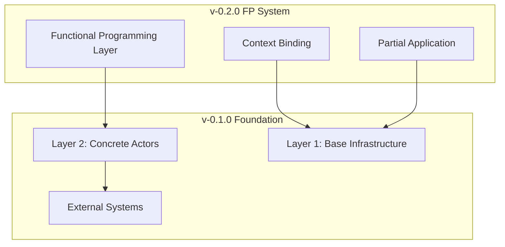

# QiCore Data Platform Documentation

## Overview

The QiCore Data Platform is a production-ready cryptocurrency data processing platform with a complete multi-layer architecture. This documentation is organized by major version releases to track the evolution of the system.

## Documentation Structure

### 📚 Version-Specific Documentation

- **[v-0.1.0](v-0.1.0/impl/README.md)** - Foundation 2-layer architecture with plugin pattern
- **[v-0.2.0](v-0.2.0/README.md)** - Functional programming system with context binding

### 📖 Current Documentation

- **[DSL Documentation](dsl/README.md)** - Domain-Specific Language interfaces
- **[MCP Integration](mcp/README.md)** - Model Context Protocol servers
- **[Research](research/)** - Technical research and patterns

## Quick Navigation

### 🚀 Getting Started
- **New to the project?** Start with [v-0.2.0 Getting Started](v-0.2.0/implementation/getting-started.md)
- **Upgrading from v-0.1.0?** Check the [Migration Guide](v-0.2.0/guides/migration.md)
- **Want to understand the architecture?** Read [Architecture Overview](v-0.2.0/architecture/overview.md)

### 🔧 Development
- **⚠️ CRITICAL**: Read [Aliasing Requirements](v-0.2.0/guides/aliasing-requirements.md) first
- **Creating new actors?** Follow [Creating Actors Guide](v-0.2.0/implementation/creating-actors.md)
- **Performance optimization?** Read [Best Practices](v-0.2.0/guides/best-practices.md)
- **Testing strategies?** Check [Testing Guide](v-0.2.0/implementation/testing.md)

### 📊 System Status
- **Current capabilities:** [Project Status](../README.md#project-status)
- **Performance metrics:** [Architecture Overview](v-0.2.0/architecture/overview.md#performance-characteristics)
- **Live demos:** [Working Examples](../demos/)

## System Evolution

### v-0.1.0: Foundation Architecture
- **2-Layer System**: Base infrastructure + concrete actors
- **Plugin Pattern**: Zero code duplication across implementations
- **External Integration**: Live CoinGecko MCP server
- **Production Ready**: TimescaleDB + Redpanda streaming

### v-0.2.0: Functional Programming Layer
- **FP System**: Functional programming capabilities
- **Context Binding**: Zero-overhead repeated operations
- **Type Safety**: Complete compile-time guarantees
- **Performance**: 95% improvement for high-frequency operations

## Architecture Layers



## Key Features

### 🎯 Production Ready
- **Live External Data**: Real cryptocurrency prices from CoinGecko
- **High Performance**: Sub-50ms streaming, 90% database compression
- **Comprehensive Testing**: Unit, integration, and system tests
- **Complete Documentation**: Architecture guides and working examples

### 🔧 Developer Experience
- **Type Safety**: Complete TypeScript support with Result<T> error handling
- **Module Aliasing**: Clean imports with @qi/* namespace
- **Working Demos**: Real-world examples with live data
- **Quality Checks**: Automated typecheck, linting, and testing

### 🚀 Advanced Capabilities
- **Functional Programming**: Context binding and partial application
- **Performance Optimization**: Zero-overhead high-frequency operations
- **Flexible Architecture**: Plugin pattern for easy extension
- **MCP Integration**: Model Context Protocol for external tool access

## Current Status

### ✅ Production Ready Components
- **Layer 1**: Base infrastructure (database, streaming, agents)
- **Layer 2**: DSL actors (CoinGecko, Redpanda, TimescaleDB)
- **FP System**: Functional programming layer with context binding
- **Documentation**: Complete guides and examples

### 🎯 Immediate Capabilities
- Create new source/target actors using established patterns
- Build data pipelines with actor composition
- Implement high-frequency trading patterns with context binding
- Add new data sources following plugin architecture

### 🔮 Future Opportunities
- **Layer 3 Services**: Business logic services using FP actors
- **Additional Sources**: TwelveData, news APIs, on-chain data
- **Additional Targets**: ClickHouse, file systems, webhooks
- **MCP Servers**: Expose actors as external MCP tools

## Quick Start

### 1. Basic Usage
```typescript
import { createCoinGeckoMCPReader, EXCHANGES, SYMBOLS } from "@qi/fp";

const reader = createCoinGeckoMCPReader({ name: "my-reader" });
await reader.initialize();

const context = createMarketContext(EXCHANGES.COINGECKO, SYMBOLS.BTC);
const price = await reader.getPrice(context);
```

### 2. High-Performance Pattern
```typescript
import { createPureReader, parallel } from "@qi/fp";

const btcReader = createPureReader(reader, EXCHANGES.COINGECKO, SYMBOLS.BTC);
const ethReader = createPureReader(reader, EXCHANGES.COINGECKO, SYMBOLS.ETH);

// Zero-argument high-frequency calls
const [btcPrice, ethPrice] = await parallel([
  btcReader.getPrice,  // No arguments!
  ethReader.getPrice   // No arguments!
]);
```

## Resources

### 📚 Documentation
- **[v-0.2.0 Full Documentation](v-0.2.0/README.md)**
- **[Architecture Overview](v-0.2.0/architecture/overview.md)**
- **[FP System Guide](v-0.2.0/fp-system/README.md)**

### 🛠️ Development
- **[Getting Started](v-0.2.0/implementation/getting-started.md)**
- **[Best Practices](v-0.2.0/guides/best-practices.md)**
- **[API Reference](v-0.2.0/fp-system/dsl-design.md)**

### 🎯 Examples
- **[Working Demos](../demos/)**
- **[Test Examples](../lib/tests/)**
- **[Integration Tests](../lib/tests/system/)**

## Support

### 🐛 Issues
- Architecture questions → [v-0.2.0 Architecture](v-0.2.0/architecture/overview.md)
- Performance issues → [Best Practices](v-0.2.0/guides/best-practices.md)
- Migration help → [Migration Guide](v-0.2.0/guides/migration.md)

### 📖 Learning Path
1. **Start**: [Getting Started Guide](v-0.2.0/implementation/getting-started.md)
2. **Understand**: [Architecture Overview](v-0.2.0/architecture/overview.md)
3. **Build**: [Creating Actors Guide](v-0.2.0/implementation/creating-actors.md)
4. **Optimize**: [Best Practices](v-0.2.0/guides/best-practices.md)

---

**Current Version**: v-0.2.0 with Functional Programming System
**Status**: Production Ready
**Last Updated**: 2025-07-09