# QiCore Crypto Data Platform - Agent/MCP Centric Architecture

## Overview

This document specifies the **Agent/MCP Centric Architecture** for the QiCore Crypto Data Platform. The architecture follows a two-centric approach: **Data Stream Platform** (structural) + **Agent/MCP Framework** (implementation).

## Platform Functionality

**Platform Purpose**: Get data from data source → Data pushed to data stream to be used → Users of the data stream get the data and do their jobs

### Complete Data Flow

### Agent Types and Functionalities

#### Publisher Agent Type
- **Functionality**: Get data from data source → Publish data into data stream
- **Examples**: CoinGecko Publisher Agent, CryptoCompare Publisher Agent, TwelveData Publisher Agent
- **Workflow**: External API → Agent → Official MCP Server → Data Processing → Custom Stream Tools → Redpanda Topics
- **Responsibilities**:
  - Connect to external data sources via Official MCP servers
  - Transform raw data into standardized format
  - Publish processed data to appropriate Redpanda topics
  - Handle rate limiting and error recovery

#### Consumer Agent Type
- **Functionality**: Get data from data stream → Store data into data store
- **Examples**: TimescaleDB Consumer Agent, ClickHouse Consumer Agent, Analytics Consumer Agent
- **Workflow**: Redpanda Topics → Custom Stream Tools → Agent → Data Processing → Official MCP Server → Database/Storage
- **Responsibilities**:
  - Subscribe to relevant Redpanda topics
  - Process streaming data in real-time
  - Store processed data via Official MCP servers
  - Maintain data quality and consistency

### Data Stream Users
- **Real-time Applications**: Live price monitoring, alerting systems
- **Analytics Teams**: Historical analysis, pattern recognition
- **Trading Systems**: Algorithmic trading, risk management
- **Research Projects**: Academic studies, market intelligence
- **Custom Integrations**: Third-party applications, webhooks

## Architecture Principles

### 1. Agent/MCP Centric Framework

#### **Implementation Architecture Diagram**

```mermaid
graph TB
    subgraph "🤖 Agent Layer (QiCore Framework)"
        subgraph "Publisher Agents"
            PA1[CoinGecko Publisher<br/>Tool Set + PE + LLM]
            PA2[TwelveData Publisher<br/>Tool Set + PE + LLM]
        end
        
        subgraph "Consumer Agents"
            CA1[TimescaleDB Consumer<br/>Tool Set + PE + LLM]
            CA2[Analytics Consumer<br/>Tool Set + PE + LLM]
        end
        
        subgraph "MCP Client (Single Manager)"
            MC[MCP Client<br/>Manages all connections]
        end
    end
    
    subgraph "✅ Official MCP Servers (100% Priority)"
        CGMCP[CoinGecko MCP<br/>@coingecko/coingecko-mcp<br/>15k+ coins, 8M+ tokens]
        PGMCP[PostgreSQL MCP<br/>@modelcontextprotocol/server-postgres<br/>TimescaleDB compatible]
        KMCP[Kafka MCP<br/>@confluent/mcp-confluent<br/>Redpanda compatible]
    end
    
    subgraph "⚠️ Custom MCP Tools (Exception Only)"
        TR[Tool Registry<br/>Manages custom tools]
        SCT[StreamCryptoDataTool<br/>High-performance streaming]
        CCT[ConsumeStreamDataTool<br/>High-performance consumption]
        PCT[ProcessCryptoStreamTool<br/>Real-time processing]
    end
    
    subgraph "🔧 Services & Infrastructure"
        CG[CoinGecko API]
        RP[Redpanda Cluster<br/>High-performance streaming]
        TS[TimescaleDB<br/>Time-series database]
    end
    
    PA1 --> MC
    PA2 --> MC
    CA1 --> MC
    CA2 --> MC
    
    MC --> CGMCP
    MC --> PGMCP
    MC --> KMCP
    MC --> TR
    
    TR --> SCT
    TR --> CCT
    TR --> PCT
    
    CGMCP --> CG
    SCT --> RP
    CCT --> RP
    PCT --> RP
    PGMCP --> TS
    
    style PA1 fill:#e8f5e8
    style PA2 fill:#e8f5e8
    style CA1 fill:#fff3cd
    style CA2 fill:#fff3cd
    style CGMCP fill:#e1f5fe
    style PGMCP fill:#e1f5fe
    style KMCP fill:#e1f5fe
    style SCT fill:#fff3e0
    style CCT fill:#fff3e0
    style PCT fill:#fff3e0
```

**Agent Definition**: Tool Set + Process Executor + Prompt/LLM
- **Tool Set**: MCP tools (official MCP servers + custom tools)
- **Process Executor**: Workflow/orchestration logic  
- **Prompt/LLM**: AI-powered decision making
- **MCP Client**: Single manager for all MCP connections

### 2. Official MCP First Principle (MANDATORY)
- **✅ ALWAYS USE**: Official MCP servers when available (100% usage)
- **PostgreSQL**: `@modelcontextprotocol/server-postgres` (TimescaleDB compatible)
- **Kafka**: `@confluent/mcp-confluent` (Redpanda compatible)
- **CoinGecko**: `@coingecko/coingecko-mcp` (15k+ coins, 8M+ tokens)

### 3. Custom MCP Tools: Exception Only
- **ONLY when**: Official server doesn't exist or lacks functionality
- **High-performance components**: Wrapped as MCP tools for agent access
- **MUST document**: Justification for custom implementation

## Data Pipeline Flow

### Publisher Agent Workflow (Get data from data source → Publish data into data stream)

#### **Publisher Agent Sequence Diagram**

```mermaid
sequenceDiagram
    participant API as CoinGecko API
    participant PA as Publisher Agent<br/>(Tool Set + PE + LLM)
    participant MC as MCP Client
    participant CGMCP as Official CoinGecko MCP
    participant TR as Tool Registry
    participant SCT as StreamCryptoDataTool
    participant RP as Redpanda Topics
    
    Note over PA: 🚀 FUNCTIONALITY: Get data from data source → Publish data into data stream
    
    rect rgb(230, 245, 230)
        Note over PA, CGMCP: STEP 1: Get data from data source
        PA->>MC: Request crypto data
        MC->>CGMCP: get_price(['bitcoin', 'ethereum'])
        CGMCP->>API: HTTP request to CoinGecko
        API-->>CGMCP: Raw JSON response
        CGMCP-->>MC: Structured price data
        MC-->>PA: Official MCP data
    end
    
    Note over PA: 🧠 Agent processes data with AI logic
    
    rect rgb(255, 243, 224)
        Note over PA, RP: STEP 2: Publish data into data stream
        PA->>MC: Request data publishing
        MC->>TR: Access custom tools
        TR->>SCT: stream_crypto_data('publish_price')
        SCT->>RP: High-performance Kafka protocol
        RP-->>SCT: Partition/offset confirmation
        SCT-->>TR: Success + latency metrics
        TR-->>MC: Operation complete
        MC-->>PA: Data published successfully
    end
    
    Note over PA: ✅ Publisher Agent functionality complete
```

**Step-by-Step Publisher Flow**:
1. **Get data from data source**: Publisher Agent calls Official CoinGecko MCP Server (`get_price`, `get_ohlcv`)
2. **Data transformation**: Agent processes raw API data into standardized format
3. **Publish data into data stream**: Agent uses Custom `StreamCryptoDataTool` to publish to Redpanda topics

### Consumer Agent Workflow (Get data from data stream → Store data into data store)

#### **Consumer Agent Sequence Diagram**

```mermaid
sequenceDiagram
    participant RP as Redpanda Topics
    participant CA as Consumer Agent<br/>(Tool Set + PE + LLM)
    participant MC as MCP Client
    participant TR as Tool Registry
    participant CCT as ConsumeStreamDataTool
    participant PGMCP as Official PostgreSQL MCP
    participant TS as TimescaleDB
    
    Note over CA: 🚀 FUNCTIONALITY: Get data from data stream → Store data into data store
    
    rect rgb(255, 243, 224)
        Note over RP, CCT: STEP 1: Get data from data stream
        CA->>MC: Request stream subscription
        MC->>TR: Access custom tools
        TR->>CCT: consume_stream_data('subscribe')
        CCT->>RP: Subscribe to crypto-prices topic
        RP-->>CCT: Stream messages (real-time)
        CCT-->>TR: Processed stream data
        TR-->>MC: Data ready for consumption
        MC-->>CA: Stream data available
    end
    
    Note over CA: 🧠 Agent processes stream data with AI logic
    Note over CA: (aggregation, validation, enrichment)
    
    rect rgb(225, 245, 254)
        Note over CA, TS: STEP 2: Store data into data store
        CA->>MC: Request data storage
        MC->>PGMCP: execute_query (INSERT statement)
        PGMCP->>TS: SQL INSERT with crypto price data
        TS-->>PGMCP: Row insertion confirmation
        PGMCP-->>MC: Query execution success
        MC-->>CA: Data stored successfully
    end
    
    Note over CA: ✅ Consumer Agent functionality complete
    Note over RP: 🔄 Continuous streaming continues...
```

**Step-by-Step Consumer Flow**:
1. **Get data from data stream**: Consumer Agent uses Custom `ConsumeStreamDataTool` to subscribe to Redpanda topics
2. **Data processing**: Agent processes streaming data (aggregation, validation, enrichment)
3. **Store data into data store**: Agent uses Official PostgreSQL MCP Server to store in TimescaleDB

This architecture ensures **clear separation of concerns**, **production-ready performance**, and **AI-powered intelligence** while maintaining **standardized tool interfaces** through the MCP protocol.