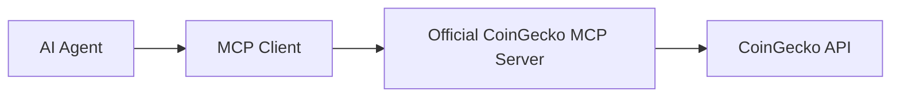

# Official CoinGecko MCP Server Integration

## Overview

This document covers the **Official CoinGecko MCP Server** for cryptocurrency data in the QiCore crypto data platform.

**Important**: When we say "Official MCP Server" we mean the **Official CoinGecko MCP Server** built by CoinGecko team, not a generic crypto data MCP server.

## Recommended Architecture



```
AI Agent → MCP Client → Official CoinGecko MCP Server → CoinGecko API
```

**Why Official CoinGecko MCP Server:**
- ✅ **Built by CoinGecko** - Official implementation from CoinGecko team
- ✅ **Complete API Coverage** - All CoinGecko features (200+ networks, 8M+ tokens)
- ✅ **Production Ready** - Enterprise-grade reliability with vendor support
- ✅ **Future-proof** - Updates automatically with new CoinGecko API features
- ✅ **Zero Custom Code** - No need to build/maintain custom crypto MCP server

## Official CoinGecko MCP Server

### Why CoinGecko Over Alternatives
- ✅ **200+ blockchain networks** vs competitors' limited coverage
- ✅ **8M+ tokens** vs others focus on major coins only
- ✅ **Official MCP server** maintained by CoinGecko team
- ✅ **Better API reliability** and uptime than alternatives
- ✅ **More comprehensive DeFi data** than any competitor
- ✅ **Free tier** with generous limits for development

### Official CoinGecko MCP Server Setup

#### Installation
```bash
# Install Official CoinGecko MCP Server
npm install @coingecko/mcp-server

# Or use via npx in production
npx @coingecko/mcp-server

# Or use Claude CLI to add it
claude mcp add coingecko -s user -- npx @coingecko/mcp-server
```

#### Configuration
```typescript
// src/mcp-servers/coingecko-mcp-config.ts
export const officialCoinGeckoMCPConfig = {
  server: '@coingecko/mcp-server',
  transport: 'stdio', // Official CoinGecko MCP uses stdio
  environment: {
    COINGECKO_API_KEY: process.env.COINGECKO_API_KEY, // Optional for free tier
    COINGECKO_RATE_LIMIT: process.env.COINGECKO_RATE_LIMIT || '50', // Requests per minute
    COINGECKO_TIMEOUT: process.env.COINGECKO_TIMEOUT || '30000'
  }
};
```

#### Available Tools
```typescript
// Official CoinGecko MCP Server capabilities
interface OfficialCoinGeckoMCPTools {
  // Price Data
  get_price: (params: { 
    ids: string, // 'bitcoin,ethereum,cardano'
    vs_currencies: string, // 'usd,eur,btc'
    include_market_cap?: boolean,
    include_24hr_vol?: boolean,
    include_24hr_change?: boolean,
    include_last_updated_at?: boolean
  }) => Promise<PriceData>;

  // OHLCV Data
  get_ohlcv: (params: {
    id: string, // 'bitcoin'
    vs_currency: string, // 'usd' 
    days: string, // '1', '7', '30', '365', 'max'
    interval?: string // 'minutely', 'hourly', 'daily'
  }) => Promise<OHLCVData[]>;

  // Historical Data
  get_history: (params: {
    id: string,
    date: string, // 'dd-mm-yyyy'
    localization?: boolean
  }) => Promise<HistoricalData>;

  // Market Data
  get_coins_markets: (params: {
    vs_currency: string,
    ids?: string,
    category?: string,
    order?: 'market_cap_desc' | 'gecko_desc' | 'gecko_asc' | 'market_cap_asc' | 'volume_asc' | 'volume_desc',
    per_page?: number,
    page?: number,
    sparkline?: boolean,
    price_change_percentage?: string
  }) => Promise<MarketData[]>;

  // Trending
  get_trending: () => Promise<TrendingData>;

  // Global Data
  get_global: () => Promise<GlobalData>;

  // Categories
  get_categories: () => Promise<Category[]>;

  // Exchanges
  get_exchanges: (params?: {
    per_page?: number,
    page?: number
  }) => Promise<Exchange[]>;

  // DeFi Data
  get_defi_stats: () => Promise<DeFiStats>;

  // NFT Data
  get_nfts_list: (params?: {
    order?: string,
    asset_platform_id?: string,
    per_page?: number,
    page?: number
  }) => Promise<NFTData[]>;

  // Search
  search: (params: {
    query: string
  }) => Promise<SearchResults>;
}
```

### Data Types
```typescript
// Core data types returned by CoinGecko MCP
export interface PriceData {
  [coinId: string]: {
    [currency: string]: number;
    [currency + '_market_cap']?: number;
    [currency + '_24h_vol']?: number;
    [currency + '_24h_change']?: number;
    last_updated_at?: number;
  };
}

export interface OHLCVData {
  timestamp: number;
  open: number;
  high: number;
  low: number;
  close: number;
  volume?: number;
}

export interface MarketData {
  id: string;
  symbol: string;
  name: string;
  image: string;
  current_price: number;
  market_cap: number;
  market_cap_rank: number;
  fully_diluted_valuation: number;
  total_volume: number;
  high_24h: number;
  low_24h: number;
  price_change_24h: number;
  price_change_percentage_24h: number;
  market_cap_change_24h: number;
  market_cap_change_percentage_24h: number;
  circulating_supply: number;
  total_supply: number;
  max_supply: number;
  ath: number;
  ath_change_percentage: number;
  ath_date: string;
  atl: number;
  atl_change_percentage: number;
  atl_date: string;
  last_updated: string;
  sparkline_in_7d?: {
    price: number[];
  };
}
```

## Implementation

### Official CoinGecko MCP Server Integration

### Starting Official CoinGecko MCP Server
```typescript
// src/mcp-servers/coingecko-mcp-launcher.ts
import { spawn } from 'child_process';
import { officialCoinGeckoMCPConfig } from './coingecko-mcp-config';

export class OfficialCoinGeckoMCPLauncher {
  private process?: any;

  async start(): Promise<void> {
    console.log('🪙 Starting Official CoinGecko MCP Server...');
    
    this.process = spawn('npx', ['@coingecko/mcp-server'], {
      env: {
        ...process.env,
        ...officialCoinGeckoMCPConfig.environment
      },
      stdio: ['pipe', 'pipe', 'pipe'] // stdio transport
    });

    this.process.on('error', (error: Error) => {
      console.error('❌ Official CoinGecko MCP Server error:', error);
    });

    this.process.on('exit', (code: number) => {
      console.log(`🪙 Official CoinGecko MCP Server exited with code ${code}`);
    });

    await this.waitForReady();
    console.log('✅ Official CoinGecko MCP Server ready');
  }

  async stop(): Promise<void> {
    if (this.process) {
      this.process.kill();
      this.process = undefined;
    }
  }

  private async waitForReady(): Promise<void> {
    // Wait for stdio connection to be established
    await new Promise(resolve => setTimeout(resolve, 3000));
  }
}
```

### AI Agent Integration
```typescript
// src/agents/crypto-data-agent.ts
import { BaseAgent } from '@qicore/agent-lib/qiagent';
import { MCPClient } from '@qicore/agent-lib/qimcp/client';

export class CryptoDataAgent extends BaseAgent {
  private coinGeckoMCP: MCPClient;

  constructor() {
    super('crypto-data-agent');
    // Connect to Official CoinGecko MCP Server
    this.coinGeckoMCP = new MCPClient('stdio://coingecko-mcp-server');
  }

  async collectRealTimePrices(symbols: string[]): Promise<PriceData> {
    const prices = await this.coinGeckoMCP.call('get_price', {
      ids: symbols.join(','),
      vs_currencies: 'usd,btc',
      include_market_cap: true,
      include_24hr_vol: true,
      include_24hr_change: true,
      include_last_updated_at: true
    });

    return prices;
  }

  async collectOHLCVData(symbol: string, days: string = '1'): Promise<OHLCVData[]> {
    const ohlcv = await this.coinGeckoMCP.call('get_ohlcv', {
      id: symbol,
      vs_currency: 'usd',
      days: days,
      interval: 'minutely'
    });

    return ohlcv.map((item: any) => ({
      timestamp: item[0],
      open: item[1],
      high: item[2],
      low: item[3],
      close: item[4],
      volume: item[5] || 0
    }));
  }

  async getTopMarketCap(limit: number = 100): Promise<MarketData[]> {
    const markets = await this.coinGeckoMCP.call('get_coins_markets', {
      vs_currency: 'usd',
      order: 'market_cap_desc',
      per_page: limit,
      page: 1,
      sparkline: true,
      price_change_percentage: '1h,24h,7d'
    });

    return markets;
  }

  async getTrendingCoins(): Promise<any> {
    const trending = await this.coinGeckoMCP.call('get_trending');
    return trending;
  }

  async searchCryptocurrency(query: string): Promise<any> {
    const results = await this.coinGeckoMCP.call('search', {
      query: query
    });
    return results;
  }

  async getGlobalStats(): Promise<any> {
    const global = await this.coinGeckoMCP.call('get_global');
    return global;
  }

  async getDeFiStats(): Promise<any> {
    const defi = await this.coinGeckoMCP.call('get_defi_stats');
    return defi;
  }
}
```

### Data Collection Orchestration
```typescript
// src/orchestrators/crypto-data-orchestrator.ts
import { CryptoDataAgent } from '../agents/crypto-data-agent';
import { MCPClient } from '@qicore/agent-lib/qimcp/client';

export class CryptoDataOrchestrator {
  private cryptoAgent: CryptoDataAgent;
  private kafkaMCP: MCPClient;

  constructor() {
    this.cryptoAgent = new CryptoDataAgent();
    this.kafkaMCP = new MCPClient('http://localhost:8081'); // Kafka MCP
  }

  async startRealTimeCollection(): Promise<void> {
    const majorCoins = [
      'bitcoin', 'ethereum', 'binancecoin', 'cardano', 'solana',
      'polkadot', 'chainlink', 'litecoin', 'avalanche-2', 'polygon'
    ];

    // Collect prices every minute
    setInterval(async () => {
      try {
        const prices = await this.cryptoAgent.collectRealTimePrices(majorCoins);
        
        // Publish to Kafka
        for (const [coinId, priceData] of Object.entries(prices)) {
          await this.kafkaMCP.call('produce_message', {
            topic: 'crypto-prices',
            key: coinId,
            value: {
              coin_id: coinId,
              timestamp: Date.now(),
              usd_price: priceData.usd,
              btc_price: priceData.btc,
              market_cap: priceData.usd_market_cap,
              volume_24h: priceData.usd_24h_vol,
              change_24h: priceData.usd_24h_change,
              last_updated: priceData.last_updated_at
            }
          });
        }

        console.log('✅ Real-time prices collected and published');
      } catch (error) {
        console.error('❌ Error collecting real-time prices:', error);
      }
    }, 60000); // Every minute

    // Collect OHLCV data every hour
    setInterval(async () => {
      for (const coin of majorCoins) {
        try {
          const ohlcv = await this.cryptoAgent.collectOHLCVData(coin, '1');
          
          // Publish latest OHLCV data
          const latestData = ohlcv[ohlcv.length - 1];
          if (latestData) {
            await this.kafkaMCP.call('produce_message', {
              topic: 'crypto-ohlcv',
              key: coin,
              value: {
                coin_id: coin,
                timestamp: latestData.timestamp,
                open: latestData.open,
                high: latestData.high,
                low: latestData.low,
                close: latestData.close,
                volume: latestData.volume
              }
            });
          }
        } catch (error) {
          console.error(`❌ Error collecting OHLCV for ${coin}:`, error);
        }
      }
      console.log('✅ OHLCV data collected and published');
    }, 3600000); // Every hour

    // Collect market overview every 5 minutes
    setInterval(async () => {
      try {
        const [topCoins, trending, global] = await Promise.all([
          this.cryptoAgent.getTopMarketCap(50),
          this.cryptoAgent.getTrendingCoins(),
          this.cryptoAgent.getGlobalStats()
        ]);

        await this.kafkaMCP.call('produce_message', {
          topic: 'crypto-analytics',
          key: 'market-overview',
          value: {
            timestamp: Date.now(),
            top_coins: topCoins,
            trending: trending,
            global_stats: global
          }
        });

        console.log('✅ Market overview collected and published');
      } catch (error) {
        console.error('❌ Error collecting market overview:', error);
      }
    }, 300000); // Every 5 minutes
  }

  async collectHistoricalData(coinId: string, days: string): Promise<void> {
    console.log(`📊 Collecting historical data for ${coinId} (${days} days)...`);
    
    const ohlcv = await this.cryptoAgent.collectOHLCVData(coinId, days);
    
    // Publish historical data in batches
    const batchSize = 100;
    for (let i = 0; i < ohlcv.length; i += batchSize) {
      const batch = ohlcv.slice(i, i + batchSize);
      
      for (const data of batch) {
        await this.kafkaMCP.call('produce_message', {
          topic: 'crypto-ohlcv-historical',
          key: coinId,
          value: {
            coin_id: coinId,
            timestamp: data.timestamp,
            open: data.open,
            high: data.high,
            low: data.low,
            close: data.close,
            volume: data.volume
          }
        });
      }
      
      // Rate limiting
      await new Promise(resolve => setTimeout(resolve, 1000));
    }
    
    console.log(`✅ Historical data for ${coinId} collected (${ohlcv.length} records)`);
  }
}
```

## Environment Configuration

```bash
# .env
# CoinGecko
COINGECKO_API_KEY=your_coingecko_api_key  # Optional for free tier
COINGECKO_RATE_LIMIT=50  # Requests per minute
COINGECKO_TIMEOUT=30000

# Fallback: CryptoCompare
CRYPTOCOMPARE_API_KEY=your_cryptocompare_api_key

# Armor Crypto (if using)
ETHEREUM_RPC_URL=https://eth-mainnet.alchemyapi.io/v2/your_key
POLYGON_RPC_URL=https://polygon-mainnet.alchemyapi.io/v2/your_key
BSC_RPC_URL=https://bsc-dataseed.binance.org/

# MCP Server Ports
CRYPTO_MCP_PORT=8083
ARMOR_CRYPTO_MCP_PORT=8084
```

## Error Handling

```typescript
// src/services/crypto-data-service.ts
export class CryptoDataService {
  private coinGeckoAgent: CryptoDataAgent;

  constructor() {
    this.coinGeckoAgent = new CryptoDataAgent();
  }

  async getPriceWithRetry(symbol: string, maxRetries: number = 3): Promise<number> {
    for (let attempt = 1; attempt <= maxRetries; attempt++) {
      try {
        const prices = await this.coinGeckoAgent.collectRealTimePrices([symbol]);
        return prices[symbol]?.usd || 0;
      } catch (error) {
        console.warn(`⚠️ CoinGecko attempt ${attempt}/${maxRetries} failed for ${symbol}:`, error);
        
        if (attempt === maxRetries) {
          throw new Error(`Failed to get price for ${symbol} after ${maxRetries} attempts`);
        }
        
        // Exponential backoff
        await new Promise(resolve => setTimeout(resolve, Math.pow(2, attempt) * 1000));
      }
    }
  }

  async getOHLCVWithRetry(symbol: string, maxRetries: number = 3): Promise<OHLCVData[]> {
    for (let attempt = 1; attempt <= maxRetries; attempt++) {
      try {
        return await this.coinGeckoAgent.collectOHLCVData(symbol);
      } catch (error) {
        console.warn(`⚠️ CoinGecko OHLCV attempt ${attempt}/${maxRetries} failed for ${symbol}:`, error);
        
        if (attempt === maxRetries) {
          throw new Error(`Failed to get OHLCV for ${symbol} after ${maxRetries} attempts`);
        }
        
        await new Promise(resolve => setTimeout(resolve, Math.pow(2, attempt) * 1000));
      }
    }
  }
}
```

## Monitoring and Health Checks

```typescript
// src/health/crypto-data-health.ts
export class CryptoDataHealthChecker {
  private coinGeckoMCP: MCPClient;

  constructor() {
    this.coinGeckoMCP = new MCPClient('stdio://coingecko-mcp-server');
  }

  async checkHealth(): Promise<HealthStatus> {
    try {
      // Test basic API call via Official CoinGecko MCP Server
      const testPrice = await this.coinGeckoMCP.call('get_price', {
        ids: 'bitcoin',
        vs_currencies: 'usd'
      });

      if (!testPrice.bitcoin?.usd) {
        return {
          status: 'unhealthy',
          message: 'CoinGecko API not returning expected data'
        };
      }

      // Check global stats
      const global = await this.coinGeckoMCP.call('get_global');
      
      return {
        status: 'healthy',
        message: 'Official CoinGecko MCP Server healthy',
        data: {
          bitcoin_price: testPrice.bitcoin.usd,
          total_market_cap: global.data?.total_market_cap?.usd
        }
      };
    } catch (error) {
      return {
        status: 'unhealthy',
        message: `Official CoinGecko MCP Server error: ${error.message}`
      };
    }
  }
}
```

## See Also

For comprehensive comparison of crypto data sources and MCP approaches, see [kafka-tech-comparison.md](./kafka.tech.comparison.md).

## Summary

- **Primary Source**: Official CoinGecko MCP Server (200+ networks, 8M+ tokens)
- **Built by CoinGecko**: Official vendor implementation with complete API coverage
- **Production Ready**: Enterprise-grade reliability with vendor support
- **Real-time Collection**: Prices every minute, OHLCV every hour
- **Error Handling**: Robust retry mechanisms with exponential backoff
- **Zero Maintenance**: No custom MCP server code to maintain