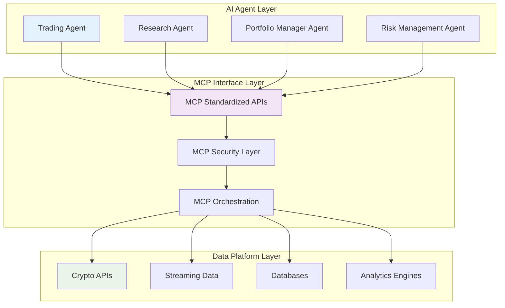
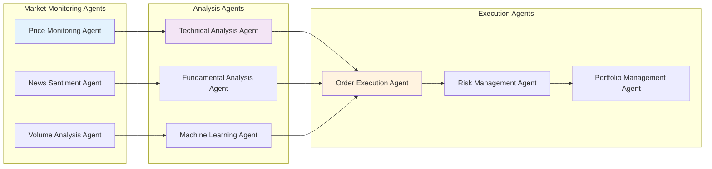
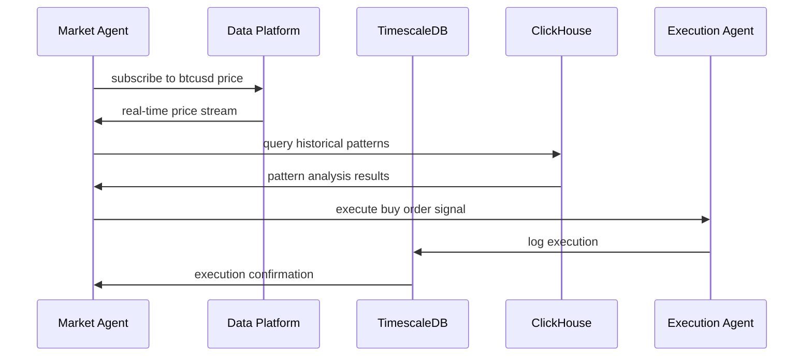

# agentized framework foundation

*how the crypto data platform enables autonomous ai agents*

## the future of financial markets

the financial industry is undergoing a fundamental transformation toward **autonomous ai agents** that can:
- monitor markets 24/7 without human intervention
- process vast amounts of data in real-time
- execute complex trading strategies with millisecond precision
- adapt to changing market conditions through machine learning
- manage risk across multiple asset classes simultaneously

## what makes our platform "agentized"?

### 1. mcp-native architecture



**key principles:**
- **standardized interfaces**: every tool uses consistent mcp apis
- **composable components**: agents can mix and match capabilities
- **secure access**: controlled permissions for financial operations
- **error resilience**: robust error handling for autonomous operations

### 2. real-time decision making

traditional trading systems require human intervention:
```
market event → human analysis → decision → execution (minutes to hours)
```

agentized systems enable autonomous response:
```
market event → ai analysis → decision → execution (milliseconds)
```

**our platform enables**:
- **sub-second data ingestion**: market changes detected instantly
- **real-time analytics**: pattern recognition in streaming data
- **autonomous execution**: agents can act without human approval
- **continuous learning**: agents adapt strategies based on outcomes

### 3. multi-agent orchestration



## agent capabilities enabled by our platform

### 1. market perception agents

**price monitoring agent**
```typescript
// mcp tool: real-time price feeds
const priceAgent = await createAgent({
  tools: [
    mcpTools.cryptocompare.websocket,
    mcpTools.timescaledb.query,
    mcpTools.alerts.priceBreakout
  ],
  objective: "monitor price movements and detect breakouts"
});

// autonomous operation
priceAgent.on('priceBreakout', async (event) => {
  await portfolioAgent.rebalance(event.symbol, event.direction);
});
```

**volume analysis agent**
```typescript
// mcp tool: volume pattern detection
const volumeAgent = await createAgent({
  tools: [
    mcpTools.clickhouse.analytics,
    mcpTools.timescaledb.realtime,
    mcpTools.alerts.volumeSpike
  ],
  objective: "detect unusual volume patterns indicating market moves"
});
```

### 2. analytical reasoning agents

**technical analysis agent**
```typescript
// mcp tool: technical indicators
const technicalAgent = await createAgent({
  tools: [
    mcpTools.indicators.rsi,
    mcpTools.indicators.macd,
    mcpTools.indicators.bollinger,
    mcpTools.clickhouse.historical
  ],
  objective: "generate trading signals from technical patterns"
});

// sophisticated analysis
const signals = await technicalAgent.analyze({
  symbol: 'btcusd',
  timeframes: ['5m', '15m', '1h', '4h'],
  indicators: ['rsi', 'macd', 'bollinger_bands']
});
```

**machine learning agent**
```typescript
// mcp tool: ml model inference
const mlAgent = await createAgent({
  tools: [
    mcpTools.ml.pricePredictor,
    mcpTools.ml.sentimentAnalysis,
    mcpTools.clickhouse.features,
    mcpTools.timescaledb.training
  ],
  objective: "predict price movements using machine learning"
});
```

### 3. execution agents

**order execution agent**
```typescript
// mcp tool: smart order routing
const executionAgent = await createAgent({
  tools: [
    mcpTools.exchanges.binance,
    mcpTools.exchanges.coinbase,
    mcpTools.orderRouting.smart,
    mcpTools.slippage.minimizer
  ],
  objective: "execute trades with minimal market impact"
});

// autonomous execution with risk controls
await executionAgent.execute({
  symbol: 'btcusd',
  side: 'buy',
  quantity: 1.5,
  maxSlippage: 0.1,
  timeLimit: '5m'
});
```

**risk management agent**
```typescript
// mcp tool: real-time risk monitoring
const riskAgent = await createAgent({
  tools: [
    mcpTools.risk.portfolioVar,
    mcpTools.risk.concentrationRisk,
    mcpTools.risk.liquidityRisk,
    mcpTools.timescaledb.positions
  ],
  objective: "continuously monitor and control portfolio risk"
});

// autonomous risk management
riskAgent.on('riskBreach', async (alert) => {
  if (alert.severity === 'critical') {
    await executionAgent.emergencyLiquidate(alert.positions);
  }
});
```

## data platform as agent foundation

### real-time data backbone



### agent coordination patterns

**hierarchical agents**:
```typescript
// master trading agent coordinates sub-agents
const masterAgent = await createAgent({
  subAgents: [
    marketAnalysisAgent,
    riskAssessmentAgent,
    executionAgent,
    reportingAgent
  ],
  coordination: 'hierarchical',
  objective: 'manage complete trading lifecycle'
});
```

**collaborative agents**:
```typescript
// peer agents share information and coordinate decisions
const agentSwarm = await createAgentSwarm([
  { agent: sentimentAgent, role: 'information_provider' },
  { agent: technicalAgent, role: 'signal_generator' },
  { agent: fundamentalAgent, role: 'trend_analyzer' },
  { agent: executionAgent, role: 'order_manager' }
]);
```

## competitive advantages of agentized trading

### 1. speed advantage
- **human traders**: minutes to hours for complex decisions
- **algorithmic trading**: seconds for predetermined strategies  
- **ai agents**: milliseconds for adaptive, contextual decisions

### 2. scale advantage
- **human traders**: monitor 5-10 assets simultaneously
- **algorithmic trading**: handle hundreds of predetermined strategies
- **ai agents**: dynamically manage thousands of assets with adaptive strategies

### 3. adaptation advantage
- **human traders**: learn from experience over months/years
- **algorithmic trading**: static strategies require manual updates
- **ai agents**: continuously learn and adapt strategies in real-time

### 4. consistency advantage
- **human traders**: emotional decisions, fatigue, inconsistency
- **algorithmic trading**: consistent but inflexible execution
- **ai agents**: consistent execution with adaptive intelligence

## implementation roadmap for agent framework

### phase 1: foundation (weeks 1-4)
- **data platform**: timescaledb + clickhouse + redpanda
- **mcp interfaces**: standardized tool apis
- **basic agents**: price monitoring, simple execution

### phase 2: intelligence (weeks 5-8)
- **analytical agents**: technical analysis, pattern recognition
- **ml integration**: prediction models, sentiment analysis
- **risk management**: automated risk controls

### phase 3: orchestration (weeks 9-12)
- **multi-agent coordination**: agent communication protocols
- **strategy management**: dynamic strategy allocation
- **performance optimization**: agent learning and adaptation

### phase 4: advanced capabilities (weeks 13-16)
- **cross-asset agents**: multi-market strategies
- **portfolio optimization**: dynamic asset allocation
- **regulatory compliance**: automated reporting and controls

## business impact

### immediate benefits
- **24/7 operation**: agents work continuously without breaks
- **consistent execution**: eliminate emotional trading decisions
- **risk reduction**: real-time risk monitoring and automated controls
- **cost efficiency**: reduce need for large trading teams

### long-term advantages
- **competitive moats**: proprietary ai trading capabilities
- **scalable growth**: expand to new markets without proportional staff increases
- **adaptive strategies**: stay ahead of changing market conditions
- **data leverage**: convert data into sustainable competitive advantage

## conclusion

this crypto data platform serves as the **foundational infrastructure** for the next generation of financial markets dominated by autonomous ai agents. by building on proven technologies (timescaledb, clickhouse, redpanda) and emerging standards (mcp), we create a platform that:

- **enables** autonomous ai agents to interact with financial markets
- **provides** real-time data infrastructure for sub-second decision making
- **scales** to handle millions of market events and agent decisions
- **adapts** to new agent capabilities and market requirements

the result is a **competitive advantage** that compounds over time as our agents learn, adapt, and improve their performance in live market conditions.