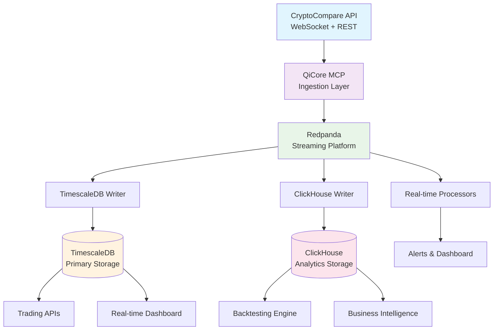
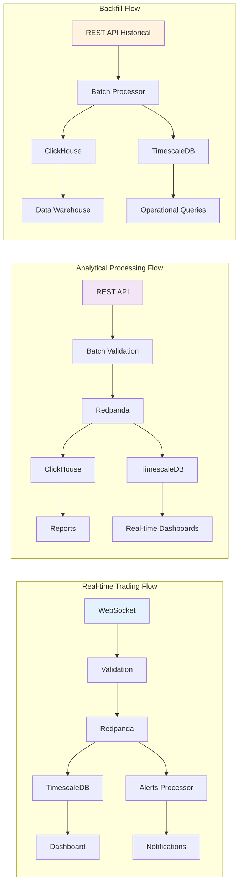

# data platform architecture

*technical foundation for autonomous ai agents in cryptocurrency markets*

## why this architecture matters for ai agents

traditional trading systems are built for human operators. **agentized systems** require fundamentally different architecture:

- **sub-second response times**: ai agents need real-time data to make autonomous decisions
- **standardized interfaces**: mcp protocol enables agents to use any tool consistently  
- **error resilience**: autonomous systems must handle failures without human intervention
- **scalable compute**: multiple agents operating simultaneously require efficient resource usage

## system overview



```
┌─────────────────┐    ┌─────────────────┐    ┌─────────────────┐
│  cryptocompare  │    │   qicore mcp    │    │    redpanda     │
│  api (ws/rest)  │───▶│  ingestion      │───▶│   streaming     │
│                 │    │   layer         │    │   platform      │
└─────────────────┘    └─────────────────┘    └─────────────────┘
                                                       │
                              ┌────────────────────────┼────────────────────────┐
                              ▼                        ▼                        ▼
                    ┌─────────────────┐     ┌─────────────────┐     ┌─────────────────┐
                    │  timescaledb    │     │   clickhouse    │     │   real-time     │
                    │    writer       │     │    writer       │     │  processors     │
                    │                 │     │                 │     │                 │
                    └─────────────────┘     └─────────────────┘     └─────────────────┘
                              │                        │                        │
                              ▼                        ▼                        ▼
                    ┌─────────────────┐     ┌─────────────────┐     ┌─────────────────┐
                    │  timescaledb    │     │   clickhouse    │     │     alerts      │
                    │   (primary)     │     │  (analytics)    │     │   dashboard     │
                    │                 │     │                 │     │   patterns      │
                    └─────────────────┘     └─────────────────┘     └─────────────────┘
```

## component details

### 1. data ingestion layer

**cryptocompare integration**
- **rest api**: historical ohlcv data, market metadata
- **websocket**: real-time price updates, orderbook changes
- **rate limiting**: respect api limits, implement backoff strategies
- **error handling**: connection drops, api errors, data validation

**qicore mcp tools (agent-ready)**
```typescript
qimcp/
├── apis/
│   ├── cryptocompare/
│   │   ├── rest-client.ts       # historical data fetching (mcp tool)
│   │   ├── websocket-client.ts  # real-time streaming (mcp tool)
│   │   └── rate-limiter.ts      # api rate management (mcp tool)
│   └── websocket/
│       ├── connection.ts        # robust websocket handling (mcp tool)
│       └── reconnect.ts         # automatic reconnection (mcp tool)
```

**mcp interface example**:
```typescript
// agents can use any tool through standardized mcp interface
interface mcptool {
  name: string;
  description: string;
  inputschema: jsonschema;
  outputschema: jsonschema;
  execute(input: any): promise<result<any>>;
}

// cryptocompare websocket as mcp tool
const cryptocomparestream: mcptool = {
  name: "cryptocompare_realtime_stream",
  description: "subscribe to real-time ohlcv data from cryptocompare",
  inputschema: { symbols: string[], timeframe: string },
  outputschema: { ohlcvdata },
  execute: async (input) => {
    return await cryptocomparewebsocketclient.subscribe(input.symbols);
  }
};
```

### 2. streaming platform

**redpanda topics**
```
ohlcv-raw          # raw ohlcv data from cryptocompare
ohlcv-validated    # validated and enriched ohlcv data
market-metadata    # symbol info, exchange data
alerts             # price alerts, pattern notifications
analytics-requests # analytical query requests
```

**message schema**
```typescript
interface ohlcvmessage {
  symbol: string;
  exchange: string;
  timestamp: number;
  open: number;
  high: number;
  low: number;
  close: number;
  volume: number;
  metadata?: {
    source: 'rest' | 'websocket';
    quality: 'high' | 'medium' | 'low';
  };
}
```

### 3. storage layer

**timescaledb schema**
```sql
-- primary ohlcv table
create table ohlcv (
  symbol text not null,
  exchange text not null,
  timestamp timestamptz not null,
  timeframe interval not null,
  open decimal(20,8) not null,
  high decimal(20,8) not null,
  low decimal(20,8) not null,
  close decimal(20,8) not null,
  volume decimal(20,8) not null,
  created_at timestamptz default now()
);

-- create hypertable
select create_hypertable('ohlcv', 'timestamp');

-- create indexes
create index on ohlcv (symbol, timestamp desc);
create index on ohlcv (exchange, timestamp desc);

-- continuous aggregates for common queries
create materialized view ohlcv_1h
with (timescaledb.continuous) as
select
  symbol,
  exchange,
  time_bucket('1 hour', timestamp) as hour,
  first(open, timestamp) as open,
  max(high) as high,
  min(low) as low,
  last(close, timestamp) as close,
  sum(volume) as volume
from ohlcv
group by symbol, exchange, hour;
```

**clickhouse schema**
```sql
-- analytical ohlcv table
create table ohlcv (
  symbol lowcardinality(string),
  exchange lowcardinality(string),
  timestamp datetime64(3),
  timeframe lowcardinality(string),
  open float64,
  high float64,
  low float64,
  close float64,
  volume float64,
  created_at datetime default now()
) engine = mergetree()
order by (symbol, timestamp)
partition by toyyymm(timestamp);

-- materialized views for aggregations
create materialized view ohlcv_daily as
select
  symbol,
  exchange,
  todate(timestamp) as date,
  argmin(open, timestamp) as open,
  max(high) as high,
  min(low) as low,
  argmax(close, timestamp) as close,
  sum(volume) as volume
from ohlcv
group by symbol, exchange, date;
```

### 4. consumer services

**timescaledb writer**
```typescript
qimcp/
├── databases/
│   ├── timescale/
│   │   ├── writer.ts           # batch writes to timescaledb
│   │   ├── schema.ts           # table definitions
│   │   └── continuous-agg.ts   # materialized view management
```

**clickhouse writer**
```typescript
qimcp/
├── databases/
│   ├── clickhouse/
│   │   ├── writer.ts           # bulk inserts to clickhouse
│   │   ├── schema.ts           # table definitions
│   │   └── mv-manager.ts       # materialized view management
```

**real-time processors**
```typescript
qimcp/
├── processors/
│   ├── alerts/
│   │   ├── price-alerts.ts     # price threshold monitoring
│   │   ├── volume-alerts.ts    # volume spike detection
│   │   └── pattern-alerts.ts   # technical pattern recognition
│   ├── analytics/
│   │   ├── indicators.ts       # technical indicators (rsi, macd, etc)
│   │   └── signals.ts          # trading signal generation
│   └── quality/
│       ├── validator.ts        # data quality checks
│       └── enricher.ts         # data enrichment
```

## data flow patterns



### 1. real-time trading flow
```
websocket → validation → redpanda → timescaledb → dashboard
                                 ↓
                               alerts processor → notifications
```

### 2. analytical processing flow  
```
rest api → batch validation → redpanda → clickhouse → reports
                                      ↓
                                   timescaledb → real-time dashboards
```

### 3. backfill flow
```
rest api (historical) → batch processor → clickhouse → data warehouse
                                        ↓
                                     timescaledb → operational queries
```

## scaling considerations

### timescaledb scaling
- **vertical scaling**: upgrade cpu/memory for complex queries
- **horizontal scaling**: distributed hypertables for very large datasets  
- **retention policies**: automatic data lifecycle management
- **compression**: reduce storage costs for historical data

### clickhouse scaling
- **horizontal scaling**: sharding across multiple nodes
- **replication**: high availability with data redundancy
- **tiered storage**: hot/warm/cold data management
- **materialized views**: pre-computed aggregations

### redpanda scaling  
- **partition scaling**: increase partitions for higher throughput
- **consumer groups**: scale consumers independently
- **tiered storage**: offload old data to object storage
- **cross-datacenter**: multi-region deployment

## monitoring and observability

### metrics to track
- **ingestion rates**: messages/second from cryptocompare
- **latency**: end-to-end data processing time
- **error rates**: api failures, processing errors
- **storage usage**: disk usage growth in both databases
- **query performance**: slow queries, connection pooling

### alerting
- **data gaps**: missing ohlcv data for extended periods
- **high latency**: processing delays beyond thresholds
- **storage capacity**: disk usage approaching limits
- **api limits**: approaching rate limit quotas

## security considerations

### api security
- **api key management**: secure storage of cryptocompare keys
- **rate limiting**: prevent api quota exhaustion
- **request signing**: if required by api provider

### database security
- **connection encryption**: tls for all database connections
- **access control**: role-based permissions
- **audit logging**: track data access and modifications
- **backup encryption**: encrypted backups for compliance

### network security
- **vpc isolation**: isolated network for data processing
- **firewall rules**: restrict access to necessary ports
- **monitoring**: network traffic analysis