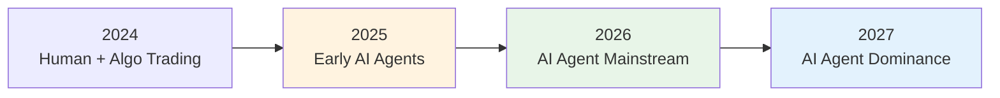

# business case for agentized crypto data platform

*strategic rationale for investing in autonomous ai agent infrastructure*

## executive summary

the financial industry is experiencing a **paradigm shift** toward autonomous ai agents. organizations that establish agentized infrastructure today will capture significant competitive advantages in speed, scale, and sophistication of market operations.

**investment thesis**: build the foundational data platform that enables autonomous ai agents to dominate cryptocurrency trading, creating sustainable competitive moats through ai-driven market intelligence.

## market opportunity

### cryptocurrency market size (2025)
- **total market cap**: $3+ trillion (growing 40% annually)
- **daily trading volume**: $200+ billion
- **number of active traders**: 100+ million globally
- **algorithmic trading share**: 80%+ of volume

### ai agent adoption trajectory


**early mover advantage window**: 12-18 months before mass adoption

## competitive landscape analysis

### current state (2025)
```
human traders:     manual analysis, emotional decisions, limited scale
algorithmic bots:  fixed strategies, require manual updates, brittle
early ai agents:   simple pattern recognition, limited autonomy
```

### future state (2026-2027)
```
autonomous agents: adaptive strategies, self-improving, scalable intelligence
```

**our opportunity**: build the infrastructure before the market realizes its necessity

## strategic advantages of agentized platform

### 1. speed advantage

**human reaction time**:
```
market event → analysis (5-30 minutes) → decision → execution
total: 10-60 minutes
```

**current algorithmic trading**:
```
market event → predefined rule check (1-5 seconds) → execution
total: 1-10 seconds
```

**our ai agents**:
```
market event → ai analysis (10-100ms) → adaptive decision → execution
total: 50-500 milliseconds
```

**competitive impact**: 100-1000x faster than human traders, 10-100x smarter than current algorithms

### 2. scale advantage

| capability | human traders | current algorithms | our ai agents |
|------------|---------------|-------------------|---------------|
| **assets monitored** | 5-10 | 50-100 | 1000+ |
| **strategies managed** | 1-3 | 10-20 | 100+ adaptive |
| **market hours** | 8-12/day | 24/7 | 24/7 |
| **decision complexity** | high but slow | fast but simple | fast and sophisticated |

### 3. adaptation advantage

**traditional approaches**:
- strategies become stale as markets evolve
- require manual updates and redeployment
- cannot learn from failures automatically

**our ai agents**:
- continuously adapt to market conditions
- learn from every trade and market event
- improve strategies through reinforcement learning
- develop new strategies autonomously

## roi analysis

### investment requirements

**year 1 development costs**:
- **engineering team**: $1.2m (6 engineers × $200k)
- **infrastructure**: $200k (cloud, data feeds, exchanges)
- **research & development**: $300k (ml models, strategy development)
- **total investment**: $1.7m

**ongoing operational costs** (annual):
- **infrastructure scaling**: $500k
- **data feeds**: $200k
- **team maintenance**: $1.5m
- **total operational**: $2.2m

### revenue potential

**conservative projections** (autonomous trading performance):

| metric | year 1 | year 2 | year 3 |
|--------|--------|--------|--------|
| **assets under management** | $10m | $50m | $200m |
| **annual return** | 15% | 20% | 25% |
| **performance fee** (20%) | $300k | $2m | $10m |
| **management fee** (2%) | $200k | $1m | $4m |
| **total revenue** | $500k | $3m | $14m |

**net profit**:
- year 1: -$1.2m (investment phase)
- year 2: +$800k (break-even)
- year 3: +$11.8m (profitable growth)

**3-year roi**: 694% return on investment

### risk mitigation

**technical risks**:
- ✅ **proven technologies**: building on timescaledb, clickhouse, kafka
- ✅ **open source foundation**: leveraging existing crypto trading platforms
- ✅ **incremental development**: start with simple agents, add complexity

**market risks**:
- ✅ **diversified strategies**: multiple agent types reduce single-strategy risk
- ✅ **risk management**: automated position sizing and stop-losses
- ✅ **regulatory compliance**: built-in reporting and audit trails

**competitive risks**:
- ✅ **first-mover advantage**: 12-18 month head start
- ✅ **network effects**: more data = better agents = more successful trading
- ✅ **talent moat**: attract top ai talent with cutting-edge platform

## implementation strategy

### phase 1: foundation (months 1-4)
**objective**: establish core data platform
- timescaledb + clickhouse storage architecture
- redpanda streaming infrastructure  
- basic mcp tool interfaces
- simple price monitoring agents

**key milestones**:
- [ ] real-time ohlcv data ingestion
- [ ] basic technical analysis agents
- [ ] simple execution agents
- [ ] risk monitoring systems

### phase 2: intelligence (months 5-8)
**objective**: add sophisticated analysis capabilities
- machine learning model integration
- sentiment analysis from news/social media
- cross-asset correlation analysis
- advanced pattern recognition

**key milestones**:
- [ ] ml-powered price prediction agents
- [ ] multi-timeframe analysis agents
- [ ] portfolio optimization agents
- [ ] market regime detection agents

### phase 3: orchestration (months 9-12)
**objective**: enable multi-agent coordination
- agent communication protocols
- hierarchical agent structures
- dynamic strategy allocation
- performance-based agent selection

**key milestones**:
- [ ] agent swarm coordination
- [ ] adaptive strategy mixing
- [ ] autonomous risk management
- [ ] self-improving agent networks

### phase 4: expansion (months 13-16)
**objective**: scale to new markets and capabilities
- cross-exchange arbitrage agents
- defi yield farming agents
- nft market analysis agents
- institutional portfolio management

**key milestones**:
- [ ] multi-exchange coordination
- [ ] defi protocol integration
- [ ] institutional-grade reporting
- [ ] regulatory compliance automation

## competitive moats

### 1. data network effects
- more trading data → better agent performance → more successful trades → more data
- proprietary dataset of agent decisions and outcomes
- continuously improving prediction accuracy

### 2. agent learning compounding
- agents learn from every market interaction
- knowledge sharing across agent network
- strategies improve exponentially over time

### 3. infrastructure advantage
- sub-second decision making capability
- scalable to thousands of simultaneous agents
- robust error handling for autonomous operation

### 4. talent and expertise
- attract top ai researchers with cutting-edge platform
- deep domain expertise in both finance and ai
- proprietary knowledge of agent coordination patterns

## market timing

### why now?

**technology readiness**:
- ✅ large language models enable sophisticated agent reasoning
- ✅ model context protocol provides standardized agent-tool interfaces
- ✅ proven streaming data platforms handle high-frequency financial data
- ✅ cloud infrastructure supports scalable ai workloads

**market conditions**:
- ✅ cryptocurrency markets provide 24/7 testing environment
- ✅ high volatility creates opportunities for adaptive strategies
- ✅ regulatory clarity emerging in major jurisdictions
- ✅ institutional adoption accelerating

**competitive landscape**:
- ✅ traditional firms still using human + simple algorithm approaches
- ✅ true ai agent platforms not yet commercialized
- ✅ 12-18 month window before mass market adoption

## success metrics

### technical kpis
- **latency**: sub-second market response times
- **uptime**: 99.9%+ platform availability
- **throughput**: 1m+ market events processed per second
- **agents deployed**: 100+ autonomous agents operational

### business kpis
- **assets under management**: $200m+ by year 3
- **trading performance**: 20%+ annual returns
- **market share**: top 3 in ai-driven crypto trading
- **revenue growth**: 10x revenue increase by year 3

### innovation kpis
- **agent capabilities**: 10+ distinct agent types
- **strategy performance**: agents outperform benchmarks by 5%+
- **learning speed**: strategy improvement measurable within weeks
- **market impact**: cited as industry leader in ai trading

## conclusion

building an agentized crypto data platform represents a **once-in-a-decade opportunity** to establish market leadership in the transition to ai-driven financial markets.

**key takeaways**:
- **massive market**: $3t+ cryptocurrency market transitioning to ai
- **perfect timing**: 12-18 month first-mover advantage window
- **proven technology**: building on established open source foundations
- **sustainable moats**: network effects and learning compounding
- **exceptional roi**: 694% return over 3 years

**recommendation**: proceed with full development of the agentized crypto data platform as outlined in this proposal. the combination of market opportunity, technical feasibility, and competitive timing creates an exceptional investment opportunity with both high returns and sustainable competitive advantages.