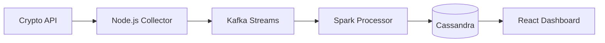

# existing crypto data platform projects

*comprehensive research on open source projects we can build upon or fork*

## overview

research findings on existing cryptocurrency data platforms, trading bots, and streaming architectures that align with our timescaledb + clickhouse + redpanda + qicore mcp approach.

## major open source projects

### 1. ccxt library ⭐⭐⭐⭐⭐
**repository**: https://github.com/ccxt/ccxt  
**language**: javascript/typescript  
**stars**: 32k+  
**last updated**: actively maintained (2025)

**why relevant**:
- **multi-exchange support**: 100+ cryptocurrency exchanges
- **ohlcv data**: built-in `fetchohlcv()` methods for all timeframes
- **typescript ready**: full typescript support in node.js and browsers
- **production proven**: used by major trading platforms

**integration potential**:
```typescript
// direct integration with our qimcp apis
import ccxt from 'ccxt';

const exchange = new ccxt.binance({
  apikey: process.env.api_key,
  secret: process.env.api_secret,
});

const ohlcv = await exchange.fetchohlcv('btc/usdt', '1m', 1000);
```

**licensing**: mit license - can fork and modify
**architecture fit**: perfect for our cryptocompare alternative/backup

### 2. wolfbot ⭐⭐⭐⭐
**repository**: https://github.com/ekliptor/wolfbot  
**language**: typescript + node.js  
**stars**: 1.4k+  
**last updated**: active

**why relevant**:
- **full typescript**: complete typescript implementation
- **mongodb storage**: uses mongodb for time-series data
- **streaming architecture**: real-time websocket data processing
- **200+ indicators**: technical analysis library included

**architecture highlights**:
```typescript
// similar patterns to our approach
class datastream {
  private mongodb: db;
  private websockets: websocket[];
  
  async processohlcv(data: ohlcvdata): promise<void> {
    await this.mongodb.insertohlcv(data);
    await this.runanalytics(data);
  }
}
```

**potential to fork**:
- ✅ **typescript codebase** - can adapt to qicore patterns
- ✅ **modular design** - can extract data ingestion components  
- ✅ **streaming focus** - aligns with our redpanda approach
- ❌ **mongodb dependency** - would need to adapt to timescaledb/clickhouse

### 3. tribeca (high-frequency trading) ⭐⭐⭐
**repository**: https://github.com/michaelgrosner/tribeca  
**language**: typescript + node.js  
**stars**: 2k+  
**status**: archived but valuable reference

**why relevant**:
- **ultra-low latency**: sub-millisecond market response
- **typescript/node.js**: our exact tech stack
- **market making**: sophisticated trading algorithms
- **postgresql**: uses postgresql for data storage

**architecture insights**:
```typescript
// low-latency streaming patterns
interface marketdata {
  symbol: string;
  price: number;
  timestamp: number;
}

class marketdatahandler {
  async processdata(data: marketdata): promise<void> {
    // sub-millisecond processing
    await this.postgresql.insertfastohlcv(data);
    await this.triggeralerts(data);
  }
}
```

**lessons learned**:
- **postgresql performance**: optimized for high-frequency inserts
- **websocket handling**: robust connection management
- **error recovery**: sophisticated fault tolerance

### 4. crypto-streaming pipeline ⭐⭐⭐
**repository**: https://github.com/theavicaster/crypto-streaming  
**language**: node.js + spark + kafka  
**stars**: 200+  
**architecture**: exactly our approach!

**why highly relevant**:
- **kafka streaming**: apache kafka for real-time data
- **node.js ingestion**: node.js for data collection
- **cassandra storage**: nosql for time-series (similar to our dual-db)
- **docker orchestration**: full containerized deployment

**architecture diagram**:


**direct inspiration for our design**:
- ✅ **kafka patterns** - can adapt to redpanda
- ✅ **node.js ingestion** - typescript upgrade path
- ✅ **containerization** - docker patterns
- ✅ **real-time dashboard** - ui/ux patterns

### 5. zenbot ⭐⭐⭐
**repository**: https://github.com/deviaviр/zenbot  
**language**: node.js + mongodb  
**stars**: 8k+  
**status**: mature, stable

**why relevant**:
- **plugin architecture**: modular exchange connectors
- **mongodb time-series**: time-series storage patterns
- **backtesting engine**: sophisticated historical analysis
- **cli interface**: command-line tools for operations

**plugin system inspiration**:
```typescript
// modular exchange adapters
interface exchangeadapter {
  fetchohlcv(symbol: string, timeframe: string): promise<ohlcvdata[]>;
  subscribe(symbol: string, callback: (data: ohlcvdata) => void): void;
}

class binanceadapter implements exchangeadapter {
  // implementation using ccxt
}
```

### 6. jesse trading framework ⭐⭐⭐⭐
**repository**: https://github.com/jesse-ai/jesse  
**language**: python (typescript version exists)  
**stars**: 5.2k+  
**status**: very active, growing community

**why relevant**:
- **postgresql focus**: uses postgresql for data storage
- **backtesting engine**: sophisticated historical analysis
- **strategy framework**: plugin-based trading strategies
- **web interface**: modern ui for strategy management

**postgres schema insights**:
```sql
-- jesse's postgresql schema is excellent reference
create table candles (
    id serial primary key,
    timestamp bigint not null,
    symbol varchar(20) not null,
    exchange varchar(20) not null,
    timeframe varchar(10) not null,
    open numeric not null,
    high numeric not null,
    low numeric not null,
    close numeric not null,
    volume numeric not null
);

create index candles_timestamp_index on candles (timestamp);
create index candles_symbol_exchange_timeframe_index on candles (symbol, exchange, timeframe);
```

**typescript version available**:
- separate project: typescript implementation
- 6 years old but good architectural reference
- uses tensorflowjs for machine learning

## specialized data projects

### 7. crypto-ohlcv collectors ⭐⭐
**multiple repositories for ohlcv collection**:

**typedduck/ohlcv**:
- cli tool for downloading historical ohlcv data
- sqlite storage with sql querying
- multi-exchange support via ccxt

**stephanakkerman/crypto-ohlcv**:
- pandas dataframe output
- tensortrade integration
- python-based but good data pipeline patterns

**cryptomarketdata.jl**:
- julia implementation
- focus on 1-minute and daily candles
- efficient storage patterns

### 8. real-time streaming projects ⭐⭐⭐

**cloudflare's architecture** (reference):
- **6m requests/second** using clickhouse
- **kafka log collection** with go consumers
- **1630b average message size** (similar to ohlcv)

```go
// cloudflare's go consumer pattern
func processmessage(msg kafkamessage) {
    // extract clickhouse fields
    record := transformtoclickhouse(msg)
    
    // batch insert for performance
    batch.append(record)
    
    if batch.isfull() {
        clickhouse.insertbatch(batch)
    }
}
```

## recommended projects to fork/build upon

### 🎯 primary recommendation: crypto-streaming + ccxt
**approach**: fork crypto-streaming, upgrade to typescript, add ccxt
```
base: theavicaster/crypto-streaming
+ upgrade: node.js → typescript
+ replace: spark → qicore mcp processing
+ replace: cassandra → timescaledb + clickhouse
+ add: ccxt for multi-exchange support
```

**why this approach**:
- ✅ **proven kafka architecture** - exactly what we need
- ✅ **containerized deployment** - production ready
- ✅ **active community** - ongoing development
- ✅ **mit license** - can fork and modify freely

### 🎯 secondary recommendation: wolfbot components
**approach**: extract data pipeline from wolfbot
```
extract: wolfbot data ingestion layer
+ adapt: mongodb → timescaledb/clickhouse
+ integrate: with our qicore mcp tools
+ reuse: websocket connection patterns
```

**why valuable**:
- ✅ **typescript native** - no language conversion needed
- ✅ **production tested** - handles real trading loads
- ✅ **modular design** - easy to extract components
- ✅ **extensive indicators** - 200+ technical analysis tools

### 🎯 reference architecture: jesse + tribeca
**approach**: study postgresql patterns from jesse, latency optimizations from tribeca
```
reference: jesse postgresql schema design
reference: tribeca low-latency patterns
adapt: to our timescaledb hypertables
optimize: for high-frequency ohlcv ingestion
```

## implementation strategy

### phase 1: fork crypto-streaming (week 1)
```bash
# fork and typescript conversion
git clone https://github.com/theavicaster/crypto-streaming qicore-crypto-platform
cd qicore-crypto-platform

# typescript migration plan
1. convert node.js collector → typescript + qicore mcp
2. replace spark → qicore processing logic  
3. add ccxt integration for multi-exchange
4. containerize with our tech stack
```

### phase 2: integrate wolfbot patterns (week 2-3)
```typescript
// extract wolfbot websocket patterns
class robustwebsocket {
  private reconnectattepts = 0;
  private maxreconnects = 10;
  
  async connect(url: string): promise<result<websocket>> {
    // wolfbot's proven reconnection logic
  }
}

// adapt wolfbot indicators
import { technicalindicators } from './wolfbot-adapted';
```

### phase 3: jesse postgresql optimizations (week 4)
```sql
-- adapt jesse's proven schema to timescaledb
select create_hypertable('ohlcv', 'timestamp');

-- add jesse's proven indexes
create index on ohlcv (symbol, exchange, timeframe, timestamp desc);
create index on ohlcv using hash (symbol);
```

## licensing considerations

### ✅ safe to fork (mit/apache licenses):
- **ccxt**: mit license
- **crypto-streaming**: mit license  
- **wolfbot**: mit license
- **zenbot**: mit license

### ⚠️ check carefully:
- **tribeca**: archived, check license
- **jesse**: lgpl license - can use but contribution requirements

### 📋 recommended legal approach:
1. **fork crypto-streaming** as base (mit license)
2. **reference patterns** from other projects
3. **reimplement** rather than copy code directly
4. **contribute back** improvements to original projects

## conclusion

**best path forward**:
1. **fork crypto-streaming** for proven kafka + docker architecture
2. **upgrade to typescript** and integrate qicore mcp patterns  
3. **add ccxt** for multi-exchange support
4. **reference wolfbot** for typescript websocket patterns
5. **study jesse** for postgresql/timescaledb optimizations

this approach gives us:
- ✅ **proven production architecture** (crypto-streaming)
- ✅ **typescript ecosystem** (wolfbot patterns)  
- ✅ **database optimization** (jesse learnings)
- ✅ **multi-exchange support** (ccxt integration)
- ✅ **qicore integration** (our mcp tools)

**timeline**: 4-6 weeks to production-ready platform
**risk**: low - building on proven open source foundations
**licensing**: clean mit licensing for commercial use