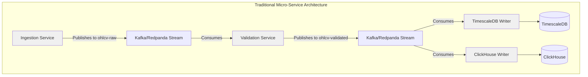
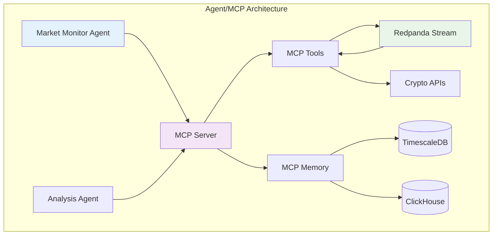

# Comparison: Traditional Micro-Service vs. Agent/MCP Architecture - Grok-3

> **Note**: This document builds on `docs/o3/architecture/comparison.md` to provide a deeper contrast between traditional micro-service architectures and the Agent/MCP approach, focusing on the centrality of the data stream, component abstraction, and the zero-coding potential enabled by LLMs.

The QiCore Crypto Data Platform can be architected in two fundamentally different ways: a **traditional micro-service architecture** with hardcoded workflows, or an **Agent/MCP (Model Context Protocol) architecture** that leverages AI agents, declarative workflows, and LLM-driven intelligence. Both approaches are built around a central data stream, but they differ significantly in implementation, flexibility, and development effort.

## Core Distinction: Data Stream as the Backbone

In both architectures, the **data stream** serves as the lifeblood of the system, carrying real-time market data (e.g., OHLCV from CryptoCompare or CCXT) through processing stages to storage and action. Whether it's raw data ingestion, validation, enrichment, or database writes, the stream dictates the flow of information. However, how each architecture interacts with and manages this stream reveals profound differences.

## 1. Traditional Micro-Service Architecture

### Overview
- **Definition**: A collection of independent, purpose-built services (e.g., ingestion, validation, DB writer) that communicate over defined interfaces (e.g., REST, message queues).
- **Workflow Implementation**: Developers must code each workflow step line-by-line at the source code level, explicitly defining how data moves from one service to another.
- **Data Stream Interaction**: The stream (often implemented via Kafka or Redpanda) is a passive transport layer. Each micro-service directly subscribes to or publishes from specific topics, with logic hardcoded into the service.

### Characteristics
- **Explicit Coding**: Every interaction, transformation, or decision along the data stream is written as imperative code. For example, a validation service must include detailed logic to check data schemas, deduplicate entries, and publish to the next topic.
- **Static Components**: Each service is a discrete, hardcoded unit (e.g., `validation-service.ts`) with fixed responsibilities. Changing workflows requires rewriting and redeploying code.
- **No Abstraction**: There is little to no abstraction beyond basic API contracts. Developers must manage the minutiae of data flow, error handling, and service orchestration.
- **Development Effort**: High. Every new feature or workflow adjustment demands direct coding, testing, and deployment cycles.

### Diagram

### Example Workflow
- **Ingestion to Storage**: A developer writes `ingestion-service.ts` to fetch data from CryptoCompare and publish to `ohlcv-raw`. Then, they code `validation-service.ts` to subscribe to `ohlcv-raw`, apply checks, and publish to `ohlcv-validated`. Finally, separate writer services are coded to insert into TimescaleDB and ClickHouse. Each step is a distinct codebase with explicit logic.
- **Effort**: 100s-1000s of lines of code per service, with manual integration and error handling.

## 2. Agent/MCP Architecture

### Overview
- **Definition**: A system where AI agents, orchestrated by an MCP Server, execute declarative workflows to manage the data stream. MCP (Model Context Protocol) provides standardized access to tools, memory, and files.
- **Workflow Implementation**: Workflows are defined in high-level YAML manifests, not source code. The MCP Server interprets these manifests, leveraging LLM intelligence for execution.
- **Data Stream Interaction**: The data stream (via Redpanda) remains central, but agents interact with it through abstracted MCP Tools. Agents don't need hardcoded logic; they rely on the MCP Server to route and process data based on declarative rules.

### Characteristics
- **Declarative Workflows**: Instead of line-by-line coding, developers define workflows in YAML, specifying what should happen (e.g., fetch data, validate, store) without detailing how. The MCP Server and LLMs handle the 'how'.
- **Component Abstraction**: MCP abstracts every component around the data stream—ingestion, validation, storage—as tools or services accessible via standardized interfaces (e.g., `server:protocol://path`). Agents interact with these abstractions, not raw implementations.
- **LLM Intelligence**: LLMs within the MCP Server provide pattern matching and reasoning capabilities (though not yet fully robust as of 2025). This enables intelligent decision-making, such as dynamically adjusting validation rules or routing data based on context, without explicit coding.
- **Zero-Coding Potential**: The combination of declarative manifests and LLM reasoning makes zero-coding workflows possible. Developers describe intent (e.g., 'alert if price exceeds threshold'), and the system infers and executes the necessary steps.
- **Development Effort**: Low to minimal. New features or workflow changes often require only manifest updates, not code rewrites.

### Diagram

### Example Workflow
- **Ingestion to Storage**: A developer writes a YAML manifest for a Market Monitor Agent, defining steps like 'fetch price from Crypto APIs', 'validate data', and 'store in TimescaleDB'. The MCP Server uses MCP Tools to interact with Redpanda and databases, leveraging LLM reasoning to handle validation logic dynamically (e.g., inferring schema checks from data patterns).
- **Effort**: A few dozen lines of YAML, with no need for direct service coding. Changes (e.g., adding a new exchange) are manifest updates, not code rewrites.

## Comparative Analysis

| Aspect | Traditional Micro-Service | Agent/MCP |
|--------|---------------------------|-----------|
| **Workflow Definition** | Line-by-line coding in source code (e.g., TypeScript). | Declarative YAML manifests interpreted by MCP Server. |
| **Data Stream Interaction** | Direct subscription/publication with hardcoded logic. | Abstracted via MCP Tools, managed by server with LLM intelligence. |
| **Component Abstraction** | Minimal; services are concrete, fixed implementations. | High; all components (ingestion, storage) abstracted as MCP interfaces. |
| **Intelligence & Reasoning** | None; all logic must be explicitly coded. | LLM-driven pattern matching and reasoning for dynamic decisions. |
| **Development Effort** | High; 100s-1000s lines of code per service. | Low; minimal code, often just manifest updates. |
| **Zero-Coding Potential** | None; coding is mandatory for every change. | High; LLM reasoning enables intent-driven, no-code workflows. |
| **Flexibility** | Low; changes require redeployment of services. | High; manifest updates can reconfigure workflows instantly. |
| **Container Count** | High (e.g., 5-10 containers for ingestion, validation, writers). | Low (e.g., 1-2 containers for MCP Server + agents). |
| **Lines of Code** | High (e.g., 10,000+ LoC for full stack). | Low (e.g., <1,000 LoC, mostly manifests). |

## Key Advantages of Agent/MCP with LLMs
1. **Abstraction Around Data Stream**: MCP abstracts every interaction with the data stream—whether fetching from APIs, validating on Redpanda, or writing to databases—as reusable tools. This shields developers from implementation details, unlike the traditional approach where each service must directly handle stream logic.
2. **LLM-Driven Intelligence**: The inclusion of LLMs in the MCP Server introduces pattern matching and reasoning capabilities (albeit still evolving in 2025). For instance, an agent might infer validation rules from data anomalies or dynamically route alerts based on market context—tasks that would require extensive coding in a traditional setup.
3. **Zero-Coding Vision**: The ultimate promise of Agent/MCP is zero-coding workflows. Developers express intent ('monitor BTC price for spikes'), and the system, using LLM reasoning, constructs the necessary pipeline (fetch, compare, notify) without manual intervention. This is impossible in traditional architectures.

## Challenges of Agent/MCP
- **Maturity of LLM Reasoning**: As of 2025, LLM reasoning is not yet fully robust, potentially leading to inconsistent workflow execution or incorrect inferences. Traditional coding offers more predictable control.
- **Learning Curve**: Declarative manifests and MCP abstractions require a mindset shift from imperative coding, which may initially slow adoption.
- **Debugging Complexity**: Errors in LLM-interpreted workflows can be harder to trace than in explicitly coded services.

## Conclusion
Both architectures center on the data stream as the core driver of the QiCore Crypto Data Platform, but the Agent/MCP approach fundamentally transforms development by abstracting components, leveraging LLM intelligence, and enabling a zero-coding future. While traditional micro-services demand exhaustive, line-by-line coding for every workflow step, Agent/MCP empowers developers to define intent at a high level, letting the system handle execution. Despite challenges in LLM maturity, the Agent/MCP model offers unparalleled flexibility and efficiency, aligning with the project's vision of autonomous, AI-driven financial operations [[memory:1382838]].

If the goal is rapid iteration, minimal code maintenance, and future-proof scalability, the Agent/MCP architecture is the clear choice over traditional micro-services. 