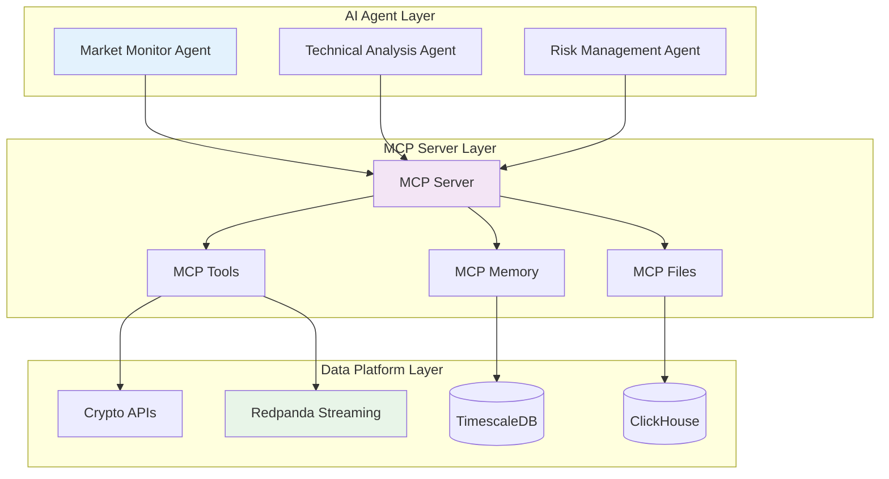

# MCP and Agent-Centric Architecture Overview - Grok-3

> **Note**: This document provides a detailed overview of the Model Context Protocol (MCP) and agent-centric design for the QiCore Crypto Data Platform, addressing a gap in the existing documentation.

The QiCore Crypto Data Platform leverages the **Model Context Protocol (MCP)** to enable AI agents to interact with financial data systems securely and efficiently. This architecture minimizes bespoke code by using declarative workflows executed by an MCP Server, replacing traditional micro-services with agent-driven tool-chains.

## Core Concepts

1. **Model Context Protocol (MCP)**:
   - MCP is a standardized interface for AI models to access external systems, ensuring secure, auditable interactions.
   - It provides tools, memory, and file access layers, allowing agents to perform complex tasks without direct code-level integration.

2. **Agent-Centric Design**:
   - Agents (e.g., Market-Monitoring Agent) are autonomous entities that execute specific financial tasks using MCP tools.
   - Instead of hard-coded micro-services, agents define workflows via YAML manifests, which the MCP Server interprets and runs.

3. **MCP Server**:
   - Acts as the runtime environment for agent workflows, orchestrating data access, tool execution, and result storage.
   - Supports Claude Code SDK for integration (available with Pro/Max plans as of May 2025) [[memory:1382838]].

## Architecture Diagram



## Benefits of MCP in Financial Data Platforms
- **Standardized Access**: Uniform API patterns for all data sources and tools, reducing integration complexity.
- **Security**: Controlled access to sensitive financial data and trading systems.
- **Flexibility**: Agents can be reconfigured via manifests without code changes.
- **Scalability**: MCP Server can handle multiple agents and workflows concurrently.

## Sample MCP Workflow Manifest

Below is an example of a YAML manifest for a Market Monitor Agent, defining how it interacts with the data platform:

```yaml
agent:
  name: MarketMonitorAgent
  version: 1.0
  description: Monitors cryptocurrency prices and triggers alerts.

tools:
  - name: CryptoPriceFetcher
    type: api
    endpoint: server:protocol://crypto-apis/fetch-price
    parameters:
      symbol: BTC/USD
      frequency: 1m
  - name: PriceAlertNotifier
    type: notifier
    endpoint: server:protocol://alerts/send
    conditions:
      threshold: 50000
      direction: above

workflow:
  steps:
    - fetch: CryptoPriceFetcher
      store: memory://latest-price
    - evaluate:
        condition: memory://latest-price > threshold
        action: PriceAlertNotifier

memory:
  - key: latest-price
    retention: 24h
```

## Integration with Data Platform
- **Ingestion**: Agents use MCP Tools to fetch data from Crypto APIs or Redpanda topics.
- **Storage**: Results are stored in MCP Memory (mapped to TimescaleDB) or MCP Files (mapped to ClickHouse).
- **Execution**: MCP Server runs agent workflows, ensuring data flows securely from source to storage or action.

## Implementation Notes
- **Tool Wrappers**: Minimal TypeScript code in `src/agents/tools/` to wrap platform APIs for MCP access.
- **Agent Deployment**: Agents are deployed as manifests to the MCP Server, not as standalone services.
- **Future Phases**: Later phases will expand agent capabilities with ML models and orchestration (Phase 3+).

This architecture reduces implementation complexity by collapsing traditional micro-services into declarative agent workflows, aligning with the project's goal of autonomous AI-driven financial operations [[memory:1382838]]. 