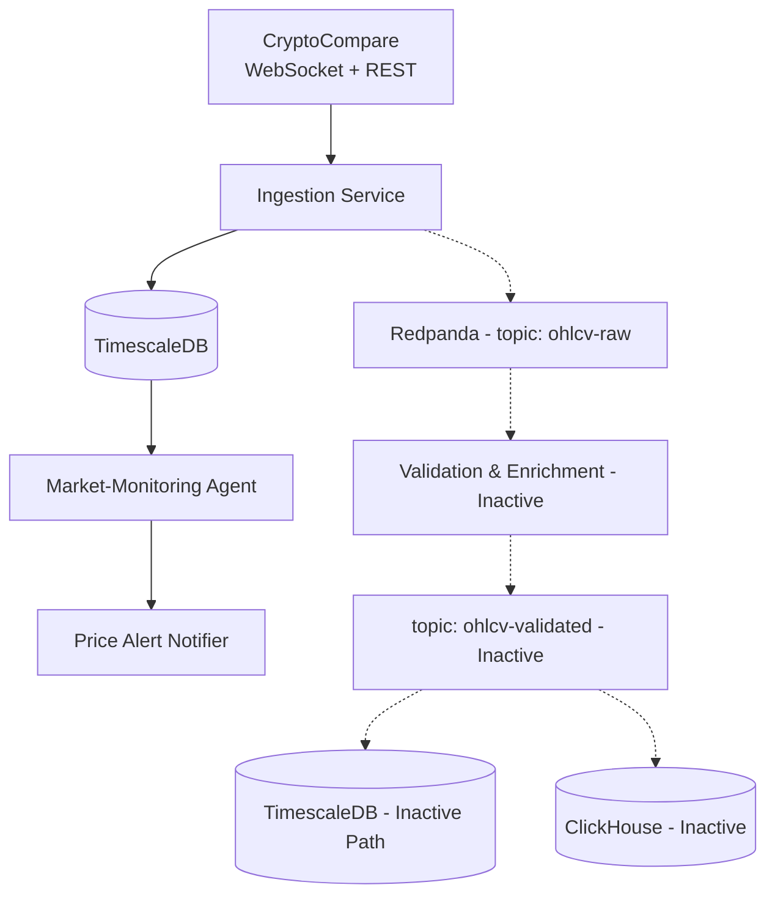

# MVP Architecture (Phase 1) - Grok-3

> **Note**: This document replaces the Phase 1 architecture in `docs/o3/phase1/architecture.md` and adjusts for the current codebase reality.

This architecture defines a **minimal viable slice** of the QiCore Crypto Data Platform, focusing on a single data source (CryptoCompare) and a primary storage engine (TimescaleDB). Given the current codebase includes Redpanda and ClickHouse (early Phase 2 components), this document identifies a functional subset within the existing setup, while noting how to revert to a true MVP if desired.

### Component Descriptions (Active for Phase 1 Slice)
1. **CryptoCompare Integration**  
   - REST for historical candles (bootstrap).  
   - WebSocket for live ticks.
2. **Ingestion Service**  
   - Transforms/validates OHLCV.  
   - Writes directly to TimescaleDB (or should, see note on alignment).  
   - Reconnect/back-off logic built-in.
3. **TimescaleDB**  
   - Single instance (Docker Compose).  
   - Hypertable `ohlcv`.  
   - Continuous aggregate for 1-hour buckets.
4. **Market-Monitoring Agent**  
   - Queries latest prices from TimescaleDB.  
   - Publishes simple threshold alerts.
5. **Alert Notifier**  
   - Implementation options: `LISTEN/NOTIFY`, WebSocket push, or email.

### Note on Codebase Alignment
- **Current State**: The codebase uses Redpanda (KafkaJS) for data flow and includes ClickHouse paths, exceeding Phase 1 scope. The dotted lines in the diagram represent these inactive or out-of-scope paths for the MVP slice.
- **Recommendation for True MVP**: Modify `Ingestion Service` to bypass Redpanda and write directly to TimescaleDB. Disable ClickHouse and Redpanda dependencies in the agent to focus solely on TimescaleDB reads.

### Out of Scope for Phase 1 (Inactive Components)
- Redpanda streaming bus (though present in code).  
- ClickHouse analytical warehouse (though referenced in code).  
- Validation & Enrichment service.  
- Multi-agent orchestration & MCP safety layers (detailed in later phases).

This architecture prioritizes a functional subset for rapid deployment and testing, acknowledging the codebase's advanced state while providing a clear path to revert if a minimal MVP is required. 