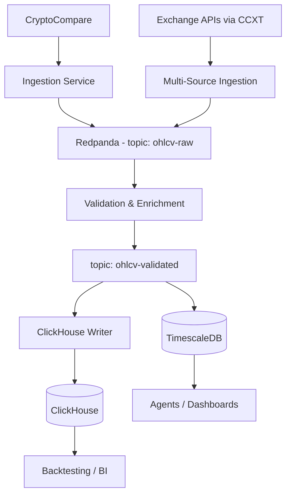

# Storage & Streaming Architecture (Phase 2) - Grok-3

> **Note**: This document replaces the Phase 2 streaming/storage section of `docs/o3/phase2/architecture.md` with enhanced detail.

### New Components Introduced
1. **Redpanda Streaming Bus** - Fault-tolerant log for all market messages. TLS and ACLs enabled for security.
2. **Validation & Enrichment Service** - Schema checks, deduplication, source reconciliation to ensure data quality.
3. **ClickHouse Analytics Warehouse** - Column-store for large time-range queries and historical back-testing.
4. **CCXT Integration** - Adds live WebSocket/REST feeds from multiple exchanges (e.g., Binance, Coinbase).

### Data Flow Summary
1. Multiple ingestion services publish raw OHLCV data into `ohlcv-raw` topic on Redpanda.
2. Validation & Enrichment service consumes, enriches, and republishes to `ohlcv-validated` topic.
3. Dedicated writers stream-insert validated data into TimescaleDB (real-time queries) and ClickHouse (analytics).

### Alignment with Current Codebase
- **Current State**: The codebase includes Redpanda producer logic and database utilities for TimescaleDB and ClickHouse, but lacks the Validation & Enrichment service, dedicated writer services, and CCXT integration.
- **Focus for Completion**: Implement missing services as detailed in `implementation.md` to fully realize this architecture.

### Out of Scope for Phase 2
- ML/technical-indicator agents (Phase 3).
- Orchestration & high-availability deployment (Phase 4). 