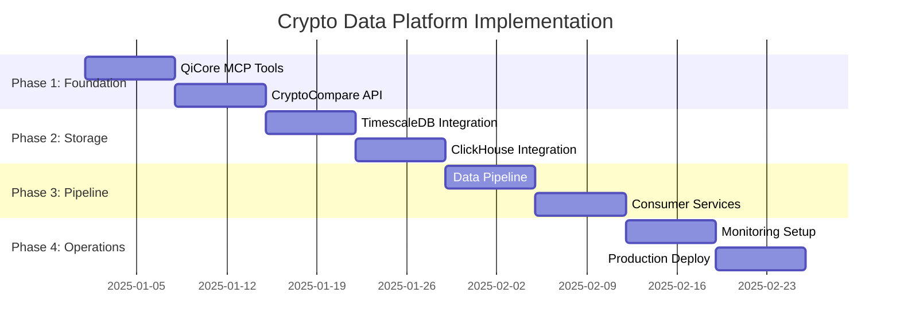

# implementation guide

## implementation timeline



## phase 1: foundation (weeks 1-2)

### qicore mcp tools development

**cryptocompare api client**
```typescript
// qimcp/apis/cryptocompare/rest-client.ts
import { Result, success, failure, createQiError } from '@qi/core/base';

export interface ohlcvdata {
  symbol: string;
  timestamp: number;
  open: number;
  high: number;
  low: number;
  close: number;
  volume: number;
}

export class cryptocomparerestclient {
  constructor(
    private apikey: string,
    private baseurl = 'https://min-api.cryptocompare.com'
  ) {}

  async getohlcv(
    symbol: string,
    timeframe: '1m' | '5m' | '1h' | '1d',
    limit = 100
  ): Promise<Result<ohlcvdata[]>> {
    try {
      const response = await fetch(
        `${this.baseurl}/data/v2/histoday?fsym=${symbol}&tsym=usd&limit=${limit}`,
        {
          headers: { authorization: `apikey ${this.apikey}` }
        }
      );
      
      if (!response.ok) {
        return failure(createQiError(
          'API_REQUEST_FAILED',
          `cryptocompare api returned ${response.status}`,
          'EXTERNAL'
        ));
      }

      const data = await response.json();
      return success(data.data.data.map(this.transformohlcv));
    } catch (error) {
      return failure(createQiError(
        'API_CONNECTION_ERROR',
        error instanceof Error ? error.message : 'unknown error',
        'NETWORK'
      ));
    }
  }

  private transformohlcv(raw: any): ohlcvdata {
    return {
      symbol: raw.fsym + raw.tsym,
      timestamp: raw.time * 1000,
      open: raw.open,
      high: raw.high,
      low: raw.low,
      close: raw.close,
      volume: raw.volumeto
    };
  }
}
```

**websocket streaming client**
```typescript
// qimcp/apis/cryptocompare/websocket-client.ts
import { EventEmitter } from 'events';
import { Result, success, failure } from '@qi/core/base';

export class cryptocomparewebsocketclient extends EventEmitter {
  private ws: WebSocket | null = null;
  private reconnectInterval = 5000;
  private maxReconnectAttempts = 10;
  private reconnectAttempts = 0;

  constructor(private apikey: string) {
    super();
  }

  async connect(): Promise<Result<void>> {
    try {
      this.ws = new WebSocket('wss://streaming.cryptocompare.com/');
      
      this.ws.onopen = () => {
        this.reconnectAttempts = 0;
        this.emit('connected');
        this.authenticate();
      };

      this.ws.onmessage = (event) => {
        const data = JSON.parse(event.data);
        this.handleMessage(data);
      };

      this.ws.onclose = () => {
        this.emit('disconnected');
        this.scheduleReconnect();
      };

      this.ws.onerror = (error) => {
        this.emit('error', error);
      };

      return success(undefined);
    } catch (error) {
      return failure(createQiError(
        'WEBSOCKET_CONNECTION_FAILED',
        error instanceof Error ? error.message : 'connection failed',
        'NETWORK'
      ));
    }
  }

  subscribeToOhlcv(symbols: string[]): void {
    if (!this.ws || this.ws.readyState !== WebSocket.OPEN) {
      throw new Error('websocket not connected');
    }

    const subscription = {
      action: 'subscribe',
      subs: symbols.map(symbol => `24~cccagg~${symbol}~usd`)
    };

    this.ws.send(JSON.stringify(subscription));
  }

  private authenticate(): void {
    if (!this.ws) return;
    
    const auth = {
      action: 'authenticate',
      apiKey: this.apikey
    };
    
    this.ws.send(JSON.stringify(auth));
  }

  private handleMessage(data: any): void {
    if (data.type === '24') { // ohlcv data
      const ohlcv = this.transformWebsocketOhlcv(data);
      this.emit('ohlcv', ohlcv);
    }
  }

  private transformWebsocketOhlcv(data: any): ohlcvdata {
    return {
      symbol: data.fromsymbol + data.tosymbol,
      timestamp: Date.now(),
      open: data.open24hour,
      high: data.high24hour,
      low: data.low24hour,
      close: data.price,
      volume: data.volume24hourto
    };
  }

  private scheduleReconnect(): void {
    if (this.reconnectAttempts >= this.maxReconnectAttempts) {
      this.emit('maxReconnectAttemptsReached');
      return;
    }

    setTimeout(() => {
      this.reconnectAttempts++;
      this.connect();
    }, this.reconnectInterval);
  }
}
```

**redpanda producer**
```typescript
// qimcp/streaming/redpanda/producer.ts
import { Kafka, Producer } from 'kafkajs';
import { Result, success, failure } from '@qi/core/base';

export class redpandaproducer {
  private producer: Producer;

  constructor(brokers: string[]) {
    const kafka = new Kafka({
      clientId: 'qicore-crypto-producer',
      brokers
    });
    
    this.producer = kafka.producer({
      maxInFlightRequests: 1,
      idempotent: true,
      transactionTimeout: 30000
    });
  }

  async connect(): Promise<Result<void>> {
    try {
      await this.producer.connect();
      return success(undefined);
    } catch (error) {
      return failure(createQiError(
        'PRODUCER_CONNECTION_FAILED',
        error instanceof Error ? error.message : 'connection failed',
        'NETWORK'
      ));
    }
  }

  async sendOhlcv(topic: string, data: ohlcvdata[]): Promise<Result<void>> {
    try {
      const messages = data.map(ohlcv => ({
        key: ohlcv.symbol,
        value: JSON.stringify(ohlcv),
        timestamp: ohlcv.timestamp.toString()
      }));

      await this.producer.send({
        topic,
        messages
      });

      return success(undefined);
    } catch (error) {
      return failure(createQiError(
        'PRODUCER_SEND_FAILED',
        error instanceof Error ? error.message : 'send failed',
        'SYSTEM'
      ));
    }
  }

  async disconnect(): Promise<void> {
    await this.producer.disconnect();
  }
}
```

## phase 2: storage integration (weeks 3-4)

### timescaledb integration

**database connection and schema**
```typescript
// qimcp/databases/timescale/connection.ts
import { Pool } from 'pg';
import { Result, success, failure } from '@qi/core/base';

export class timescaledbconnection {
  private pool: Pool;

  constructor(config: {
    host: string;
    port: number;
    database: string;
    user: string;
    password: string;
  }) {
    this.pool = new Pool({
      ...config,
      max: 20,
      idleTimeoutMillis: 30000,
      connectionTimeoutMillis: 5000
    });
  }

  async initializeSchema(): Promise<Result<void>> {
    try {
      await this.pool.query(`
        create table if not exists ohlcv (
          symbol text not null,
          exchange text not null,
          timestamp timestamptz not null,
          timeframe interval not null,
          open decimal(20,8) not null,
          high decimal(20,8) not null,
          low decimal(20,8) not null,
          close decimal(20,8) not null,
          volume decimal(20,8) not null,
          created_at timestamptz default now()
        );
      `);

      await this.pool.query(`
        select create_hypertable('ohlcv', 'timestamp', if_not_exists => true);
      `);

      await this.pool.query(`
        create index if not exists ohlcv_symbol_timestamp_idx 
        on ohlcv (symbol, timestamp desc);
      `);

      return success(undefined);
    } catch (error) {
      return failure(createQiError(
        'SCHEMA_INITIALIZATION_FAILED',
        error instanceof Error ? error.message : 'schema init failed',
        'DATABASE'
      ));
    }
  }

  async insertOhlcv(data: ohlcvdata[]): Promise<Result<void>> {
    const client = await this.pool.connect();
    
    try {
      await client.query('begin');
      
      for (const ohlcv of data) {
        await client.query(`
          insert into ohlcv (symbol, exchange, timestamp, timeframe, open, high, low, close, volume)
          values ($1, $2, to_timestamp($3/1000), interval '1 minute', $4, $5, $6, $7, $8)
          on conflict (symbol, timestamp) do update set
            open = excluded.open,
            high = excluded.high,
            low = excluded.low,
            close = excluded.close,
            volume = excluded.volume
        `, [
          ohlcv.symbol,
          'cryptocompare',
          ohlcv.timestamp,
          ohlcv.open,
          ohlcv.high,
          ohlcv.low,
          ohlcv.close,
          ohlcv.volume
        ]);
      }
      
      await client.query('commit');
      return success(undefined);
    } catch (error) {
      await client.query('rollback');
      return failure(createQiError(
        'INSERT_FAILED',
        error instanceof Error ? error.message : 'insert failed',
        'DATABASE'
      ));
    } finally {
      client.release();
    }
  }
}
```

**consumer service**
```typescript
// qimcp/databases/timescale/consumer.ts
import { Kafka, Consumer } from 'kafkajs';
import { timescaledbconnection } from './connection';

export class timescaleconsumer {
  private consumer: Consumer;
  private db: timescaledbconnection;

  constructor(brokers: string[], dbconfig: any) {
    const kafka = new Kafka({
      clientId: 'qicore-timescale-consumer',
      brokers
    });
    
    this.consumer = kafka.consumer({ groupId: 'timescale-writers' });
    this.db = new timescaledbconnection(dbconfig);
  }

  async start(): Promise<void> {
    await this.consumer.connect();
    await this.consumer.subscribe({ topic: 'ohlcv-validated' });
    
    await this.consumer.run({
      eachBatch: async ({ batch }) => {
        const ohlcvData: ohlcvdata[] = batch.messages.map(message => 
          JSON.parse(message.value!.toString())
        );
        
        const result = await this.db.insertOhlcv(ohlcvData);
        if (isFailure(result)) {
          console.error('failed to insert batch:', getError(result));
          // implement retry logic or dead letter queue
        }
      }
    });
  }
}
```

### clickhouse integration

**clickhouse connection**
```typescript
// qimcp/databases/clickhouse/connection.ts
import { createClient, ClickHouseClient } from '@clickhouse/client';
import { Result, success, failure } from '@qi/core/base';

export class clickhouseconnection {
  private client: ClickHouseClient;

  constructor(config: {
    host: string;
    port: number;
    database: string;
    username: string;
    password: string;
  }) {
    this.client = createClient({
      url: `http://${config.host}:${config.port}`,
      username: config.username,
      password: config.password,
      database: config.database,
      clickhouse_settings: {
        async_insert: 1,
        wait_for_async_insert: 0
      }
    });
  }

  async initializeSchema(): Promise<Result<void>> {
    try {
      await this.client.exec({
        query: `
          create table if not exists ohlcv (
            symbol lowcardinality(string),
            exchange lowcardinality(string),
            timestamp datetime64(3),
            timeframe lowcardinality(string),
            open float64,
            high float64,
            low float64,
            close float64,
            volume float64,
            created_at datetime default now()
          ) engine = mergetree()
          order by (symbol, timestamp)
          partition by toyyyymm(timestamp)
        `
      });

      return success(undefined);
    } catch (error) {
      return failure(createQiError(
        'CLICKHOUSE_SCHEMA_FAILED',
        error instanceof Error ? error.message : 'schema creation failed',
        'DATABASE'
      ));
    }
  }

  async insertOhlcv(data: ohlcvdata[]): Promise<Result<void>> {
    try {
      const values = data.map(ohlcv => [
        ohlcv.symbol,
        'cryptocompare',
        new Date(ohlcv.timestamp),
        '1m',
        ohlcv.open,
        ohlcv.high,
        ohlcv.low,
        ohlcv.close,
        ohlcv.volume
      ]);

      await this.client.insert({
        table: 'ohlcv',
        values,
        format: 'JSONEachRow'
      });

      return success(undefined);
    } catch (error) {
      return failure(createQiError(
        'CLICKHOUSE_INSERT_FAILED',
        error instanceof Error ? error.message : 'insert failed',
        'DATABASE'
      ));
    }
  }
}
```

## phase 3: data pipeline orchestration (weeks 5-6)

### pipeline coordinator
```typescript
// app/src/crypto-data-pipeline.ts
import { cryptocomparerestclient } from '@qi/mcp/apis/cryptocompare';
import { cryptocomparewebsocketclient } from '@qi/mcp/apis/cryptocompare';
import { redpandaproducer } from '@qi/mcp/streaming/redpanda';
import { timescaleconsumer } from '@qi/mcp/databases/timescale';
import { clickhouseconsumer } from '@qi/mcp/databases/clickhouse';

export class cryptodatapipeline {
  private restclient: cryptocomparerestclient;
  private wsclient: cryptocomparewebsocketclient;
  private producer: redpandaproducer;
  private timescaleconsumer: timescaleconsumer;
  private clickhouseconsumer: clickhouseconsumer;

  constructor(config: {
    cryptocompareApiKey: string;
    redpandaBrokers: string[];
    timescaleConfig: any;
    clickhouseConfig: any;
  }) {
    this.restclient = new cryptocomparerestclient(config.cryptocompareApiKey);
    this.wsclient = new cryptocomparewebsocketclient(config.cryptocompareApiKey);
    this.producer = new redpandaproducer(config.redpandaBrokers);
    this.timescaleconsumer = new timescaleconsumer(config.redpandaBrokers, config.timescaleConfig);
    this.clickhouseconsumer = new clickhouseconsumer(config.redpandaBrokers, config.clickhouseConfig);
  }

  async start(): Promise<void> {
    // start consumers first
    await this.timescaleconsumer.start();
    await this.clickhouseconsumer.start();
    
    // connect producer
    await this.producer.connect();
    
    // setup websocket streaming
    await this.wsclient.connect();
    this.wsclient.subscribeToOhlcv(['btc', 'eth', 'ada', 'sol']);
    
    this.wsclient.on('ohlcv', async (data) => {
      await this.producer.sendOhlcv('ohlcv-raw', [data]);
    });
    
    // backfill historical data
    await this.backfillHistoricalData();
  }

  private async backfillHistoricalData(): Promise<void> {
    const symbols = ['btc', 'eth', 'ada', 'sol'];
    
    for (const symbol of symbols) {
      const result = await this.restclient.getohlcv(symbol, '1d', 1000);
      if (isSuccess(result)) {
        await this.producer.sendOhlcv('ohlcv-validated', getData(result));
      }
    }
  }
}
```

## phase 4: monitoring and operations (weeks 7-8)

### monitoring setup
```typescript
// qimcp/monitoring/metrics.ts
export class datapipelinemetrics {
  private prometheus = require('prom-client');
  
  private ingestRate = new this.prometheus.Counter({
    name: 'crypto_data_ingested_total',
    help: 'total number of ohlcv records ingested',
    labelNames: ['symbol', 'source']
  });

  private processingLatency = new this.prometheus.Histogram({
    name: 'crypto_data_processing_duration_seconds',
    help: 'time taken to process ohlcv data',
    labelNames: ['stage']
  });

  recordIngestion(symbol: string, source: string, count: number): void {
    this.ingestRate.inc({ symbol, source }, count);
  }

  recordProcessingTime(stage: string, duration: number): void {
    this.processingLatency.observe({ stage }, duration);
  }
}
```

### health checks
```typescript
// qimcp/monitoring/health.ts
export class healthchecker {
  async checkTimescaleHealth(): Promise<boolean> {
    try {
      // check if timescaledb is responding
      const result = await timescaledb.query('select 1');
      return result.rows.length > 0;
    } catch {
      return false;
    }
  }

  async checkClickhouseHealth(): Promise<boolean> {
    try {
      // check if clickhouse is responding
      const result = await clickhouse.query('select 1');
      return result.data.length > 0;
    } catch {
      return false;
    }
  }

  async checkRedpandaHealth(): Promise<boolean> {
    try {
      // check if redpanda brokers are available
      const admin = kafka.admin();
      await admin.connect();
      const metadata = await admin.fetchTopicMetadata();
      await admin.disconnect();
      return metadata.topics.length >= 0;
    } catch {
      return false;
    }
  }
}
```

## deployment configuration

### docker-compose setup
```yaml
# docker-compose.yml
version: '3.8'

services:
  timescaledb:
    image: timescale/timescaledb:latest-pg15
    environment:
      postgres_db: cryptodb
      postgres_user: qicore
      postgres_password: ${postgres_password}
    ports:
      - "5432:5432"
    volumes:
      - timescale_data:/var/lib/postgresql/data

  clickhouse:
    image: clickhouse/clickhouse-server:latest
    ports:
      - "8123:8123"
      - "9000:9000"
    volumes:
      - clickhouse_data:/var/lib/clickhouse

  redpanda:
    image: redpandadata/redpanda:latest
    command:
      - redpanda start
      - --smp 1
      - --memory 1g
      - --overprovisioned
      - --node-id 0
      - --kafka-addr internal://0.0.0.0:9092,external://0.0.0.0:19092
      - --advertise-kafka-addr internal://redpanda:9092,external://localhost:19092
      - --pandaproxy-addr internal://0.0.0.0:8082,external://0.0.0.0:18082
      - --advertise-pandaproxy-addr internal://redpanda:8082,external://localhost:18082
    ports:
      - "18082:18082"
      - "19092:19092"
    volumes:
      - redpanda_data:/var/lib/redpanda/data

volumes:
  timescale_data:
  clickhouse_data:
  redpanda_data:
```

### environment configuration
```bash
# .env
cryptocompare_api_key=your_api_key_here
postgres_password=secure_password
redpanda_brokers=localhost:19092
timescale_host=localhost
clickhouse_host=localhost
```

## testing strategy

### unit tests
- test each qicore mcp component in isolation
- mock external dependencies (apis, databases)
- validate result<t> error handling patterns

### integration tests  
- test end-to-end data flow
- validate data consistency between databases
- test failure scenarios and recovery

### performance tests
- measure ingestion throughput
- validate query performance under load
- test scaling characteristics

## operational runbooks

### common issues
1. **high api latency**: check cryptocompare api status, implement backoff
2. **database connection issues**: verify connection pools, check network
3. **consumer lag**: scale consumer instances, optimize batch sizes
4. **disk space**: implement data retention policies, monitor growth

### maintenance procedures
1. **database updates**: rolling updates with connection draining
2. **schema migrations**: use timescaledb migration tools
3. **topic compaction**: configure redpanda retention policies
4. **backup procedures**: automated daily backups to s3