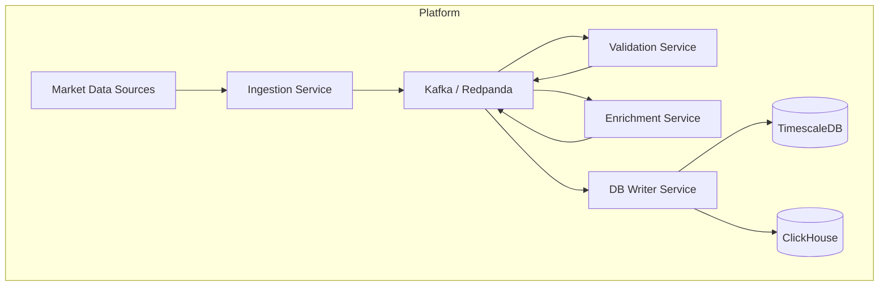
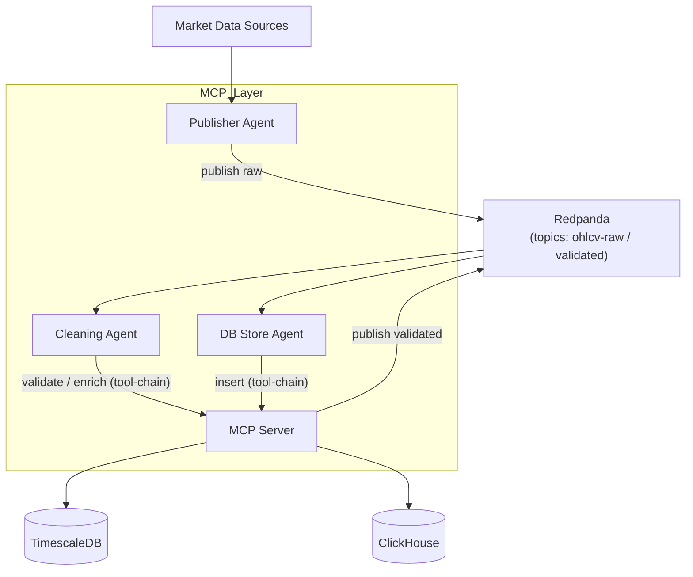

# Architecture Comparison – Traditional Micro-services vs Agent/MCP

Purpose: show at a glance how an agent-centric, MCP-enabled design **collapses several bespoke services** used in a conventional streaming data platform.

---

## 1. Traditional Container View (Micro-service heavy)

*Each logical step has its **own container**; wiring, retries, and monitoring must be coded per service.*

---

## 2. Agent/MCP Container View (Minimal bespoke code)

*All processing stages are **agents executing tool-chains inside a shared MCP Server**; only the runner & YAML manifests differ.*

---

## 3. Component Mapping
| Traditional Component | Replaced by | Notes |
|-----------------------|-------------|-------|
| Ingestion micro-service | **Publisher Agent** | uses `redpanda.publish` tool |
| Validation micro-service | **Cleaning Agent** + `schema.validate` tool | retry & errors handled by MCP |
| Enrichment micro-service | **Cleaning Agent** + `enrich.exchangeMeta` tool | no extra container |
| DB Writer micro-service | **DB Store Agent** + `timescaledb.insert` / `clickhouse.insert` tools | idempotency handled in tool |
| Per-service retry logic | Centralised in **MCP Server** | uniform policy |
| Per-service monitoring | Centralised via **MCP traces/metrics** | one exporter |

### Quantitative impact
| Metric | Traditional | Agent/MCP |
|--------|-------------|-----------|
| Containers to deploy | 6 | 2 (MCP Server + Runner) |
| Lines of bespoke code | ~3–4 k | <300 (tool wrappers + runner) |
| Deploy/update cycle | Rebuild & redeploy each service | Edit YAML manifest, hot-reload |

---

## 4. When to keep traditional services?
* Ultra-high-throughput stages needing specialised languages (Rust/Go).  
* Teams already staffed around separate micro-services.  
* Regulatory constraints requiring strict process isolation.

Otherwise, the Agent/MCP approach offers faster iteration, smaller footprint, and consistent operational semantics.

---
_Last updated: 2025-07-03_ 