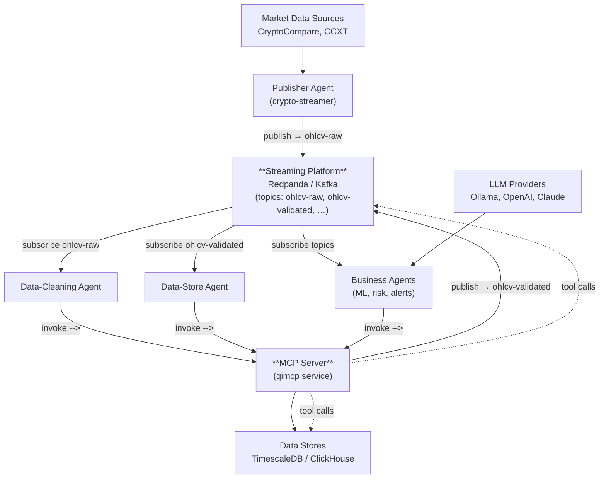

# Architecture Overview (Agent-Centric Data Platform)

This document provides a **single, authoritative view** of the platform's core components and their relationships, derived from the clarified Phase-2 design.  It does **not** alter any legacy docs; instead it stands alongside them under `docs/o3/`.

---

## C4 Container Diagram



---

## Component Identification

| # | Component | Implementation | Responsibilities | Quality Targets |
|---|-----------|----------------|------------------|-----------------|
| 1 | **Streaming Platform** | Redpanda (Kafka-API) cluster | Durable event log (`ohlcv-raw`, `ohlcv-validated`, etc.); exactly-once semantics | 100 MB/s ingress; <200 ms end-to-end latency; HA 3-node cluster |
| 2 | **MCP Server** | `qimcp` service exposing HTTP/GRPC API | Executes tool-chains for all agents; provides retries, error taxonomy, tracing | ≤5 ms overhead per call; horizontal scaling |
| 3 | **Agent Runtime** | `qiagent` + `qimcp` | Hosts publisher & consumer agents expressed in YAML; handles AI model calls | Handles 1k concurrent tool executions; OpenTelemetry spans emitted |
| 4 | **Data Stores** | TimescaleDB (primary), ClickHouse (analytics) | Persist raw + cleansed OHLCV; serve queries to agents & dashboards | Timescale P95 <50 ms for last-5m query; ClickHouse daily roll-up <1 s |
| 5 | **External Data Sources** | CryptoCompare, CCXT exchanges | Provide market data via WS/REST | 99.5 % availability assumed |
| 6 | **LLM Providers** | Ollama (self-hosted), OpenAI, Claude Code | Execute model prompts for analysis agents | response <5 s; costs monitored |

---

## Agent Types (non-exhaustive)
1. **Publisher Agent – Crypto Streamer**  
   Grabs market data from external APIs; publishes to `ohlcv-raw` via `redpanda.publish` tool.
2. **Data-Store Agent**  
   Consumes `ohlcv-validated`; writes to TimescaleDB & ClickHouse using `timescaledb.insert` / `clickhouse.insert` tools.
3. **Data-Cleaning Agent**  
   Consumes `ohlcv-raw`; runs `schema.validate`, `deduplicate.recent`, `enrich.exchangeMeta`; republishes to `ohlcv-validated`.
4. **Business Agents** (future)  
   Risk, ML, alerting – chained on top of validated stream.

All of the above are defined declaratively and executed via the MCP runtime—**no bespoke micro-services** beyond the thin `stream-runner` loop required to bridge Kafka to MCP.

---

## How the Agent ↔ MCP pattern works

1. **Agents are declarative workflows**  
   Each agent (publisher, cleaning, store, business) is described in a YAML manifest that lists the MCP tools to execute, the order/conditions (`when:` clauses), and retry policy.  No bespoke code is required beyond wiring the manifest to the runtime.

2. **MCP Runtime (qimcp) executes the workflow**  
   At runtime the agent process invokes `qimcp`, which:
   • resolves each tool,  
   • enforces JSON-schema I/O contracts,  
   • orchestrates retries/back-offs,  
   • emits OpenTelemetry spans.

3. **Tools are thin adapters (running inside MCP Server)**  
   Tools such as `schema.validate`, `redpanda.publish`, `timescaledb.insert` are 10-20 LOC wrappers that call commodity libraries (Ajv, KafkaJS, `pg`).  They are stateless and reusable across agents.

4. **Stream-runner provides the event loop**  
   A lightweight runner (~50 LOC) bridges Redpanda topics to the agent API: for each message it calls `agent.execute({payload})`.  Separate runners can be spawned per topic or agent, but the logic remains identical.

5. **Extensibility is configuration-only**  
   Adding a new cleansing rule or ML inference step means editing the YAML manifest to insert another tool call—deployment artifacts stay the same.

### Example (Data-Cleaning Agent manifest)
```yaml
id: ohlcv-cleaner
steps:
  - use: schema.validate
  - use: deduplicate.recent
  - use: enrich.exchangeMeta
  - use: redpanda.publish
    with: { topic: ohlcv-validated }
on_error:
  strategy: retry
  maxAttempts: 5
```

## Why this matters
* **Minimal code surface** — core logic lives in reusable tools; business logic is YAML.  
* **Composability** — any agent can subscribe to any topic and string together tools; no service boundaries to refactor.
* **Operability** — retries, metrics, traces are uniform across all agents via MCP runtime.

_Last updated: 2025-07-03_ 