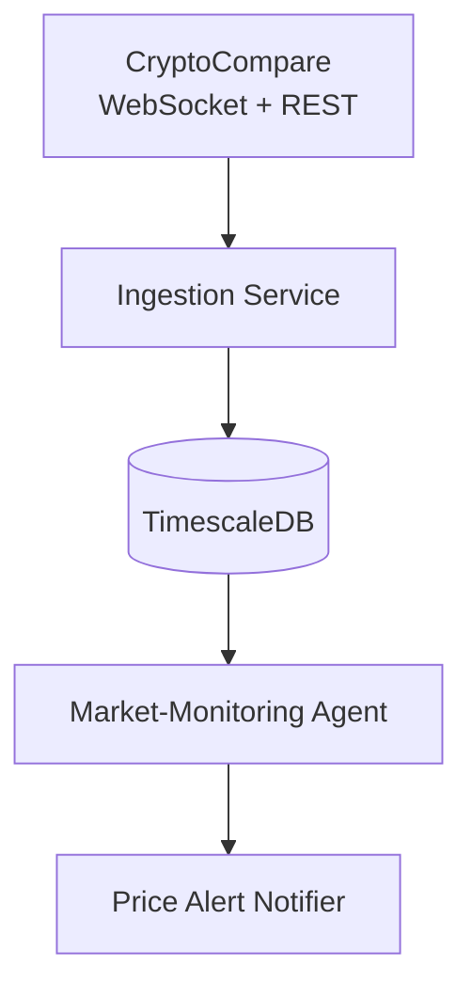

# MVP Architecture (Phase 1)

> **Note**: This document replaces the *Phase 1* architecture portion of the master `docs/architecture.md`. For phases beyond the MVP, continue to use the master file.

This architecture focuses on **one data source** (CryptoCompare) and **one storage engine** (TimescaleDB).  Additional components such as Redpanda and ClickHouse are introduced in Phase 2.

### Component descriptions
1. **CryptoCompare Integration**  
   • REST for historical candles (bootstrap).  
   • WebSocket for live ticks.

2. **Ingestion Service**  
   • Transforms/validates OHLCV.  
   • Writes directly to TimescaleDB.  
   • Reconnect/back-off logic built-in.

3. **TimescaleDB**  
   • Single instance (Docker Compose).  
   • Hypertable `ohlcv`.  
   • Continuous aggregate for 1-hour buckets.

4. **Market-Monitoring Agent**  
   • Queries latest prices.  
   • Publishes simple threshold alerts.

5. **Alert Notifier**  
   • Implementation options: `LISTEN/NOTIFY`, WebSocket push, or email.

---

### Out of scope for Phase 1
- Redpanda/Kafka streaming bus.  
- ClickHouse analytical warehouse.  
- Advanced ML/technical-analysis agents.  
- Multi-agent orchestration & MCP safety layers. 