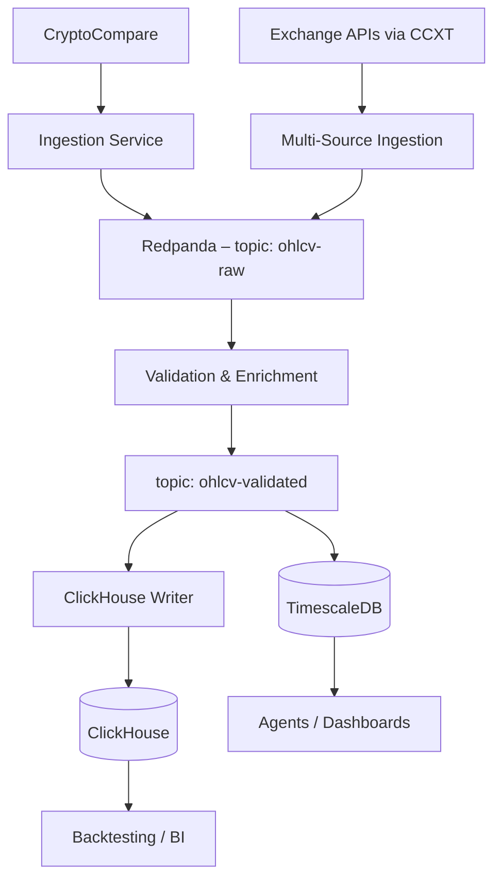

# Storage & Streaming Architecture (Phase 2)

> **Note**: This document replaces the *Phase 2* streaming/storage section of the master `docs/architecture.md`.

### New components introduced
1. **Redpanda streaming bus** – fault-tolerant log for all market messages. TLS and ACLs enabled.
2. **Validation & Enrichment service** – schema checks, deduplication, source reconciliation.
3. **ClickHouse Analytics Warehouse** – column-store for large time-range queries and historical back-testing.
4. **CCXT Integration** – adds live WS/REST feeds from multiple exchanges.

### Data flow summary
1. Multiple ingestion services publish raw OHLCV into `ohlcv-raw`.
2. Validator consumes, enriches and republishes to `ohlcv-validated`.
3. Writers stream-insert into TimescaleDB (real-time) and ClickHouse (analytics).

### Out of scope for Phase 2
- ML/technical-indicator agents (Phase 3).
- Orchestration & HA deployment (Phase 4). 