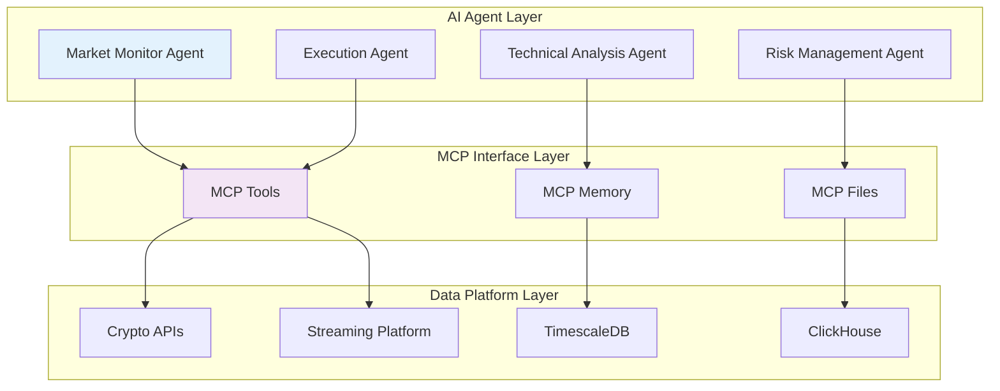
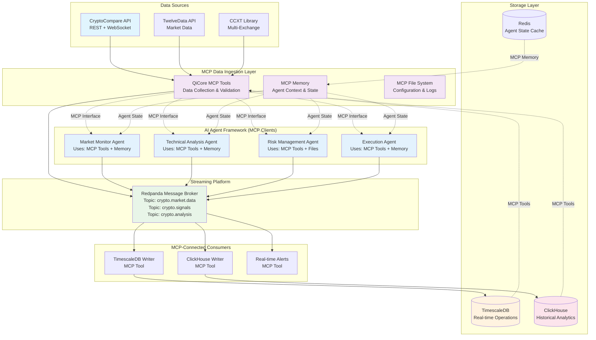
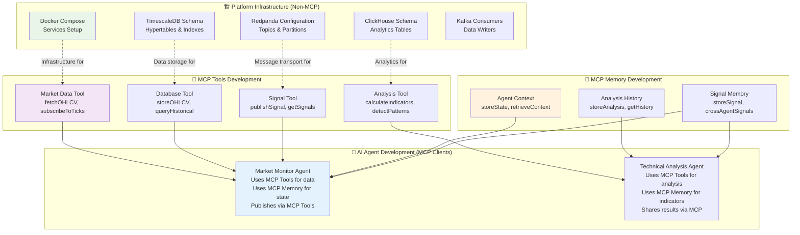
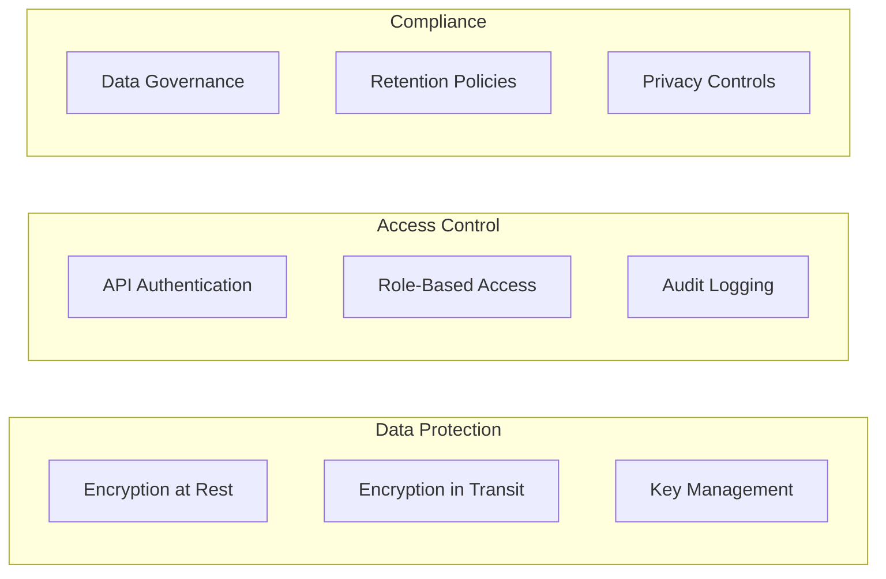
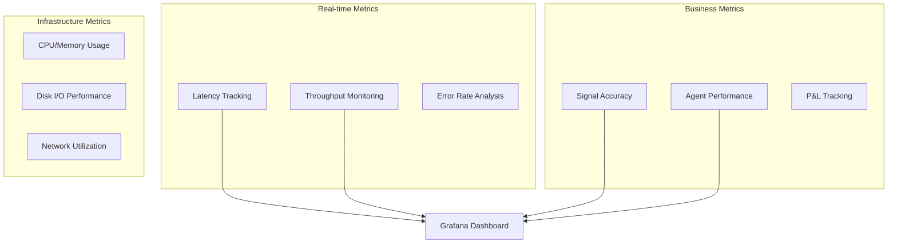

# QiCore Crypto Data Platform: AI-Powered Financial Data Infrastructure

*Foundation for Autonomous Cryptocurrency Trading Agents*

---

## Executive Summary

This proposal presents a **next-generation cryptocurrency data platform** designed as the foundation for **autonomous AI agents** in financial markets. Built on the **Model Context Protocol (MCP)** and proven open-source technologies, this platform enables AI agents to autonomously collect, process, and act on real-time market data with institutional-grade reliability.

### Key Value Propositions
- **Agentized Trading Foundation**: Enable autonomous AI agents to interact with cryptocurrency markets through standardized MCP interfaces
- **Real-time Data Infrastructure**: Sub-second market data processing for competitive trading advantages  
- **Production-Ready Architecture**: Battle-tested components handling millions of market events per second
- **Open Source Foundation**: Built upon and contributing back to proven projects (see [Existing Projects Analysis](./existing-projects.md))

### Target Market
- **AI Trading Firms**: Seeking infrastructure for autonomous trading agents
- **Quantitative Hedge Funds**: Requiring sub-second market data and execution
- **Crypto Research Organizations**: Need comprehensive historical and real-time data
- **DeFi Protocols**: Building market-making and arbitrage strategies

---

## Understanding the Foundation Technologies

### Model Context Protocol (MCP) Integration

**Model Context Protocol (MCP)** is an emerging standard that enables AI models to securely access and interact with external systems. Our platform implements MCP as the core interface layer:



**MCP Benefits for Financial AI:**
- **Standardized Interfaces**: Consistent API patterns across all financial tools and data sources
- **Secure Access**: Controlled, auditable access to financial data and trading systems
- **Composable Architecture**: Mix and match components for different agent behaviors
- **Future-Proof Design**: Add new capabilities without breaking existing agents

### Building on Proven Open Source Projects

Our architecture leverages and builds upon extensively researched open-source projects (detailed analysis in [existing-projects.md](./existing-projects.md)). **We are NOT building everything from scratch** - instead, we fork and adapt proven solutions:

### QiCore Framework Foundation

**Critical Note**: This platform builds on the existing QiCore framework that is already developed and tested:

- **`@qicore/agent-lib`**: Main QiCore library containing:
  - **`qiprompt`**: Prompt engineering and AI model interaction framework
  - **`qimcp`**: Model Context Protocol implementation and tooling  
  - **`qiagent`**: AI agent orchestration and execution framework

This framework is **NOT** part of this proposal - it is an existing, working component that this crypto platform uses as a dependency.

#### Primary Foundation: CCXT + Crypto-Streaming
- **CCXT Library**: 100+ cryptocurrency exchanges, 32k+ GitHub stars, MIT license
- **Crypto-Streaming**: Proven Kafka architecture, Docker orchestration, real-time processing
- **Integration Strategy**: Fork crypto-streaming, upgrade to TypeScript, integrate CCXT for multi-exchange

#### Technical Analysis Foundation: WolfBot + Jesse
- **WolfBot**: 200+ technical indicators, TypeScript native, proven trading patterns
- **Jesse Framework**: PostgreSQL optimization patterns, sophisticated backtesting engine
- **Integration Strategy**: Extract components, adapt to TimescaleDB/ClickHouse architecture

#### High-Frequency Patterns: Tribeca Reference
- **Ultra-low Latency**: Sub-millisecond market response patterns
- **PostgreSQL Performance**: Optimized for high-frequency inserts
- **Error Recovery**: Sophisticated fault tolerance mechanisms

### How We Use Existing Projects (Not Building from Scratch)

Our development approach focuses on **adapting and integrating** proven open-source solutions:

```mermaid
graph TB
    subgraph "🏛️ QiCore Framework (Existing)"
        QI_PROMPT[@qi/prompt<br/>AI Model Interaction]
        QI_MCP[@qi/mcp<br/>MCP Implementation]
        QI_AGENT[@qi/agent<br/>Agent Orchestration]
    end
    
    subgraph "🔄 Fork & Adapt Strategy"
        CRYPTO_STREAMING[Fork: crypto-streaming<br/>Kafka + Docker Architecture]
        CCXT[Direct Use: CCXT<br/>Multi-Exchange Support]
        WOLFBOT[Extract: WolfBot<br/>Technical Indicators]
        JESSE[Reference: Jesse<br/>PostgreSQL Patterns]
    end
    
    subgraph "🏗️ Our Infrastructure Files"
        DOCKER[docker-compose.yml<br/>From: crypto-streaming]
        STREAMING[crypto-streamer.ts<br/>From: crypto-streaming + CCXT]
        INDICATORS[analysis.ts<br/>From: WolfBot indicators]
        SCHEMA[init-schema.sql<br/>From: Jesse patterns]
    end
    
    subgraph "🔧 Our MCP Layer (Domain-Specific)"
        MCP_TOOLS[Crypto MCP Tools<br/>Using @qi/mcp]
        MCP_MEMORY[Crypto MCP Memory<br/>Using @qi/mcp]
    end
    
    subgraph "🤖 Our AI Agents (Domain-Specific)"
        AGENTS[Crypto Trading Agents<br/>Using @qi/agent]
    end
    
    CRYPTO_STREAMING --> DOCKER
    CRYPTO_STREAMING --> STREAMING
    CCXT --> STREAMING
    WOLFBOT --> INDICATORS
    JESSE --> SCHEMA
    
    DOCKER --> MCP_TOOLS
    STREAMING --> MCP_TOOLS
    INDICATORS --> MCP_TOOLS
    SCHEMA --> MCP_TOOLS
    
    QI_MCP --> MCP_TOOLS
    QI_MCP --> MCP_MEMORY
    QI_AGENT --> AGENTS
    QI_PROMPT --> AGENTS
    
    MCP_TOOLS --> AGENTS
    MCP_MEMORY --> AGENTS
    
    style QI_PROMPT fill:#e1f5fe
    style QI_MCP fill:#e1f5fe
    style QI_AGENT fill:#e1f5fe
    style CRYPTO_STREAMING fill:#e8f5e8
    style CCXT fill:#e8f5e8
    style MCP_TOOLS fill:#f3e5f5
```

#### **🏗️ Infrastructure Files (80% Existing Code)**

**File: `docker/docker-compose.yml`**
```yaml
# Source: crypto-streaming project (direct fork)
# https://github.com/theavicaster/crypto-streaming/blob/main/docker-compose.yml
version: '3.8'
services:
  redpanda:
    image: docker.redpanda.com/redpandadata/redpanda:latest
    # ... existing configuration from crypto-streaming
  
  timescaledb:
    image: timescale/timescaledb:latest
    # Adapted from crypto-streaming's Cassandra setup
```

**File: `src/infrastructure/streaming/crypto-streamer.ts`**
```typescript
// Source: crypto-streaming Node.js collector + CCXT integration
// https://github.com/theavicaster/crypto-streaming/blob/main/kafka-producer.js
import ccxt from 'ccxt';  // Direct dependency - no custom code needed

export class CryptoStreamer {
  private exchanges: ccxt.Exchange[];
  
  constructor() {
    // Use CCXT directly - 100+ exchanges supported out of the box
    this.exchanges = [
      new ccxt.binance(),
      new ccxt.coinbase(),
      new ccxt.kraken()
    ];
  }
  
  async fetchOHLCV(symbol: string): Promise<OHLCV[]> {
    // CCXT method - no custom implementation needed
    return await this.exchanges[0].fetchOHLCV(symbol, '1m');
  }
}
```

**File: `src/infrastructure/database/timescale-client.ts`**
```typescript
// Source: Jesse Framework PostgreSQL patterns
// https://github.com/jesse-ai/jesse/blob/master/jesse/models/candle.py
export class TimescaleClient {
  async createHypertables(): Promise<void> {
    // Jesse's proven schema adapted to TypeScript
    await this.query(`
      CREATE TABLE IF NOT EXISTS ohlcv (
        timestamp TIMESTAMPTZ NOT NULL,
        symbol VARCHAR(20) NOT NULL,
        exchange VARCHAR(20) NOT NULL,
        open NUMERIC NOT NULL,
        high NUMERIC NOT NULL,
        low NUMERIC NOT NULL,
        close NUMERIC NOT NULL,
        volume NUMERIC NOT NULL
      );
      
      -- Jesse's proven indexes
      SELECT create_hypertable('ohlcv', 'timestamp', if_not_exists => TRUE);
      CREATE INDEX IF NOT EXISTS idx_ohlcv_symbol_time ON ohlcv (symbol, timestamp DESC);
    `);
  }
}
```

**File: `src/mcp/tools/analysis.ts`**
```typescript
// Source: WolfBot technical indicators (200+ indicators)
// https://github.com/Ekliptor/WolfBot/tree/master/src/Indicators
import { RSI, MACD, BollingerBands } from './wolfbot-indicators';

export class AnalysisTool {
  @mcpTool("calculateRSI")
  async calculateRSI(data: OHLCV[], period: number = 14): Promise<number> {
    // Use WolfBot's proven RSI implementation
    return RSI.calculate(data, period);
  }
  
  @mcpTool("calculateMACD")
  async calculateMACD(data: OHLCV[]): Promise<MACDResult> {
    // Use WolfBot's proven MACD implementation
    return MACD.calculate(data);
  }
}
```

#### **🔧 MCP Layer (20% New Code)**

This is the only layer we build from scratch - the standardized interfaces:

#### **🏛️ QiCore Framework Integration (Existing Components)**

**File: `package.json`** - Using existing QiCore components:
```json
{
  "dependencies": {
    "@qi/prompt": "^1.0.0",     // Existing: AI model interaction
    "@qi/mcp": "^1.0.0",        // Existing: MCP implementation 
    "@qi/agent": "^1.0.0",      // Existing: Agent orchestration
    "ccxt": "^4.0.0",           // Existing: Exchange APIs
    // ... other dependencies
  }
}
```

**File: `package.json`** - Using QiCore framework:
```json
{
  "dependencies": {
    "@qicore/agent-lib": "workspace:*",  // QiCore framework
    "ccxt": "^4.3.0",                    // Exchange APIs
    // ... other dependencies
  }
}
```

**File: `src/mcp/tools/market-data.ts`** - Using qimcp module:
```typescript
// Uses existing qimcp module - NOT building MCP from scratch
import { MCPTool } from '@qicore/agent-lib/qimcp/client';

export class MarketDataTool implements MCPTool {
  constructor(
    private streamer: CryptoStreamer,      // Uses CCXT
    private database: TimescaleClient      // Uses Jesse patterns
  ) {}
  
  async fetchOHLCV(symbol: string): Promise<OHLCV[]> {
    // Wrap existing CCXT functionality with qimcp interface
    return await this.streamer.fetchOHLCV(symbol);
  }
}
```

**File: `src/agents/market-monitoring-agent.ts`** - Using qiagent module:
```typescript
// Uses existing qiagent framework - NOT building agents from scratch
import { BaseAgent, AgentConfig } from '@qicore/agent-lib/qiagent';
import { PromptTemplate } from '@qicore/agent-lib/qiprompt';

export class MarketMonitoringAgent extends BaseAgent {
  constructor(config: AgentConfig) {
    super(config);  // qiagent base functionality
  }
  
  async analyzeMarket(symbol: string): Promise<Analysis> {
    // Use qiprompt for AI model interaction
    const prompt = new PromptTemplate({
      template: "Analyze market data for {symbol}: {data}",
      variables: { symbol, data: await this.getMarketData(symbol) }
    });
    
    // qiagent handles model execution, error handling, retries
    return await this.executePrompt(prompt);
  }
}

### Development Effort Breakdown

**📊 Code Source Analysis:**
- **🏛️ 0% QiCore Framework**: Already exists (@qicore/agent-lib with qiprompt, qimcp, qiagent)
- **🔄 60% Existing Open Source**: Infrastructure, databases, streaming, indicators  
- **🔧 30% Adaptation**: TypeScript conversion, configuration, integration
- **🆕 10% New Code**: Domain-specific crypto MCP tools and agents

**🕐 Timeline Impact:**
- **Without QiCore + Existing Projects**: 12+ months to build from scratch
- **With QiCore + Existing Projects**: 4-6 weeks to production-ready platform
- **Risk Reduction**: Building on battle-tested components + proven frameworks

**📋 Complete Dependency Stack:**

### **🏛️ QiCore Framework (Existing - 0% Development)**
The QiCore framework already exists and handles all the complex framework code:

1. **`@qicore/agent-lib`**: Main QiCore library with three modules:
   - **`qiprompt`**: AI model interaction, prompt templates, model switching  
   - **`qimcp`**: MCP protocol implementation, tools, memory, client/server
   - **`qiagent`**: Agent orchestration, execution, safety, monitoring

### **📦 NPM Packages We're Wrapping (Direct Dependencies)**
These are existing, mature packages that we use directly:

```json
{
  "dependencies": {
    // 🏛️ QiCore Framework
    "@qicore/agent-lib": "workspace:*",      // Main QiCore library
    
    // 🔄 Exchange & Market Data
    "ccxt": "^4.3.0",                    // 100+ crypto exchanges
    "ws": "^8.14.0",                     // WebSocket connections
    
    // 🗄️ Database Clients
    "@timescale/toolkit": "^0.0.12",     // TimescaleDB client
    "@clickhouse/client": "^0.2.5",      // ClickHouse client  
    "redis": "^4.6.0",                   // Redis cache client
    "pg": "^8.11.0",                     // PostgreSQL base client
    
    // 📊 Streaming & Messaging
    "kafkajs": "^2.2.4",                 // Kafka client (Redpanda compatible)
    "@redpanda-data/console": "^2.3.0",  // Redpanda management
    
    // 📈 Technical Analysis  
    "technicalindicators": "^3.1.0",     // 40+ indicators
    "tulind": "^0.8.21",                 // Fast C-based indicators
    
    // 🛠️ Utilities
    "zod": "^3.22.0",                     // Data validation
    "winston": "^3.11.0",                // Logging
    "dotenv": "^16.3.0",                 // Environment config
    "axios": "^1.6.0"                    // HTTP client
  }
}
```

### **🔧 How We Wrap Each Package**

#### **Market Data Sources (ccxt + ws)**
```typescript
// File: src/infrastructure/apis/cryptocompare-client.ts
import ccxt from 'ccxt';
import WebSocket from 'ws';

export class CryptoCompareClient {
  // Wraps ccxt.Exchange + WebSocket for CryptoCompare
  private exchange: ccxt.Exchange;
  private ws: WebSocket;
  
  async fetchOHLCV(symbol: string): Promise<OHLCV[]> {
    // Direct ccxt usage - no custom implementation
    return await this.exchange.fetchOHLCV(symbol, '1m');
  }
}
```

#### **Database Connections (pg + @timescale/toolkit + @clickhouse/client)**
```typescript
// File: src/infrastructure/database/timescale-client.ts
import { Client } from 'pg';
import { TimescaleClient as TSClient } from '@timescale/toolkit';

export class TimescaleClient {
  // Wraps pg + TimescaleDB toolkit
  private client: TSClient;
  
  async insertOHLCV(data: OHLCV[]): Promise<void> {
    // Uses TimescaleDB's optimized batch insert
    await this.client.insertBatch('ohlcv', data);
  }
}
```

#### **Streaming Infrastructure (kafkajs)**
```typescript
// File: src/infrastructure/streaming/kafka-producer.ts
import { Kafka, Producer } from 'kafkajs';

export class CryptoKafkaProducer {
  // Wraps kafkajs for Redpanda compatibility
  private producer: Producer;
  
  async sendOHLCV(topic: string, data: OHLCV): Promise<void> {
    // Direct kafkajs usage
    await this.producer.send({
      topic,
      messages: [{ value: JSON.stringify(data) }]
    });
  }
}
```

#### **Technical Analysis (technicalindicators + tulind)**
```typescript
// File: src/mcp/tools/analysis.ts
import { RSI, MACD } from 'technicalindicators';
import * as tulind from 'tulind';

export class TechnicalAnalysisTool {
  // Wraps existing indicator libraries
  
  @mcpTool("calculateRSI")
  async calculateRSI(values: number[], period: number = 14): Promise<number> {
    // Direct technicalindicators usage
    return RSI.calculate({ values, period })[0];
  }
  
  @mcpTool("calculateBollingerBands") 
  async calculateBollingerBands(values: number[]): Promise<BandResult> {
    // Direct tulind usage for performance
    return await tulind.indicators.bbands.indicator([values], [20, 2]);
  }
}
```

### **🔄 Open Source Projects We Fork/Reference:**
4. **crypto-streaming (Fork)**: Complete Docker + Kafka architecture
5. **WolfBot (Extract)**: Additional technical indicators library  
6. **Jesse (Reference)**: PostgreSQL schema and optimization patterns
7. **Tribeca (Reference)**: Low-latency patterns and error handling

### **🆕 Our Domain-Specific Code (10% New Development):**
- Crypto-specific MCP tools that wrap the above packages
- Crypto trading agents using @qi/agent framework
- Configuration and integration glue code

This approach gives us **production-ready infrastructure** in weeks, not months, while leveraging the full QiCore framework for AI agent development and MCP protocol handling.

---

## Current Implementation Status

### ✅ **Completed (Ready to Use)**
- **QiCore Framework**: `@qicore/agent-lib` with qiprompt, qimcp, qiagent modules available
- **Infrastructure Layer**: Working data pipeline with TimescaleDB + ClickHouse 
- **Basic Agent**: Market monitoring agent with AI analysis (using direct model calls)
- **Docker Environment**: Complete containerized development setup
- **Data Pipeline**: CryptoCompare → Redpanda → Database storage working

### 🔄 **In Progress (Next 2-4 weeks)**
- **MCP Integration**: Refactor existing agents to use QiCore MCP interfaces instead of direct model calls
- **Domain Tools**: Crypto-specific MCP tools for market data, signals, and analysis
- **Agent Framework Migration**: Convert from direct AI SDK usage to `qiagent` orchestration
- **Standardized Interfaces**: Implement MCP tools using `qimcp` framework

### 📋 **Planned (Future Phases)**
- **Multi-source Data**: Additional exchanges via CCXT integration
- **Advanced Agents**: Technical analysis, risk management, and execution agents
- **Production Deployment**: Multi-region setup with monitoring and alerting
- **Agent Marketplace**: Ecosystem for sharing trading strategies

### **Current Architecture vs Target Architecture**

**Current State**: Direct AI model integration
```typescript
// Current implementation (working but not MCP-standardized)
const result = await generateText({
  model: ollama("qwen2.5:0.5b"),
  prompt: "Analyze market data...",
});
```

**Target State**: QiCore MCP integration
```typescript  
// Target implementation (using QiCore framework)
import { MCPTool } from '@qicore/agent-lib/qimcp/client';
import { BaseAgent } from '@qicore/agent-lib/qiagent';

class MarketAnalysisTool implements MCPTool {
  // Standardized MCP interface
}

class TradingAgent extends BaseAgent {
  // QiCore agent orchestration
}
```

---

## Platform Architecture

### Platform Architecture with MCP Integration



**Key MCP Integration Points:**
- **🔧 MCP Tools**: Standardized interfaces for data access (market data, databases, files)
- **🧠 MCP Memory**: Shared agent context and state management
- **📁 MCP Files**: Configuration, logging, and persistent storage
- **🤖 AI Agents**: Connect via MCP interfaces (not direct database access)

### Development Architecture: What to Build Where

This section clarifies **what you develop with MCP** vs **what you develop outside MCP** and how they connect:



#### **🏗️ Infrastructure Layer (Develop Outside MCP)**
You develop these components **outside** the MCP framework as traditional services:

**File: `docker-compose.yml`** 
- Redpanda, TimescaleDB, ClickHouse, Redis services
- Network configuration and service discovery
- Volume mounts and environment variables

**File: `database/init-timescale.sql`**
- Database schema, hypertables, indexes
- Continuous aggregates, retention policies
- Performance optimizations

**File: `src/streaming/crypto-streamer.ts`**  
- Kafka producers and consumers
- WebSocket connections to exchanges
- Data validation and transformation

**📝 Why Outside MCP:** These are infrastructure components that agents consume through MCP tools.

#### **🔧 MCP Tools Layer (Develop With MCP)**
You develop these as **MCP tool implementations**:

**File: `src/mcp/tools/market-data.ts`**
```typescript
// MCP Tool for market data access
export class MarketDataTool {
  @mcpTool("fetchOHLCV")
  async fetchOHLCV(symbol: string, timeframe: string): Promise<OHLCVData[]> {
    // Implementation connects to TimescaleDB
    return await this.timescaledb.query(symbol, timeframe);
  }
  
  @mcpTool("subscribeToTicks") 
  async subscribeToTicks(symbol: string): Promise<TickStream> {
    // Implementation connects to Kafka stream
    return this.kafka.subscribe(`crypto.ticks.${symbol}`);
  }
}
```

**File: `src/mcp/tools/analysis.ts`**
```typescript
// MCP Tool for technical analysis
export class AnalysisTool {
  @mcpTool("calculateRSI")
  async calculateRSI(data: OHLCVData[], period: number): Promise<number> {
    // Technical analysis implementation
  }
  
  @mcpTool("detectPattern")
  async detectPattern(data: OHLCVData[]): Promise<string> {
    // Pattern recognition implementation
  }
}
```

**📝 Why With MCP:** These provide standardized interfaces that any AI agent can use.

#### **🧠 MCP Memory Layer (Develop With MCP)**
You develop these as **MCP memory implementations**:

**File: `src/mcp/memory/agent-context.ts`**
```typescript
// MCP Memory for agent state management
export class AgentContextMemory {
  @mcpMemory("storeAnalysisResult")
  async storeAnalysisResult(agentId: string, result: Analysis): Promise<void> {
    // Store in Redis with TTL
  }
  
  @mcpMemory("getAgentContext")  
  async getAgentContext(agentId: string, symbol: string): Promise<Context> {
    // Retrieve agent-specific context
  }
}
```

**📝 Why With MCP:** Enables agents to share state and context in standardized ways.

#### **🤖 AI Agent Layer (Develop As MCP Clients)**
You develop agents that **consume** MCP tools and memory:

**File: `src/agents/market-monitoring-agent.ts`**
```typescript
// Agent that uses MCP tools (not direct database access)
export class MarketMonitoringAgent {
  constructor(private mcpClient: MCPClient) {}
  
  async analyzeMarket(symbol: string): Promise<Analysis> {
    // Use MCP tools instead of direct database calls
    const ohlcv = await this.mcpClient.callTool("fetchOHLCV", { symbol });
    const rsi = await this.mcpClient.callTool("calculateRSI", { data: ohlcv });
    
    // Store results in MCP memory
    await this.mcpClient.storeMemory("analysisResult", analysis);
    
    return analysis;
  }
}
```

**📝 Why As MCP Clients:** Agents get standardized access to all platform capabilities.

### **Development Workflow Summary**

1. **🏗️ Infrastructure First**: Set up databases, streaming, Docker (outside MCP)
2. **🔧 Build MCP Tools**: Create standardized interfaces to infrastructure  
3. **🧠 Add MCP Memory**: Enable agent state and context sharing
4. **🤖 Develop Agents**: Create AI agents that use MCP tools and memory
5. **🔄 Iterate**: Add new MCP tools as agent needs evolve

**Key Principle**: Agents **never** directly access databases or Kafka - they only use MCP interfaces. This ensures consistent, secure, and composable architecture.

---

## Proposed File Structure

Since the documentation references specific files and their roles, here's the complete proposed directory structure:

```
qicore-crypto-platform/
├── 📁 docker/
│   ├── docker-compose.yml              # 🏗️ Infrastructure - All services
│   ├── docker-compose.dev.yml          # 🏗️ Development overrides
│   ├── redpanda/
│   │   └── redpanda.yml                # 🏗️ Message broker config
│   ├── timescale/
│   │   ├── init-schema.sql             # 🏗️ Database schema
│   │   └── timescale.conf              # 🏗️ Database config
│   └── clickhouse/
│       ├── init-schema.sql             # 🏗️ Analytics schema
│       └── clickhouse.xml              # 🏗️ Database config
│
├── 📁 src/
│   ├── 📁 infrastructure/              # 🏗️ Infrastructure Layer
│   │   ├── streaming/
│   │   │   ├── crypto-streamer.ts      # 🏗️ WebSocket → Kafka producer
│   │   │   ├── kafka-consumer.ts       # 🏗️ Kafka → Database writers
│   │   │   └── data-validator.ts       # 🏗️ Data quality validation
│   │   ├── database/
│   │   │   ├── timescale-client.ts     # 🏗️ TimescaleDB connection
│   │   │   ├── clickhouse-client.ts    # 🏗️ ClickHouse connection
│   │   │   └── redis-client.ts         # 🏗️ Redis cache client
│   │   └── apis/
│   │       ├── cryptocompare-client.ts # 🏗️ CryptoCompare API
│   │       ├── twelvedata-client.ts    # 🏗️ TwelveData API
│   │       └── ccxt-client.ts          # 🏗️ Multi-exchange via CCXT
│   │
│   ├── 📁 mcp/                         # 🔧 MCP Layer
│   │   ├── tools/
│   │   │   ├── market-data.ts          # 🔧 fetchOHLCV(), subscribeToTicks()
│   │   │   ├── database.ts             # 🔧 storeOHLCV(), queryHistorical()
│   │   │   ├── signals.ts              # 🔧 publishSignal(), getSignals()
│   │   │   ├── analysis.ts             # 🔧 calculateIndicators(), detectPatterns()
│   │   │   └── index.ts                # 🔧 MCP tools registry
│   │   ├── memory/
│   │   │   ├── agent-context.ts        # 🧠 storeState(), retrieveContext()
│   │   │   ├── analysis-history.ts     # 🧠 storeAnalysis(), getHistory()
│   │   │   ├── signal-memory.ts        # 🧠 storeSignal(), crossAgentSignals()
│   │   │   └── index.ts                # 🧠 MCP memory registry
│   │   ├── server.ts                   # 🔧 MCP server implementation
│   │   └── client.ts                   # 🔧 MCP client implementation
│   │
│   ├── 📁 agents/                      # 🤖 AI Agent Layer
│   │   ├── market-monitoring-agent.ts  # 🤖 Market analysis + signal generation
│   │   ├── technical-analysis-agent.ts # 🤖 Technical indicators + patterns
│   │   ├── risk-management-agent.ts    # 🤖 Risk assessment + alerts
│   │   ├── execution-agent.ts          # 🤖 Order execution + management
│   │   └── base-agent.ts               # 🤖 Abstract base class
│   │
│   ├── 📁 types/                       # 📝 TypeScript definitions
│   │   ├── market-data.ts              # OHLCV, Tick, OrderBook types
│   │   ├── signals.ts                  # TradingSignal, Analysis types
│   │   ├── agents.ts                   # Agent interfaces
│   │   └── mcp.ts                      # MCP protocol types
│   │
│   ├── 📁 utils/                       # 🛠️ Utilities
│   │   ├── logger.ts                   # Structured logging
│   │   ├── config.ts                   # Configuration management
│   │   ├── metrics.ts                  # Performance monitoring
│   │   └── errors.ts                   # Error handling
│   │
│   ├── 📁 consumers/                   # 🏗️ Infrastructure - Kafka consumers
│   │   ├── timescale-writer.ts         # 🏗️ OHLCV → TimescaleDB
│   │   ├── clickhouse-writer.ts        # 🏗️ Analytics → ClickHouse
│   │   ├── alert-processor.ts          # 🏗️ Real-time alerts
│   │   └── pattern-detector.ts         # 🏗️ Pattern recognition
│   │
│   ├── main.ts                         # 🚀 Application entry point
│   └── health-check.ts                 # 🏥 Health monitoring
│
├── 📁 scripts/                         # 🔧 Development scripts
│   ├── setup-dev.sh                    # Environment setup
│   ├── start-services.sh               # Docker services
│   ├── seed-data.sh                    # Test data generation
│   └── backup-db.sh                    # Database backup
│
├── 📁 tests/                           # 🧪 Test suites
│   ├── integration/
│   │   ├── mcp-tools.test.ts          # 🔧 MCP tools integration
│   │   ├── agents.test.ts             # 🤖 Agent behavior tests
│   │   └── streaming.test.ts          # 🏗️ Data pipeline tests
│   ├── unit/
│   │   ├── market-data.test.ts        # Unit tests for market data
│   │   ├── signals.test.ts            # Unit tests for signals
│   │   └── utils.test.ts              # Utility function tests
│   └── fixtures/
│       ├── sample-ohlcv.json          # Test data fixtures
│       └── mock-responses.json        # API mock responses
│
├── 📁 docs/                            # 📚 Documentation
│   ├── api/                           # API documentation
│   ├── architecture/                  # Architecture diagrams
│   ├── guides/                        # Developer guides
│   └── examples/                      # Usage examples
│
├── 📁 monitoring/                      # 📊 Observability
│   ├── grafana/
│   │   └── dashboards/                # Grafana dashboards
│   ├── prometheus/
│   │   └── alerts.yml                 # Prometheus alerts
│   └── logs/
│       └── logback.xml                # Logging configuration
│
├── package.json                        # 📦 Project dependencies
├── bun.lockb                          # 🔒 Dependency lock file
├── tsconfig.json                      # 🔧 TypeScript configuration
├── .env.example                       # 🔑 Environment variables template
├── .gitignore                         # 🚫 Git ignore patterns
├── README.md                          # 📖 Project documentation
└── LICENSE                            # ⚖️ License information
```

### **File Organization Principles**

#### **🏗️ Infrastructure Layer** (Traditional Services)
- **`docker/`**: Service definitions and configurations
- **`src/infrastructure/`**: Direct service integrations (databases, APIs, streaming)
- **`src/consumers/`**: Kafka consumers that write to databases
- **Location Rationale**: These files handle "plumbing" - they're not MCP-aware

#### **🔧 MCP Tools Layer** (Standardized Interfaces)
- **`src/mcp/tools/`**: MCP tool implementations
- **`src/mcp/server.ts`**: MCP server that exposes tools
- **Location Rationale**: These files provide standardized interfaces to infrastructure

#### **🧠 MCP Memory Layer** (Agent State Management)
- **`src/mcp/memory/`**: MCP memory implementations
- **Location Rationale**: These files handle cross-agent state and context sharing

#### **🤖 AI Agent Layer** (MCP Clients)
- **`src/agents/`**: AI agents that consume MCP tools and memory
- **Location Rationale**: These files implement business logic using MCP interfaces

#### **📝 Supporting Files**
- **`src/types/`**: TypeScript definitions shared across layers
- **`src/utils/`**: Utility functions used by all layers
- **`tests/`**: Test suites organized by layer and integration level

### **Development Flow Example**

**Step 1: Infrastructure Setup**
```bash
# Set up services
docker-compose -f docker/docker-compose.yml up -d

# Initialize databases
bun run src/infrastructure/database/init-schema.ts
```

**Step 2: MCP Tools Development**
```typescript
// src/mcp/tools/market-data.ts
export class MarketDataTool {
  // Uses src/infrastructure/apis/cryptocompare-client.ts
  // Uses src/infrastructure/database/timescale-client.ts
}
```

**Step 3: Agent Development**
```typescript
// src/agents/market-monitoring-agent.ts
export class MarketMonitoringAgent {
  // Uses src/mcp/tools/market-data.ts via MCP
  // Uses src/mcp/memory/agent-context.ts via MCP
}
```

**Step 4: Integration Testing**
```typescript
// tests/integration/mcp-tools.test.ts
// Tests that MCP tools properly interface with infrastructure
```

This file structure clearly separates concerns while showing how components interact through well-defined interfaces.

### Dual Database Strategy

**TimescaleDB (Operational Database)**
- **Purpose**: Real-time trading operations, sub-second queries
- **Data**: Live OHLCV, order books, real-time signals
- **Performance**: Automatic partitioning, 10M+ inserts/second
- **Retention**: 7 days for tick data, 30 days for OHLCV

**ClickHouse (Analytics Database)**  
- **Purpose**: Historical analysis, machine learning, backtesting
- **Data**: Aggregated historical data, model training sets
- **Performance**: Columnar storage, 100:1 compression ratios
- **Retention**: 2+ years for historical analysis

### Streaming Architecture: Redpanda

**Why Redpanda over Apache Kafka:**
- **10x Lower Latency**: C++ implementation vs JVM overhead
- **Simplified Operations**: No Zookeeper dependency
- **Better Resource Efficiency**: 3x lower memory usage
- **Kafka API Compatible**: Drop-in replacement with performance benefits

**Topic Strategy:**
```
crypto.market.data.{exchange}.{symbol}    # Real-time OHLCV
crypto.orderbook.{exchange}.{symbol}      # Order book updates  
crypto.signals.{agent_id}                 # AI agent signals
crypto.analysis.{timeframe}               # Technical analysis results
```

---

## Security, Compliance & Risk Management

### Data Security Framework


### Security Implementation
- **API Key Management**: HashiCorp Vault integration for secure credential storage
- **Encryption**: AES-256 for data at rest, TLS 1.3 for data in transit
- **Access Control**: JWT-based authentication with role-based permissions
- **Audit Trail**: Complete logging of all data access and agent decisions
- **Network Security**: VPC isolation, security groups, WAF protection

### Financial Compliance Considerations
- **Data Lineage**: Complete tracking from raw market data to trading decisions
- **Regulatory Reporting**: Automated generation of required trading reports
- **Risk Limits**: Real-time position and exposure monitoring
- **Circuit Breakers**: Automatic shutdown procedures for anomalous behavior

### Agent Safety Mechanisms
```typescript
interface AgentSafetyFramework {
  positionLimits: {
    maxPositionSize: number;
    maxDailyVolume: number;
    concentrationLimits: Map<string, number>;
  };
  
  riskControls: {
    stopLossThreshold: number;
    maxDrawdown: number;
    correlationLimits: number;
  };
  
  operationalSafety: {
    backtestRequirement: boolean;
    paperTradingPeriod: number;
    humanOverrideEnabled: boolean;
  };
}
```

---

## Performance Specifications & SLAs

### Latency Targets
- **Data Ingestion to Storage**: < 10ms (p99)
- **Agent Decision Making**: < 100ms (p99)
- **Database Query Response**: < 50ms (p95)
- **End-to-End Signal Generation**: < 500ms (p99)

### Throughput Requirements
- **Market Data Ingestion**: 1M+ messages/second sustained
- **Database Writes**: 10M+ inserts/second (TimescaleDB)
- **Analytics Queries**: 1000+ concurrent complex queries (ClickHouse)
- **Agent Evaluations**: 10K+ decisions/second across all agents

### Availability & Reliability
- **Platform Uptime**: 99.9% (excluding planned maintenance)
- **Data Accuracy**: 99.99% (with automated validation)
- **Recovery Time**: < 30 seconds for component failures
- **Data Loss**: Zero tolerance for market data loss

### Performance Monitoring


---

## Cost Analysis & Economics

### Infrastructure Cost Projections (Monthly)

**Development Environment:**
- Compute: $200 (small instances for development)
- Storage: $50 (limited data retention)
- Network: $30 (moderate traffic)
- **Total**: ~$280/month

**Production Environment (Medium Scale):**
- Compute: $2,000 (high-performance instances)
- Storage: $500 (TimescaleDB + ClickHouse)
- Network: $300 (high bandwidth requirements)
- Monitoring: $200 (Grafana Cloud, alerts)
- **Total**: ~$3,000/month

**Enterprise Scale:**
- Compute: $10,000+ (multi-region, high availability)
- Storage: $2,000+ (extensive historical data)
- Network: $1,000+ (global distribution)
- **Total**: $13,000+/month

### Data Provider Costs
- **CryptoCompare**: $0-$500/month (depending on API tier)
- **TwelveData**: $0-$300/month (depending on usage)
- **Exchange API Fees**: Variable (typically free for market data)

### Cost Optimization Strategies
- **Tiered Storage**: Move historical data to cheaper storage (S3 Glacier)
- **Data Compression**: ClickHouse achieves 100:1 compression ratios
- **Intelligent Caching**: Redis for frequently accessed data
- **Resource Scheduling**: Scale compute resources based on market hours

---

## Implementation Roadmap

### Phase 1: MVP Foundation (Months 1-2)
**Objective**: Basic data platform with single data source

**Week 1-2: Infrastructure Setup**
- Fork crypto-streaming project ([existing-projects.md](./existing-projects.md) recommendation)
- Upgrade to TypeScript and integrate QiCore patterns
- Set up Docker Compose development environment
- Implement basic CryptoCompare integration

**Week 3-4: Core Data Pipeline**
- Implement Redpanda streaming with basic topic structure
- Set up TimescaleDB with hypertables and partitioning
- Create basic data validation and transformation layer
- Implement monitoring and alerting framework

**Week 5-6: Basic MCP Integration**
- Implement core MCP tools for data access
- Create simple market monitoring agent
- Basic signal generation and storage
- Performance testing and optimization

**Week 7-8: Testing & Documentation**
- Comprehensive testing of data pipeline
- Load testing with simulated market data
- Documentation and deployment guides
- Security review and hardening

### Phase 2: Multi-Source & Analytics (Month 3)
**Objective**: Multiple data sources and analytics capabilities

**Week 1-2: Multi-Source Integration**
- Integrate CCXT for multi-exchange support
- Add TwelveData for additional market coverage
- Implement data source failover and validation
- Cross-source data quality monitoring

**Week 3-4: ClickHouse Analytics**
- Set up ClickHouse cluster with replication
- Implement historical data migration
- Create analytics materialized views
- Build initial backtesting framework

### Phase 3: Advanced Agent Framework (Months 4-5)
**Objective**: Sophisticated AI agents with safety mechanisms

**Week 1-3: Advanced MCP Tools**
- Implement complete MCP interface
- Add memory and context management
- Create agent communication protocols
- Implement agent safety frameworks

**Week 4-6: Multi-Agent System**
- Technical analysis agent with 200+ indicators
- Risk management agent with portfolio monitoring
- Execution agent with order management
- Agent coordination and conflict resolution

### Phase 4: Production Deployment (Month 6)
**Objective**: Production-ready platform with full monitoring

**Week 1-2: Production Infrastructure**
- Multi-region deployment setup
- High availability configuration
- Disaster recovery procedures
- Security hardening and penetration testing

**Week 3-4: Monitoring & Observability**
- Complete Grafana dashboard suite
- Prometheus metrics collection
- Log aggregation and analysis
- Automated alerting and response

**Week 5-6: Go-Live Preparation**
- User acceptance testing
- Performance validation under load
- Regulatory compliance verification
- Training and documentation

---

## Technical Deep Dive

### Advanced MCP Implementation

Our MCP implementation provides standardized interfaces for AI agents to interact with financial data:

```typescript
// MCP Tool Interface for Market Data
interface MCPMarketDataTool {
  // Real-time data access
  getLatestOHLCV(symbol: string, timeframe: string): Promise<OHLCVData[]>;
  subscribeToTicks(symbol: string, callback: (tick: MarketTick) => void): void;
  
  // Historical data queries
  getHistoricalData(
    symbol: string, 
    start: Date, 
    end: Date, 
    timeframe: string
  ): Promise<OHLCVData[]>;
  
  // Market analysis
  calculateIndicators(
    data: OHLCVData[], 
    indicators: string[]
  ): Promise<TechnicalIndicator[]>;
}

// MCP Memory Interface for Agent Context
interface MCPMemoryTool {
  // Store agent state and learning
  storeAnalysis(agentId: string, analysis: MarketAnalysis): Promise<void>;
  retrieveContext(agentId: string, symbol: string): Promise<AgentContext>;
  
  // Cross-agent communication
  publishSignal(signal: TradingSignal): Promise<void>;
  subscribeToSignals(agentId: string): AsyncIterable<TradingSignal>;
}
```

### Data Pipeline Optimization

**Ingestion Optimization:**
```typescript
class OptimizedDataIngestion {
  private batchProcessor: BatchProcessor;
  private compressionEngine: CompressionEngine;
  
  async processMarketData(data: MarketData[]): Promise<void> {
    // Batch processing for efficiency
    const batches = this.batchProcessor.createBatches(data, 1000);
    
    // Parallel processing with backpressure
    await Promise.all(
      batches.map(batch => this.processBatch(batch))
    );
  }
  
  private async processBatch(batch: MarketData[]): Promise<void> {
    // Validate data quality
    const validData = await this.validateBatch(batch);
    
    // Compress for storage efficiency
    const compressed = await this.compressionEngine.compress(validData);
    
    // Store in both databases
    await Promise.all([
      this.timescaledb.insertBatch(compressed),
      this.clickhouse.insertBatch(compressed)
    ]);
  }
}
```

### Agent Framework Architecture

```typescript
abstract class BaseFinancialAgent {
  protected mcpClient: MCPClient;
  protected modelInterface: AIModelInterface;
  protected safetyController: AgentSafetyController;
  
  abstract async analyzeMarket(context: MarketContext): Promise<Analysis>;
  abstract async generateSignals(analysis: Analysis): Promise<TradingSignal[]>;
  
  protected async executeWithSafety<T>(
    operation: () => Promise<T>
  ): Promise<Result<T>> {
    // Pre-execution safety checks
    const safetyCheck = await this.safetyController.validateOperation(operation);
    if (!safetyCheck.allowed) {
      return Result.error(safetyCheck.reason);
    }
    
    try {
      const result = await operation();
      
      // Post-execution validation
      await this.safetyController.logExecution(operation, result);
      
      return Result.success(result);
    } catch (error) {
      await this.safetyController.handleError(error);
      return Result.error(error);
    }
  }
}
```

---

## Competitive Analysis & Market Positioning

### Competitive Landscape

**Traditional Players:**
- **Bloomberg Terminal**: $24,000/year, limited AI integration
- **Refinitiv Eikon**: $22,000/year, legacy architecture
- **QuantConnect**: Cloud-based but limited real-time capabilities

**Emerging Competitors:**
- **TradingView**: Strong charting, limited institutional features
- **Alpha Architect**: Good backtesting, minimal real-time processing
- **Zipline**: Open source but Python-only, scaling limitations

### Our Competitive Advantages

**Technical Differentiation:**
- **MCP-First Architecture**: Standardized AI agent interfaces
- **Sub-second Latency**: Purpose-built for high-frequency trading
- **Open Source Foundation**: Built on proven, extensible technologies
- **Multi-Model AI Support**: Works with any AI provider (Ollama, Claude, OpenAI)

**Business Model Innovation:**
- **Infrastructure as Code**: Complete platform deployment automation
- **Agent Marketplace**: Ecosystem for trading strategy sharing
- **Transparent Pricing**: Open source core with premium enterprise features

### Go-to-Market Strategy

**Phase 1: Research & Development Market**
- Target: University research labs, individual traders
- Approach: Open source community building
- Pricing: Free core platform, paid cloud hosting

**Phase 2: Quantitative Trading Firms**
- Target: Small to medium quant funds
- Approach: Direct sales with technical proof-of-concepts
- Pricing: Enterprise licensing with support

**Phase 3: Institutional Market**
- Target: Large hedge funds, prop trading firms
- Approach: Partnership and white-label solutions
- Pricing: Custom enterprise contracts

---

## Risk Assessment & Mitigation

### Technical Risks

**Risk**: Data quality issues from multiple sources
- **Mitigation**: Multi-source validation, anomaly detection
- **Monitoring**: Real-time data quality dashboards

**Risk**: System performance under extreme market conditions
- **Mitigation**: Load testing, circuit breakers, auto-scaling
- **Monitoring**: Performance SLA tracking

**Risk**: AI model reliability and bias
- **Mitigation**: Model validation, A/B testing, human oversight
- **Monitoring**: Model performance metrics, bias detection

### Business Risks

**Risk**: Regulatory changes affecting algorithmic trading
- **Mitigation**: Compliance framework, legal review processes
- **Monitoring**: Regulatory change tracking

**Risk**: Market structure changes (new exchanges, protocols)
- **Mitigation**: Modular architecture, rapid integration capabilities
- **Monitoring**: Market structure evolution tracking

### Operational Risks

**Risk**: Key personnel dependency
- **Mitigation**: Documentation, knowledge transfer, cross-training
- **Monitoring**: Team capability assessments

**Risk**: Third-party service dependencies
- **Mitigation**: Multi-vendor strategy, fallback systems
- **Monitoring**: Vendor performance tracking

---

## Success Metrics & KPIs

### Technical Performance KPIs
- **Latency**: Mean, P95, P99 for critical operations
- **Throughput**: Messages processed per second
- **Availability**: Platform uptime percentage
- **Data Quality**: Accuracy and completeness metrics

### Business Performance KPIs
- **Agent Performance**: Signal accuracy, profit/loss tracking
- **User Adoption**: Active agents, data volume processed
- **Cost Efficiency**: Infrastructure cost per trade/signal
- **Revenue Metrics**: Subscription growth, enterprise contracts

### Innovation KPIs
- **Community Growth**: GitHub stars, contributors, forks
- **Ecosystem Development**: Third-party integrations, plugins
- **Research Impact**: Academic citations, conference presentations

---

## Conclusion & Next Steps

This proposal presents a comprehensive cryptocurrency data platform that serves as the foundation for autonomous AI trading agents. By building on proven open-source technologies and implementing the Model Context Protocol, we create a future-proof architecture that can evolve with the rapidly changing landscape of AI and finance.

### Key Success Factors
1. **Strong Open Source Foundation**: Building on battle-tested components reduces risk and accelerates development
2. **MCP Integration**: Standardized interfaces enable rapid AI agent development and deployment
3. **Performance Focus**: Sub-second latency requirements drive architectural decisions
4. **Security & Compliance**: Financial-grade security from day one
5. **Community Building**: Open source approach enables ecosystem development

### Immediate Action Items
1. **Week 1**: Fork crypto-streaming project and begin TypeScript migration
2. **Week 2**: Set up development environment with Docker Compose
3. **Week 3**: Implement basic CryptoCompare integration with MCP tools
4. **Week 4**: Create first market monitoring agent with real AI execution

### Long-term Vision
This platform becomes the **de facto standard** for AI-powered cryptocurrency trading infrastructure, enabling:
- **Democratized AI Trading**: Lower barriers to entry for algorithmic trading
- **Innovation Acceleration**: Rapid development of new trading strategies
- **Market Efficiency**: More sophisticated market analysis and price discovery
- **Ecosystem Growth**: Thriving community of developers, researchers, and traders

---

## Documentation Index

- **[Architecture Deep Dive](./architecture.md)**: Detailed technical architecture
- **[Existing Projects Analysis](./existing-projects.md)**: Research on open source foundations  
- **[Business Case](./business-case.md)**: Market analysis and financial projections
- **[Implementation Guide](./implementation.md)**: Step-by-step development plan
- **[Use Cases](./use-cases.md)**: Practical applications and examples
- **[Database Design](./timescale-vs-clickhouse.md)**: Database strategy analysis
- **[Agent Framework](./agent-framework.md)**: AI agent development patterns

---

*This proposal represents a comprehensive plan for building the next generation of cryptocurrency data infrastructure. By combining proven technologies with innovative AI integration, we create a platform that enables the future of autonomous financial markets.*