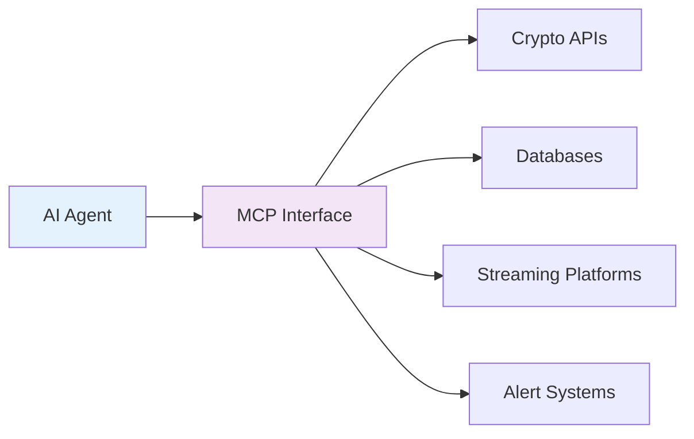
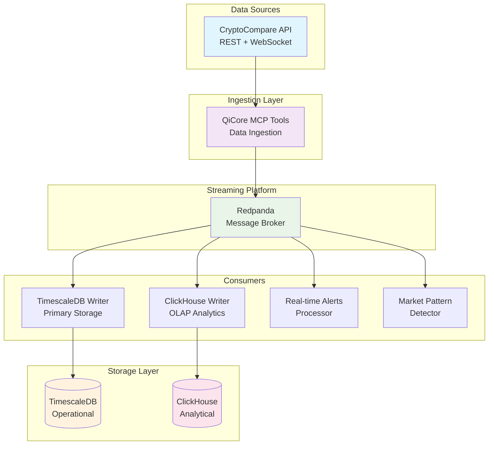
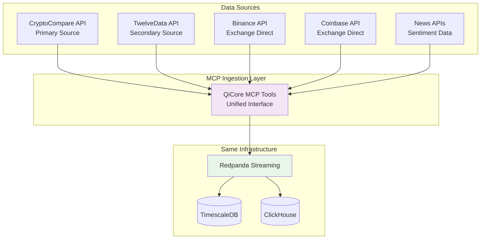

# crypto data platform

*foundation for agentized cryptocurrency trading and analytics*

## executive summary

this proposal outlines a **next-generation cryptocurrency data platform** that serves as the foundation for **autonomous ai agents** in financial markets. built on proven open source technologies and the emerging **model context protocol (mcp)**, this platform enables ai agents to autonomously collect, process, and act on real-time market data.

**key objectives:**
- **agentized framework foundation**: enable autonomous ai agents to interact with cryptocurrency markets
- **real-time data infrastructure**: sub-second market data processing and decision making
- **scalable architecture**: handle millions of market events per second
- **production-ready**: battle-tested components for financial applications

## what is an agentized framework?

an **agentized framework** enables autonomous ai agents to:
- **perceive**: continuously monitor market conditions through real-time data streams
- **reason**: analyze market patterns using advanced analytics and machine learning
- **act**: execute trading decisions, manage portfolios, and respond to market events
- **learn**: adapt strategies based on market feedback and performance

## model context protocol (mcp) overview

**model context protocol (mcp)** is an emerging standard that enables ai models to securely access and interact with external systems. in our context:



**benefits of mcp approach:**
- **standardized interfaces**: consistent api patterns across all tools
- **secure access**: controlled access to financial data and trading systems
- **composable tools**: mix and match components for different agent behaviors
- **scalable architecture**: add new capabilities without breaking existing agents

## overview

comprehensive data platform for ingesting, processing, and analyzing cryptocurrency market data (ohlcv) from cryptocompare api. designed as the **foundation for autonomous ai trading agents**, high-frequency analytics, and research applications.

## architecture



```
cryptocompare api (rest + websocket)
  ↓
qicore mcp data ingestion layer
  ↓  
redpanda streaming platform
  ↓
multiple specialized consumers
  ├── timescaledb writer (primary analytical storage)
  ├── clickhouse writer (olap analytics)
  ├── real-time alerts processor
  └── market pattern detector
```

## data flow

1. **ingestion**: cryptocompare websocket → qicore mcp tools
2. **streaming**: redpanda topics for different data types
3. **storage**: dual database approach for different use cases
4. **processing**: specialized consumers for various workflows
5. **analytics**: real-time dashboards and historical analysis

## storage strategy

### primary: timescaledb
- **postgresql compatibility** - familiar sql, rich ecosystem
- **time-series optimizations** - hypertables, compression, continuous aggregates
- **relational capabilities** - join ohlcv data with metadata, user data, trading strategies
- **operational simplicity** - standard postgresql tooling and monitoring

### secondary: clickhouse  
- **olap analytics** - complex aggregations, reporting, backtesting
- **high performance** - sub-second queries on terabytes of data
- **data warehouse** - historical analysis, business intelligence
- **specialized workloads** - when postgresql/timescale hits limits

## why dual database approach

### timescaledb for:
- **real-time trading** - low latency queries for current market data
- **application storage** - user portfolios, trading strategies, alerts
- **operational analytics** - real-time dashboards, monitoring
- **transactional workloads** - order management, user data

### clickhouse for:
- **historical analytics** - backtesting trading strategies over years of data
- **business intelligence** - market research, trend analysis
- **data science** - machine learning model training
- **heavy aggregations** - complex analytical queries

## benefits of this approach

### for ai agent development
- **mcp standardization** - consistent interfaces for agent tools
- **real-time decision making** - sub-second data access for trading agents
- **composable architecture** - mix and match tools for different agent behaviors
- **error handling** - robust error recovery for autonomous operations
- **scalable foundation** - platform grows with agent complexity

### for data architecture
- **best of both worlds** - postgresql ecosystem + analytical performance
- **workload optimization** - right tool for each use case
- **operational familiarity** - timescaledb for day-to-day operations
- **analytical power** - clickhouse for complex analysis
- **cost efficiency** - timescaledb for hot data, clickhouse for cold storage

### for business value
- **autonomous trading** - ai agents can execute strategies 24/7
- **risk management** - real-time monitoring and automated responses
- **market opportunities** - sub-second reaction to market changes
- **competitive advantage** - next-generation ai-driven trading infrastructure

## expanding data sources

### multi-source architecture design

our mcp-based architecture makes adding new data sources straightforward without disrupting existing infrastructure:



### adding twelvedata example

**step 1: create new mcp tool** (no changes to existing code)
```typescript
// qimcp/apis/twelvedata/websocket-client.ts
export class twelvedatawebsocketclient {
  async connect(): promise<result<void>> {
    // implement twelvedata websocket connection
  }
  
  async subscribeohlcv(symbols: string[]): promise<result<void>> {
    // subscribe to twelvedata real-time feed
  }
}

// register as mcp tool
const twelvedatatool: mcptool = {
  name: "twelvedata_realtime_stream",
  description: "real-time ohlcv from twelvedata (170ms latency)",
  execute: async (input) => {
    return await twelvedatawebsocketclient.subscribe(input.symbols);
  }
};
```

**step 2: extend data validation** (additive only)
```typescript
// existing validation stays the same
interface ohlcvmessage {
  symbol: string;
  exchange: string;
  timestamp: number;
  open: number;
  high: number;
  low: number;
  close: number;
  volume: number;
  source: 'cryptocompare' | 'twelvedata' | 'binance'; // just add new sources
}
```

**step 3: route to same infrastructure** (zero changes)
```typescript
// same redpanda topics, same databases, same consumers
const producer = new redpandaproducer(['localhost:19092']);

// data flows to existing infrastructure unchanged
await producer.sendohlcv('ohlcv-validated', ohlcvdata);
```

### benefits of multi-source approach

**data redundancy**:
- if cryptocompare is down, switch to twelvedata automatically
- cross-validate data quality between sources
- reduce dependency on single provider

**enhanced coverage**:
- cryptocompare: broad market coverage, established api
- twelvedata: ultra-low latency (170ms), official mcp support
- exchange apis: direct feeds, highest accuracy for specific exchanges

**cost optimization**:
- use free tiers across multiple providers
- switch to backup sources during rate limits
- optimize cost vs. latency vs. coverage tradeoffs

### implementation effort

**minimal development required**:
- **new code**: ~200 lines for twelvedata mcp tool
- **existing code changes**: zero modifications needed
- **infrastructure changes**: none required
- **deployment impact**: add new container, no downtime

**timeline**: 1-2 days to add new data source

### agent benefits

**improved decision making**:
```typescript
// agents can now compare data across sources
const priceagent = await createagent({
  tools: [
    mcptools.cryptocompare.websocket,
    mcptools.twelvedata.websocket,
    mcptools.binance.direct
  ],
  objective: "detect price discrepancies and arbitrage opportunities"
});

// automatic data source failover
if (cryptocomparedown) {
  await priceagent.switchdatasource('twelvedata');
}
```

**enhanced reliability**:
- agents continue operating even if primary data source fails
- cross-source validation prevents bad data from affecting decisions
- multiple sources provide richer market intelligence

### future data source expansion

**additional sources easily integrated**:
- **alpha vantage**: fundamental data, economic indicators
- **quandl**: alternative datasets, macro data  
- **social sentiment**: twitter, reddit, telegram analysis
- **on-chain data**: blockchain transaction analysis
- **news feeds**: reuters, bloomberg, cryptonews apis

**same pattern for each**:
1. create new mcp tool (100-300 lines of code)
2. register with existing ingestion layer
3. route to same infrastructure
4. agents automatically gain access to new data

### operational considerations

**monitoring per source**:
```sql
-- track data quality by source
select 
  source,
  count(*) as records,
  avg(latency_ms) as avg_latency,
  count(case when price > 0 then 1 end) / count(*) as data_quality
from ohlcv 
where timestamp > now() - interval '1 hour'
group by source;
```

**cost tracking**:
- monitor api usage per provider
- automatic fallback when approaching rate limits
- cost optimization based on data quality metrics

**conclusion**: our mcp architecture makes data source expansion trivial. adding twelvedata or any other provider requires minimal development effort while maintaining all existing functionality.