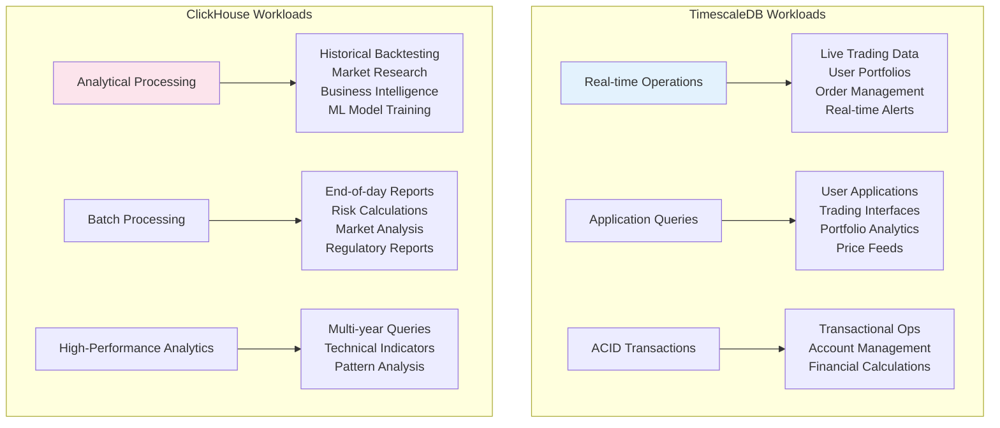

# timescaledb vs clickhouse comparison

## why both databases?

our crypto data platform uses a **dual database strategy** where timescaledb serves as the primary operational database and clickhouse handles analytical workloads. this approach maximizes the strengths of each system.

## detailed comparison

### timescaledb strengths

**postgresql ecosystem compatibility**
- **familiar sql**: standard postgresql sql syntax and features
- **tooling ecosystem**: pgadmin, datagrip, grafana, metabase work out of the box
- **extensions**: postgis for geo data, pg_stat_statements for monitoring
- **existing knowledge**: most developers already know postgresql

**operational database features**
- **acid transactions**: full transaction support for consistent writes
- **referential integrity**: foreign keys, constraints, triggers
- **concurrent reads/writes**: excellent multi-user performance
- **backup/restore**: mature postgresql backup ecosystem

**time-series optimizations**
- **hypertables**: automatic partitioning by time
- **continuous aggregates**: materialized views updated automatically
- **compression**: transparent compression of old data
- **retention policies**: automatic data lifecycle management

**use cases in our platform**
```sql
-- real-time trading queries
select * from ohlcv 
where symbol = 'btcusd' 
  and timestamp > now() - interval '1 hour'
order by timestamp desc;

-- join with user portfolio data
select o.*, p.quantity 
from ohlcv o
join user_portfolios p on o.symbol = p.symbol
where p.user_id = 123;

-- transactional operations
begin;
  insert into trade_orders (user_id, symbol, quantity, price);
  update user_balances set btc_balance = btc_balance - 0.1;
commit;
```

**storage efficiency improvements (2025)**
- **compression ratio**: 10:1 for time-series data
- **columnar compression**: similar benefits to column stores for aggregations
- **partial compression**: compress old data while keeping recent data uncompressed

### clickhouse strengths

**analytical performance**
- **columnar storage**: extremely fast aggregations and scans
- **vectorized execution**: simd optimizations for numerical operations
- **parallel processing**: automatic query parallelization
- **sparse indexes**: efficient filtering on large datasets

**olap optimizations**
- **materialized views**: automatically maintained aggregations
- **partition pruning**: skip irrelevant data partitions
- **compression**: industry-leading compression ratios (25:1)
- **merge tree engine**: optimized for analytical workloads

**scalability**
- **horizontal scaling**: distributed tables across multiple nodes
- **sharding**: automatic data distribution
- **replication**: built-in data redundancy
- **cluster management**: clickhouse keeper for coordination

**use cases in our platform**
```sql
-- complex analytical queries
select 
  symbol,
  todate(timestamp) as date,
  avg(close) as avg_price,
  stddev(close) as volatility,
  percentile(0.95)(volume) as volume_95th
from ohlcv 
where timestamp >= today() - interval 365 day
group by symbol, date
order by volatility desc;

-- backtesting queries
select 
  symbol,
  close,
  lag(close, 1) over (partition by symbol order by timestamp) as prev_close,
  (close - prev_close) / prev_close as return_1d
from ohlcv
where symbol in ('btcusd', 'ethusd')
  and timestamp between '2023-01-01' and '2024-01-01';

-- high-frequency aggregations
select 
  tostartoftime(timestamp, interval 5 minute) as time_bucket,
  symbol,
  argmin(open, timestamp) as open,
  max(high) as high,
  min(low) as low,
  argmax(close, timestamp) as close,
  sum(volume) as volume
from ohlcv
where timestamp >= now() - interval 1 day
group by time_bucket, symbol;
```

## performance comparison (2025 benchmarks)

### ingestion performance
```
metric                    | timescaledb | clickhouse
--------------------------|-------------|------------
single-threaded inserts   | 50k rows/s  | 100k rows/s
batch inserts (1000 rows) | 200k rows/s | 1m rows/s
concurrent writers        | excellent   | good
transaction overhead      | low         | none (async)
```

### query performance
```
query type               | timescaledb | clickhouse
-------------------------|-------------|------------
point queries           | excellent   | good
range scans             | good        | excellent
aggregations            | good        | excellent
joins                   | excellent   | limited
complex analytics       | good        | outstanding
```

### storage efficiency
```
compression ratio        | timescaledb | clickhouse
-------------------------|-------------|------------
raw ohlcv data          | 8:1         | 20:1
with indexes            | 6:1         | 15:1
query performance impact| minimal     | minimal
```

## workload distribution strategy



### timescaledb workloads
**real-time operations**
- live trading data ingestion
- user portfolio management
- order management system
- real-time alerting
- operational dashboards

**application queries**
- user-facing applications
- trading interfaces
- portfolio analytics
- real-time price feeds

**data consistency requirements**
- transactional operations
- user account management
- financial calculations requiring acid properties

### clickhouse workloads
**analytical processing**
- historical backtesting
- market research queries
- business intelligence reports
- data science model training
- complex aggregations over large time ranges

**batch processing**
- end-of-day reporting
- risk calculations
- market analysis
- regulatory reporting

**high-performance analytics**
- queries spanning multiple years
- complex technical indicator calculations
- market pattern analysis

## data synchronization strategy

### real-time sync
```typescript
// real-time data flows to both databases
redpanda topic: 'ohlcv-validated'
  ├── timescale consumer (primary)
  └── clickhouse consumer (analytics)
```

### batch sync for consistency
```typescript
// nightly batch job ensures data consistency
async function syncDatabases() {
  // compare row counts
  const timescaleCount = await timescale.query(
    'select count(*) from ohlcv where date = current_date'
  );
  
  const clickhouseCount = await clickhouse.query(
    'select count(*) from ohlcv where todate(timestamp) = today()'
  );
  
  // reconcile differences
  if (timescaleCount !== clickhouseCount) {
    await reconcileData();
  }
}
```

## cost comparison

### infrastructure costs (monthly)
```
database          | compute  | storage | network | total
------------------|----------|---------|---------|-------
timescaledb (aws) | $200     | $100    | $50     | $350
clickhouse (cloud)| $300     | $150    | $75     | $525
dual setup        | $500     | $250    | $125    | $875
```

**cost justification**
- **operational efficiency**: timescaledb reduces development time
- **analytical performance**: clickhouse enables complex analysis impossible on single db
- **risk reduction**: dual setup provides redundancy and specialized optimization
- **total cost of ownership**: reduced developer time + better performance = roi

## migration and rollback strategy

### progressive migration
1. **phase 1**: implement dual-write to both databases
2. **phase 2**: gradually move analytical queries to clickhouse
3. **phase 3**: optimize each database for its specific workload
4. **phase 4**: implement specialized retention policies

### rollback plan
```typescript
// feature flags for database routing
const useClickhouseForAnalytics = process.env.use_clickhouse === 'true';

async function runAnalyticalQuery(query: string) {
  if (useClickhouseForAnalytics) {
    return await clickhouse.query(query);
  } else {
    return await timescale.query(translateToPostgresql(query));
  }
}
```

## operational considerations

### monitoring strategy
```typescript
// monitor both databases
const metrics = {
  timescale: {
    connectionPool: 'active_connections',
    queryPerformance: 'slow_query_log',
    diskUsage: 'pg_database_size',
    replication: 'pg_stat_replication'
  },
  clickhouse: {
    queryPerformance: 'system.query_log',
    diskUsage: 'system.disks',
    mergePerformance: 'system.merges',
    replication: 'system.replicas'
  }
};
```

### backup strategy
```bash
# timescaledb backups
pg_dump -h timescale-primary -u qicore cryptodb | gzip > backup-$(date).sql.gz

# clickhouse backups
clickhouse-backup create backup-$(date)
clickhouse-backup upload backup-$(date)
```

### scaling strategy
```yaml
# timescaledb scaling
scaling_strategy:
  vertical: # scale up for complex queries
    cpu: 16-32 cores
    memory: 64-128gb
    storage: ssd with high iops
    
  horizontal: # distributed hypertables for very large datasets
    read_replicas: 2-3 instances
    distributed_hypertables: for multi-tb datasets

# clickhouse scaling  
scaling_strategy:
  horizontal: # scale out by default
    cluster_nodes: 3-10 nodes
    sharding: by symbol hash
    replication: 2x redundancy
```

## conclusion

the dual database approach maximizes strengths:

- **timescaledb**: excellent for operational workloads, familiar postgresql ecosystem, transactional integrity
- **clickhouse**: unmatched analytical performance, compression, horizontal scaling

**total cost**: higher infrastructure cost but significant gains in:
- **developer productivity**: familiar tools and sql
- **operational reliability**: proven postgresql ecosystem
- **analytical capabilities**: clickhouse performance enables new use cases
- **risk management**: specialized databases reduce single points of failure

this architecture provides the best foundation for a production crypto data platform that needs both operational reliability and analytical power.