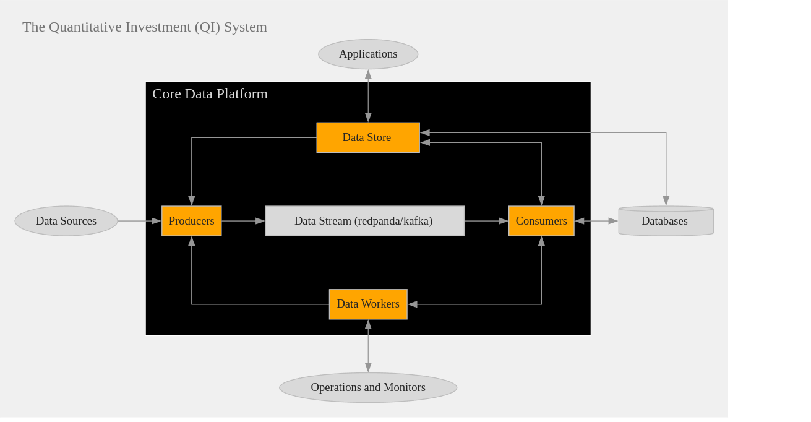

# The Data Platform

The Data Platform is a central component of the Quantitative Investment (QI) System, designed to model and implement the information flow necessary for investment operations. It serves as the backbone that facilitates data services for various investment activities, including trading, risk management, portfolio management, and investment strategy development.

---

## Investment Platform Context

### Investment and Investment Systems

- **Investment** involves processing various types of information, primarily in the form of data streams, to make decisions, execute trades, and manage investment portfolios.

- An **Investment System** manages the day-to-day primary investment activities by treating these activities as **operations** acting on an **information flow**. The main design principle is to **decouple operations from the information flow**, enhancing modularity and flexibility.

### Quantitative Investment System

A **Quantitative Investment System** is characterized by:

1. **Quantifying Operations**: Utilizing models and logic to represent operations so they can be implemented within a software system.

2. **Modeling Information Flow**: Leveraging software engineering frameworks and tools to model and implement information flow, providing interfaces for operations to access or communicate with it.

---

## Overview of the Data Platform

The **Data Platform** is responsible for modeling and implementing the information flow, essentially providing data services for the operations within the investment processes.

### Scope and Functionalities

The Data Platform offers the following core functionalities:

- **Data Services**: Facilitated through the `Data Store` and `Data Worker` components, providing clean interfaces for communication with users (applications and operations).

- **Historical Data Acquisition**: Fetching historical data such as assets, exchanges, most active assets, OHLCV (Open, High, Low, Close, Volume), and tick data from external sources.

- **Real-Time Tick Data Feed**: Obtaining live tick data to reflect current market conditions.

- **Data Consumption and Storage**: Consuming data from the data stream and storing it into databases for persistence and later retrieval.

### Key Mechanisms

The Data Platform employs several key mechanisms:

- **Decoupling Operations from Data Flow**: By separating the logic of operations from the data flow, components can operate independently and communicate through well-defined interfaces, promoting modularity and scalability.

- **Cross-Language Communication via Data Flow**: Utilizing data streams (e.g., Kafka or Redpanda) allows components written in different programming languages (TypeScript, Go, Python) to interact seamlessly.

- **Reactive State Machine-Driven Design**: Implementing state machines (e.g., using **XState**) to manage component states and transitions, ensuring predictable and manageable system behavior.

---

## Architecture Conceptual Diagram

### Core Components

The Data Platform consists of the following key components, highlighted in orange in the diagram:

1. **Producers**

2. **Data Stream (Redpanda/Kafka)**

3. **Consumers**

4. **Data Workers**

5. **Data Store**

### Supporting Components

- **Data Sources**: External providers supplying market and financial data.

- **Databases**: Systems where data is stored for persistence.

- **Applications**: Users of the Data Platform that consume data services.

- **Operations and Monitors**: Investment processes and monitoring systems that interact with the Data Platform via Data Workers.

---

## Detailed Component Descriptions

### 1. Producers

**Responsibilities:**

- **Data Acquisition**: Fetch historical and real-time market data from external sources.

- **Data Publishing**: Publish the acquired data into the Data Stream (Redpanda/Kafka) for downstream consumption.

**Implementation Details:**

- **Programming Languages**: Primarily implemented in TypeScript, with integrations in Go and Python for specialized tasks.

- **Data Retrieval Methods:**

  - **REST API Clients**: Communicate with external data sources (e.g., CryptoCompare, TwelveData) to fetch historical data.

  - **WebSocket Clients**: Establish connections to receive real-time tick data.

- **Cross-Language Integration**: Utilize mechanisms to allow components written in different languages to work together, ensuring flexibility and leveraging language-specific strengths.

- **Producer Machine Abstraction:**

  - **State Management**: Use **XState** to model the producer's states and transitions, encapsulating the behavior in an actor model.

  - **Interfaces for Machine Actions**: Define clear interfaces for actions, context, events, states, and transformation functions, promoting modularity and reusability.

### 2. Data Stream (Redpanda/Kafka)

**Role:**

- Serves as the central messaging system that decouples producers and consumers.

- Standardizes data ingestion and distribution, ensuring scalability and reliability.

**Features:**

- **High Throughput and Low Latency**: Capable of handling large volumes of data with minimal delays.

- **Scalability**: Easily scales horizontally to accommodate increasing data loads.

- **Fault Tolerance**: Provides data replication and redundancy to prevent data loss.

### 3. Consumers

**Responsibilities:**

- **Data Consumption**: Read data from the Data Stream for processing and storage.

- **Data Storage**: Persist data into databases for historical analysis, backtesting, and other purposes.

**Implementation Details:**

- **Programming Languages**: Implemented in TypeScript.

- **Database Integration:**

  - **Database Schemas with Sequelize**: Define database schemas without relying on Sequelize TypeScript decorators, offering greater control.

  - **Supports Multiple Databases**: Can interact with various database systems depending on storage needs.

- **Consumer Machine Abstraction:**

  - **State Management**: Similar to producers, consumers use **XState** to manage states and transitions.

  - **Interfaces for Machine Actions**: Define actions and states to manage data consumption and error handling.

### 4. Data Workers

**Responsibilities:**

- **Interface Provision**: Offer interfaces for operations and monitors to interact with the Data Platform.

- **Operation Support**: Enable investment processes (e.g., portfolio construction, trading orders, risk management) to access and manipulate data.

- **Process Monitoring**: Facilitate communication with monitoring systems to ensure smooth operation and quick issue resolution.

**Implementation Details:**

- **Communication Interfaces**: Provide APIs or messaging protocols for operations to spawn producers or consumers as needed.

- **Integration with Producers and Consumers**: Act as intermediaries that can control and coordinate data flow components.

- **Scalability**: Designed to handle multiple concurrent operations, ensuring efficient resource utilization.

### 5. Data Store

**Responsibilities:**

- **Application Interface**: Serve as the primary point of interaction for applications needing data services.

- **Orchestration**: Coordinate producers and consumers based on application requirements, ensuring data availability and freshness.

**Implementation Details:**

- **State Machine Management**: Use **XState** to orchestrate interactions between producer and consumer actors, managing dependencies and data flow.

- **Interface Definitions**: Provide clear and well-documented interfaces (e.g., APIs) for applications to request data services.

- **Abstract Complexity**: Hide the internal workings of data acquisition and storage from applications, offering a simplified view.

---

## Data Flow and Interactions

### External Data Sources to Producers

- **Data Acquisition**: Producers fetch data from external sources via REST APIs and WebSocket connections.

- **Data Publishing**: Producers publish the fetched data into the Data Stream.

### Data Stream to Consumers

- **Data Distribution**: The Data Stream disseminates data to subscribed consumers.

- **Data Storage**: Consumers persist the data into databases for long-term storage and retrieval.

### Data Workers with Operations and Monitors

- **Operation Support**: Data Workers provide interfaces for operations to access data, spawn new producers or consumers, and perform investment activities.

- **Monitoring**: They also communicate with monitoring systems to track the health and performance of data flow components.

### Applications with Data Store

- **Data Services**: Applications interact with the Data Store to retrieve data without concerning themselves with the underlying data acquisition processes.

- **Orchestration Requests**: Applications can request specific data services, prompting the Data Store to coordinate the necessary producers and consumers.

---

## Key Mechanisms in Depth

### Decoupling Operations from Data Flow

- **Modularity**: By separating operations (business logic) from data flow (data acquisition and distribution), each component can evolve independently.

- **Flexibility**: New operations or data sources can be added without significant changes to existing components.

- **Maintainability**: Easier to troubleshoot and maintain individual components without affecting the entire system.

### Cross-Language Communication via Data Flow

- **Language Agnosticism**: Data streams enable components written in different programming languages to communicate through standardized messaging formats.

- **Best Tool for the Job**: Allows developers to use the most appropriate programming language for each task (e.g., Go for performance-intensive tasks, Python for data analysis).

### Reactive State Machine-Driven Design

- **Predictable Behavior**: State machines provide a clear model of component behavior, making it easier to anticipate and handle different states and events.

- **Error Handling**: Enhanced ability to manage errors and recover from unexpected states.

- **Scalability**: State machines can manage multiple instances of producers and consumers efficiently.

---

## Technologies and Tools

### Programming Languages

- **TypeScript**: Used for the majority of the Data Platform components due to its strong typing and modern JavaScript features.

- **Go and Python**: Employed where their specific advantages are needed (e.g., Go for concurrency and performance, Python for data analysis and machine learning tasks).

### Messaging Systems

- **Redpanda/Kafka**: Chosen for high-performance data streaming, supporting real-time data ingestion and distribution.

### State Management

- **XState**: A JavaScript/TypeScript library for state machines and statecharts, used to model component behaviors predictably.

### Databases

- **Sequelize ORM**: Used for database interactions, providing a promise-based ORM for Node.js supporting various SQL dialects.

---

## Benefits of the Data Platform

- **Scalability**: Modular design allows the system to handle increasing data volumes and additional operations without significant redesign.

- **Flexibility**: Easy integration of new data sources, operations, and applications.

- **Reliability**: State machine-driven components enhance system reliability through predictable behavior and robust error handling.

- **Efficiency**: Decoupled components and cross-language communication optimize performance by leveraging the strengths of different technologies.

---

## Use Cases

### Portfolio Management

- **Data Access**: Portfolio managers use Data Workers to access market data and analytics for constructing and adjusting portfolios.

- **Real-Time Decisions**: Real-time tick data enables immediate response to market movements.

### Algorithmic Trading

- **Strategy Implementation**: Trading algorithms consume data services to execute strategies based on real-time and historical data.

- **Order Execution**: Data Workers facilitate the placement and monitoring of orders through integration with trading systems.

### Risk Management

- **Data Analysis**: Risk managers analyze data stored in databases to assess exposure and potential risks.

- **Alerts and Monitoring**: Monitoring systems receive data from Data Workers to trigger alerts based on predefined risk thresholds.

---

## Security and Compliance

- **Data Security**: Secure communication protocols and authentication mechanisms are employed to protect sensitive financial data.

- **Access Control**: Role-based access control ensures that only authorized personnel and systems can access specific data and functionalities.

- **Compliance**: The system adheres to regulatory requirements for data handling, storage, and transmission, crucial in financial environments.

---

## Future Enhancements

- **Machine Learning Integration**: Incorporate advanced analytics and predictive models to enhance investment strategies.

- **Microservices Architecture**: Further decomposition of components into microservices for increased scalability and maintainability.

- **Cloud Deployment**: Leverage cloud infrastructure for elasticity, cost-effectiveness, and global accessibility.

- **Enhanced Monitoring and Observability**: Implement comprehensive monitoring tools for better visibility into system performance and quicker issue resolution.

---

## Summary

The Data Platform is a robust and flexible foundation for the Quantitative Investment System, effectively decoupling operations from data flow and enabling seamless integration of various investment activities. By leveraging modern technologies and design principles, it provides scalable, reliable, and efficient data services essential for informed investment decisions and effective portfolio management.
