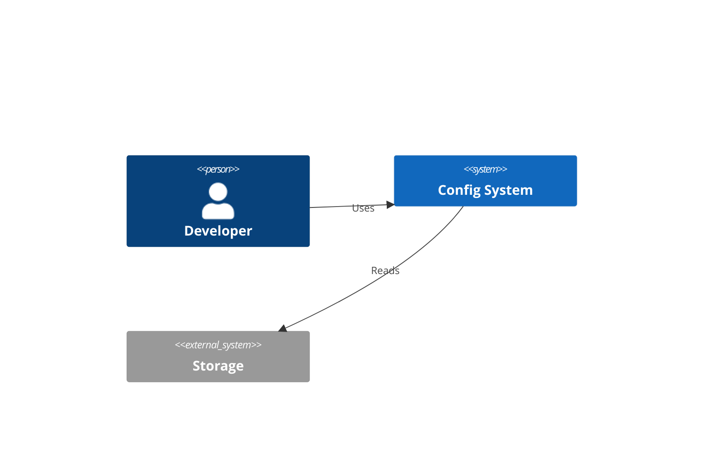
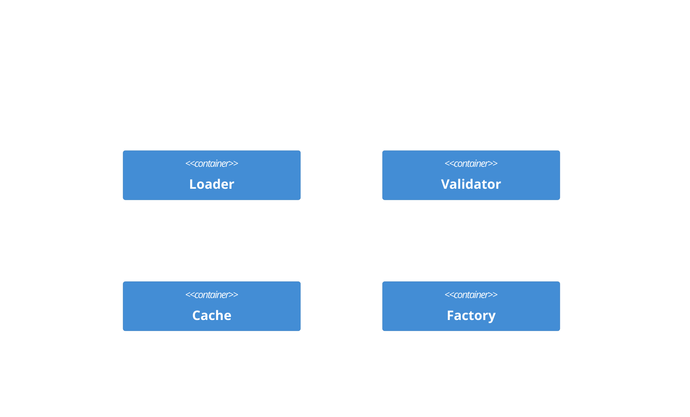
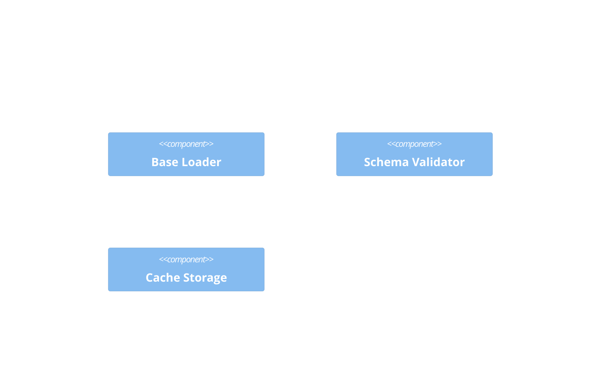
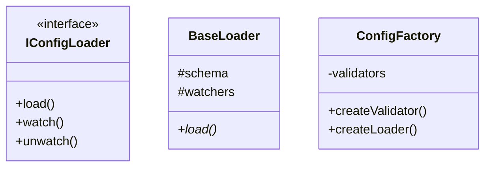
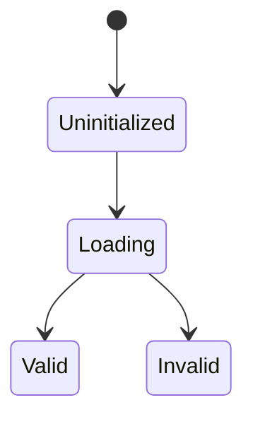

# Step-by-Step Documentation Build Plan

## 1. Overview Files

```markdown
# Configuration System Overview

## Core System Definition
$\mathcal{C} = (L, V, S, \Delta, \Gamma, \Omega)$

## System Boundaries
- Config loading
- Schema validation  
- Config caching
- Event handling

## Key Components
1. Loader system
2. Validation system
3. Cache system
4. Factory system
```

## 2. Formal Model

```markdown
# Formal Mathematical Model

## Type System
$T = (Config, Schema, Value)$

## State Space
$S = \{uninitialized, loading, valid, invalid\}$

## Event Space
$E = \{load, validate, error, change\}$

## Operation Space
$O = \{load: Source \rightarrow Config,$ 
$validate: Config \times Schema \rightarrow Boolean,$
$cache: Key \times Config \rightarrow Config\}$

## Invariants
1. $\forall c \in Config: validate(c.schema, c.value) \rightarrow true$
2. $\forall k \in Keys: cache.get(k) = cache.set(k)$
3. $\forall l \in Loaders: load(l) \rightarrow Config \cup Error$
```

## 3. Architecture

```markdown
# C4 Architecture Model

## System Context


## Container View


## Component View  

```

## 4. Implementation Details

```markdown
# Implementation Design

## Class Model


## State Transitions

```

## 5. Mappings

```markdown
# Formal to C4 Mappings

## Type Mappings
- $Config \mapsto$ ConfigLoader Container
- $Schema \mapsto$ SchemaValidator Container
- $Cache \mapsto$ CacheSystem Container

## Operation Mappings
- $load \mapsto$ Loader.load()
- $validate \mapsto$ Validator.validate()
- $cache \mapsto$ Cache.set()
```