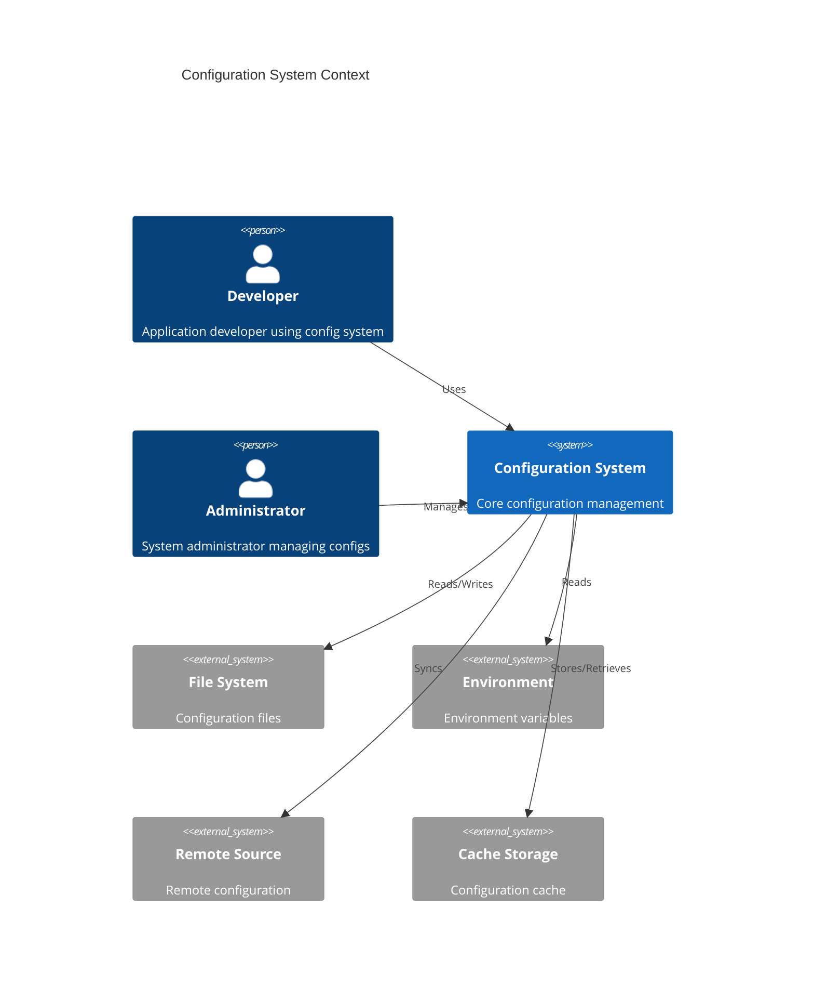

# System Context Design

## 1. System Boundaries

## 2. Actor Responsibilities

| Actor                | Primary Responsibilities | Secondary Responsibilities |
| -------------------- | ------------------------ | -------------------------- |
| Developer            | Use configurations       | Monitor changes            |
| Administrator        | Manage configurations    | Setup sources              |
| Configuration System | Load & validate configs  | Cache & notify             |

## 3. External Systems

| System        | Role               | Protocol  |
| ------------- | ------------------ | --------- |
| File System   | Local storage      | File I/O  |
| Environment   | Runtime config     | ENV vars  |
| Remote Source | Distributed config | HTTP/gRPC |
| Cache Storage | Fast retrieval     | Cache API |

## 4. System Interfaces

### 4.1 Input Interfaces

$$I = \{FileSystem, Environment, RemoteSource\}$$

### 4.2 Output Interfaces

$$O = \{Cache, Events, Logs\}$$

### 4.3 Control Flow

$$Developer \xrightarrow{uses} Config \xrightarrow{reads} Source$$
$$Admin \xrightarrow{manages} Config \xrightarrow{writes} Source$$
