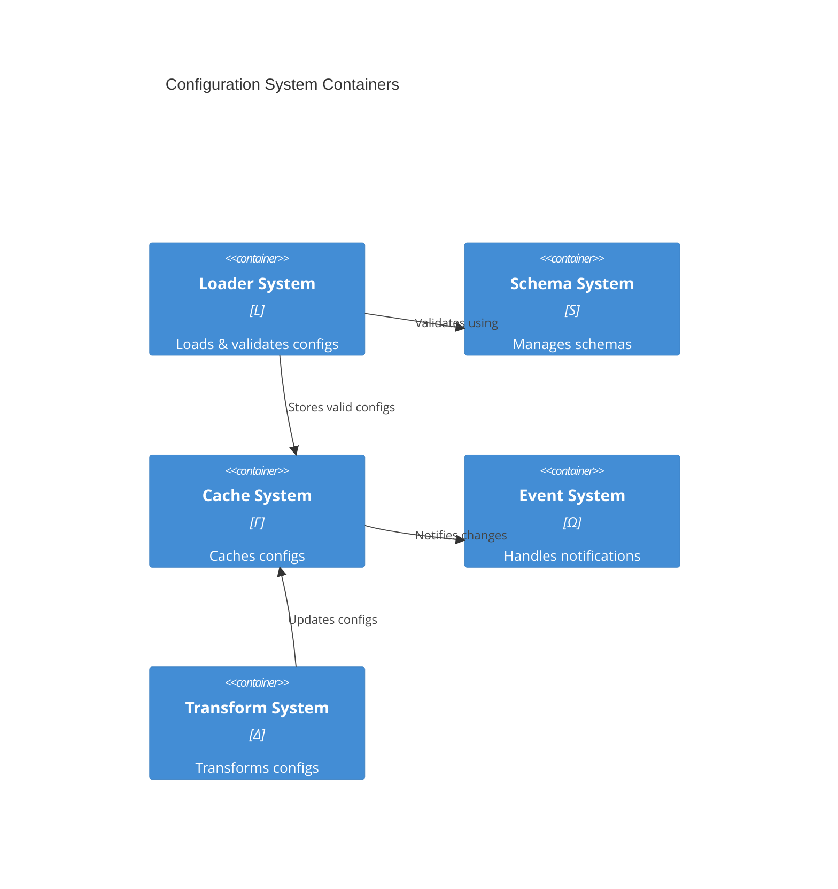

# Container Design

## 1. Core Containers

## 2. Container Responsibilities

| Container | Space | Primary Role          | Secondary Role     |
| --------- | ----- | --------------------- | ------------------ |
| Loader    | L     | Config loading        | Source management  |
| Schema    | S     | Schema validation     | Type checking      |
| Cache     | Γ     | Config storage        | Cache invalidation |
| Event     | Ω     | Change notification   | Event routing      |
| Transform | Δ     | Config transformation | Data conversion    |

## 3. Container Interfaces

### 3.1 Loader Interface

$$L_{if} = \{load, validate, watch\}$$

### 3.2 Schema Interface

$$S_{if} = \{check, enforce, extend\}$$

### 3.3 Cache Interface

$$\Gamma_{if} = \{get, set, clear\}$$

### 3.4 Event Interface

$$\Omega_{if} = \{emit, subscribe, unsubscribe\}$$

### 3.5 Transform Interface

$$\Delta_{if} = \{convert, merge, diff\}$$

## 4. Container Dependencies

$$
\begin{aligned}
dep(Loader) &= \{Schema, Cache\} \\
dep(Schema) &= \{Transform\} \\
dep(Cache) &= \{Event\} \\
dep(Event) &= \{\} \\
dep(Transform) &= \{Cache\}
\end{aligned}
$$
