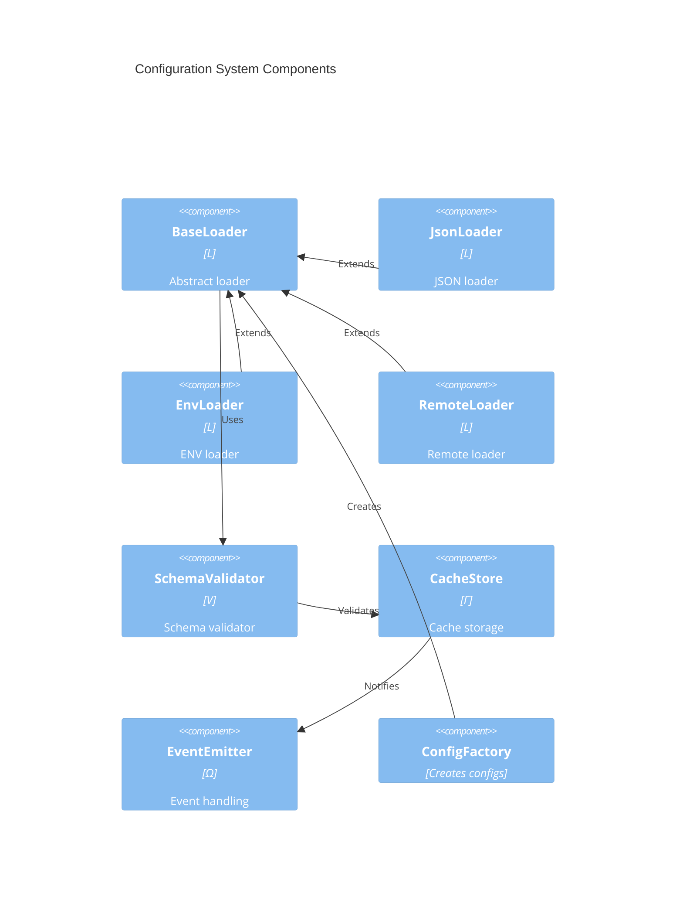

# Component Design

## 1. Core Components

## 2. Component Specifications

| Component       | Container | Interface  | Dependencies    |
| --------------- | --------- | ---------- | --------------- |
| BaseLoader      | Loader    | ILoader    | SchemaValidator |
| JsonLoader      | Loader    | ILoader    | BaseLoader      |
| EnvLoader       | Loader    | ILoader    | BaseLoader      |
| RemoteLoader    | Loader    | ILoader    | BaseLoader      |
| SchemaValidator | Schema    | IValidator | None            |
| CacheStore      | Cache     | ICache     | EventEmitter    |
| EventEmitter    | Event     | IEmitter   | None            |
| ConfigFactory   | Transform | IFactory   | BaseLoader      |

## 3. Component Interfaces

### 3.1 Loader Components

$$I_{loader} = \{load(), validate(), watch()\}$$

### 3.2 Validator Components

$$I_{validator} = \{validate(), getSchema()\}$$

### 3.3 Cache Components

$$I_{cache} = \{get(), set(), clear()\}$$

### 3.4 Event Components

$$I_{event} = \{emit(), on(), off()\}$$

### 3.5 Factory Components

$$I_{factory} = \{create(), register()\}$$

## 4. Component Dependencies

$$
\begin{aligned}
dep(JsonLoader) &= \{BaseLoader\} \\
dep(EnvLoader) &= \{BaseLoader\} \\
dep(RemoteLoader) &= \{BaseLoader\} \\
dep(BaseLoader) &= \{SchemaValidator\} \\
dep(SchemaValidator) &= \{\} \\
dep(CacheStore) &= \{EventEmitter\} \\
dep(EventEmitter) &= \{\} \\
dep(ConfigFactory) &= \{BaseLoader\}
\end{aligned}
$$
