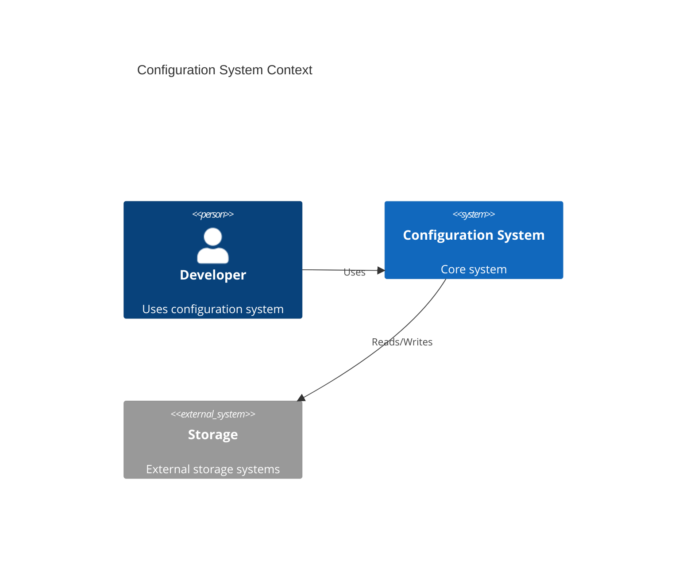

# Configuration System Overview

## Document Metadata
- Version: 1.0.0
- Status: Draft
- Updated: 2024-03-20
- Category: System Specification

## 1. Mathematical Foundation

### 1.1 Core System
$$\mathfrak{C} = (L, V, S, \Delta, \Gamma, \Omega)$$

where:
- $L$ : Loader space - configuration loading
- $V$ : Validator space - schema validation
- $S$ : Schema space - configuration structure
- $\Delta$ : Transform space - data transformations
- $\Gamma$ : Cache space - configuration storage
- $\Omega$ : Event space - change notifications

### 1.2 Space Definitions
$$
\begin{aligned}
L &: Source \rightarrow Config & \text{(Loader Space)} \\
V &: Config \times Schema \rightarrow Bool & \text{(Validator Space)} \\
S &: Type \times Rules & \text{(Schema Space)} \\
\Delta &: Config \rightarrow Config & \text{(Transform Space)} \\
\Gamma &: Key \times Config \rightarrow Config & \text{(Cache Space)} \\
\Omega &: Event \rightarrow Action & \text{(Event Space)}
\end{aligned}
$$

## 2. System Context

## 3. Core Properties 

$$
\begin{aligned}
I_{loader} &= \{load, validate, watch\} \\
I_{validator} &= \{check, enforce\} \\
I_{cache} &= \{get, set, clear\} \\
I_{event} &= \{emit, on, off\} \\
I_{transform} &= \{convert, merge\}
\end{aligned}
$$

### 3.1 Invariants
$$
\begin{aligned}
&\forall c \in Config: type(c) \in T \\
&\forall c \in Config: validate(c) \rightarrow \{true, false\} \\
&\forall k \in Keys: get(k) = set(k)
\end{aligned}
$$

### 3.2 Constraints
$$
\begin{aligned}
&|Cache| \leq MAX\_CACHE\_SIZE \\
&|Config| \leq MAX\_CONFIG\_SIZE \\
&t_{load} \leq MAX\_LOAD\_TIME \\
&t_{validate} \leq MAX\_VALIDATE\_TIME
\end{aligned}
$$

## 4. System Boundaries

### In Scope
- Configuration loading
- Schema validation
- Configuration caching
- Change notifications
- Type safety

### Out of Scope
- Persistence
- Access control
- Encryption
- Transport

## 5. Usage Patterns
$$
\begin{aligned}
&load: Source \xrightarrow{validate} Config \xrightarrow{cache} Cached \\
&update: Config \xrightarrow{validate} Config' \xrightarrow{notify} Observers \\
&compose: Config \times Config \xrightarrow{merge} Config
\end{aligned}
$$
