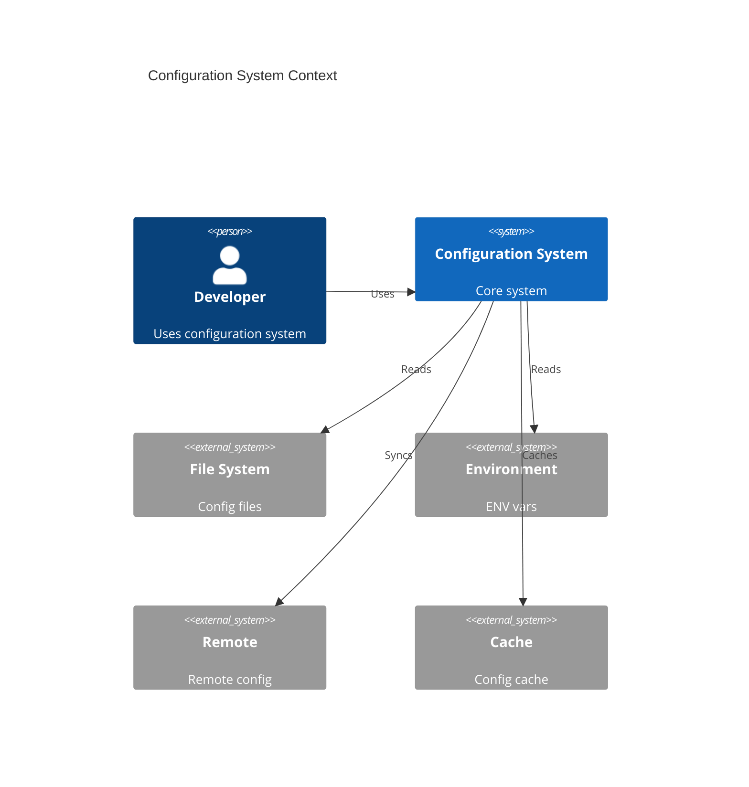
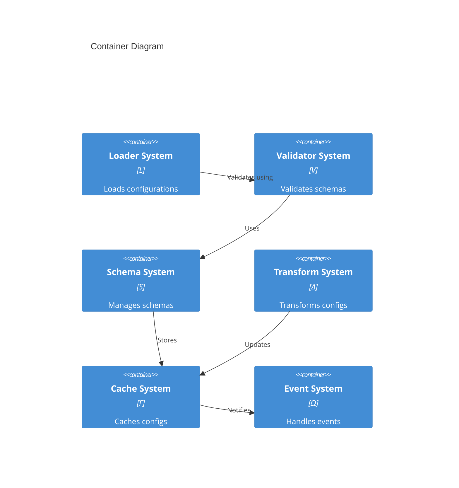
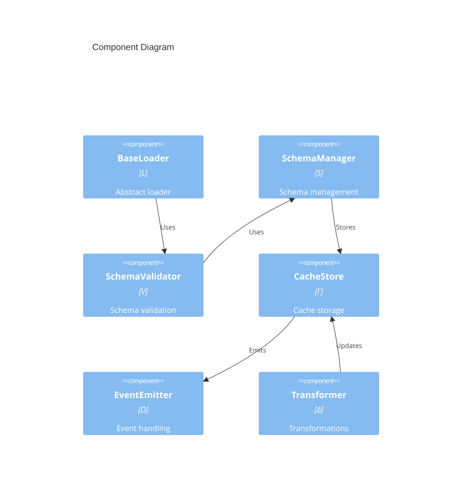

# Configuration System Architecture

## 1. System Context (Level 1)

## 2. Container View (Level 2)

## 3. Component View (Level 3)

## 4. Space Mappings
$$
\begin{aligned}
L &\mapsto \text{Loader System} \mapsto \text{BaseLoader} \\
V &\mapsto \text{Validator System} \mapsto \text{SchemaValidator} \\
S &\mapsto \text{Schema System} \mapsto \text{SchemaManager} \\
\Delta &\mapsto \text{Transform System} \mapsto \text{Transformer} \\
\Gamma &\mapsto \text{Cache System} \mapsto \text{CacheStore} \\
\Omega &\mapsto \text{Event System} \mapsto \text{EventEmitter}
\end{aligned}
$$

## 5. Category Theory Mapping
$$
\begin{aligned}
Ob(\mathfrak{C}) &\mapsto \text{Core Components} \\
Mor(\mathfrak{C}) &\mapsto \text{Component Relations}
\end{aligned}
$$
