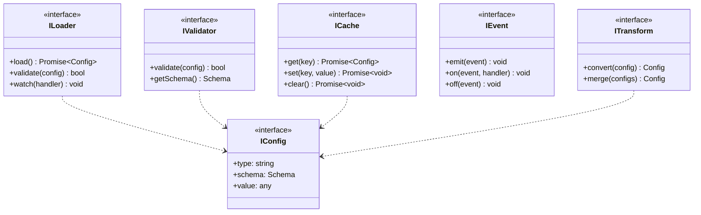
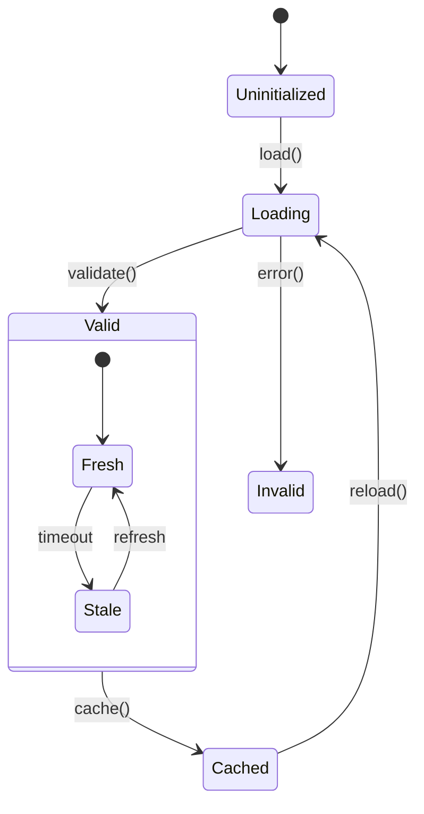

# Configuration System Implementation

## 1. Type Hierarchy

## 2. State Machine Implementation

## 3. Component Dependencies

### 3.1 Loader System

$$L = \{BaseLoader, JsonLoader, EnvLoader\}$$
$$dep(JsonLoader) = \{BaseLoader, SchemaValidator\}$$

### 3.2 Validator System

$$V = \{SchemaValidator, TypeValidator, RuleValidator\}$$
$$dep(SchemaValidator) = \{TypeValidator, RuleValidator\}$$

### 3.3 Cache System

$$\Gamma = \{CacheStore, CachePolicy, Eviction\}$$
$$dep(CacheStore) = \{CachePolicy, Eviction\}$$

## 4. Interface Contracts

### 4.1 Loader Contract

$$
\begin{aligned}
load &: () \rightarrow Promise\langle Config\rangle \\
validate &: Config \rightarrow boolean \\
watch &: (Config \rightarrow void) \rightarrow void
\end{aligned}
$$

### 4.2 Cache Contract

$$
\begin{aligned}
get &: Key \rightarrow Promise\langle Config\rangle \\
set &: Key \times Config \rightarrow Promise\langle void\rangle \\
clear &: () \rightarrow Promise\langle void\rangle
\end{aligned}
$$

## 5. Implementation Invariants

$$
\begin{aligned}
&\forall l \in Loaders: implements(l, ILoader) \\
&\forall c \in Caches: implements(c, ICache) \\
&\forall s \in States: \exists t \in Transitions: valid(t(s))
\end{aligned}
$$
