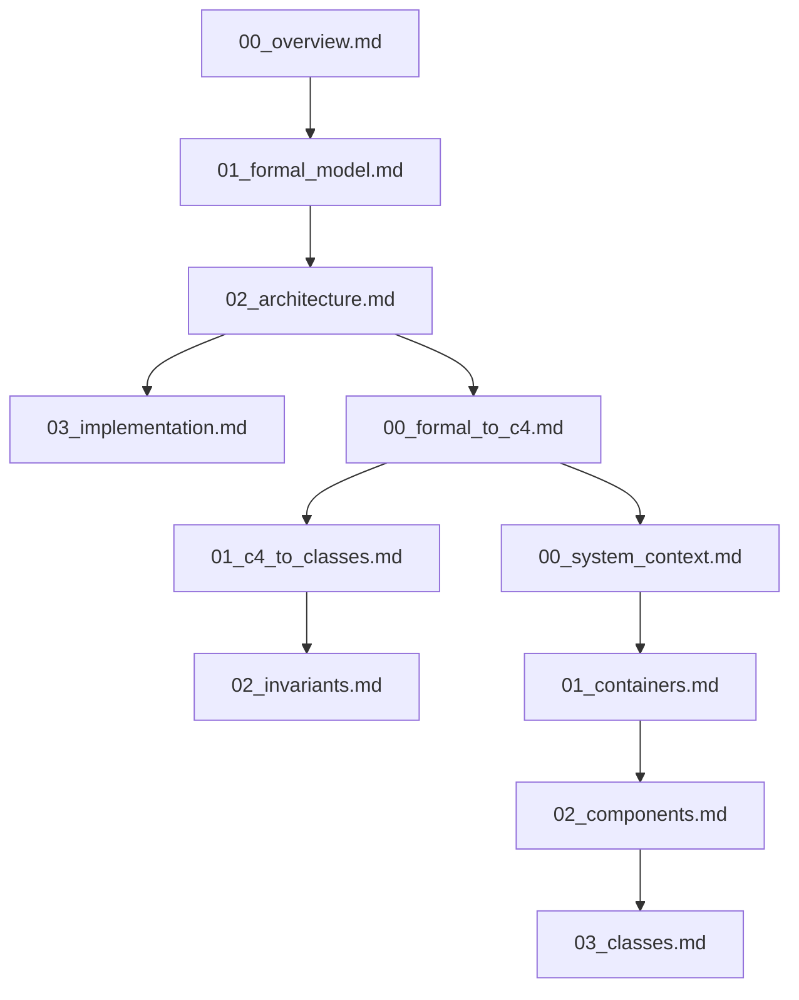

# Documentation Structure

## 1. Core Documentation Files

```filetree
docs/
├── specifications/
│   ├── 00_overview.md           # System definition & core spaces
│   ├── 01_formal_model.md       # Mathematical model & operations
│   ├── 02_architecture.md       # C4 diagrams (all levels)
│   └── 03_implementation.md     # Type hierarchy & interfaces
├── design/
│   ├── 00_system_context.md     # System boundaries & actors
│   ├── 01_containers.md         # Container decomposition
│   ├── 02_components.md         # Component details
│   └── 03_classes.md           # Class implementation
└── mapping/
    ├── 00_formal_to_c4.md      # Math model → C4 architecture
    ├── 01_c4_to_classes.md     # C4 → Implementation
    └── 02_invariants.md        # Cross-cutting constraints
```   

## 2. Document Contents Structure



### Specification Documents
1. Core definitions
2. Mathematical model
3. State spaces
4. Type system 
5. Operations
6. Invariants

### Design Documents
1. C4 diagrams
2. Component relationships
3. State transitions
4. Class hierarchies
5. Interface definitions

### Mapping Documents
1. Math ↔ Architecture mappings
2. Architecture ↔ Implementation mappings
3. Cross-cutting constraints

Each document should avoid code snippets and focus on formal/architectural descriptions using:
- Mathematical notation
- Mermaid diagrams
- C4 diagrams
- State diagrams