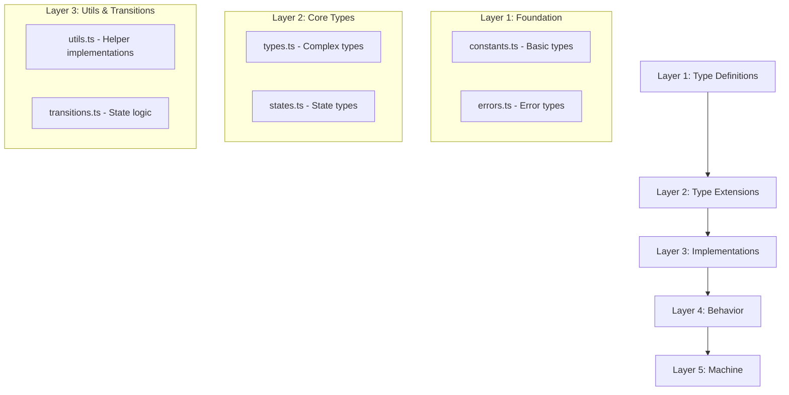

# WebSocket State Machine Implementation Guide (XState v5)

## Implementation Structure Overview

### Layer Architecture


## Layer 1: Foundation Implementation

### constants.ts
**Purpose**: 
Define fundamental constants and their associated types that will be used throughout the WebSocket state machine implementation.

**Implementation Guide**:
```typescript
// Core WebSocket states
export const STATES = {
  DISCONNECTED: "disconnected",
  CONNECTING: "connecting",
  CONNECTED: "connected",
  RECONNECTING: "reconnecting",
  DISCONNECTING: "disconnecting",
  TERMINATED: "terminated",
} as const;

// Derive type from constant
export type State = typeof STATES[keyof typeof STATES];

// Configuration with type safety
export const BASE_CONFIG = {
  reconnect: true,
  maxReconnectAttempts: 5,
  reconnectInterval: 1000,
  messageQueueSize: 100,
} as const;
```

**Key Points**:
- Use `as const` assertions for all constant definitions
- Export derived types immediately after constants
- Keep constants grouped by logical function
- No implementation logic, only definitions

### errors.ts
**Purpose**: 
Define error types and interfaces that will be used for error handling throughout the system.

**Implementation Guide**:
```typescript
// Error codes with type safety
export const ERROR_CODES = {
  CONNECTION_FAILED: "CONNECTION_FAILED",
  MESSAGE_FAILED: "MESSAGE_FAILED",
  TIMEOUT: "TIMEOUT",
} as const;

export type ErrorCode = typeof ERROR_CODES[keyof typeof ERROR_CODES];

// Error context interface
export interface ErrorContext {
  readonly code: ErrorCode;
  readonly timestamp: number;
  readonly message: string;
  readonly metadata?: Record<string, unknown>;
}
```

**Key Points**:
- Define error types as readonly
- Use discriminated unions for error types
- Keep error interfaces minimal and focused
- No error handling logic, only types

## Layer 2: Core Types Implementation

### types.ts
**Purpose**: 
Define the core type system that describes all data structures used in the WebSocket state machine.

**Implementation Guide**:
```typescript
// Base event interface
export interface BaseEvent {
  readonly timestamp: number;
  readonly id?: string;
}

// WebSocket events
export type WebSocketEvent =
  | ({ type: "CONNECT"; url: string } & BaseEvent)
  | ({ type: "DISCONNECT"; code?: number } & BaseEvent)
  | ({ type: "MESSAGE"; data: unknown } & BaseEvent);

// Context interface
export interface WebSocketContext {
  readonly url: string | null;
  readonly status: State;
  readonly socket: WebSocket | null;
  readonly error: ErrorContext | null;
  readonly options: Options;
  readonly metrics: Metrics;
}
```

**Key Points**:
- Use discriminated unions for events
- Make all properties readonly where appropriate
- Use intersection types for composition
- No implementation details or type guards

### states.ts
**Purpose**: 
Define interfaces and types that describe the state system and its metadata.

**Implementation Guide**:
```typescript
// State metadata
export interface StateMetadata {
  readonly description: string;
  readonly tags: ReadonlyArray<string>;
  readonly timeoutMs?: number;
  readonly retryable: boolean;
}

// State definition
export interface StateDefinition {
  readonly name: State;
  readonly allowedEvents: ReadonlySet<WebSocketEvent["type"]>;
  readonly metadata: StateMetadata;
}
```

**Key Points**:
- Define clear state interfaces
- Use readonly arrays and sets
- Keep metadata separate from logic
- No validation or implementation code

## Layer 3: Implementation Guide

### utils.ts
**Purpose**: 
Implement reusable utility functions that handle common operations and data manipulations.

**Implementation Guide**:
```typescript
// Generic validation
export function validateUrl(url: string): ValidationResult {
  try {
    const parsed = new URL(url);
    return {
      isValid: parsed.protocol === "ws:" || parsed.protocol === "wss:",
      reason: parsed.protocol !== "ws:" && parsed.protocol !== "wss:" 
        ? "Invalid protocol" 
        : undefined
    };
  } catch {
    return { isValid: false, reason: "Invalid URL format" };
  }
}

// Context manipulation
export function createContext(options: Options): WebSocketContext {
  return {
    url: null,
    status: "disconnected",
    socket: null,
    error: null,
    options,
    metrics: createInitialMetrics()
  };
}
```

**Key Points**:
- Write pure functions only
- Handle all error cases
- Return new objects, don't mutate
- Keep functions focused and simple

### transitions.ts
**Purpose**: 
Implement state machine-specific logic for managing states and transitions.

**Implementation Guide**:
```typescript
// Transition validation
export function validateTransition(
  from: State,
  event: WebSocketEvent,
  to: State,
  context: WebSocketContext
): ValidationResult {
  const allowedState = transitions[from]?.[event.type];
  if (!allowedState || allowedState !== to) {
    return {
      isValid: false,
      reason: `Invalid transition from ${from} to ${to}`
    };
  }
  return { isValid: true };
}

// State management
export function getNextState(
  current: State,
  event: WebSocketEvent
): State | undefined {
  return transitions[current]?.[event.type];
}
```

**Key Points**:
- Focus on state machine logic
- Validate all transitions
- Handle all edge cases
- Keep state management pure

## XState v5 Implementation Notes

### Action Implementation
```typescript
// Correct v5 action implementation
export const actions = {
  initializeConnection: assign((context, event) => ({
    url: event.url,
    status: "connecting"
  }))
};
```

### Guard Implementation
```typescript
// Correct v5 guard implementation
export const guards = {
  canConnect: (context: WebSocketContext, event) => {
    return context.status === "disconnected" && !!event.url;
  }
};
```

### Service Implementation
```typescript
// Correct v5 service implementation
export const services = {
  webSocket: fromCallback(({ input, self }) => {
    const socket = new WebSocket(input.url);
    socket.onmessage = (event) => self.send({ type: "MESSAGE", data: event.data });
    return () => socket.close();
  })
};
```

## Layer 4: Behavior Implementation

### guards.ts
**Purpose**: 
Implement type-safe guard functions that determine when state transitions and actions can occur.

**Implementation Guide**:
```typescript
// Type-safe guard implementations
export const guards = {
  canConnect: (context: WebSocketContext, event: WebSocketEvent) => {
    if (event.type !== "CONNECT") return false;
    return (
      context.status === "disconnected" &&
      !context.socket &&
      validateUrl(event.url).isValid
    );
  },

  canRetry: (context: WebSocketContext) => {
    return (
      context.options.reconnect &&
      context.retryCount < context.options.maxReconnectAttempts &&
      !isRateLimited(context)
    );
  },

  isRateLimited: (context: WebSocketContext) => {
    return context.rateLimit.count >= context.rateLimit.maxBurst;
  }
} satisfies Record<string, (context: WebSocketContext, event: WebSocketEvent) => boolean>;
```

**Key Points**:
- Use type-safe guard functions
- Keep guards pure and simple
- Handle all edge cases
- Return boolean values only

### actions.ts
**Purpose**: 
Implement type-safe actions that handle state updates and side effects.

**Implementation Guide**:
```typescript
// Type-safe action implementations
export const actions = {
  initializeConnection: assign((context, event) => {
    if (event.type !== "CONNECT") return {};
    return {
      url: event.url,
      status: "connecting" as const,
      socket: null,
      error: null,
      retryCount: 0
    };
  }),

  handleMessage: assign((context, event) => {
    if (event.type !== "MESSAGE") return {};
    return {
      metrics: {
        ...context.metrics,
        messagesReceived: context.metrics.messagesReceived + 1,
        lastMessageTime: Date.now()
      }
    };
  }),

  cleanup: assign((context) => ({
    socket: null,
    error: null,
    status: "disconnected" as const
  }))
} satisfies Record<string, AssignAction<WebSocketContext, WebSocketEvent>>;
```

**Key Points**:
- Use assign for context updates
- Keep actions pure
- Type-safe action creators
- Handle all event types

### services.ts
**Purpose**: 
Implement WebSocket services and actors that handle external communication.

**Implementation Guide**:
```typescript
// WebSocket service implementation
export const services = {
  webSocket: fromCallback(({ input, self }) => {
    const socket = new WebSocket(input.url);

    socket.onopen = () => {
      self.send({ type: "OPEN", timestamp: Date.now() });
    };

    socket.onmessage = (event) => {
      self.send({ 
        type: "MESSAGE", 
        data: event.data,
        timestamp: Date.now()
      });
    };

    socket.onerror = (error) => {
      self.send({ 
        type: "ERROR",
        error: createErrorContext(
          ERROR_CODES.CONNECTION_FAILED,
          error.message
        ),
        timestamp: Date.now()
      });
    };

    socket.onclose = (event) => {
      self.send({
        type: "CLOSE",
        code: event.code,
        reason: event.reason,
        wasClean: event.wasClean,
        timestamp: Date.now()
      });
    };

    // Cleanup function
    return () => {
      if (socket.readyState === WebSocket.OPEN) {
        socket.close();
      }
    };
  })
} satisfies Record<string, ActorLogic<WebSocketContext, WebSocketEvent>>;
```

**Key Points**:
- Use proper actor model
- Handle all WebSocket events
- Proper cleanup
- Type-safe event sending

## Layer 5: Machine Implementation

### machine.ts
**Purpose**: 
Define the complete state machine configuration and behavior.

**Implementation Guide**:
```typescript
import { createMachine, assign } from 'xstate';
import { actions } from './actions';
import { guards } from './guards';
import { services } from './services';

export function createWebSocketMachine(options: Options = BASE_CONFIG) {
  return createMachine({
    id: 'webSocket',
    types: {} as {
      context: WebSocketContext;
      events: WebSocketEvent;
    },
    context: {
      url: null,
      socket: null,
      status: 'disconnected',
      options,
      metrics: createInitialMetrics(),
      error: null,
      retryCount: 0,
      rateLimit: createInitialRateLimit()
    },
    initial: 'disconnected',
    states: {
      disconnected: {
        on: {
          CONNECT: {
            target: 'connecting',
            guard: 'canConnect',
            actions: 'initializeConnection'
          }
        }
      },
      connecting: {
        invoke: {
          src: 'webSocket',
          onDone: 'connected',
          onError: [{
            target: 'reconnecting',
            guard: 'canRetry'
          }, {
            target: 'disconnected'
          }]
        },
        on: {
          OPEN: 'connected',
          ERROR: {
            target: 'reconnecting',
            guard: 'canRetry'
          }
        }
      },
      connected: {
        on: {
          DISCONNECT: {
            target: 'disconnecting',
            actions: 'cleanup'
          },
          MESSAGE: {
            actions: 'handleMessage'
          },
          ERROR: {
            target: 'reconnecting',
            guard: 'canRetry'
          }
        }
      },
      reconnecting: {
        after: {
          RETRY_DELAY: {
            target: 'connecting',
            guard: 'canRetry'
          }
        },
        on: {
          MAX_RETRIES: 'disconnected'
        }
      },
      disconnecting: {
        on: {
          CLOSE: 'disconnected'
        }
      },
      terminated: {
        type: 'final'
      }
    }
  }, {
    actions,
    guards,
    services
  });
}
```

**Key Points**:
- Proper type definitions
- Clear state hierarchy
- Proper event handling
- Clean transition logic
- Proper service integration

## Testing Guidelines

### Type Testing
```typescript
describe("Type Definitions", () => {
  it("should enforce readonly properties", () => {
    const context: WebSocketContext = createContext(DEFAULT_OPTIONS);
    // @ts-expect-error - Should not allow mutation
    context.url = "new-url";
  });
});
```

### Implementation Testing
```typescript
describe("Utils", () => {
  it("should validate URLs correctly", () => {
    expect(validateUrl("ws://localhost")).toEqual({
      isValid: true
    });
    expect(validateUrl("http://localhost")).toEqual({
      isValid: false,
      reason: "Invalid protocol"
    });
  });
});
```

### Integration Testing
```typescript
describe("State Machine", () => {
  it("should handle connection lifecycle", () => {
    const machine = createWebSocketMachine();
    const state = machine.transition("disconnected", {
      type: "CONNECT",
      url: "ws://localhost"
    });
    expect(state.value).toBe("connecting");
  });
});
```