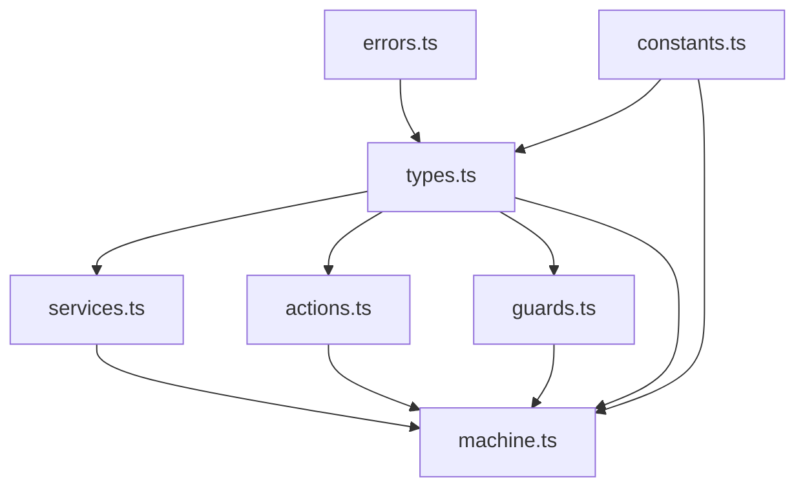

# WebSocket State Machine Implementation Guide

## 1. Dependency Structure

### 1.1 Core Dependencies



### 1.2 Feature Dependencies

1. **Error Handling Flow**
```
ApplicationError (base)
└── NetworkError (errors.ts)
    └── WebSocketError (types.ts)
        ├── Error Context (types.ts)
        └── Error Events (types.ts)
```

2. **State Management Flow**
```
constants.ts (CONNECTION_STATES, INITIAL_CONTEXT)
└── types.ts (WebSocketContext, WebSocketEvents)
    └── machine.ts
        ├── services.ts (WebSocket lifecycle)
        ├── actions.ts (Context updates)
        └── guards.ts (Transition conditions)
```

3. **Event Flow**
```
types.ts (Event definitions)
└── services.ts (Event creation)
    └── actions.ts (Event handling)
        └── machine.ts (State transitions)
```

## 2. XState v5 Integration Patterns

### 2.1 Pure Function Patterns

1. **Action Implementation**
```typescript
// Pure function pattern for actions
function handleError(
  context: WebSocketContext,
  event: Extract<WebSocketEvents, { type: 'ERROR' }>
): WebSocketContext {
  return {
    ...context,
    metrics: {
      ...context.metrics,
      totalErrors: context.metrics.totalErrors + 1
    }
  };
}
```

2. **Guard Implementation**
```typescript
// Pure function pattern for guards
function canReconnect(
  context: WebSocketContext,
  event: Extract<WebSocketEvents, { type: 'ERROR' }>
): boolean {
  return (
    context.options.reconnect &&
    context.state.connectionAttempts < context.options.maxReconnectAttempts
  );
}
```

### 2.2 Type System Integration

1. **Machine Type Definition**
```typescript
type WebSocketMachine = {
  context: WebSocketContext;
  events: WebSocketEvents;
};

const machine = createMachine({
  types: {} as WebSocketMachine,
  // ...
});
```

2. **Event Type Handling**
```typescript
type WebSocketEvents =
  | { type: 'CONNECT'; url: string; protocols?: string[] }
  | { type: 'DISCONNECT'; code?: number; reason?: string }
  | { type: 'ERROR'; error: WebSocketError; timestamp: number };
```

### 2.3 State Management Patterns

1. **Context Updates**
```typescript
// Immutable context updates
function updateMetrics(context: WebSocketContext): WebSocketContext {
  return {
    ...context,
    metrics: {
      ...context.metrics,
      lastUpdate: Date.now()
    }
  };
}
```

2. **State Transitions**
```typescript
const states = {
  connecting: {
    invoke: {
      src: 'webSocketService',
      onError: {
        target: 'reconnecting',
        actions: 'handleError'
      }
    }
  }
} as const;
```

## 3. Implementation Features

### 3.1 Debugging Support

1. **Error Tracking**
```typescript
interface WebSocketMetrics {
  totalErrors: number;
  consecutiveErrors: number;
  errors: ErrorRecord[];
  lastSuccessfulConnection?: number;
}
```

2. **State Logging**
```typescript
// Logger integration in services
logger.info("WebSocket connection established", {
  url: context.url,
  attempts: context.state.connectionAttempts
});
```

3. **Metrics Collection**
```typescript
interface WebSocketMetrics {
  messagesSent: number;
  messagesReceived: number;
  bytesReceived: number;
  bytesSent: number;
  messageTimestamps: number[];
}
```

### 3.2 Error Recovery Features

1. **Reconnection Logic**
```typescript
// Backoff calculation
function calculateBackoffDelay(context: WebSocketContext): number {
  return Math.min(
    context.options.reconnectInterval * 
    Math.pow(context.options.reconnectBackoffRate, 
    context.state.connectionAttempts),
    30000
  );
}
```

2. **Error Classification**
```typescript
function isRecoverableError(error: WebSocketError): boolean {
  return error.statusCode !== HttpStatusCode.WEBSOCKET_POLICY_VIOLATION &&
         error.statusCode !== HttpStatusCode.WEBSOCKET_PROTOCOL_ERROR;
}
```

### 3.3 Message Queue Management

1. **Queue Implementation**
```typescript
interface QueuedMessage {
  id: string;
  data: unknown;
  timestamp: number;
  attempts: number;
  priority: "high" | "normal";
}
```

2. **Rate Limiting**
```typescript
interface ConnectionOptions {
  rateLimit: {
    messages: number;
    window: number;
  };
}
```

## 4. Best Practices

### 4.1 Error Handling

1. Always use typed error creation:
```typescript
function createWebSocketError(
  message: string,
  originalError: Error,
  context: WebSocketErrorContext
): WebSocketError
```

2. Maintain error context:
```typescript
interface WebSocketErrorContext extends NetworkErrorContext {
  connectionAttempts: number;
  totalErrors: number;
  consecutiveErrors: number;
}
```

### 4.2 State Management

1. Use immutable context updates:
```typescript
function updateContext(context: WebSocketContext): WebSocketContext {
  return {
    ...context,
    // updates
  };
}
```

2. Implement proper cleanup:
```typescript
function cleanup(context: WebSocketContext): WebSocketContext {
  return {
    ...context,
    socket: null,
    queue: {
      messages: [],
      pending: false,
      lastProcessed: 0
    }
  };
}
```

### 4.3 Testing

1. Action Testing:
```typescript
describe('WebSocket Actions', () => {
  const initialContext = INITIAL_CONTEXT;
  
  test('handleError updates error metrics', () => {
    const error = new Error('Test error');
    const event = { type: 'ERROR', error, timestamp: Date.now() };
    
    const result = handleError(initialContext, event);
    expect(result.metrics.totalErrors).toBe(1);
  });
});
```

2. Guard Testing:
```typescript
describe('WebSocket Guards', () => {
  test('canReconnect respects max attempts', () => {
    const context = {
      ...INITIAL_CONTEXT,
      state: { connectionAttempts: 5 },
      options: { maxReconnectAttempts: 3 }
    };
    
    expect(canReconnect(context)).toBe(false);
  });
});
```

## 5. Configuration

### 5.1 Default Configuration

```typescript
const DEFAULT_CONFIG = {
  reconnect: true,
  maxReconnectAttempts: 5,
  reconnectInterval: 1000,
  reconnectBackoffRate: 1.5,
  connectionTimeout: 30000,
  pingInterval: 30000,
  pongTimeout: 5000,
  messageQueueSize: 100,
  messageTimeout: 5000,
  rateLimit: {
    messages: 100,
    window: 1000,
  },
} as const;
```

### 5.2 State Configuration

```typescript
const CONNECTION_STATES = {
  DISCONNECTED: "disconnected",
  CONNECTING: "connecting",
  CONNECTED: "connected",
  RECONNECTING: "reconnecting",
  DISCONNECTING: "disconnecting",
} as const;
```

## 6. Common Implementation Tasks

### 6.1 Adding New Events

1. Update event types:
```typescript
type WebSocketEvents =
  | { type: 'NEW_EVENT'; payload: unknown }
  | // existing events...
```

2. Add corresponding action:
```typescript
function handleNewEvent(
  context: WebSocketContext,
  event: Extract<WebSocketEvents, { type: 'NEW_EVENT' }>
): WebSocketContext {
  // implementation
}
```

### 6.2 Adding New States

1. Update state constants:
```typescript
const CONNECTION_STATES = {
  NEW_STATE: "new_state",
  // existing states...
} as const;
```

2. Add state configuration:
```typescript
const states = {
  new_state: {
    on: {
      EVENT: {
        target: 'other_state',
        guard: 'someGuard',
        actions: 'someAction'
      }
    }
  }
};
```

### 6.3 Extending Metrics

1. Update metrics interface:
```typescript
interface WebSocketMetrics {
  newMetric: number;
  // existing metrics...
}
```

2. Update metric collection:
```typescript
function updateNewMetric(context: WebSocketContext): WebSocketContext {
  return {
    ...context,
    metrics: {
      ...context.metrics,
      newMetric: calculateNewMetric(context)
    }
  };
}
```