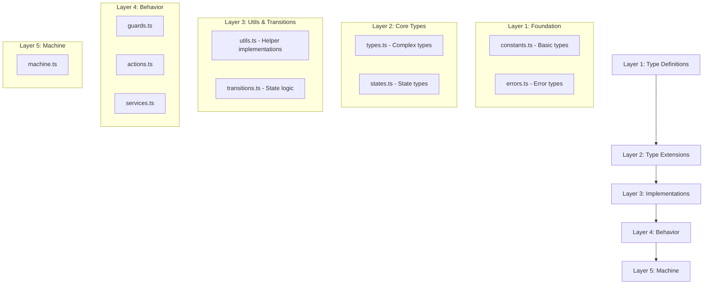

# WebSocket State Machine Implementation Plan (XState v5)

## 1. Module Structure

Updated diagram:

## 2. Implementation Sequence

### 2.1 Layer 1: Foundation (Type Definitions Only)
- **Purpose**: Define fundamental types and constants
- **Files**:
  1. `constants.ts`
     - Socket state constants (`as const`)
     - Event type constants (`as const`)
     - Configuration constants (`as const`)
     - Basic type exports
     - NO implementations or logic
  
  2. `errors.ts`
     - Error code constants (`as const`)
     - Error type definitions
     - Error interfaces
     - NO error handling logic
     - NO error creation implementations

### 2.2 Layer 2: Core Types (Type Extensions & Interfaces)
- **Purpose**: Define complex types and interfaces using Layer 1 definitions
- **Files**:
  1. `types.ts`
     - Event type interfaces
     - Context type interfaces
     - Configuration interfaces
     - Message type interfaces
     - NO type guard implementations
     - NO validation logic
  
  2. `states.ts`
     - State interface definitions
     - State metadata interfaces
     - State validation interfaces
     - State history interfaces
     - NO state implementations
     - NO validation logic

### 2.3 Layer 3: Utils & Transitions (All Implementations)
- **Purpose**: Implement all helper functions and business logic
- **Files**:
  1. `utils.ts`
     - Implementation of all helper functions
     - Implementation of all validation utilities
     - Implementation of error handling
     - Implementation of type guards
     - Context creation and manipulation
     - State validation logic
  
  2. `transitions.ts`
     - Implementation of transition logic
     - Implementation of state management
     - Implementation of validation rules
     - Error handling implementations
     - State history tracking

### 2.4 Layer 4: Behavior
- **Purpose**: Implement machine behavior
- **Files**:
  1. `guards.ts` (depends on: utils.ts, types.ts)
     - State guards
     - Event guards
     - Condition checks
  2. `actions.ts` (depends on: utils.ts, types.ts)
     - Context updates
     - Event handling
     - State transitions
  3. `services.ts` (depends on: utils.ts, types.ts)
     - WebSocket service
     - Health checks
     - Message handling

### 2.5 Layer 5: Machine
- **Purpose**: Define the state machine
- **Files**:
  1. `machine.ts` (depends on: all previous layers)
     - Machine configuration
     - State definitions
     - Behavior mapping

## 3. Implementation Checklist

### Layer 1: Types & Constants
- [ ] Define state constants
- [ ] Define event constants
- [ ] Define config constants
- [ ] Define error types
- [ ] Define error interfaces
- [ ] Verify no implementations

### Layer 2: Extended Types
- [ ] Define event interfaces
- [ ] Define context interfaces
- [ ] Define state interfaces
- [ ] Define metadata interfaces
- [ ] Verify no implementations

### Layer 3: Implementations
- [ ] Implement helper functions
- [ ] Implement type guards
- [ ] Implement validation logic
- [ ] Implement error handling
- [ ] Implement state management
- [ ] Implement transitions

### Layer 4
- [ ] Implement guards
- [ ] Create actions
- [ ] Add services
- [ ] Add behavior tests

### Layer 4: Behavior Updates
- [ ] Add cleanup actions for terminated state
- [ ] Add resource management
- [ ] Add metric tracking
- [ ] Add rate limiting

### Layer 5
- [ ] Configure machine
- [ ] Add state definitions
- [ ] Map behaviors
- [ ] Add integration tests

## 4. Testing Strategy

### Unit Tests
- Individual components per layer
- Pure function testing
- Type validation

### Integration Tests
- Cross-layer functionality
- State transitions
- Event handling

### System Tests
- Complete machine behavior
- Real WebSocket interaction
- Error scenarios

### Testing Strategy Updates
- Add terminated state tests
- Add metric validation
- Add rate limit testing
- Add cleanup verification

## 5. Migration Notes

### XState v5 Patterns
- Pure functions for actions
- Pure functions for guards
- Service callbacks
- Type inference

### Breaking Changes
- Remove v4 patterns
- Update type system
- Refactor behaviors

