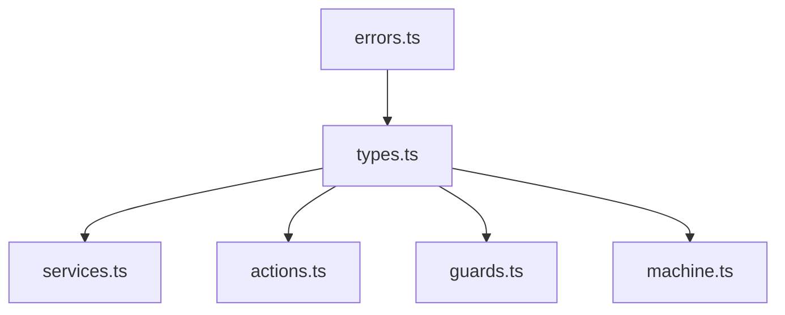

Let's start with a systematic implementation approach:

1. First, can we prioritize which file to tackle first? Based on the dependency structure outlined in the doc:



We should start with either:
1. `types.ts` - since it's a core dependency for other files
2. Or stick with `services.ts` which had the original issues

Which would you prefer to start with? My recommendation would be `types.ts` since:
- It defines core types used throughout
- Changes here will inform changes needed elsewhere
- It's where we'll implement core XState v5 type patterns

This way we can:
1. Update the type system first
2. Update the docs with any new type patterns we discover
3. Then move on to implementing services/actions/guards with the new types

---


### Enhancement of the plan

Let me analyze the dependencies and create a clear refactoring plan:

1. Dependency Analysis:
```mermaid
graph TD
    types --> constants
    types --> errors[../../errors.ts]
    
    actions --> types
    actions --> logger[@qi/core/logger]
    
    guards --> types
    guards --> utils
    guards --> logger
    
    utils --> types
    utils --> errors
    utils --> logger
    
    machine --> types
    machine --> constants
    machine --> actions
    machine --> guards
    machine --> services
    
    services --> types
    services --> utils
    services --> logger
    services --> errors

    states --> constants
```

2. File Update Sequence (based on dependencies):

a) First Layer (No Internal Dependencies):
- `constants.ts` - Contains basic enums and config
- `../../errors.ts` - Base error types (external)

b) Second Layer:
- `types.ts` - Depends on constants and errors
  * Update base types (ConnectionState, ConnectionOptions)
  * Update error types (WebSocketError, ErrorContext)
  * Update context and metrics
  * Update event types and machine helper

c) Third Layer:
- `utils.ts` - Depends on types, errors
  * Update error creation helpers
  * Update retry logic
  * Update utility functions

d) Fourth Layer:
- `guards.ts` - Depends on types, utils
- `actions.ts` - Depends on types
- `services.ts` - Depends on types, utils
- `states.ts` - Depends on constants

e) Final Layer:
- `machine.ts` - Depends on all above

3. Detailed Plan for `types.ts` Update:

```typescript
// 1. Base Types
interface ConnectionOptions {
  // Add readonly markers
  // Improve type safety
}

// 2. Error Types
interface WebSocketError {
  // Update error hierarchy
  // Add type guards
}

// 3. Context & Metrics
interface WebSocketContext {
  // Add immutability
  // Improve type inference
}

// 4. Events
type WebSocketEvents = {
  // Enhance type narrowing
  // Add discriminated unions
}
```

4. Testing Strategy:
- Update types incrementally
- Test type inference at each step
- Verify backward compatibility
- Check dependent files compile

Would you like me to proceed with implementing these updates in this order, starting with the types in `types.ts`?