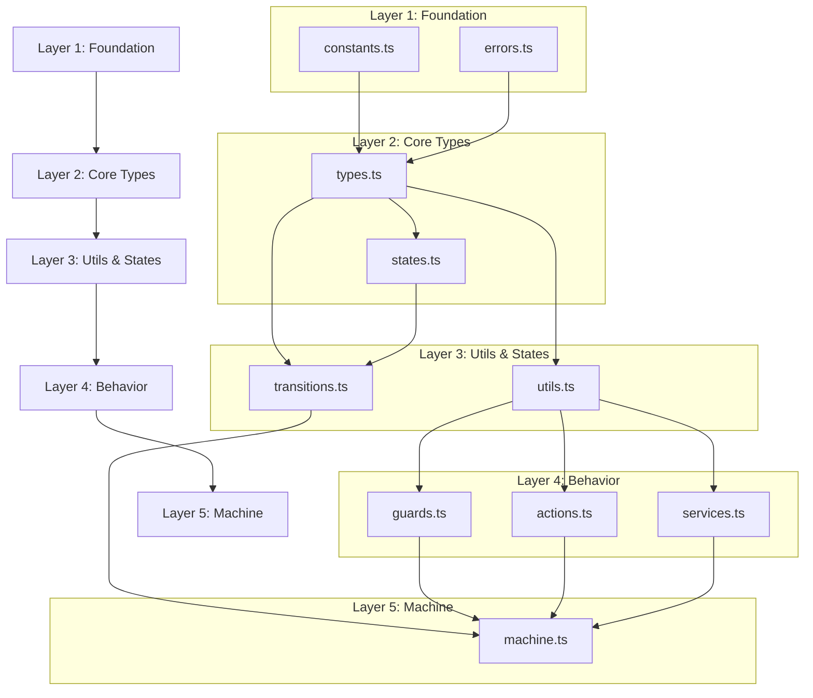

# WebSocket State Machine Implementation Plan (XState v5)

## 1. Module Structure

## 2. Implementation Sequence

### 2.1 Layer 1: Foundation
- **Purpose**: Define core constants and error handling
- **Files**:
  1. `constants.ts`
     - Socket states
     - Event types
     - Configuration constants
  2. `errors.ts`
     - Error hierarchy
     - Error types
     - Error factories

### 2.2 Layer 2: Core Types
- **Purpose**: Define type system and state structure
- **Files**:
  1. `types.ts` (depends on: constants.ts, errors.ts)
     - Event types
     - Context types
     - Configuration types
  2. `states.ts` (depends on: types.ts)
     - State definitions
     - State metadata
     - State validation

### 2.3 Layer 3: Utils & States
- **Purpose**: Implement utility functions and transition logic
- **Files**:
  1. `utils.ts` (depends on: types.ts)
     - Helper functions
     - Validation utilities
     - Error handling utilities
  2. `transitions.ts` (depends on: states.ts, types.ts)
     - Transition definitions
     - Transition validation
     - Transition metadata

### 2.4 Layer 4: Behavior
- **Purpose**: Implement machine behavior
- **Files**:
  1. `guards.ts` (depends on: utils.ts, types.ts)
     - State guards
     - Event guards
     - Condition checks
  2. `actions.ts` (depends on: utils.ts, types.ts)
     - Context updates
     - Event handling
     - State transitions
  3. `services.ts` (depends on: utils.ts, types.ts)
     - WebSocket service
     - Health checks
     - Message handling

### 2.5 Layer 5: Machine
- **Purpose**: Define the state machine
- **Files**:
  1. `machine.ts` (depends on: all previous layers)
     - Machine configuration
     - State definitions
     - Behavior mapping

## 3. Implementation Checklist

### Layer 1
- [ ] Define state constants
- [ ] Define event constants
- [ ] Define configuration constants
- [ ] Create error hierarchy
- [ ] Implement error utilities

### Layer 2
- [ ] Define event types
- [ ] Define context types
- [ ] Create state types
- [ ] Implement state definitions
- [ ] Add state validation

### Layer 2: Core Types Updates
- [ ] Add terminated state handling
- [ ] Add message processing flags
- [ ] Add timing metrics
- [ ] Add byte counters
- [ ] Add rate limiting context

### Layer 3
- [ ] Create utility functions
- [ ] Add validation helpers
- [ ] Define transitions
- [ ] Add transition validation

### Layer 4
- [ ] Implement guards
- [ ] Create actions
- [ ] Add services
- [ ] Add behavior tests

### Layer 4: Behavior Updates
- [ ] Add cleanup actions for terminated state
- [ ] Add resource management
- [ ] Add metric tracking
- [ ] Add rate limiting

### Layer 5
- [ ] Configure machine
- [ ] Add state definitions
- [ ] Map behaviors
- [ ] Add integration tests

## 4. Testing Strategy

### Unit Tests
- Individual components per layer
- Pure function testing
- Type validation

### Integration Tests
- Cross-layer functionality
- State transitions
- Event handling

### System Tests
- Complete machine behavior
- Real WebSocket interaction
- Error scenarios

### Testing Strategy Updates
- Add terminated state tests
- Add metric validation
- Add rate limit testing
- Add cleanup verification

## 5. Migration Notes

### XState v5 Patterns
- Pure functions for actions
- Pure functions for guards
- Service callbacks
- Type inference

### Breaking Changes
- Remove v4 patterns
- Update type system
- Refactor behaviors

