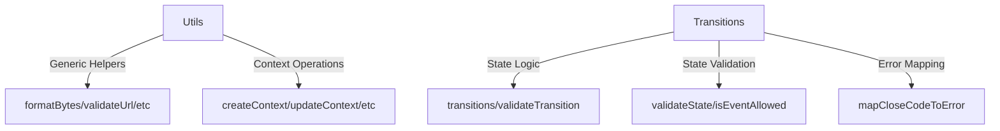

## Layer 1: Foundation

### `constants.ts`

```typescript
// constants.ts
/**
 * @fileoverview Core WebSocket constants
 * @module @qi/core/network/websocket/constants
 */

/**
 * Core WebSocket states
 */
export const STATES = {
  DISCONNECTED: 'disconnected',
  CONNECTING: 'connecting',
  CONNECTED: 'connected',
  RECONNECTING: 'reconnecting',
  DISCONNECTING: 'disconnecting',
  TERMINATED: 'terminated'
} as const;

/**
 * Core WebSocket events
 */
export const EVENTS = {
  CONNECT: 'CONNECT',
  DISCONNECT: 'DISCONNECT',
  OPEN: 'OPEN',
  CLOSE: 'CLOSE',
  ERROR: 'ERROR',
  MESSAGE: 'MESSAGE',
  SEND: 'SEND',
  RETRY: 'RETRY',
  MAX_RETRIES: 'MAX_RETRIES',
  TERMINATE: 'TERMINATE'
} as const;

/**
 * Basic configuration defaults
 */
export const BASE_CONFIG = {
  reconnect: true,
  maxReconnectAttempts: 5,
  reconnectInterval: 1000,
  messageQueueSize: 100
} as const;

/**
 * WebSocket close codes
 */
export const CLOSE_CODES = {
  NORMAL_CLOSURE: 1000,
  GOING_AWAY: 1001,
  PROTOCOL_ERROR: 1002,
  INVALID_DATA: 1003,
  POLICY_VIOLATION: 1008,
  MESSAGE_TOO_BIG: 1009,
  INTERNAL_ERROR: 1011,
  CONNECTION_FAILED: 1006 // Add abnormal closure code
} as const;
```

### `errors.ts`

```typescript
// errors.ts
/**
 * @fileoverview Basic WebSocket error definitions
 * @module @qi/core/network/websocket/errors
 */

import { CLOSE_CODES } from "./constants.js";

/**
 * Basic error codes
 */
export const ERROR_CODES = {
  CONNECTION_FAILED: "CONNECTION_FAILED",
  MESSAGE_FAILED: "MESSAGE_FAILED",
  TIMEOUT: "TIMEOUT",
  INVALID_STATE: "INVALID_STATE",
} as const;

export type ErrorCode = (typeof ERROR_CODES)[keyof typeof ERROR_CODES];

/**
 * Basic error context
 */
export interface ErrorContext {
  readonly code: ErrorCode;
  readonly timestamp: number;
  readonly message: string;
}

/**
 * WebSocket base error
 */
export class WebSocketError extends Error {
  constructor(
    message: string,
    public readonly code: ErrorCode,
    public readonly context: ErrorContext
  ) {
    super(message);
    this.name = "WebSocketError";
  }
}
```

## Layer 2: Core Types

### `types.ts`

```typescript
// types.ts
/**
 * @fileoverview Core WebSocket types
 * @module @qi/core/network/websocket/types
 */

import { STATES, EVENTS } from './constants';
import { ErrorCode, ErrorContext } from './errors';

/**
 * Core state type
 */
export type State = typeof STATES[keyof typeof STATES];

/**
 * Core event type
 */
export type EventType = typeof EVENTS[keyof typeof EVENTS];

/**
 * Basic context interface
 */
export interface WebSocketContext {
  readonly url: string | null;
  readonly status: State;
  readonly socket: WebSocket | null;
  readonly error: ErrorContext | null;
  readonly options: Options;
  readonly metrics: Metrics;
}

/**
 * Basic options interface
 */
export interface Options {
  readonly reconnect: boolean;
  readonly maxReconnectAttempts: number;
  readonly reconnectInterval: number;
  readonly messageQueueSize: number;
}

/**
 * Basic metrics interface
 */
export interface Metrics {
  readonly messagesSent: number;
  readonly messagesReceived: number;
  readonly errors: ReadonlyArray<ErrorContext>;
}

/**
 * Core event types
 */
export type WebSocketEvent =
  | { type: 'CONNECT'; url: string }
  | { type: 'DISCONNECT'; code?: number }
  | { type: 'OPEN' }
  | { type: 'CLOSE'; code: number; reason: string }
  | { type: 'ERROR'; error: ErrorContext }
  | { type: 'MESSAGE'; data: unknown }
  | { type: 'SEND'; data: unknown }
  | { type: 'RETRY'; attempt: number }
  | { type: 'MAX_RETRIES' }
  | { type: 'TERMINATE' };

/**
 * Core machine schema
 */
export interface WebSocketMachine {
  context: WebSocketContext;
  events: WebSocketEvent;
}
```

### `states.ts`

```typescript
/**
 * @fileoverview Core WebSocket state definitions
 * @module @qi/core/network/websocket/states
 */

import { WebSocketContext, State, WebSocketEvent } from "./types.js";

/**
 * State definition interface
 */
export interface StateDefinition {
  readonly name: State;
  readonly allowedEvents: ReadonlySet<WebSocketEvent["type"]>;
  readonly invariant: (context: WebSocketContext) => boolean;
}

/**
 * Core state definitions
 */
export const states: Record<State, StateDefinition> = {
  disconnected: {
    name: "disconnected",
    allowedEvents: new Set(["CONNECT"]),
    invariant: (ctx) => ctx.socket === null,
  },
  connecting: {
    name: "connecting",
    allowedEvents: new Set(["OPEN", "ERROR", "CLOSE"]),
    invariant: (ctx) => ctx.socket !== null && ctx.url !== null,
  },
  connected: {
    name: "connected",
    allowedEvents: new Set(["DISCONNECT", "MESSAGE", "SEND", "ERROR", "CLOSE"]),
    invariant: (ctx) => ctx.socket !== null && ctx.url !== null,
  },
  reconnecting: {
    name: "reconnecting",
    allowedEvents: new Set(["RETRY", "MAX_RETRIES"]),
    invariant: (ctx) => ctx.socket === null && ctx.url !== null,
  },
  disconnecting: {
    name: "disconnecting",
    allowedEvents: new Set(["CLOSE"]),
    invariant: (ctx) => ctx.socket !== null,
  },
  terminated: {
    name: "terminated",
    allowedEvents: new Set([]),
    invariant: (ctx) => ctx.socket === null,
  },
};
```

## Layer 3: utils and transitions
### `utils.ts`

```typescript
/**
 * @fileoverview Pure utility functions for WebSocket operations
 */

import { WebSocketContext, WebSocketEvent, Options } from "./types.js";
import { WebSocketError, ErrorCode, ErrorContext } from "./errors.js";

// Format and validation utilities
export function formatBytes(bytes: number): string {
  if (bytes === 0) return "0 Bytes";
  const k = 1024;
  const sizes = ["Bytes", "KB", "MB", "GB"];
  const i = Math.floor(Math.log(bytes) / Math.log(k));
  return `${parseFloat((bytes / Math.pow(k, i)).toFixed(2))} ${sizes[i]}`;
}

export function validateUrl(url: string): boolean {
  try {
    const parsed = new URL(url);
    return parsed.protocol === 'ws:' || parsed.protocol === 'wss:';
  } catch {
    return false;
  }
}

// Context update utilities
export function updateContext(
  context: WebSocketContext,
  updates: Partial<WebSocketContext>
): WebSocketContext {
  return { ...context, ...updates };
}

export function updateMetrics(
  context: WebSocketContext,
  error?: ErrorContext
): WebSocketContext {
  return {
    ...context,
    metrics: {
      ...context.metrics,
      errors: error
        ? [...context.metrics.errors, error]
        : context.metrics.errors,
      messagesSent: context.metrics.messagesSent,
      messagesReceived: context.metrics.messagesReceived,
    },
  };
}

// Error handling utilities
export function createErrorContext(
  code: ErrorCode,
  message: string
): ErrorContext {
  return {
    code,
    timestamp: Date.now(),
    message,
  };
}

export function calculateBackoff(attempts: number, baseInterval: number): number {
  return Math.min(1000 * Math.pow(2, attempts), 30000);
}

export function createContext(options: Options): WebSocketContext {
  return {
    url: null,
    status: 'disconnected',
    socket: null,
    error: null,
    options,
    metrics: {
      messagesSent: 0,
      messagesReceived: 0,
      errors: []
    }
  };
}
```

### `transitions.ts`

```typescript
import { State, WebSocketContext, WebSocketEvent } from "./types.js";
import { CLOSE_CODES } from "./constants.js";
import { ErrorCode, ERROR_CODES } from "./errors.js";
import { states } from "./states.js";

// State transition map
export const transitions: Record<
  State,
  Partial<Record<WebSocketEvent["type"], State>>
> = {
  disconnected: {
    CONNECT: "connecting",
  },
  connecting: {
    OPEN: "connected",
    ERROR: "reconnecting",
    CLOSE: "disconnected",
  },
  connected: {
    DISCONNECT: "disconnecting",
    ERROR: "reconnecting",
    CLOSE: "disconnected",
  },
  reconnecting: {
    RETRY: "connecting",
    MAX_RETRIES: "disconnected",
  },
  disconnecting: {
    CLOSE: "disconnected",
  },
  terminated: {},
};

// Transition validation
export function validateTransition(
  from: State,
  event: WebSocketEvent["type"],
  to: State
): boolean {
  return transitions[from]?.[event] === to;
}

export function validateState(
  state: State,
  context: WebSocketContext
): boolean {
  return states[state].invariant(context);
}

export function isEventAllowed(state: State, event: WebSocketEvent): boolean {
  return states[state].allowedEvents.has(event.type);
}

// Close code mapping
export function mapCloseCodeToError(code: number): ErrorCode {
  const closeCodeMap: Record<number, ErrorCode> = {
    [CLOSE_CODES.GOING_AWAY]: ERROR_CODES.CONNECTION_FAILED,
    [CLOSE_CODES.CONNECTION_FAILED]: ERROR_CODES.CONNECTION_FAILED,
    [CLOSE_CODES.MESSAGE_TOO_BIG]: ERROR_CODES.MESSAGE_FAILED,
    [CLOSE_CODES.PROTOCOL_ERROR]: ERROR_CODES.PROTOCOL_ERROR,
    [CLOSE_CODES.INVALID_DATA]: ERROR_CODES.PROTOCOL_ERROR,
    [CLOSE_CODES.POLICY_VIOLATION]: ERROR_CODES.PROTOCOL_ERROR,
    [CLOSE_CODES.INTERNAL_ERROR]: ERROR_CODES.INVALID_STATE,
  };

  return closeCodeMap[code] ?? ERROR_CODES.INVALID_STATE;
}

/**
 * Type guards
 */
export function isWebSocketEvent(value: unknown): value is WebSocketEvent {
  return (
    typeof value === "object" &&
    value !== null &&
    "type" in value &&
    typeof (value as any).type === "string" &&
    "timestamp" in value &&
    Object.values(Event).includes((value as any).type)
  );
}
```

---



---

Key improvements:

1. Better separation of concerns
2. Pure functions throughout
3. Simplified interfaces
4. Improved type safety
5. Clear state transitions

The complex functionality has been removed from these layers and will be implemented in Layers 4 and 5, such as:

1. Actor model implementation
2. Complex state machines
3. Advanced error handling
4. Message queuing
5. Health monitoring