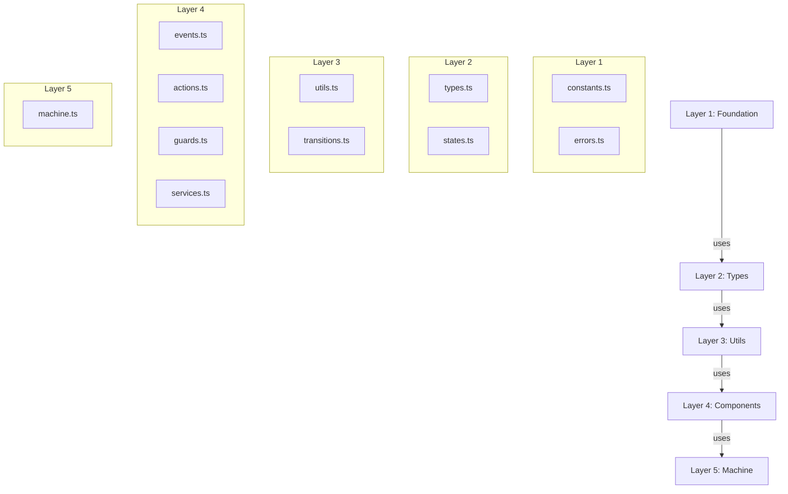
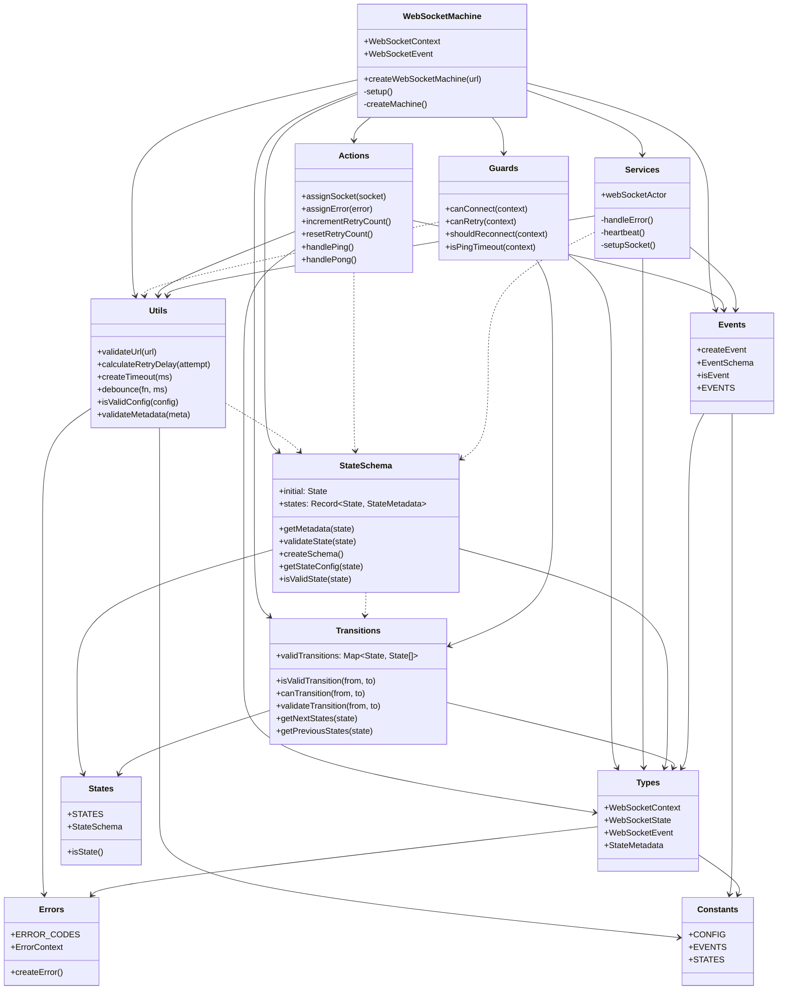

# WebSocket Machine Class Diagram

## 1. Layer Structure


## 2. Component Relations



## 3. File Dependencies

## File Dependencies
```
/machine/
├── Layer 5
│   └── machine.ts
│       ├── actions.ts [L4]
│       ├── guards.ts [L4]
│       ├── services.ts [L4]
│       ├── events.ts [L4]
│       ├── states.ts [L3]
│       └── types.ts [L2]
│
├── Layer 4
│   ├── actions.ts
│   │   ├── events.ts [L4]
│   │   ├── types.ts [L2]
│   │   ├── states.ts [L3]
│   │   └── utils.ts [L3]
│   ├── guards.ts
│   │   ├── transitions.ts [L3]
│   │   └── types.ts [L2]
│   ├── services.ts
│   │   ├── events.ts [L4]
│   │   ├── types.ts [L2]
│   │   └── utils.ts [L3]
│   └── events.ts
│       ├── types.ts [L2]
│       └── constants.ts [L1]
│
├── Layer 3
│   ├── utils.ts
│   │   ├── constants.ts [L1]
│   │   └── errors.ts [L1]
│   ├── transitions.ts
│   │   ├── states.ts [L2]
│   │   └── types.ts [L2]
│   └── states.ts
│       └── types.ts [L2]
│
├── Layer 2
│   ├── types.ts
│   │   ├── constants.ts [L1]
│   │   └── errors.ts [L1]
│   └── states.ts
│       └── constants.ts [L1]
│
└── Layer 1
    ├── constants.ts
    └── errors.ts
```

## 4. Implementation Rules

1. Layer Access:
   - Higher layers can use lower layers
   - Lower layers cannot use higher layers
   - Same layer components can interact

2. Component Rules:
   - Actions: Pure functions, no side effects
   - Guards: Boolean conditions only
   - Events: Type definitions and creators
   - Services: Side effects and IO
   - Utils: Pure utility functions
   - Transitions: State validation logic
   - StateSchema: State metadata and validation

3. Design Patterns:
   - Factory Pattern for machine creation
   - Builder Pattern for state transitions
   - Observer Pattern for event handling
   - Strategy Pattern for guards and actions
   
4. Error Prevention:
   - Type safety through interfaces
   - State validation in transitions
   - Guard conditions for state changes
   - Pure functions for predictability