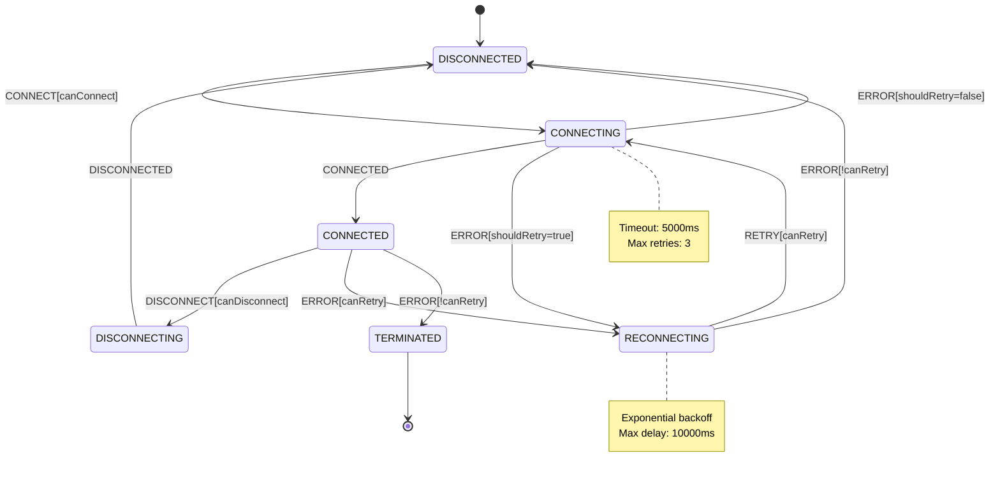

# WebSocket State Machine - Verification Document (Phase 1)

## State Machine Diagram



## Code Review Checklist

### XState v5 Pattern Verification

- [ ] Uses setup() pattern for machine creation
- [ ] No usage of createMachine() directly
- [ ] No usage of assign() in actions
- [ ] Actions return context directly
- [ ] Uses fromPromise for actors
- [ ] Proper event emission in actors
- [ ] Includes cleanup functions in actors

### Type Safety Verification

- [ ] Types defined in setup()
- [ ] No type assertions (as any)
- [ ] Proper interfaces defined
- [ ] Generic constraints used
- [ ] Event types are union types
- [ ] Context type is interface
- [ ] Error types are comprehensive

### Implementation Verification

- [ ] Pure functions used
- [ ] Immutable context updates
- [ ] Proper resource cleanup
- [ ] Clear error handling
- [ ] State transitions valid
- [ ] Guards are pure functions
- [ ] Actions handle all cases

## Test Requirements

### Unit Tests Coverage

1. State Transitions

   - [ ] All valid state transitions
   - [ ] Invalid transition blocks
   - [ ] Error state handling
   - [ ] Reconnection flows

2. Context Operations

   - [ ] Context creation
   - [ ] Context updates
   - [ ] Immutability checks
   - [ ] Type safety

3. Action Implementations

   - [ ] Direct context returns
   - [ ] No side effects
   - [ ] Error handling
   - [ ] Resource management

4. Guard Functions

   - [ ] Boolean returns
   - [ ] Pure functions
   - [ ] Edge cases
   - [ ] Type safety

5. Actor Behavior
   - [ ] Event emission
   - [ ] Resource cleanup
   - [ ] Error handling
   - [ ] Type safety

### Integration Tests Coverage

1. Machine Behavior

   - [ ] Full connection lifecycle
   - [ ] Error recovery flows
   - [ ] State transitions
   - [ ] Event handling

2. WebSocket Operations

   - [ ] Connection management
   - [ ] Message handling
   - [ ] Error scenarios
   - [ ] Cleanup verification

3. Resource Management
   - [ ] Connection cleanup
   - [ ] Memory leaks
   - [ ] Event listener cleanup
   - [ ] Error recovery

### Type Tests Coverage

- [ ] Context type compilation
- [ ] Event type compilation
- [ ] Guard type safety
- [ ] Action type safety
- [ ] Actor type safety
- [ ] Machine type inference

## File Structure Verification

```
src/
└── machine/
    ├── constants.ts
    ├── errors.ts
    ├── types.ts
    ├── states.ts
    ├── utils.ts
    ├── transitions.ts
    ├── events.ts
    ├── contexts.ts
    ├── guards.ts
    ├── actions.ts
    ├── services.ts
    ├── setup.ts
    └── machine.ts

tests/
├── unit/
│   └── [corresponding test files]
├── integration/
│   └── [integration test files]
└── types/
    └── compile.test.ts
```

## Documentation Requirements

- [ ] API documentation complete
- [ ] Type definitions documented
- [ ] Usage examples provided
- [ ] Error handling documented
- [ ] Pattern usage explained
- [ ] Test coverage reported

## Exit Criteria

### 1. Implementation Completeness

- [ ] All layers implemented
- [ ] No TODO comments
- [ ] No placeholder code
- [ ] All features functional
- [ ] Resource cleanup verified

### 2. Type Safety

- [ ] No type errors
- [ ] No type assertions
- [ ] Type inference working
- [ ] Generic constraints proper
- [ ] Type tests passing

### 3. Test Coverage

- [ ] Unit tests >95%
- [ ] Integration tests complete
- [ ] Type tests passing
- [ ] Edge cases covered
- [ ] Error paths tested

### 4. Code Quality

- [ ] No v4 patterns
- [ ] Pure functions used
- [ ] Immutable updates
- [ ] Clear error handling
- [ ] Proper resource management

### 5. Documentation

- [ ] API docs complete
- [ ] Examples provided
- [ ] Patterns documented
- [ ] Error handling documented
- [ ] Usage guide complete

## State Transition Verification

## State Transition Verification

### State Matrix Test Cases

1. **Disconnected → Connecting**

   ```typescript
   describe("Disconnected to Connecting", () => {
     test("should transition when canConnect is true", () => {
       // Initial state setup
       // Valid URL
       // No existing connection
       // Within retry limits
     });

     test("should stay in disconnected when canConnect is false", () => {
       // Invalid URL cases
       // Max retries reached
       // Already connecting
     });

     test("should handle concurrent connection attempts", () => {
       // Multiple CONNECT events
       // Race condition scenarios
     });
   });
   ```

2. **Connecting → Connected**

   ```typescript
   describe("Connecting to Connected", () => {
     test("should transition on successful connection", () => {
       // WebSocket open event
       // Context update verification
       // Event emission check
     });

     test("should handle connection timeout", () => {
       // Timeout scenario
       // Error handling
       // Retry mechanism
     });

     test("should handle protocol errors", () => {
       // Invalid protocol
       // Server rejection
       // Handshake failure
     });
   });
   ```

3. **Connected → Disconnecting**

   ```typescript
   describe("Connected to Disconnecting", () => {
     test("should transition on clean disconnect", () => {
       // Clean disconnect request
       // Resource cleanup check
       // Event handling
     });

     test("should handle forced disconnect", () => {
       // Immediate disconnect
       // Resource forced cleanup
       // State validation
     });

     test("should maintain message queue", () => {
       // Queue state preservation
       // Message handling during disconnect
       // Priority message handling
     });
   });
   ```

4. **Disconnecting → Disconnected**

   ```typescript
   describe("Disconnecting to Disconnected", () => {
     test("should complete cleanup process", () => {
       // Resource cleanup verification
       // Event listener removal
       // Timer clearance
     });

     test("should handle incomplete cleanups", () => {
       // Timeout scenarios
       // Forced cleanup
       // Error handling
     });

     test("should reset connection state", () => {
       // Context reset
       // Queue state
       // Retry counter
     });
   });
   ```

5. **Any → Reconnecting**

   ```typescript
   describe("Reconnection Scenarios", () => {
     test("should handle connection loss", () => {
       // Network failure
       // Server disconnect
       // Protocol error
     });

     test("should respect retry limits", () => {
       // Max retries
       // Backoff timing
       // Error handling
     });

     test("should maintain state during reconnection", () => {
       // Message queue
       // Connection parameters
       // Authentication state
     });
   });
   ```

### Resource Management Test Cases

1. **Cleanup Trigger Tests**

   ```typescript
   describe("Resource Cleanup", () => {
     describe("Explicit Disconnect", () => {
       test("should clean up socket resources", () => {
         // Socket closure
         // Event listener removal
         // Buffer clearance
       });

       test("should handle in-flight messages", () => {
         // Message queue handling
         // Pending operations
         // State cleanup
       });

       test("should verify complete cleanup", () => {
         // Memory usage
         // Handle count
         // Timer clearance
       });
     });

     describe("Error Condition Cleanup", () => {
       test("should handle network errors", () => {
         // Connection loss
         // Timeout handling
         // Resource release
       });

       test("should handle protocol errors", () => {
         // Invalid messages
         // Protocol violations
         // State recovery
       });

       test("should manage partial failures", () => {
         // Partial cleanup
         // Recovery mechanism
         // State consistency
       });
     });

     describe("Page Unload Cleanup", () => {
       test("should handle normal unload", () => {
         // Event listener cleanup
         // Socket closure
         // State persistence
       });

       test("should handle forced unload", () => {
         // Immediate cleanup
         // Resource release
         // State handling
       });
     });
   });
   ```

2. **Memory Management Tests**

   ```typescript
   describe("Memory Management", () => {
     describe("Message Queue Management", () => {
       test("should enforce size limits", () => {
         // Queue size limits
         // Priority handling
         // Overflow behavior
       });

       test("should handle priority messages", () => {
         // Priority queue
         // Message ordering
         // Capacity management
       });

       test("should clean up old messages", () => {
         // Message expiry
         // Queue cleanup
         // Memory release
       });
     });

     describe("Buffer Management", () => {
       test("should handle large messages", () => {
         // Buffer allocation
         // Memory limits
         // Cleanup verification
       });

       test("should prevent memory leaks", () => {
         // Long-running operations
         // Resource tracking
         // Memory profiling
       });
     });

     describe("Event Listener Management", () => {
       test("should track all listeners", () => {
         // Listener registration
         // Reference counting
         // Cleanup verification
       });

       test("should remove all listeners", () => {
         // Complete removal
         // Memory verification
         // Event isolation
       });
     });

     describe("Actor Lifecycle", () => {
       test("should manage actor resources", () => {
         // Actor creation
         // Resource allocation
         // Cleanup verification
       });

       test("should handle actor failures", () => {
         // Error scenarios
         // Resource recovery
         // State consistency
       });

       test("should verify complete cleanup", () => {
         // Resource tracking
         // Memory verification
         // State validation
       });
     });
   });
   ```

### Verification Checklist

- [ ] All test cases implemented
- [ ] Edge cases covered
- [ ] Error scenarios handled
- [ ] Resource cleanup verified
- [ ] Memory leaks checked
- [ ] State consistency validated
- [ ] Event handling verified
- [ ] Timeout scenarios tested
- [ ] Race conditions addressed
- [ ] Performance impacts assessed

## Critical Cases to Verify

### 1. Connection Lifecycle

- [ ] Clean connect
- [ ] Clean disconnect
- [ ] Error handling
- [ ] Reconnection
- [ ] Resource cleanup

### 2. Error Recovery

- [ ] Connection failures
- [ ] Network errors
- [ ] Protocol errors
- [ ] Cleanup after errors
- [ ] State recovery

### 3. Resource Management

- [ ] Socket cleanup
- [ ] Memory management
- [ ] Event listener cleanup
- [ ] Error scenario cleanup
- [ ] Reconnection cleanup

### 4. Type Safety

- [ ] Context updates
- [ ] Event handling
- [ ] Guard conditions
- [ ] Action returns
- [ ] Actor implementations
