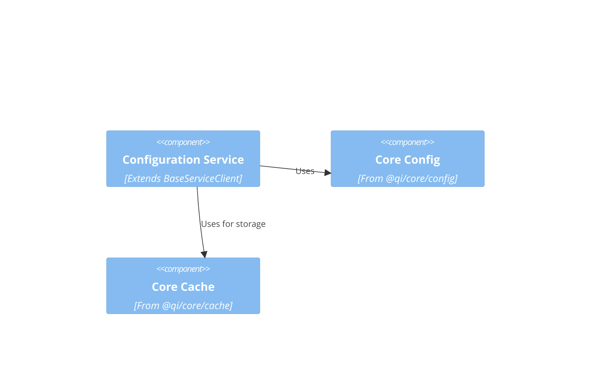
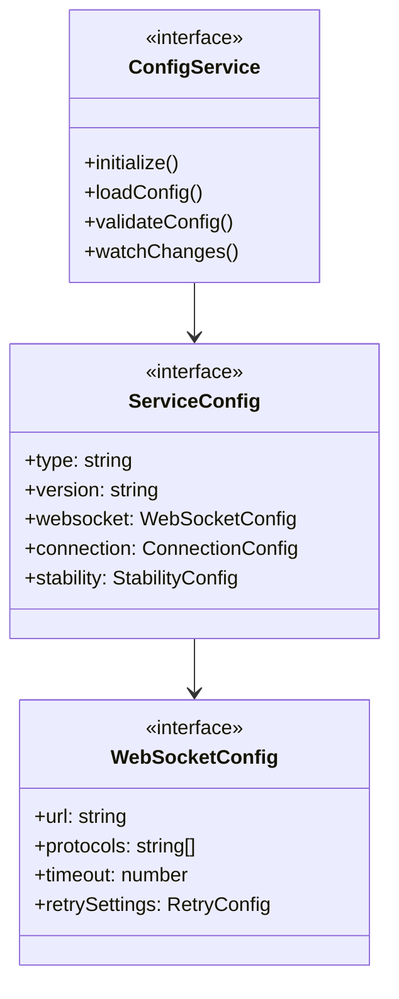
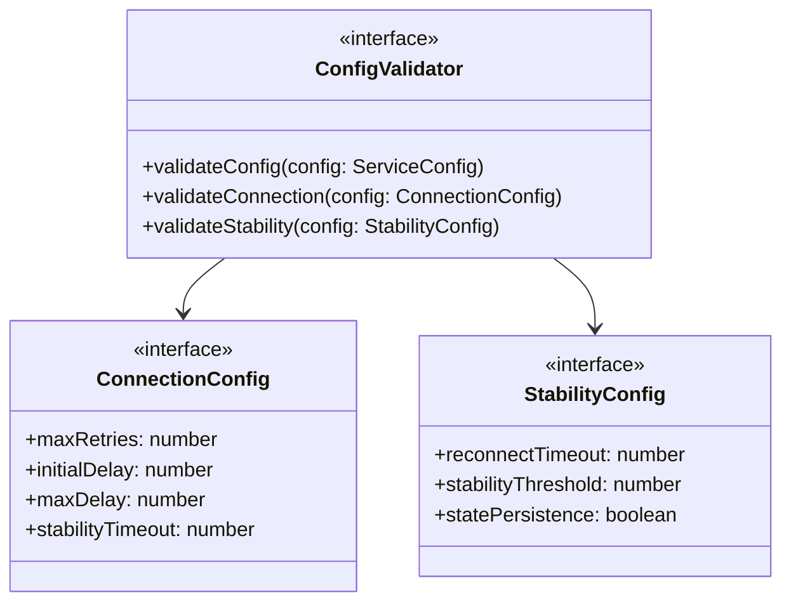

# WebSocket Configuration System Design

## Preamble

### Document Dependencies
1. `core/machine.md`: Core mathematical specification
   - Configuration space $C$
   - Property definitions $P$
   - Type constraints $T$

2. `impl/abstract.md`: Abstract design layer
   - Base configuration patterns
   - Extension points
   - Property preservation

### Document Purpose
Maps formal configuration specification to concrete design using existing infrastructure.

### Document Scope
Defines:
- Essential configuration components
- Service-specific settings
- Core property mappings
- Extension points
- Required validations

## 1. System Context



## 2. Core Components

### 2.1 Configuration Structure


### 2.2 Configuration Validation


## 3. Core Properties

### 3.1 Required Settings
Maps to configuration space $C$:

1. Connection Properties
   - URL configuration
   - Protocol settings
   - Timeout values
   - Retry policies

2. Stability Properties
   - Reconnection settings
   - State persistence
   - Recovery options

3. Resource Properties
   - Buffer sizes
   - Queue limits
   - Memory constraints

### 3.2 Type Constraints
Maps to type constraints $T$:

1. Value Types
   - String constraints
   - Numeric ranges
   - Boolean flags
   - Enumerations

2. Object Types
   - Required fields
   - Optional fields
   - Nested structures

## 4. Extension Points

### 4.1 Allowed Extensions
Only at defined points:

1. Additional Settings
   - Custom timeouts
   - Extra protocols
   - Resource limits

2. Custom Validation
   - Value constraints
   - Format checks
   - Range validation

### 4.2 Fixed Elements
Must not change:

1. Core Structure
   - Base properties
   - Required fields
   - Type definitions

2. Core Behavior
   - Loading logic
   - Basic validation
   - Change tracking

## 5. Implementation Requirements

### 5.1 Service Integration
1. Must extend BaseServiceClient
   ```typescript
   interface ConfigService extends BaseServiceClient {
     // Core configuration operations
   }
   ```

2. Must use core cache
   ```typescript
   interface ConfigStorage {
     type: "memory" | "redis";
     prefix: string;
     ttl?: number;
   }
   ```

### 5.2 Core Operations

1. Configuration Loading
   ```typescript
   interface ConfigLoader {
     load(): Promise<ServiceConfig>
     validate(): Promise<boolean>
     watch(callback: ChangeCallback): void
   }
   ```

2. Value Validation
   ```typescript
   interface ValueValidator {
     validateValue(value: unknown): boolean
     validateType(value: unknown, type: string): boolean
     checkConstraints(value: unknown, rules: Rule[]): boolean
   }
   ```

### 5.3 Property Preservation
Must maintain:

1. Value Constraints
   - Type checking
   - Range validation
   - Format verification
   - Required fields

2. Relationship Rules
   - Dependency checks
   - Compatibility rules
   - Version matching

## 6. Error Management

### 6.1 Error Categories
1. Configuration Errors
   - Invalid values
   - Missing fields
   - Type mismatches
   - Format errors

2. Loading Errors
   - File not found
   - Parse errors
   - Access denied
   - Network failures

### 6.2 Error Handling
1. Error Responses
   - Clear messages
   - Error codes
   - Context data
   - Recovery hints

2. Recovery Actions
   - Default values
   - Retry logic
   - Fallback options
   - Clean shutdown