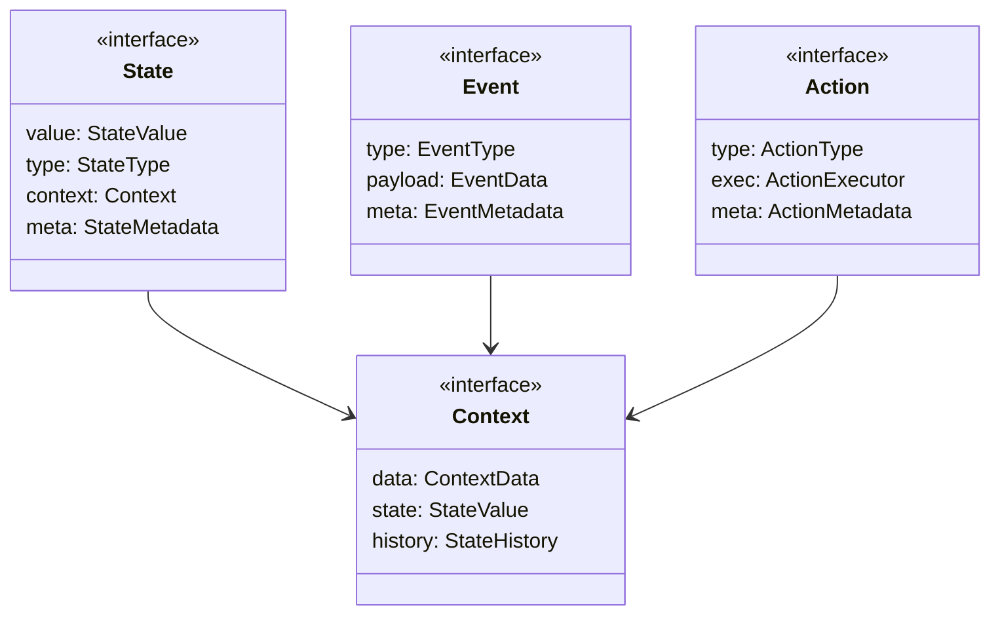
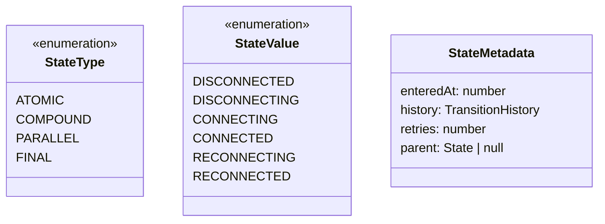
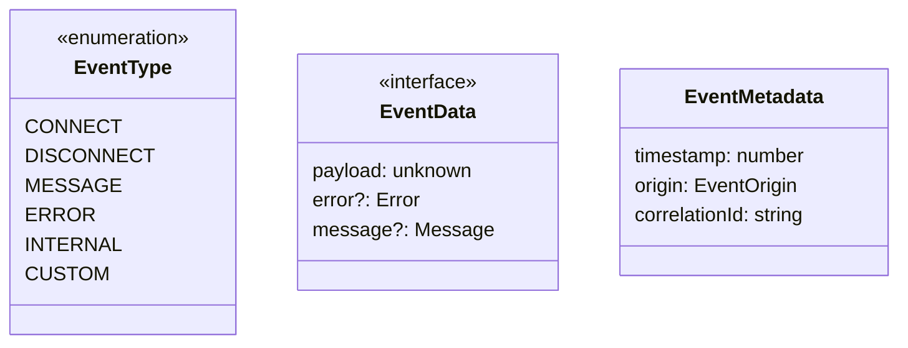
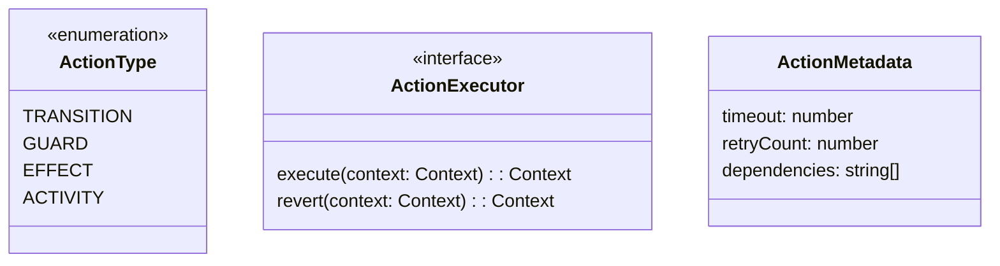
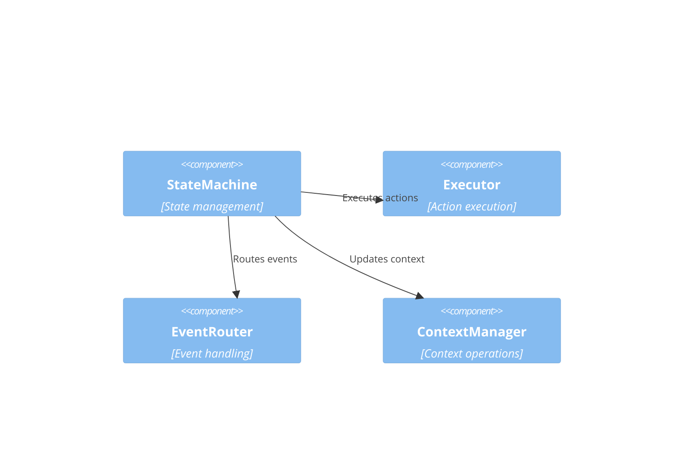
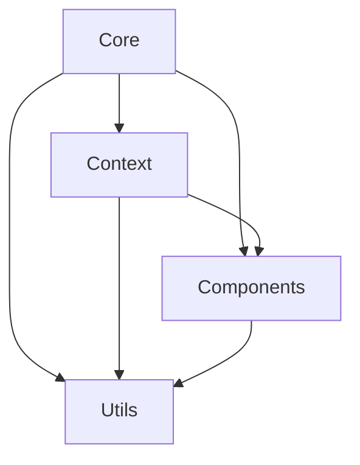
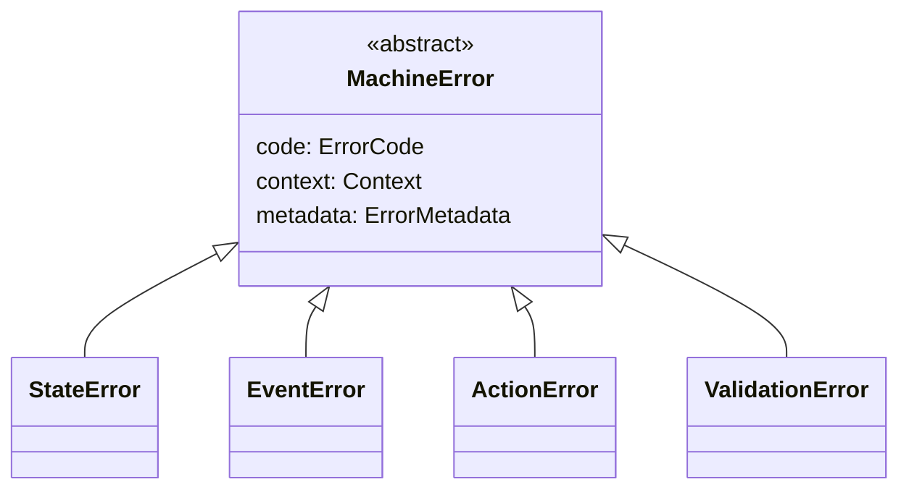

# WebSocket Client: Core Implementation Design

## Preamble

This document provides concrete design specifications for implementing the WebSocket state machine defined in the formal model. It bridges between mathematical specifications and practical implementation by defining component structures, interface boundaries, and implementation patterns.

### Document Purpose

1. Define concrete implementation structures for the abstract components
2. Establish clear module boundaries and interfaces
3. Specify component relationships and dependencies
4. Detail file organization and module structure
5. Provide practical implementation patterns

### Document Dependencies

This document depends on and is constrained by:

1. `core/machine.md`: Core mathematical specification
   - Formal state machine ($\mathcal{WC}$)
   - State and event spaces
   - Transition functions
   - Core properties

2. `core/websocket.md`: Protocol specification
   - Protocol mappings
   - State extensions
   - Event handling
   - Error management

3. `impl/abstract.md`: Abstract design
   - Component abstractions
   - Interface definitions
   - Type hierarchies
   - Property preservation

4. `impl/map.md`: Implementation mappings  
   - Type mappings
   - Property preservation rules
   - Implementation constraints
   - Verification requirements

### Document Scope

Defines:
- Domain concept implementations
- Component structures and boundaries
- Module organization and dependencies
- Implementation patterns and rules
- Extension points and constraints
- Error handling strategies

Excludes:
- Mathematical proofs and formal properties
- Specific technology choices
- Performance optimizations
- Deployment concerns
- External integrations

### Design Philosophy

This design follows core principles:

1. Alignment with Formal Model
   - Preserves mathematical properties
   - Maintains state machine semantics
   - Ensures type safety
   - Handles errors properly

2. Implementation Practicality
   - Clear component boundaries
   - Well-defined interfaces
   - Modular organization
   - Extension points
   - Error recovery

3. Code Generation Focus
   - Concrete structure guidance
   - Implementation patterns
   - File organization
   - Module boundaries
   - Dependency management
## 1. Domain Concepts

### 1.1 Core Types



### 1.2 State Types



### 1.3 Event Types 



### 1.4 Action Types



## 2. Component Design

### 2.1 Core Components



### 2.2 Component Interfaces

StateMachine Interface:
```
interface StateMachine {
  // State transitions 
  handleEvent(event: Event)
  transitTo(state: StateValue)
  
  // State access
  getState(): State
  getContext(): Context
  
  // Registration
  addState(state: State)
  addTransition(from: StateValue, to: StateValue)
}
```

Executor Interface:
```
interface Executor {
  // Action handling
  executeAction(action: Action)
  revertAction(action: Action)
  
  // Action management  
  registerAction(action: Action)
  removeAction(actionType: string)
}
```

EventRouter Interface:
```
interface EventRouter {
  // Event handling
  routeEvent(event: Event) 
  handleEvent(event: Event)
  
  // Registration
  addHandler(type: EventType, handler: Handler)
  removeHandler(type: EventType)
}
```

ContextManager Interface:
```
interface ContextManager {
  // Context operations
  getContext(): Context
  updateContext(changes: Partial<Context>)
  
  // History
  getHistory(): StateHistory
  clearHistory()
}
```

## 3. Module Structure

### 3.1 Directory Layout

```
src/
├── core/
│   ├── types/           # Core type definitions
│   ├── machine/         # State machine implementation
│   ├── actions/         # Action definitions & handling
│   └── events/          # Event definitions & routing
├── context/
│   ├── manager/         # Context management
│   ├── history/         # History tracking
│   └── validation/      # Context validation
├── components/
│   ├── executor/        # Action execution
│   ├── router/          # Event routing
│   └── manager/         # Resource management
└── utils/
    ├── validation/      # Validation utilities
    ├── guards/          # Guard conditions
    └── errors/          # Error handling
```

### 3.2 Module Boundaries

Core Module:
- Type definitions
- State machine core
- Basic actions
- Event system

Context Module:
- Context operations
- History tracking
- Validation rules

Components Module:
- Action execution
- Event routing
- Resource management

Utils Module:
- Validation helpers
- Guard conditions
- Error handling

### 3.3 Module Dependencies



## 4. Implementation Patterns

### 4.1 State Management

State Creation:
```
createState(value: StateValue) {
  validate state structure
  set initial context
  configure metadata
  register state handlers
}
```

State Transitions:
```
transition(from: State, to: State) {
  validate transition
  execute exit actions
  update context
  change state
  execute entry actions
}
```

### 4.2 Event Processing

Event Handling:
```
handleEvent(event: Event) {
  validate event
  find handlers
  execute guard conditions
  process event
  update state/context
}
```

Event Routing:
```
routeEvent(event: Event) {
  determine target state
  check validity
  execute handlers
  manage errors
}
```

### 4.3 Action Execution

Action Processing:
```
executeAction(action: Action) {
  validate action
  check preconditions
  execute action
  handle results
  manage errors
}
```

Action Results:
```
handleResult(result: ActionResult) {
  validate result
  update context
  trigger events
  manage side effects
}
```

## 5. Extension Points

### 5.1 Custom States

Adding States:
```
addCustomState(state: State) {
  validate structure
  register handlers
  configure transitions
  initialize context
}
```

### 5.2 Custom Actions

Adding Actions:
```
addCustomAction(action: Action) {
  validate action
  register executor
  configure metadata
  set up error handling
}
```

### 5.3 Custom Events

Adding Events:
```
addCustomEvent(event: Event) {
  validate event type
  register handlers
  configure routing
  set up processing
}
```

## 6. Implementation Rules

### 6.1 State Rules

1. State Validation
   - Structure must match spec
   - Context must be valid
   - Metadata required
   - History tracked

2. State Changes
   - Must use transitions
   - Must validate guards
   - Must maintain history
   - Must be atomic

### 6.2 Event Rules

1. Event Processing
   - Must validate type
   - Must check guards
   - Must route correctly
   - Must handle errors

2. Event Handling
   - Must preserve order
   - Must be idempotent
   - Must handle failure
   - Must be traceable

### 6.3 Action Rules

1. Action Execution
   - Must validate inputs
   - Must be atomic
   - Must handle errors
   - Must be reversible

2. Action Results
   - Must validate
   - Must update context
   - Must be consistent
   - Must track history

## 7. Error Handling

### 7.1 Error Types



### 7.2 Error Handling Rules

1. Error Recovery
   - Must preserve state
   - Must clean resources
   - Must log details
   - Must be consistent

2. Error Reporting
   - Must include context
   - Must track history
   - Must categorize
   - Must be traceable