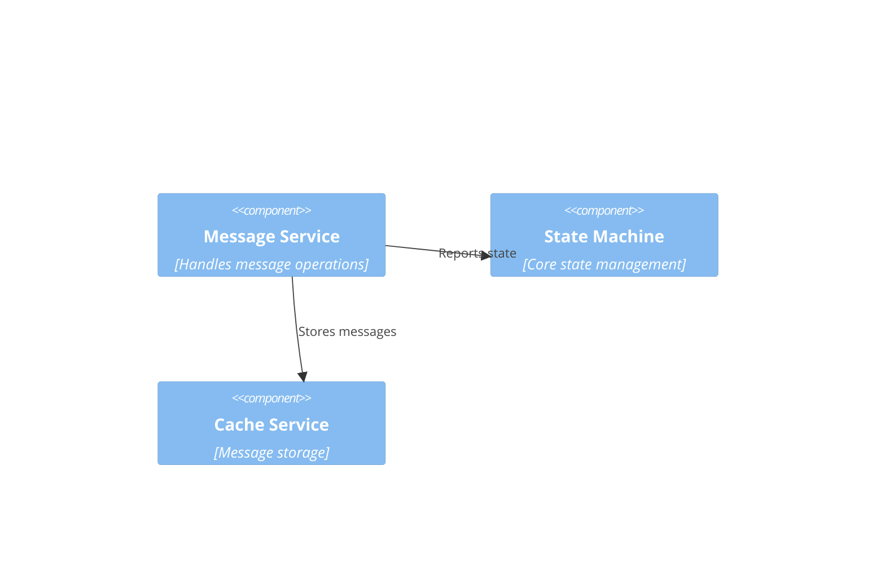
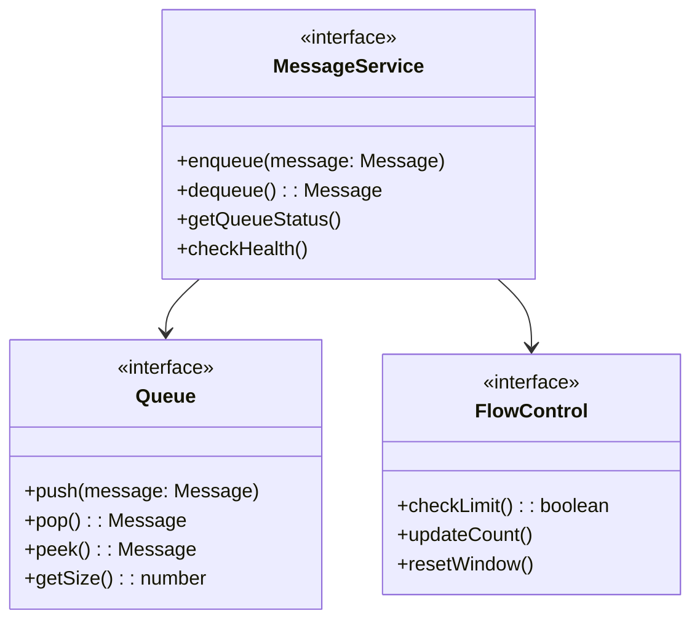
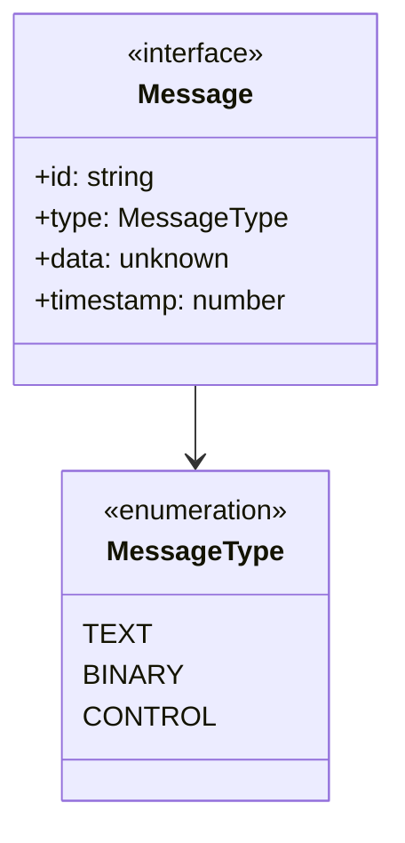
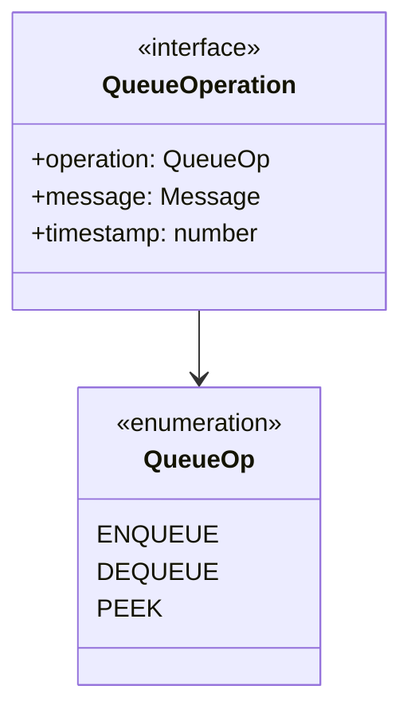

# WebSocket Implementation Design: Message System

## Preamble

### Document Dependencies
1. `core/machine.md`: Core mathematical specification
   - Message handling properties
   - Queue invariants
   - Rate limiting properties

2. `impl/abstract.md`: Abstract layer design
   - Message component abstraction
   - Extension points
   - Stability requirements

### Document Purpose
Defines essential message system design that:
- Maintains formal properties
- Uses core service patterns
- Leverages existing infrastructure
- Ensures stability and workability

### Document Scope
Defines:
- Message service structure
- Queue operation patterns
- Core message handling
- Essential flow control
- Error management

Excludes:
- Implementation details
- Specific technologies
- Optimization strategies
- Complex extensions

## 1. System Context

## 2. Component Structure

## 3. Core Concepts

### 3.1 Message Types

### 3.2 Queue Operation

## 4. Core Properties

### 4.1 Queue Properties
1. Size limits
   - Maximum queue size
   - Maximum message size

2. Operation order
   - FIFO guarantee
   - Message sequence

3. State handling  
   - Queue persistence
   - State recovery

### 4.2 Flow Properties
1. Rate control
   - Message rate limits
   - Window tracking

2. Backpressure
   - Queue full handling
   - Flow control

## 5. Error Handling

### 5.1 Error Types
1. Queue errors
   - Full queue
   - Invalid message
   - Operation failure

2. Flow errors
   - Rate exceeded
   - Window expired
   - State invalid

### 5.2 Recovery Patterns
1. Queue recovery
   - State restoration
   - Operation retry

2. Flow recovery
   - Window reset
   - Rate adjustment

## 6. Extension Points

### 6.1 Allowed Extensions
1. Message validation
   - Custom validators
   - Type checking

2. Flow control
   - Rate adjustments
   - Window sizes

### 6.2 Fixed Elements
1. Core operations
   - Queue interface
   - Basic flow control

2. State handling
   - Queue persistence
   - Error recovery

## 7. Implementation Requirements

### 7.1 Service Integration
1. Must extend BaseServiceClient
2. Must use core cache system
3. Must use standard error types
4. Must follow service patterns

### 7.2 Core Operations
1. Basic queue operations
   - Enqueue/dequeue
   - Size tracking
   - State checks

2. Simple flow control
   - Rate limiting
   - Basic backpressure

### 7.3 Error Management
1. Use ApplicationError types
2. Standard error codes
3. Basic recovery patterns
4. State preservation

This design focuses on essential message handling while maintaining formal properties through simple, stable components.