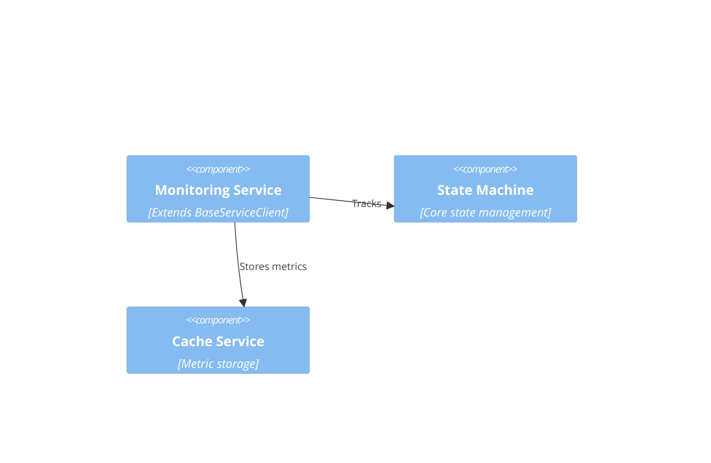
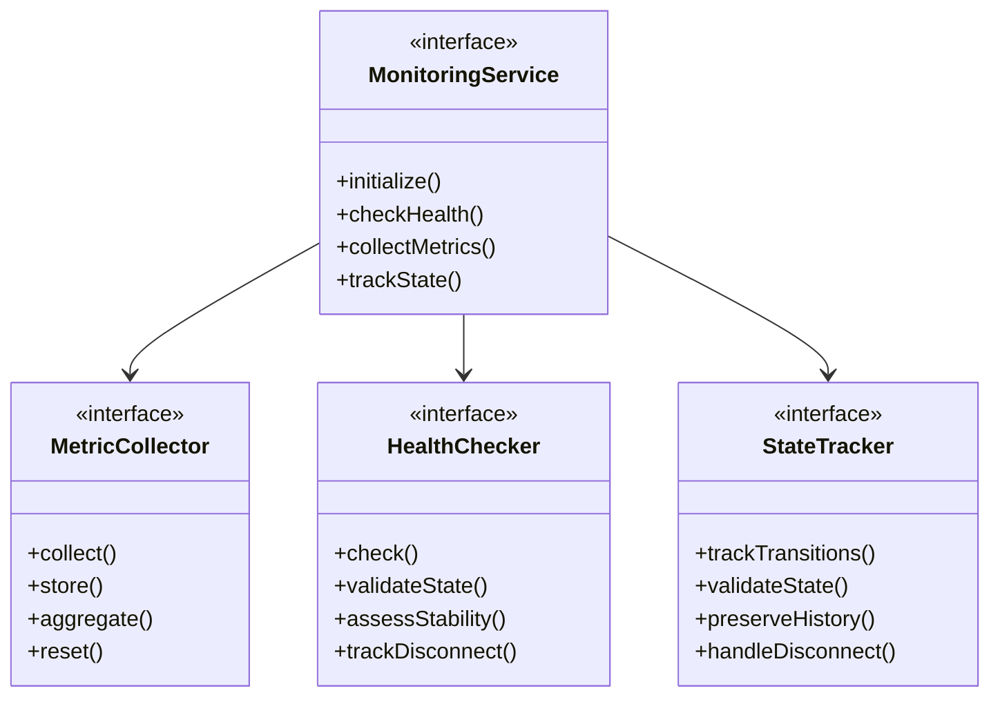
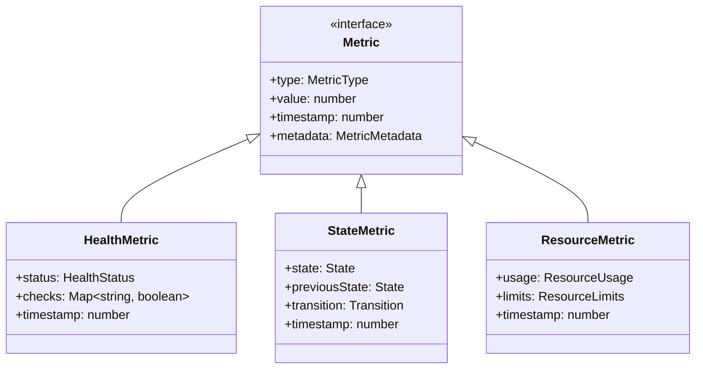

# WebSocket Monitoring System Design

## Preamble

### Document Dependencies
1. `core/machine.md`: Core mathematical specification
   - $M$ monitoring space definition
   - $\tau$ timing properties
   - $\sigma$ stability metrics
   - $\delta$ disconnect tracking

2. `impl/abstract.md`: Abstract design layer
   - Base monitoring patterns
   - Metric interfaces
   - Extension points
   - Property preservation

### Document Purpose
Provides 1-1 mapping of formal monitoring specification to concrete design components while maintaining simplicity and stability.

### Document Scope
Defines:
- Essential monitoring components
- Core metric collection
- Health tracking
- Resource monitoring
- Error monitoring
- State preservation

## 1. System Context



## 2. Core Monitoring Components

### 2.1 Base Monitoring Structure


### 2.2 Core Metrics


## 3. Core Properties

### 3.1 Monitoring Properties 
Maps to formal monitoring space $M$:

1. Health Properties
   - Connection status
   - Service state 
   - Error conditions
   - Resource health

2. State Properties
   - Current state
   - Transitions
   - History tracking
   - Stability markers

3. Resource Properties
   - Memory usage
   - Connection count
   - Message rates
   - Queue sizes

### 3.2 Timing Properties
Maps to timing properties $\tau$:

1. Collection Intervals
   - Health checks
   - Metric gathering
   - State updates
   - Resource checks

2. Retention Periods
   - Metric storage
   - History length
   - State tracking
   - Error logs

## 4. Extension Points

### 4.1 Allowed Extensions
Only at defined points:

1. Metric Collection
   - Custom metrics
   - Additional checks
   - New resource types

2. Health Checking
   - Custom checks
   - Validation rules
   - Alert conditions

### 4.2 Fixed Elements
Must not be modified:

1. Core Operations
   - State tracking
   - Basic health
   - Resource monitoring

2. Base Properties
   - Collection timing
   - Storage methods
   - State transitions

## 5. Implementation Requirements

### 5.1 Service Integration
1. Must extend BaseServiceClient:
   ```typescript
   class MonitoringService extends BaseServiceClient {
     // Core monitoring implementation
   }
   ```

2. Must use core cache:
   ```typescript
   interface MetricStorage {
     store(metric: Metric): void
     retrieve(type: MetricType): Metric[]
   }
   ```

3. Must use standard errors:
   ```typescript
   interface MonitoringError extends ApplicationError {
     metricType?: MetricType
     timestamp: number
   }
   ```

### 5.2 Core Operations

1. Health Monitoring
   ```typescript
   interface HealthCheck {
     check(): HealthStatus
     validate(): boolean
     getLastCheck(): number
   }
   ```

2. State Tracking
   ```typescript
   interface StateTracking {
     trackState(state: State): void
     validateTransition(from: State, to: State): boolean
     getHistory(): StateHistory
   }
   ```

3. Resource Monitoring
   ```typescript
   interface ResourceMonitor {
     trackUsage(): ResourceMetrics
     checkLimits(): boolean
     reportViolations(): ResourceViolation[]
   }
   ```

### 5.3 Stability Requirements

1. State Preservation
   ```typescript
   interface StabilityTracking {
     trackStability(): StabilityMetrics
     preserveState(): void
     validateStability(): boolean
   }
   ```

2. Reconnection Monitoring
   ```typescript
   interface ReconnectionTracking {
     trackReconnection(): void
     validateReconnection(): boolean
     getReconnectionHistory(): ReconnectionHistory
   }
   ```

### 5.4 Error Management

1. Error Tracking
   ```typescript
   interface ErrorTracking {
     trackError(error: MonitoringError): void
     getErrorHistory(): ErrorHistory
     validateErrorState(): boolean
   }
   ```

2. Recovery Monitoring
   ```typescript
   interface RecoveryTracking {
     trackRecovery(): void
     validateRecovery(): boolean
     getRecoveryHistory(): RecoveryHistory
   }
   ```

## 6. Property Preservation

### 6.1 Formal Properties
Must maintain:

1. State Tracking Properties
   - Unique states
   - Valid transitions
   - Complete history
   - Stability markers

2. Metric Properties
   - Accuracy
   - Completeness
   - Ordering
   - Timestamps

### 6.2 Implementation Properties
Must ensure:

1. Service Properties
   - Health consistency
   - Resource accuracy
   - Error tracking
   - State validity

2. Storage Properties
   - Metric integrity
   - History preservation
   - State consistency
   - Error records