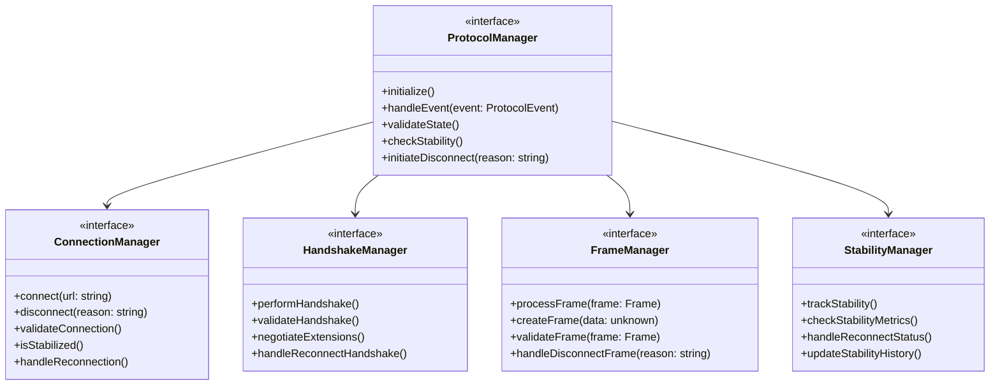
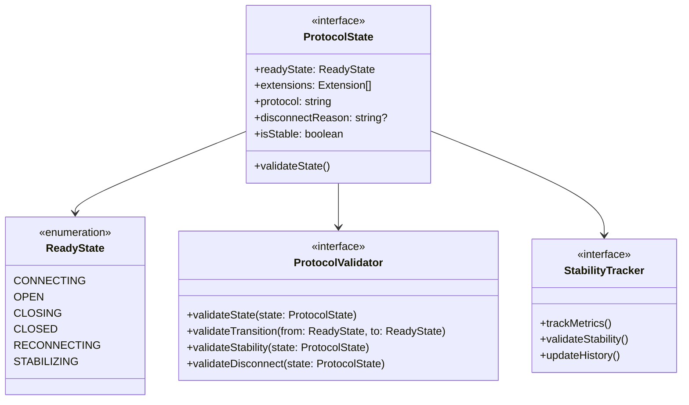
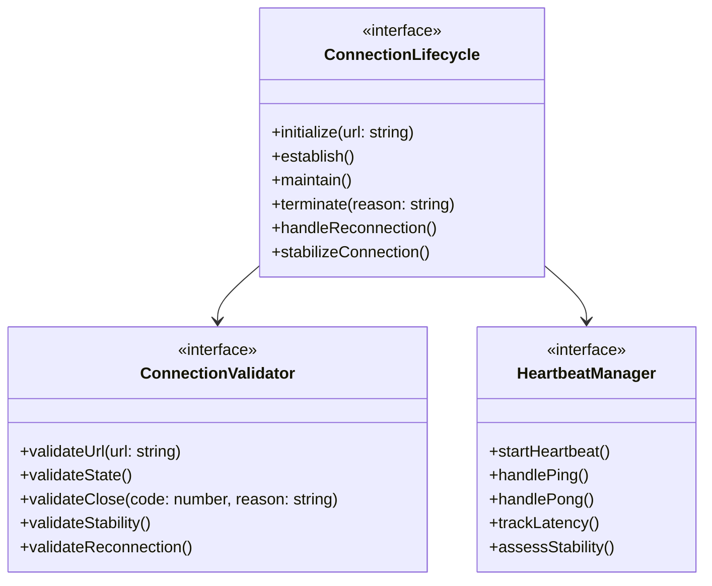
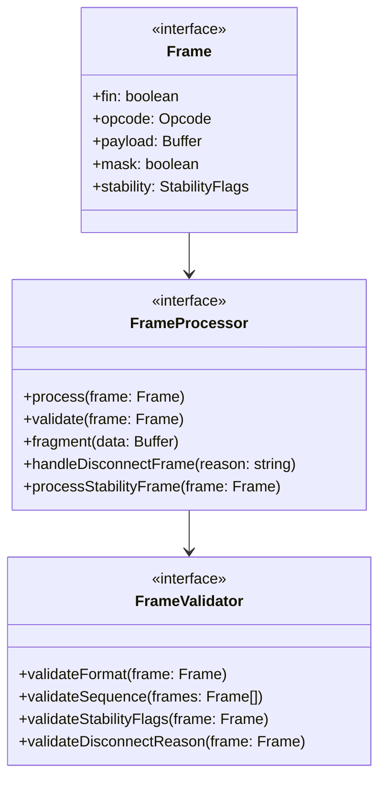
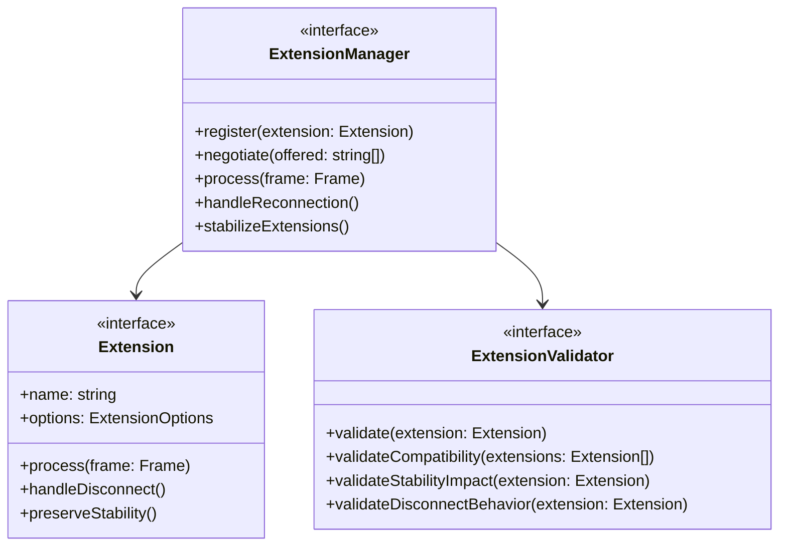
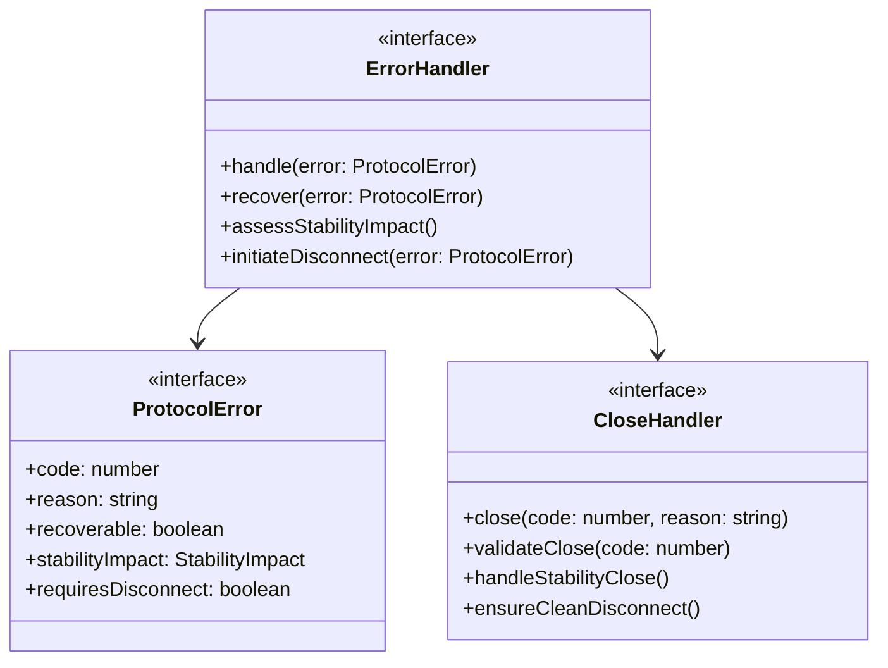

# WebSocket Implementation Design: Protocol Components

## Preamble

This document defines the protocol component implementation requirements that govern WebSocket behavior implementation. It specifies the mapping between formal WebSocket state machine design and concrete implementations while maintaining all formal properties.

### Document Dependencies

This document inherits all dependencies from `impl/core.md` and additionally requires:

1. `impl/core.md`: Core implementation design
   - Base service patterns
   - Component lifecycles
   - State management
   - Connection handling
   - Error management

2. `impl/abstract.md`: Abstract design layer
   - Component abstractions
   - Interface hierarchies
   - Extension points
   - Property mappings

3. `core/machine.md`: Core mathematical specification
   - State machine model ($\mathcal{WC}$)
   - State and event spaces
   - Transition functions
   - Core properties

4. `core/websocket.md`: Protocol specification
   - Protocol state extensions
   - Event handling
   - Frame processing
   - Error classification

### Document Scope

This document SPECIFIES:
- Protocol component abstractions
- State management requirements
- Connection handling patterns
- Message processing flows
- Extension mechanisms
- Error handling strategies
- Validation requirements

This document does NOT cover:
- Specific implementation details
- Library dependencies
- Configuration structures
- Performance tuning
- Deployment concerns

## 1. Protocol Component Architecture 

### 1.1 Core Components

### 1.2 Protocol State Management

## 2. Connection Management

### 2.1 Connection Lifecycle

## 3. Frame Processing

### 3.1 Frame Management

## 4. Protocol Extension System

### 4.1 Extension Architecture

## 5. Error Handling

### 5.1 Protocol Errors

## 6. Implementation Requirements

### 6.1 State Machine Integration

Components must:
- Map to formal state machine ($\mathcal{WC}$)
- Maintain state invariants
- Preserve transition properties
- Handle error states correctly
- Track stability metrics

### 6.2 Protocol Standards

Must implement:
- WebSocket protocol RFC 6455
- Extension negotiation
- Frame processing
- Control frames
- Error codes

### 6.3 Error Recovery

Must handle:
- Connection failures
- Frame errors
- Protocol violations
- Timeout conditions
- Invalid states

### 6.4 Property Preservation

Must maintain:
- Message ordering
- Frame sequencing
- Rate limiting
- Extension chaining
- State consistency

## 7. Design Conventions

### 7.1 Component Design

- Follow core service patterns
- Use interface-based design
- Enable extension points
- Maintain clear boundaries
- Support health monitoring

### 7.2 Error Handling

- Use error hierarchies
- Enable recovery paths
- Preserve state integrity
- Track error history
- Support diagnostics

### 7.3 Validation

- Verify state transitions
- Validate protocol compliance
- Check message integrity
- Enforce rate limits
- Monitor stability