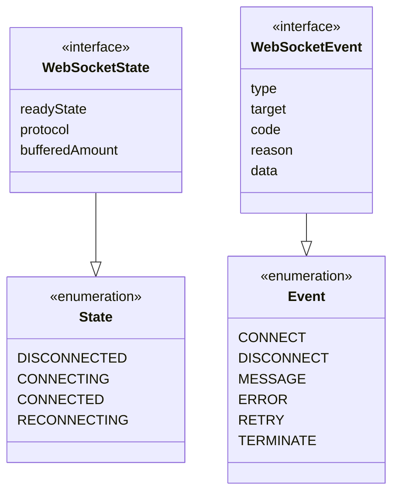
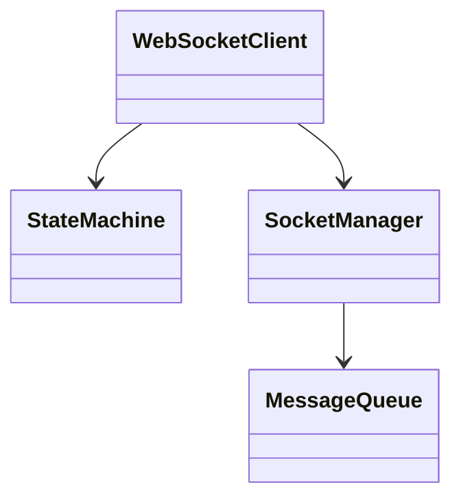

# WebSocket Implementation Design: Abstract Layer

## Preamble

This document defines the abstract design layer for the WebSocket state machine, establishing core architectural patterns and component relationships. It provides a bridge between the formal mathematical specification and concrete implementation design.

### Document Purpose

1. Define abstract components that preserve formal properties
2. Establish architectural patterns and relationships
3. Specify type hierarchies and interfaces
4. Define extension mechanisms and constraints
5. Provide property preservation rules

### Document Dependencies

This document depends on:

1. `core/machine.md`: Core mathematical specification
   - Formal state machine ($\mathcal{WC}$)
   - Core state definitions
   - Event space mappings
   - Property requirements
   - Transition rules

2. `core/websocket.md`: Protocol specification  
   - Protocol-specific behaviors
   - State mappings
   - Event definitions
   - Error handling

3. `impl/map.md`: Implementation mappings
   - Type system mappings
   - Property preservation
   - Implementation constraints
   - Verification rules

### Document Scope

Defines:
- Abstract component model
- Architectural patterns
- Type hierarchies
- Property mappings
- Extension points
- Design constraints

Excludes:
- Concrete implementations
- Specific technologies
- Implementation details
- Deployment concerns
- Performance specifics

### Design Philosophy

This abstract design follows key principles:

1. Mathematical Alignment
   - Preserves formal properties
   - Maintains state semantics
   - Ensures type soundness
   - Handles errors formally

2. Design Clarity
   - Clear component boundaries
   - Well-defined interfaces
   - Modular architecture
   - Extension mechanisms
   - Property preservation

3. Implementation Guidance
   - Component relationships
   - Interface contracts
   - Type structures
   - Extension patterns
   - Design constraints

## 1. Document Purpose

This document defines the essential architecture and domain model for implementing the WebSocket Client ($\mathcal{WC}$), bridging the formal specification to concrete implementation.

### Dependencies

1. machine.part.1.md: Core mathematical specification and proofs
2. machine.part.1.websocket.md: Protocol-specific behaviors and constraints
3. impl.map.md: Implementation mapping rules and type hierarchies
4. governance.md: Design stability requirements and extension patterns

### Scope

Defines:
- Core abstractions and boundaries
- Primary component relationships
- Domain model and type hierarchies
- Extension points and rules

Excludes:
- Specific implementation details
- Tool choices or configurations
- Deployment concerns
- Performance optimizations

## 2. Domain Model



## 3. Component Architecture



## 4. Directory Structure

```
websocket/
├── client/     # Client interface & coordination
├── state/      # State management 
├── socket/     # Socket operations
└── types/      # Core types & events
```

## 5. Component Responsibilities

### Client Layer
- Public API exposure
- State coordination
- Message flow control
- Error management

### State Layer
- State transitions
- Context management
- Guard evaluation
- Action execution

### Socket Layer
- Connection lifecycle
- Protocol events
- Message buffering
- Health tracking

## 6. Extension Points

### Primary Extension Mechanisms
1. Event Handlers
2. State Actions
3. Message Processors
4. Error Handlers

### Extension Rules
1. Never modify core state machine
2. Add handlers through registration
3. Extend through composition
4. Preserve core properties

## 7. Property Mappings

### State Machine ($\mathcal{WC}$)
- States map to formal state space $S$
- Events map to event space $E$
- Actions map to $\gamma$ functions
- Guards preserve formal properties

### Protocol Elements ($E_{ws}$)
- Socket states map to readyState
- Protocol events map to handlers
- Operations preserve constraints
- Timing properties maintained

## 8. Validation Rules

### Component Interaction
1. One active socket per client
2. Message ordering preserved
3. State transitions atomic
4. Context immutability

### Resource Management
1. Connection cleanup
2. Timer management
3. Queue bounds
4. Buffer limits

## 9. Success Criteria

### Required Properties
1. State consistency
2. Message preservation
3. Error recovery
4. Resource cleanup

### Stability Metrics
1. Connection uptime
2. Message throughput
3. Error frequency
4. Recovery speed

## 10. Governance Guidelines

### Core Stability
1. No core state modifications
2. Fixed transition paths
3. Preserved invariants
4. Type safety maintained

### Change Management
1. Additive changes only
2. Extension through hooks
3. Composition over modification
4. Clear boundary maintenance

This document provides essential architectural guidance while maintaining simplicity and workability. It preserves core mathematical properties while enabling practical implementation.