# WebSocket Client Class Diagrams

## 1. State Machine Classes (XState Integration)

### 1.1 Core Structure

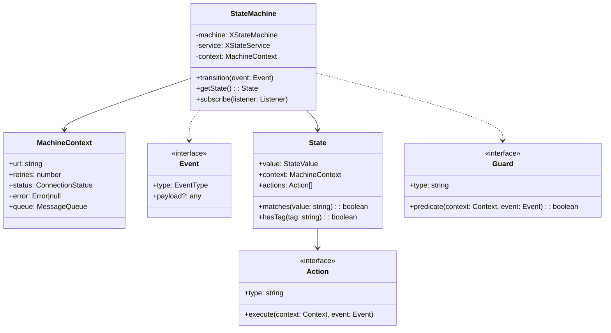
```mermaid
classDiagram
    class StateMachine {
        -machine: XStateMachine
        -service: XStateService
        -context: MachineContext
        +transition(event: Event)
        +getState(): State
        +subscribe(listener: Listener)
    }

    class MachineContext {
        +url: string
        +retries: number
        +status: ConnectionStatus
        +error: Error|null
        +queue: MessageQueue
    }

    class Event {
        <<interface>>
        +type: EventType
        +payload?: any
    }

    class State {
        +value: StateValue
        +context: MachineContext
        +actions: Action[]
        +matches(value: string): boolean
        +hasTag(tag: string): boolean
    }

    class Guard {
        <<interface>>
        +type: string
        +predicate(context: Context, event: Event): boolean
    }

    class Action {
        <<interface>>
        +type: string
        +execute(context: Context, event: Event)
    }

    StateMachine --> MachineContext
    StateMachine --> State
    State --> Action
    StateMachine ..> Guard
    StateMachine ..> Event
```

### 1.2 Event Hierarchy

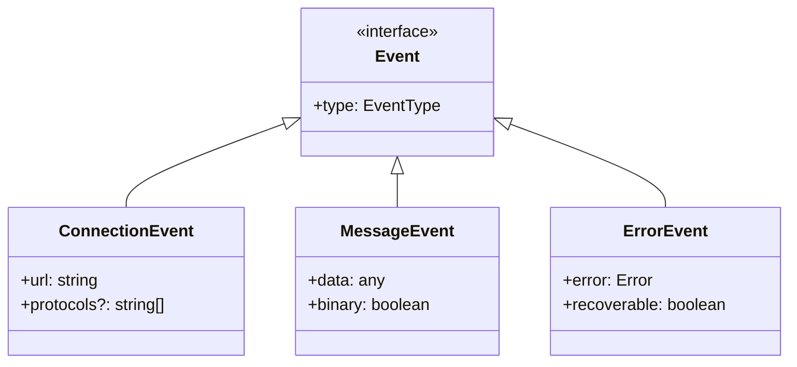
```mermaid
classDiagram
    class Event {
        <<interface>>
        +type: EventType
    }

    class ConnectionEvent {
        +url: string
        +protocols?: string[]
    }

    class MessageEvent {
        +data: any
        +binary: boolean
    }

    class ErrorEvent {
        +error: Error
        +recoverable: boolean
    }

    Event <|-- ConnectionEvent
    Event <|-- MessageEvent
    Event <|-- ErrorEvent
```

### 1.3 Guard Types

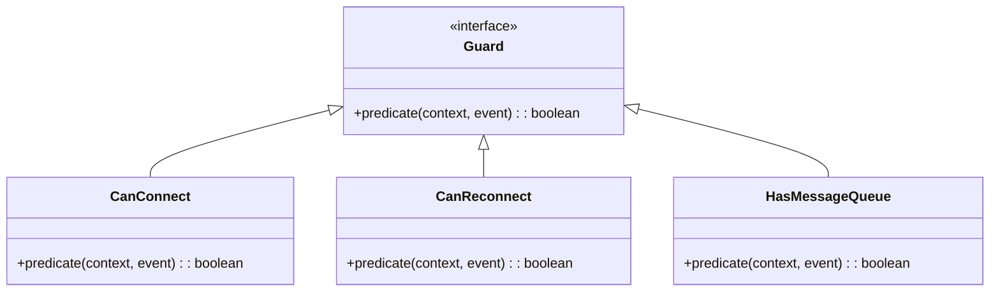
```mermaid
classDiagram
    class Guard {
        <<interface>>
        +predicate(context, event): boolean
    }

    class CanConnect {
        +predicate(context, event): boolean
    }

    class CanReconnect {
        +predicate(context, event): boolean
    }

    class HasMessageQueue {
        +predicate(context, event): boolean
    }

    Guard <|-- CanConnect
    Guard <|-- CanReconnect
    Guard <|-- HasMessageQueue
```

### 1.4 Action Types

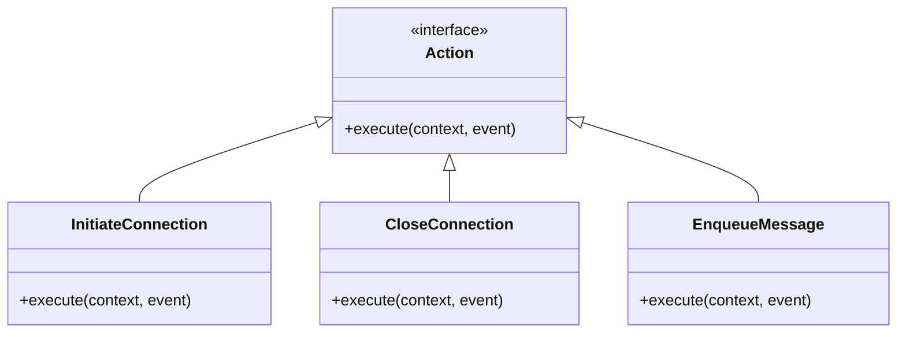
```mermaid
classDiagram
    class Action {
        <<interface>>
        +execute(context, event)
    }

    class InitiateConnection {
        +execute(context, event)
    }

    class CloseConnection {
        +execute(context, event)
    }

    class EnqueueMessage {
        +execute(context, event)
    }

    Action <|-- InitiateConnection
    Action <|-- CloseConnection
    Action <|-- EnqueueMessage
```

## 2. WebSocket Handler Classes (WS Integration)

### 2.1 Core Structure

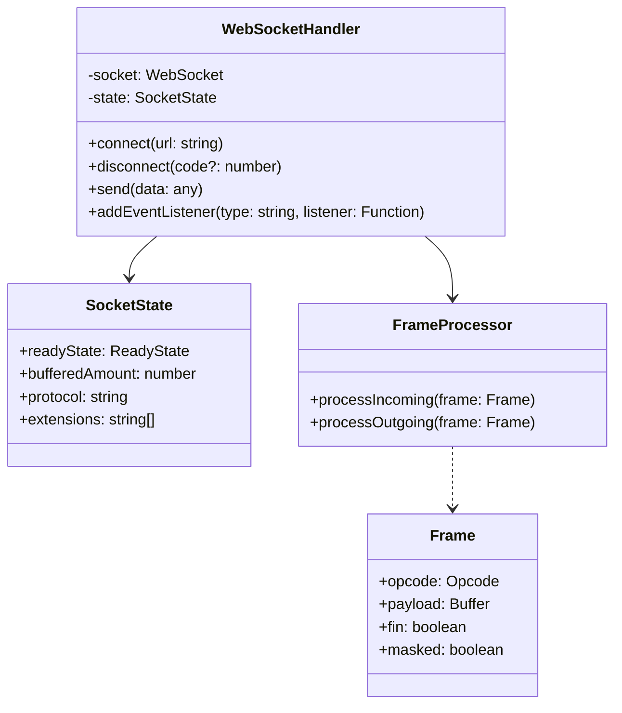
```mermaid
classDiagram
    class WebSocketHandler {
        -socket: WebSocket
        -state: SocketState
        +connect(url: string)
        +disconnect(code?: number)
        +send(data: any)
        +addEventListener(type: string, listener: Function)
    }

    class SocketState {
        +readyState: ReadyState
        +bufferedAmount: number
        +protocol: string
        +extensions: string[]
    }

    class Frame {
        +opcode: Opcode
        +payload: Buffer
        +fin: boolean
        +masked: boolean
    }

    class FrameProcessor {
        +processIncoming(frame: Frame)
        +processOutgoing(frame: Frame)
    }

    WebSocketHandler --> SocketState
    WebSocketHandler --> FrameProcessor
    FrameProcessor ..> Frame
```

### 2.2 Protocol States

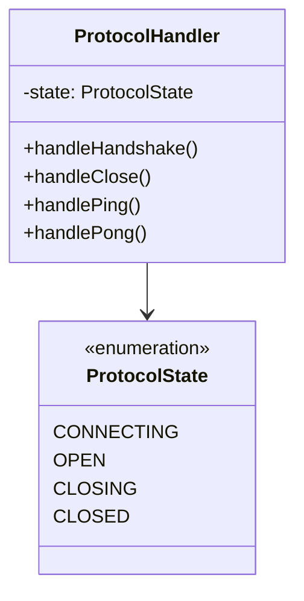
```mermaid
classDiagram
    class ProtocolState {
        <<enumeration>>
        CONNECTING
        OPEN
        CLOSING
        CLOSED
    }

    class ProtocolHandler {
        -state: ProtocolState
        +handleHandshake()
        +handleClose()
        +handlePing()
        +handlePong()
    }

    ProtocolHandler --> ProtocolState
```

## 3. Message Queue Classes

### 3.1 Core Structure

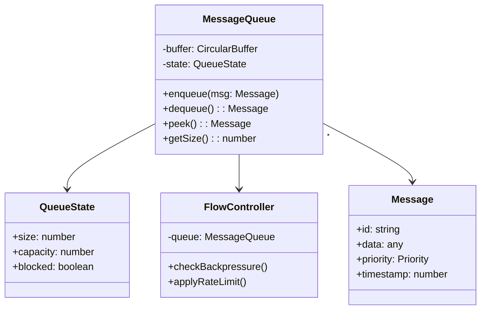
```mermaid
classDiagram
    class MessageQueue {
        -buffer: CircularBuffer
        -state: QueueState
        +enqueue(msg: Message)
        +dequeue(): Message
        +peek(): Message
        +getSize(): number
    }

    class Message {
        +id: string
        +data: any
        +priority: Priority
        +timestamp: number
    }

    class QueueState {
        +size: number
        +capacity: number
        +blocked: boolean
    }

    class FlowController {
        -queue: MessageQueue
        +checkBackpressure()
        +applyRateLimit()
    }

    MessageQueue --> QueueState
    MessageQueue --> FlowController
    MessageQueue "*" --> Message
```

### 3.2 Queue Policies

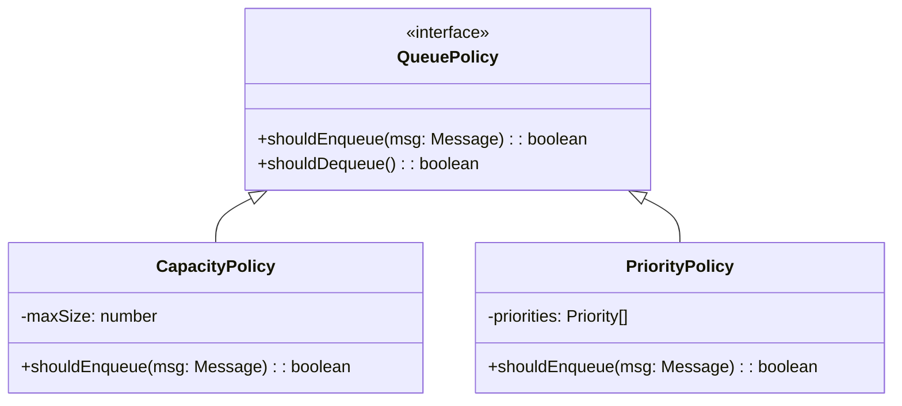
```mermaid
classDiagram
    class QueuePolicy {
        <<interface>>
        +shouldEnqueue(msg: Message): boolean
        +shouldDequeue(): boolean
    }

    class CapacityPolicy {
        -maxSize: number
        +shouldEnqueue(msg: Message): boolean
    }

    class PriorityPolicy {
        -priorities: Priority[]
        +shouldEnqueue(msg: Message): boolean
    }

    QueuePolicy <|-- CapacityPolicy
    QueuePolicy <|-- PriorityPolicy
```

## 4. Cross-Cutting Concerns

### 4.1 Resource Management

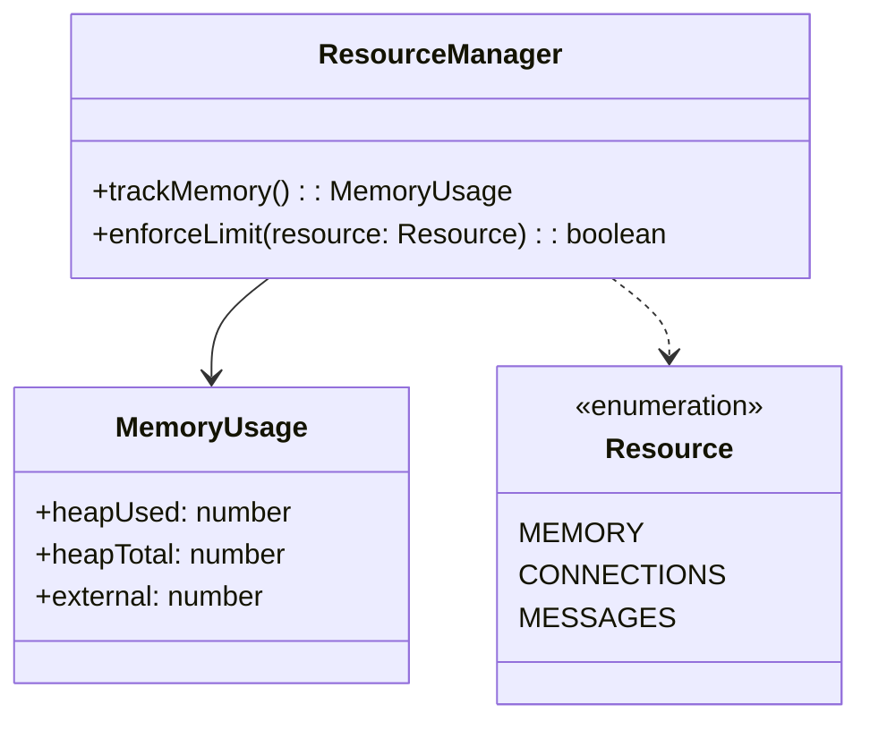
```mermaid
classDiagram
    class ResourceManager {
        +trackMemory(): MemoryUsage
        +enforceLimit(resource: Resource): boolean
    }

    class MemoryUsage {
        +heapUsed: number
        +heapTotal: number
        +external: number
    }

    class Resource {
        <<enumeration>>
        MEMORY
        CONNECTIONS
        MESSAGES
    }

    ResourceManager --> MemoryUsage
    ResourceManager ..> Resource
```

### 4.2 Error Management

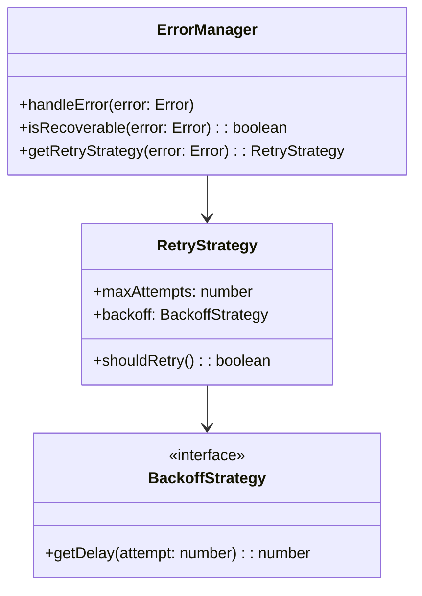
```mermaid
classDiagram
    class ErrorManager {
        +handleError(error: Error)
        +isRecoverable(error: Error): boolean
        +getRetryStrategy(error: Error): RetryStrategy
    }

    class RetryStrategy {
        +maxAttempts: number
        +backoff: BackoffStrategy
        +shouldRetry(): boolean
    }

    class BackoffStrategy {
        <<interface>>
        +getDelay(attempt: number): number
    }

    ErrorManager --> RetryStrategy
    RetryStrategy --> BackoffStrategy
```

# Configuration Management Structure

## 1. Core Configuration Classes

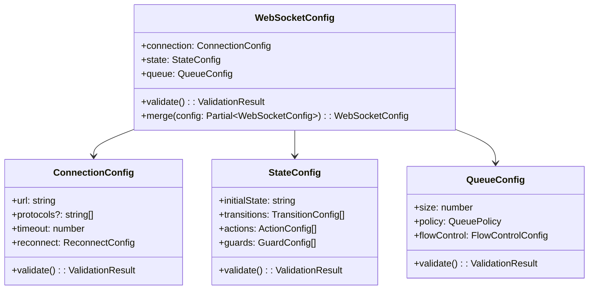
```mermaid
classDiagram
    class WebSocketConfig {
        +connection: ConnectionConfig
        +state: StateConfig
        +queue: QueueConfig
        +validate(): ValidationResult
        +merge(config: Partial~WebSocketConfig~): WebSocketConfig
    }

    class ConnectionConfig {
        +url: string
        +protocols?: string[]
        +timeout: number
        +reconnect: ReconnectConfig
        +validate(): ValidationResult
    }

    class StateConfig {
        +initialState: string
        +transitions: TransitionConfig[]
        +actions: ActionConfig[]
        +guards: GuardConfig[]
        +validate(): ValidationResult
    }

    class QueueConfig {
        +size: number
        +policy: QueuePolicy
        +flowControl: FlowControlConfig
        +validate(): ValidationResult
    }

    WebSocketConfig --> ConnectionConfig
    WebSocketConfig --> StateConfig
    WebSocketConfig --> QueueConfig
```

## 2. Configuration Details

### 2.1 Connection Configuration

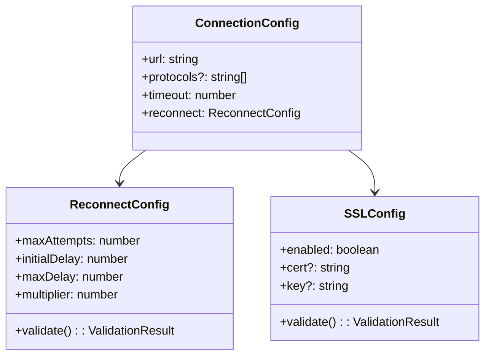
```mermaid
classDiagram
    class ConnectionConfig {
        +url: string
        +protocols?: string[]
        +timeout: number
        +reconnect: ReconnectConfig
    }

    class ReconnectConfig {
        +maxAttempts: number
        +initialDelay: number
        +maxDelay: number
        +multiplier: number
        +validate(): ValidationResult
    }

    class SSLConfig {
        +enabled: boolean
        +cert?: string
        +key?: string
        +validate(): ValidationResult
    }

    ConnectionConfig --> ReconnectConfig
    ConnectionConfig --> SSLConfig
```

### 2.2 State Configuration

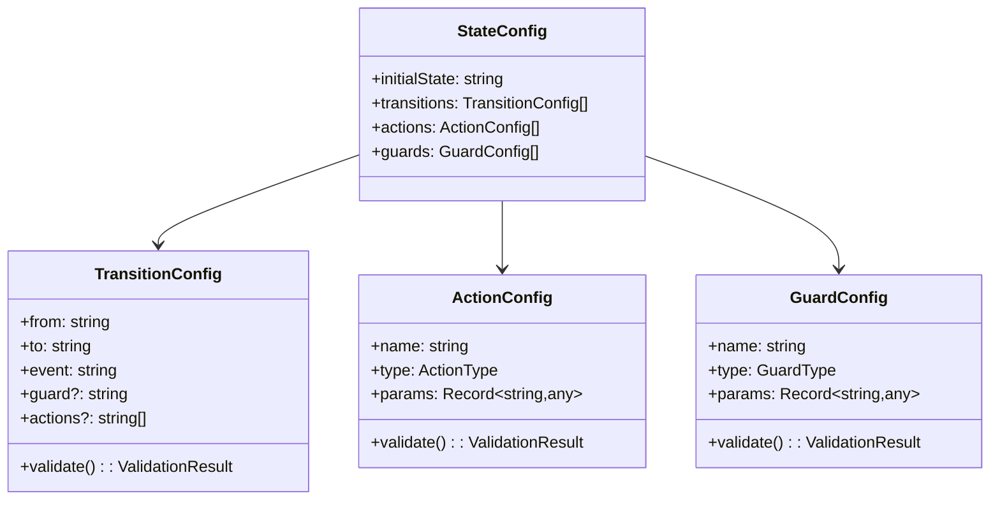
```mermaid
classDiagram
    class StateConfig {
        +initialState: string
        +transitions: TransitionConfig[]
        +actions: ActionConfig[]
        +guards: GuardConfig[]
    }

    class TransitionConfig {
        +from: string
        +to: string
        +event: string
        +guard?: string
        +actions?: string[]
        +validate(): ValidationResult
    }

    class ActionConfig {
        +name: string
        +type: ActionType
        +params: Record~string,any~
        +validate(): ValidationResult
    }

    class GuardConfig {
        +name: string
        +type: GuardType
        +params: Record~string,any~
        +validate(): ValidationResult
    }

    StateConfig --> TransitionConfig
    StateConfig --> ActionConfig
    StateConfig --> GuardConfig
```

### 2.3 Queue Configuration

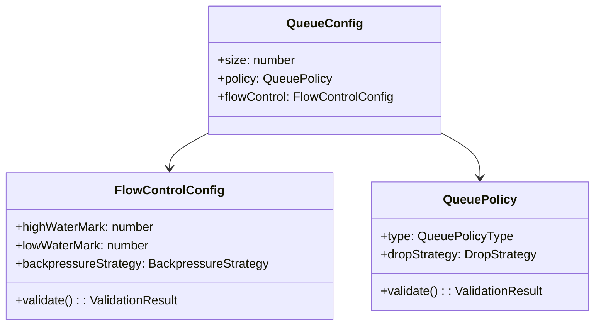
```mermaid
classDiagram
    class QueueConfig {
        +size: number
        +policy: QueuePolicy
        +flowControl: FlowControlConfig
    }

    class FlowControlConfig {
        +highWaterMark: number
        +lowWaterMark: number
        +backpressureStrategy: BackpressureStrategy
        +validate(): ValidationResult
    }

    class QueuePolicy {
        +type: QueuePolicyType
        +dropStrategy: DropStrategy
        +validate(): ValidationResult
    }

    QueueConfig --> FlowControlConfig
    QueueConfig --> QueuePolicy
```

## 3. Configuration Validation

### 3.1 Validation Structure

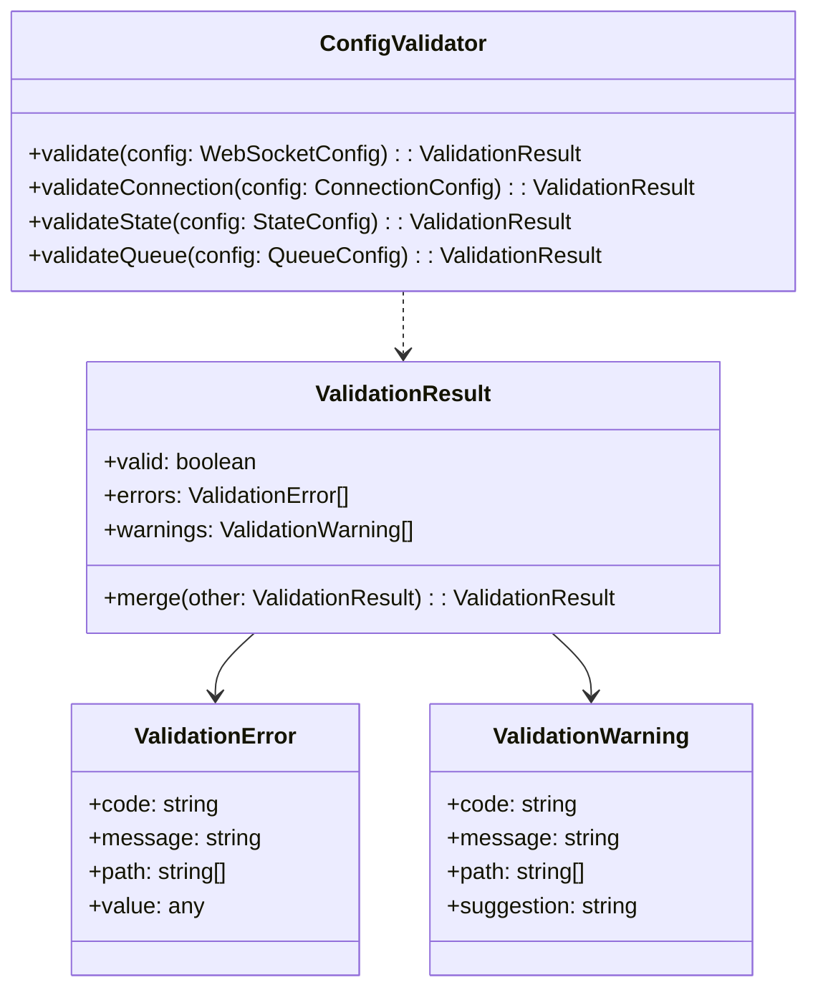
```mermaid
classDiagram
    class ValidationResult {
        +valid: boolean
        +errors: ValidationError[]
        +warnings: ValidationWarning[]
        +merge(other: ValidationResult): ValidationResult
    }

    class ValidationError {
        +code: string
        +message: string
        +path: string[]
        +value: any
    }

    class ValidationWarning {
        +code: string
        +message: string
        +path: string[]
        +suggestion: string
    }

    class ConfigValidator {
        +validate(config: WebSocketConfig): ValidationResult
        +validateConnection(config: ConnectionConfig): ValidationResult
        +validateState(config: StateConfig): ValidationResult
        +validateQueue(config: QueueConfig): ValidationResult
    }

    ValidationResult --> ValidationError
    ValidationResult --> ValidationWarning
    ConfigValidator ..> ValidationResult
```

## 4. Configuration Flow

### 4.1 Configuration Loading

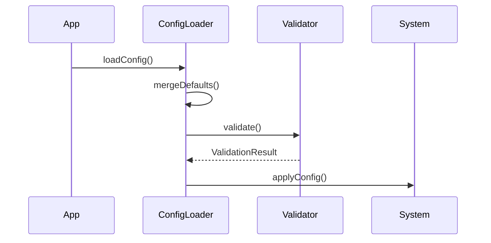
```mermaid
sequenceDiagram
    participant App
    participant ConfigLoader
    participant Validator
    participant System

    App->>ConfigLoader: loadConfig()
    ConfigLoader->>ConfigLoader: mergeDefaults()
    ConfigLoader->>Validator: validate()
    Validator-->>ConfigLoader: ValidationResult
    ConfigLoader->>System: applyConfig()
```

### 4.2 Configuration Updates

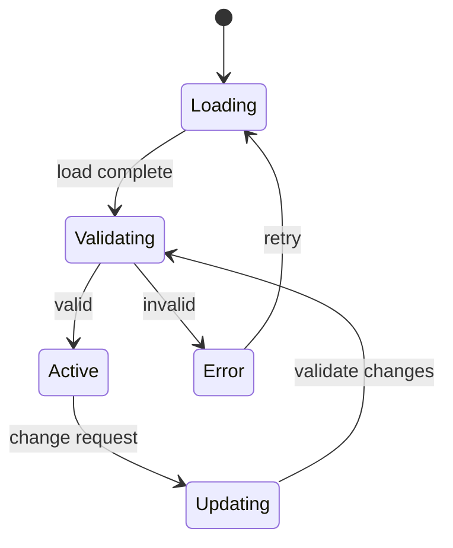
```mermaid
stateDiagram-v2
    [*] --> Loading
    Loading --> Validating: load complete
    Validating --> Active: valid
    Validating --> Error: invalid
    Active --> Updating: change request
    Updating --> Validating: validate changes
    Error --> Loading: retry
```

## 5. Default Configurations

```typescript
const DEFAULT_CONFIG: WebSocketConfig = {
  connection: {
    timeout: 30000,
    reconnect: {
      maxAttempts: 5,
      initialDelay: 1000,
      maxDelay: 60000,
      multiplier: 1.5,
    },
  },
  state: {
    initialState: "disconnected",
    transitions: [
      // Core transitions from state machine spec
    ],
    actions: [
      // Core actions from state machine spec
    ],
    guards: [
      // Core guards from state machine spec
    ],
  },
  queue: {
    size: 1000,
    policy: {
      type: "fifo",
      dropStrategy: "tail",
    },
    flowControl: {
      highWaterMark: 800,
      lowWaterMark: 200,
      backpressureStrategy: "block",
    },
  },
};
```

## 6. Configuration Constraints

### 6.1 Value Constraints

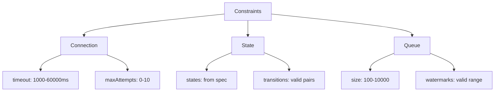
```mermaid
graph TD
    A[Constraints] --> B[Connection]
    A --> C[State]
    A --> D[Queue]

    B --> B1[timeout: 1000-60000ms]
    B --> B2[maxAttempts: 0-10]

    C --> C1[states: from spec]
    C --> C2[transitions: valid pairs]

    D --> D1[size: 100-10000]
    D --> D2[watermarks: valid range]
```

### 6.2 Relationship Constraints

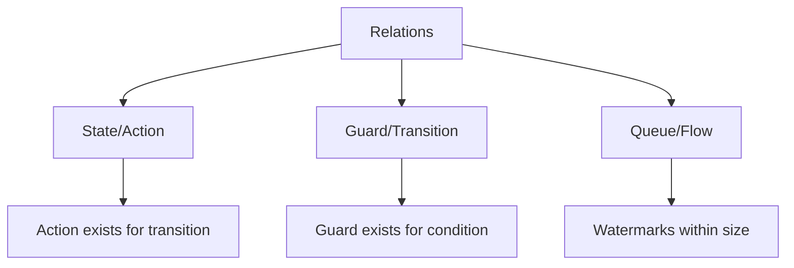
```mermaid
graph TD
    A[Relations] --> B[State/Action]
    A --> C[Guard/Transition]
    A --> D[Queue/Flow]

    B --> B1[Action exists for transition]
    C --> C1[Guard exists for condition]
    D --> D1[Watermarks within size]
```

# Test Structure

## 1. Core Test Hierarchy

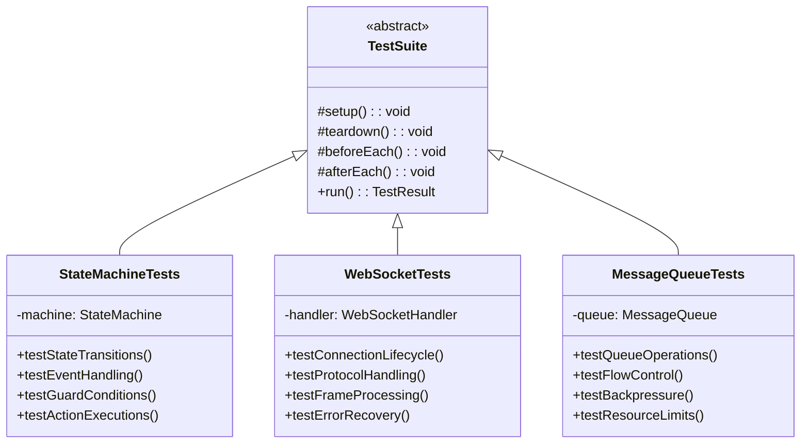
```mermaid
classDiagram
    class TestSuite {
        <<abstract>>
        #setup(): void
        #teardown(): void
        #beforeEach(): void
        #afterEach(): void
        +run(): TestResult
    }

    class StateMachineTests {
        -machine: StateMachine
        +testStateTransitions()
        +testEventHandling()
        +testGuardConditions()
        +testActionExecutions()
    }

    class WebSocketTests {
        -handler: WebSocketHandler
        +testConnectionLifecycle()
        +testProtocolHandling()
        +testFrameProcessing()
        +testErrorRecovery()
    }

    class MessageQueueTests {
        -queue: MessageQueue
        +testQueueOperations()
        +testFlowControl()
        +testBackpressure()
        +testResourceLimits()
    }

    TestSuite <|-- StateMachineTests
    TestSuite <|-- WebSocketTests
    TestSuite <|-- MessageQueueTests
```

## 2. Component Integration Tests

### 2.1 State-WebSocket Integration

```mermaid
classDiagram
    class StateWebSocketIntegration {
        -machine: StateMachine
        -handler: WebSocketHandler
        +testConnectionStateSync()
        +testErrorPropagation()
        +testMessageFlow()
        +testResourceManagement()
    }

    class TestScenario {
        <<interface>>
        +arrange(): void
        +act(): void
        +assert(): void
    }

    class ConnectionScenario {
        +arrange(): void
        +act(): void
        +assert(): void
    }

    class ErrorScenario {
        +arrange(): void
        +act(): void
        +assert(): void
    }

    TestScenario <|-- ConnectionScenario
    TestScenario <|-- ErrorScenario
    StateWebSocketIntegration --> TestScenario
```

### 2.2 Message Flow Integration

```mermaid
classDiagram
    class MessageFlowIntegration {
        -handler: WebSocketHandler
        -queue: MessageQueue
        +testMessageEnqueuing()
        +testMessageDequeuing()
        +testFlowControl()
        +testBackpressure()
    }

    class FlowTestScenario {
        <<interface>>
        +setupFlow(): void
        +executeFlow(): void
        +verifyFlow(): void
    }

    class NormalFlow {
        +setupFlow()
        +executeFlow()
        +verifyFlow()
    }

    class BackpressureFlow {
        +setupFlow()
        +executeFlow()
        +verifyFlow()
    }

    FlowTestScenario <|-- NormalFlow
    FlowTestScenario <|-- BackpressureFlow
    MessageFlowIntegration --> FlowTestScenario
```

## 3. Property-Based Testing

### 3.1 State Machine Properties

```mermaid
classDiagram
    class StateMachineProperties {
        +prop_validTransitions()
        +prop_actionExecution()
        +prop_guardConsistency()
        +prop_invariantMaintenance()
    }

    class PropertyGenerator {
        <<interface>>
        +generateStates(): State[]
        +generateEvents(): Event[]
        +generateContext(): Context
    }

    class StateGenerator {
        +generateStates()
        +isValid(state: State)
    }

    class EventGenerator {
        +generateEvents()
        +isValid(event: Event)
    }

    PropertyGenerator <|-- StateGenerator
    PropertyGenerator <|-- EventGenerator
    StateMachineProperties --> PropertyGenerator
```

### 3.2 Protocol Properties

```mermaid
classDiagram
    class ProtocolProperties {
        +prop_connectionLifecycle()
        +prop_messageOrdering()
        +prop_errorHandling()
        +prop_resourceUsage()
    }

    class ScenarioGenerator {
        +generateConnectionScenarios()
        +generateMessageScenarios()
        +generateErrorScenarios()
    }

    class ResourceMonitor {
        +trackMemory()
        +trackConnections()
        +verifyLimits()
    }

    ProtocolProperties --> ScenarioGenerator
    ProtocolProperties --> ResourceMonitor
```

## 4. Test Configurations

### 4.1 Test Environment Setup

```mermaid
stateDiagram-v2
    [*] --> ConfigureTest
    ConfigureTest --> SetupMocks
    SetupMocks --> PrepareScenario
    PrepareScenario --> ExecuteTest
    ExecuteTest --> Verify
    Verify --> Cleanup
    Cleanup --> [*]
```

### 4.2 Mock Structure

```mermaid
classDiagram
    class MockWebSocket {
        +simulateOpen()
        +simulateMessage(data: any)
        +simulateError(error: Error)
        +simulateClose(code: number)
    }

    class MockMessageQueue {
        +simulateBackpressure()
        +simulateOverflow()
        +simulateProcessing()
    }

    class MockResourceManager {
        +simulateMemoryPressure()
        +simulateConnectionLimit()
        +simulateNetworkIssues()
    }
```

## 5. Validation Framework

### 5.1 Test Assertions

```mermaid
classDiagram
    class Assertion {
        <<interface>>
        +assert(): boolean
        +getMessage(): string
    }

    class StateAssertion {
        +assertValidTransition()
        +assertInvariantMaintained()
        +assertActionExecuted()
    }

    class ProtocolAssertion {
        +assertConnectionState()
        +assertMessageDelivery()
        +assertErrorHandling()
    }

    class ResourceAssertion {
        +assertMemoryUsage()
        +assertConnectionCount()
        +assertQueueSize()
    }

    Assertion <|-- StateAssertion
    Assertion <|-- ProtocolAssertion
    Assertion <|-- ResourceAssertion
```

### 5.2 Test Results

```mermaid
classDiagram
    class TestResult {
        +success: boolean
        +failures: TestFailure[]
        +duration: number
        +resources: ResourceUsage
    }

    class TestFailure {
        +assertion: Assertion
        +actual: any
        +expected: any
        +context: TestContext
    }

    class ResourceUsage {
        +memoryPeak: number
        +connections: number
        +queueSize: number
    }

    TestResult --> TestFailure
    TestResult --> ResourceUsage
```

## 6. Test Coverage Requirements

### 6.1 Core Coverage

```mermaid
graph TD
    A[Coverage Requirements] --> B[State Coverage]
    A --> C[Event Coverage]
    A --> D[Path Coverage]

    B --> B1[All States Visited]
    B --> B2[All Transitions Tested]

    C --> C1[All Events Handled]
    C --> C2[All Guards Evaluated]

    D --> D1[Happy Paths]
    D --> D2[Error Paths]
```

### 6.2 Integration Coverage

```mermaid
graph TD
    A[Integration Coverage] --> B[Component Pairs]
    A --> C[Error Propagation]
    A --> D[Resource Sharing]

    B --> B1[All Interactions]
    B --> B2[Boundary Cases]

    C --> C1[Error Paths]
    C --> C2[Recovery Scenarios]

    D --> D1[Resource Contention]
    D --> D2[Limit Scenarios]
```
