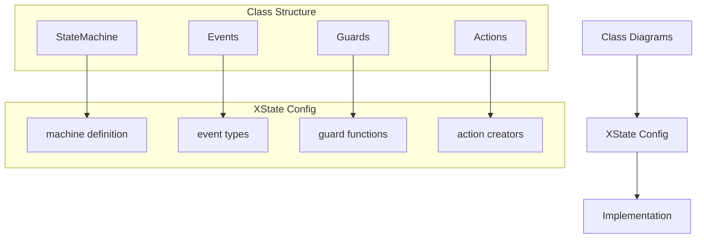
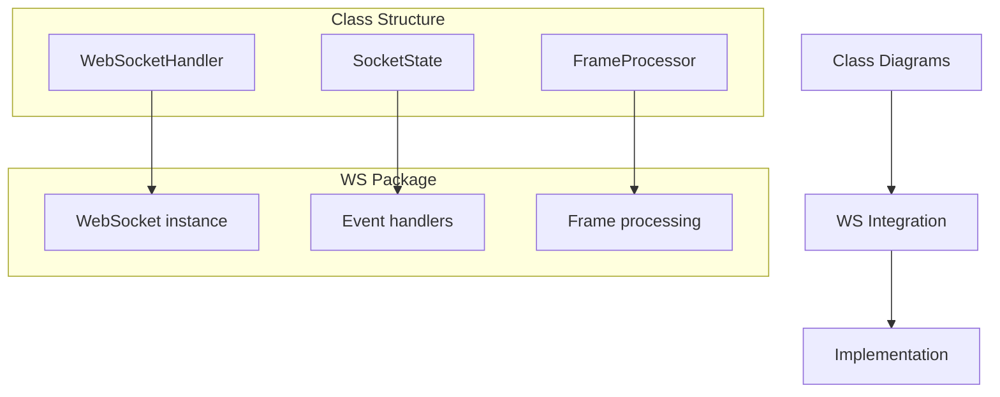
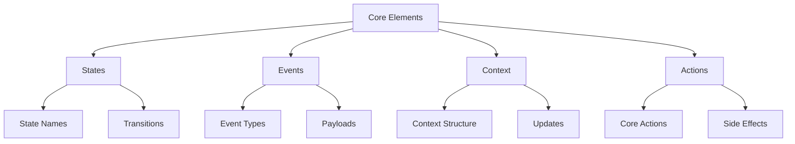
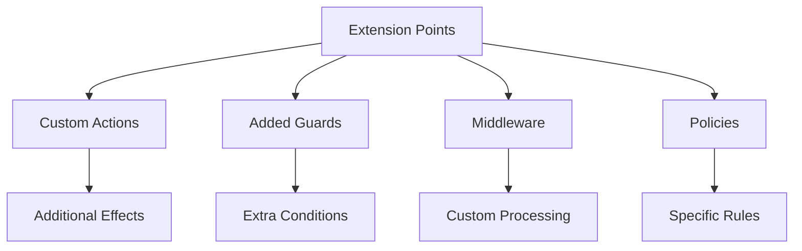
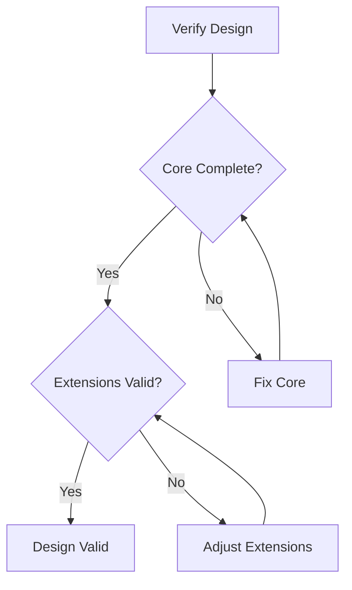

# Class Implementation Guide

## 1. Implementation Mapping

### 1.1 State Machine (XState)

Key Mappings:

1. States and Events:

   - Each state in diagram → state node in XState
   - Each event in hierarchy → XState event type
   - Each guard interface → XState guard function
   - Each action interface → XState action creator

2. Context and State:

   - MachineContext class → XState context type
   - State class → XState state definition
   - Transitions → XState transition config
   - Actions → XState action implementations

3. Behaviors:
   - Guard predicates → XState guard conditions
   - Action executions → XState action effects
   - State transitions → XState transition selectors

### 1.2 WebSocket Handler (WS)

Key Mappings:

1. Socket Management:

   - Handler class → WS instance wrapper
   - State tracking → WS event listeners
   - Frame processing → WS frame handlers

2. Protocol Handling:

   - ProtocolState → WS readyState
   - Frame definitions → WS frame types
   - Connection lifecycle → WS events

3. Error Management:
   - Error types → WS error events
   - Recovery strategies → Reconnection logic
   - State synchronization → Event propagation

## 2. Design Consistency

### 2.1 Fixed Elements (Must Be Same)

1. State Machine:

   - State names and hierarchy
   - Core transitions
   - Basic guard conditions
   - Essential actions

2. WebSocket:

   - Connection lifecycle
   - Frame processing
   - Error categories
   - Protocol states

3. Message Queue:
   - Queue operations
   - Basic policies
   - Flow control
   - Resource limits

### 2.2 Extension Points (Can Vary)

1. Allowed Variations:

   - Additional guards
   - Custom actions
   - Extended context
   - Enhanced policies

2. Configuration Options:

   - Timeout values
   - Retry strategies
   - Buffer sizes
   - Queue priorities

3. Custom Behaviors:
   - Logging
   - Metrics
   - Debug tools
   - Extensions

### 2.3 Consistency Verification

Checklist:

1. Core Structure

   - [ ] All core states present
   - [ ] Required transitions defined
   - [ ] Basic guards implemented
   - [ ] Essential actions included

2. Integration Points

   - [ ] XState configuration complete
   - [ ] WS package integration defined
   - [ ] Queue management specified
   - [ ] Resource handling covered

3. Extension Mechanisms
   - [ ] Extension points identified
   - [ ] Custom behavior hooks defined
   - [ ] Configuration options specified
   - [ ] Policy framework established
