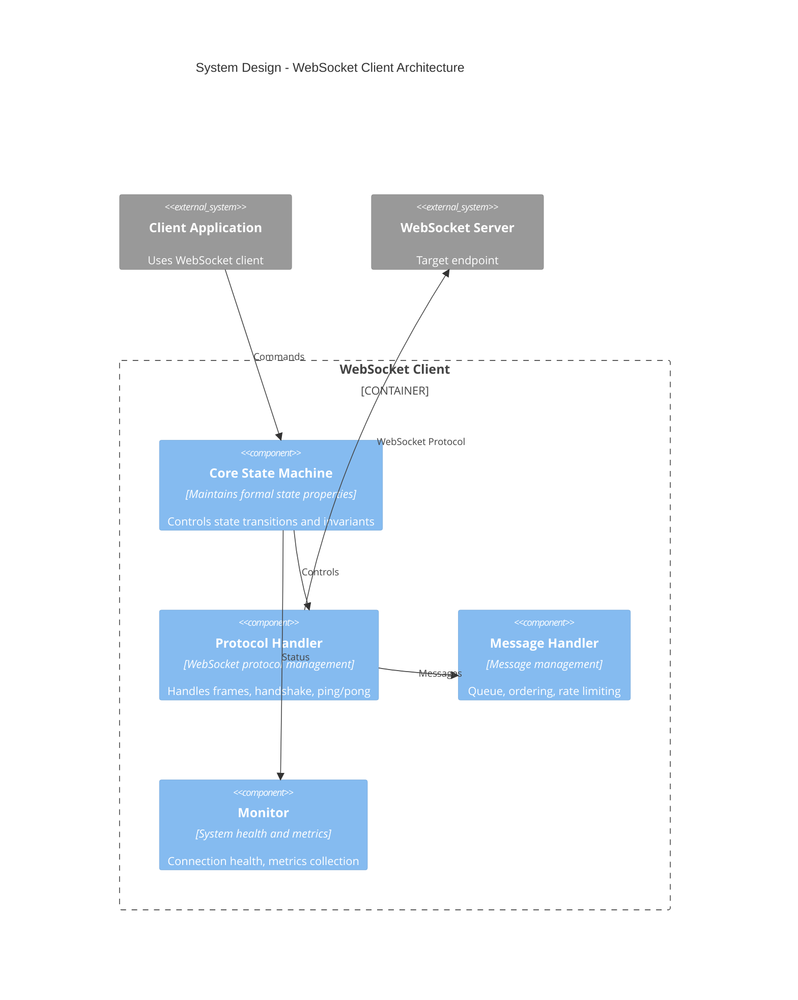
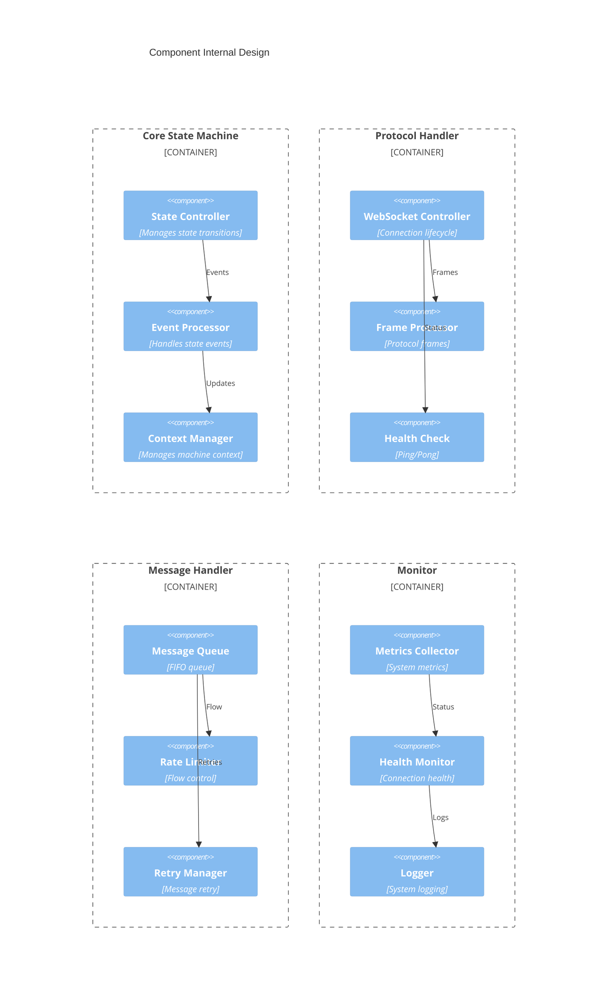

```mermaid
C4Context
    title System Design - WebSocket Client Architecture

    Container_Boundary(client, "WebSocket Client") {
        Component(core, "Core State Machine", "Maintains formal state properties", "Controls state transitions and invariants")
        Component(protocol, "Protocol Handler", "WebSocket protocol management", "Handles frames, handshake, ping/pong")
        Component(queue, "Message Handler", "Message management", "Queue, ordering, rate limiting")
        Component(monitor, "Monitor", "System health and metrics", "Connection health, metrics collection")
    }

    System_Ext(app, "Client Application", "Uses WebSocket client")
    System_Ext(server, "WebSocket Server", "Target endpoint")

    Rel(app, core, "Commands")
    Rel(core, protocol, "Controls")
    Rel(protocol, server, "WebSocket Protocol")
    Rel(protocol, queue, "Messages")
    Rel(core, monitor, "Status")
```

```mermaid
C4Component
    title Component Internal Design

    Container_Boundary(core, "Core State Machine") {
        Component(state_ctrl, "State Controller", "Manages state transitions")
        Component(event_proc, "Event Processor", "Handles state events")
        Component(ctx_mgr, "Context Manager", "Manages machine context")
    }

    Container_Boundary(protocol, "Protocol Handler") {
        Component(ws_ctrl, "WebSocket Controller", "Connection lifecycle")
        Component(frame_proc, "Frame Processor", "Protocol frames")
        Component(health, "Health Check", "Ping/Pong")
    }

    Container_Boundary(queue, "Message Handler") {
        Component(msg_queue, "Message Queue", "FIFO queue")
        Component(rate_limit, "Rate Limiter", "Flow control")
        Component(retry, "Retry Manager", "Message retry")
    }

    Container_Boundary(monitor, "Monitor") {
        Component(metrics, "Metrics Collector", "System metrics")
        Component(health_check, "Health Monitor", "Connection health")
        Component(logger, "Logger", "System logging")
    }

    Rel(state_ctrl, event_proc, "Events")
    Rel(event_proc, ctx_mgr, "Updates")
    
    Rel(ws_ctrl, frame_proc, "Frames")
    Rel(ws_ctrl, health, "Status")
    
    Rel(msg_queue, rate_limit, "Flow")
    Rel(msg_queue, retry, "Retries")

    Rel(metrics, health_check, "Status")
    Rel(health_check, logger, "Logs")
```