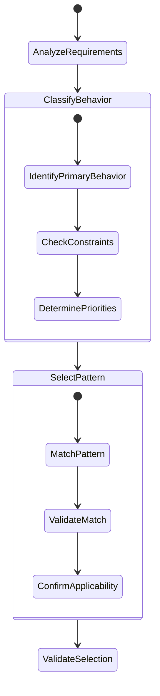
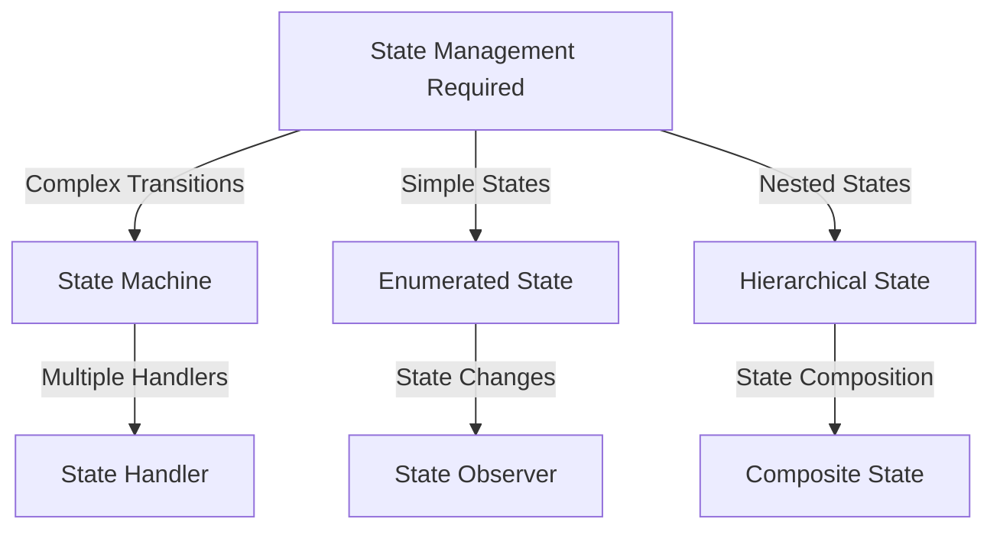
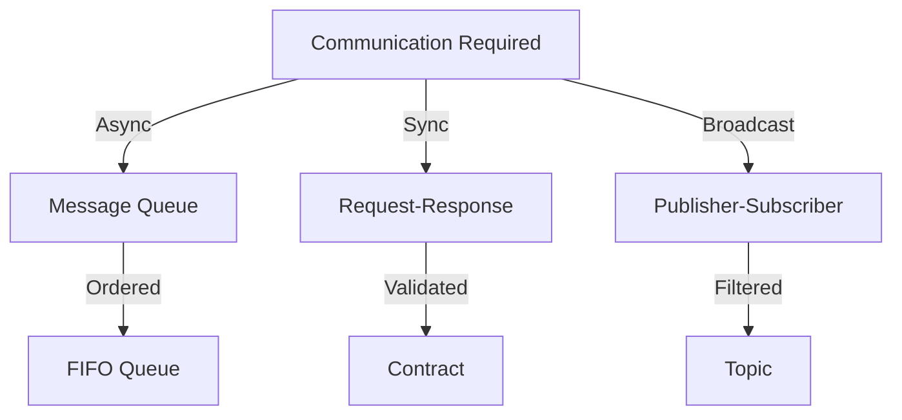
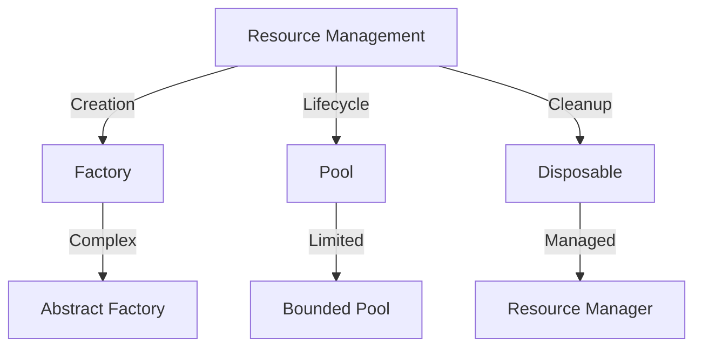

# AI Design Pattern Rules

## 1. Pattern Selection Process



## 2. Core Pattern Categories

### 2.1 State Patterns



Selection Rules:

```
IF state management required
    IF state transitions > 3
        USE StateMachine
        IMPLEMENT transition guards
        DEFINE state actions
    ELSE IF simple states
        USE EnumeratedState
        IMPLEMENT state checks
    ELSE IF nested states
        USE HierarchicalState
        IMPLEMENT state hierarchy

FOR EACH state pattern
    MUST define valid states
    MUST specify transitions
    MUST handle invalid states
    MUST manage state history
```

### 2.2 Communication Patterns



Selection Rules:

```
IF communication required
    IF asynchronous needed
        USE MessageQueue
        IMPLEMENT ordering
        DEFINE retry policy
    ELSE IF synchronous needed
        USE RequestResponse
        IMPLEMENT timeout
        DEFINE contract
    ELSE IF broadcast needed
        USE PublisherSubscriber
        IMPLEMENT topics
        DEFINE filters

FOR EACH communication pattern
    MUST handle failures
    MUST ensure delivery
    MUST maintain order
    MUST verify contracts
```

### 2.3 Resource Patterns



Selection Rules:

```
IF resource management required
    IF creation complex
        USE Factory
        IMPLEMENT creation logic
        DEFINE validation
    ELSE IF lifecycle management
        USE Pool
        IMPLEMENT bounds
        DEFINE cleanup
    ELSE IF cleanup critical
        USE Disposable
        IMPLEMENT cleanup
        DEFINE order

FOR EACH resource pattern
    MUST handle exhaustion
    MUST ensure cleanup
    MUST track usage
    MUST validate state
```

## 3. Pattern Composition Rules

### 3.1 Primary Pattern Selection

```
FOR EACH component
    IDENTIFY primary responsibility
    SELECT matching primary pattern
    VERIFY pattern constraints
    VALIDATE pattern applicability
```

### 3.2 Pattern Combination

```
WHEN combining patterns
    VERIFY pattern compatibility
    CHECK interaction points
    DEFINE clear boundaries
    ENSURE property preservation
```

### 3.3 Pattern Constraints

```
FOR EACH pattern combination
    CHECK resource usage
    VERIFY state consistency
    VALIDATE interactions
    ENSURE error handling
```

## 4. Implementation Guidelines

### 4.1 Pattern Implementation Rules

```
WHEN implementing pattern
    FOLLOW standard structure
    IMPLEMENT all interfaces
    HANDLE all errors
    VERIFY constraints
```

### 4.2 Pattern Validation

```
FOR EACH implemented pattern
    VERIFY behavior correctness
    CHECK error handling
    VALIDATE state management
    CONFIRM resource cleanup
```

### 4.3 Pattern Documentation

```
FOR EACH pattern used
    DOCUMENT selection rationale
    SPECIFY constraints
    DEFINE interactions
    LIST assumptions
```

## 5. Pattern Anti-Rules

### 5.1 Pattern Misuse Prevention

```
NEVER
    Mix pattern responsibilities
    Skip pattern interfaces
    Ignore pattern constraints
    Bypass pattern rules
```

### 5.2 Pattern Conflict Prevention

```
ALWAYS
    Check pattern compatibility
    Verify interaction rules
    Validate composition
    Test combined behavior
```

## 6. Pattern Verification

### 6.1 Structural Verification

```
FOR EACH pattern
    VERIFY interface compliance
    CHECK constraint satisfaction
    VALIDATE component structure
    CONFIRM pattern rules
```

### 6.2 Behavioral Verification

```
FOR EACH pattern
    TEST state transitions
    VERIFY error handling
    VALIDATE resource management
    CHECK interaction behavior
```

### 6.3 Integration Verification

```
FOR EACH pattern combination
    VERIFY combined behavior
    TEST interaction points
    VALIDATE state consistency
    CHECK resource usage
```
