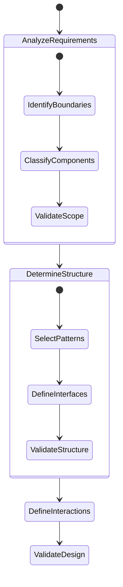

# AI Design Core Rules

## 1. Rule Application Order



## 2. Core Decision Rules

### 2.1 System Analysis Rules

```
WHEN analyzing system requirements
    IF external integration required
        THEN identify boundary types
        AND define interface contracts
        AND specify protocols

    IF state management needed
        THEN identify state types
        AND define state transitions
        AND specify consistency rules

    IF data processing required
        THEN identify data flows
        AND define transformations
        AND specify validation rules
```

### 2.2 Structure Rules

```
WHEN determining structure
    FOR EACH major function
        IF stateful
            THEN create state container
            AND define state interfaces
        ELSE IF processing
            THEN create service container
            AND define processing interfaces
        ELSE IF storage
            THEN create storage container
            AND define persistence interfaces
```

### 2.3 Interaction Rules

```
WHEN defining interactions
    FOR EACH component pair
        IF requires immediate response
            THEN use synchronous pattern
        ELSE IF loose coupling needed
            THEN use asynchronous pattern
        ELSE IF state notification needed
            THEN use observer pattern
```

## 3. Rule Categories

### 3.1 Must-Follow Rules

1. Single Responsibility

   - Each component has one clear purpose
   - Interfaces define single concern
   - States represent single aspect

2. Explicit Boundaries

   - Clear component interfaces
   - Defined state transitions
   - Explicit error handling

3. Consistent Structure
   - Follow determined patterns
   - Maintain hierarchy
   - Preserve constraints

### 3.2 Decision Guide Rules

1. Pattern Selection

   - Base on primary responsibility
   - Consider interaction needs
   - Account for state requirements

2. Interface Design

   - Minimize dependencies
   - Ensure completeness
   - Preserve encapsulation

3. State Management
   - Define clear states
   - Specify transitions
   - Handle edge cases

## 4. Rule References

### 4.1 Pattern Rules

See: [patterns.md](./patterns.md)

- Pattern selection criteria
- Implementation guidelines
- Composition rules

### 4.2 Validation Rules

See: [validation.md](./validation.md)

- Validation procedures
- Consistency checks
- Quality criteria

### 4.3 Template Rules

See: [templates.md](./templates.md)

- Standard structures
- Component templates
- Interface templates

## 5. Rule Application Process

### 5.1 Analysis Phase

1. Identify Requirements
2. Classify Components
3. Determine Patterns
4. Validate Structure

### 5.2 Design Phase

1. Apply Templates
2. Define Interfaces
3. Specify Interactions
4. Validate Design

### 5.3 Verification Phase

1. Check Constraints
2. Validate Patterns
3. Verify Interactions
4. Confirm Completeness
