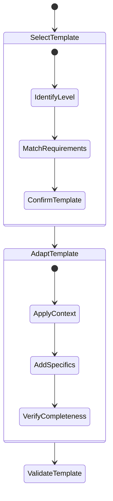
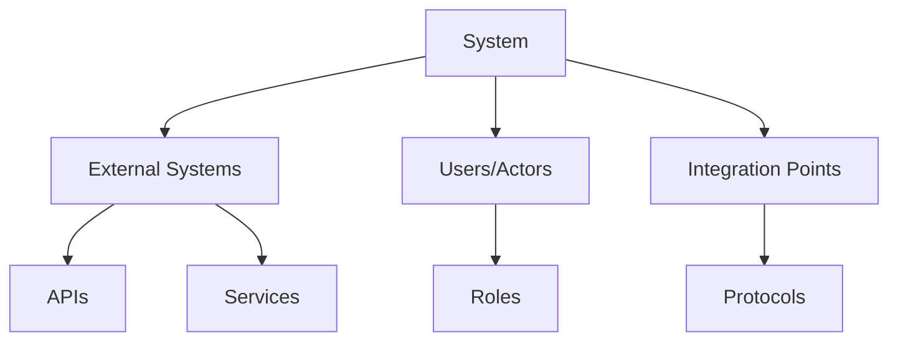
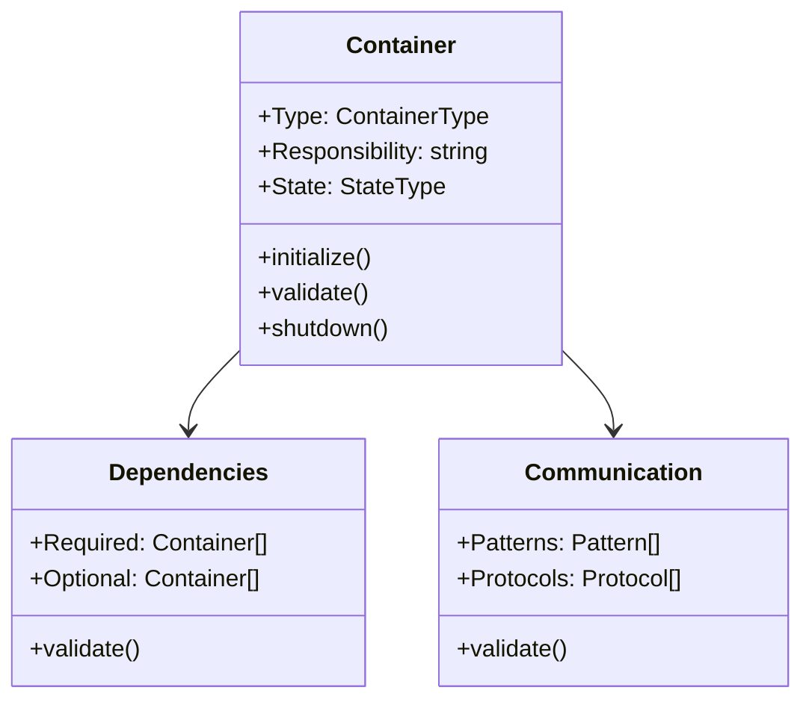
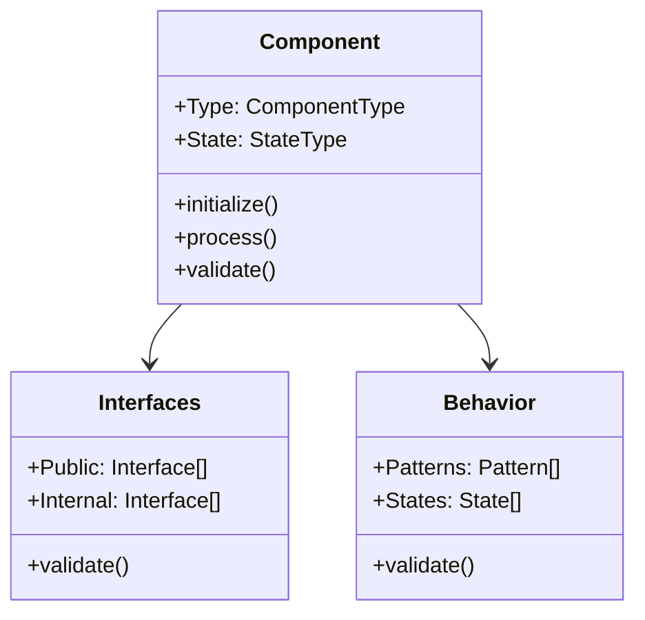
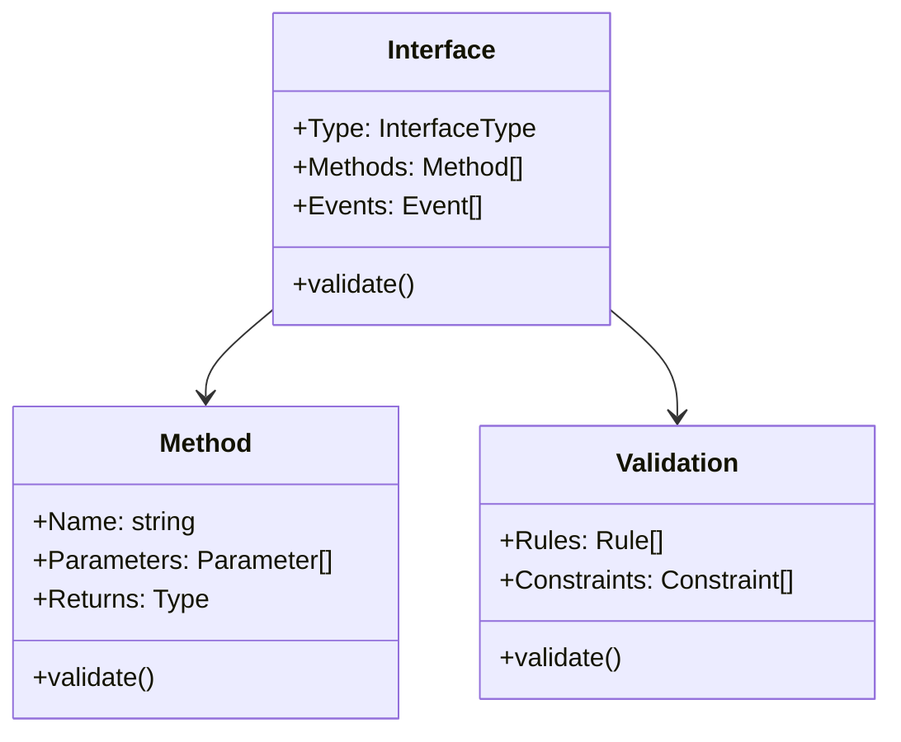
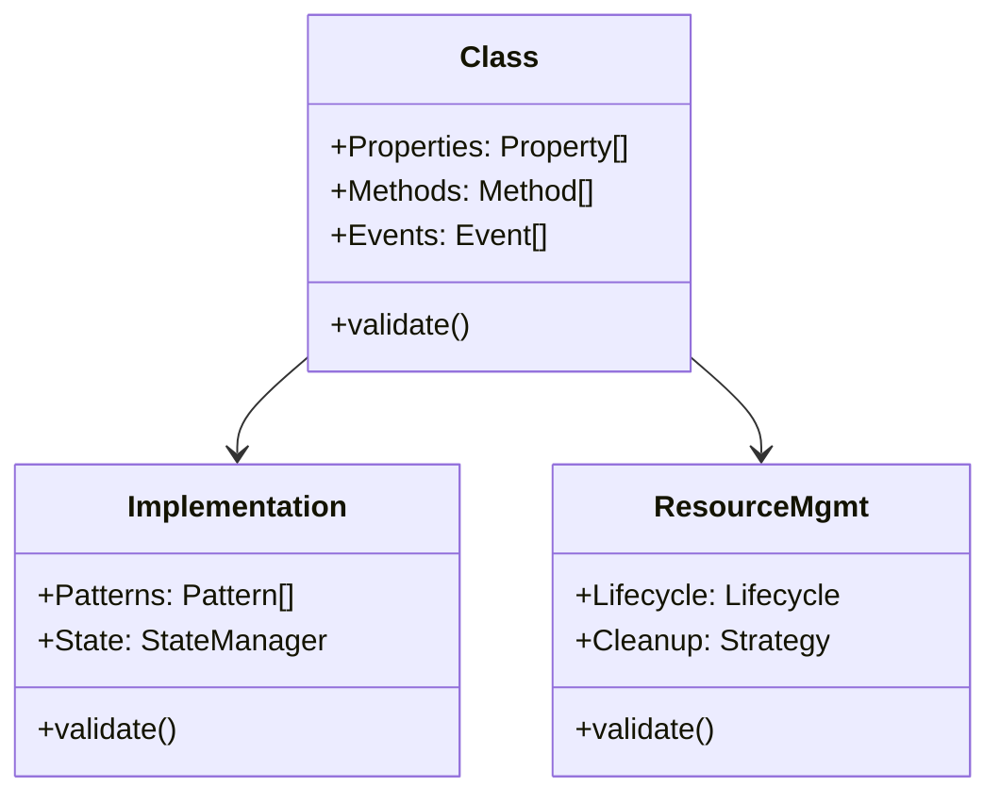
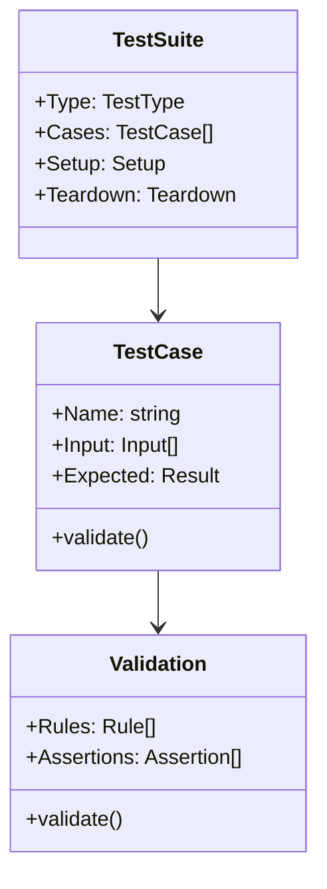

# AI Design Templates

## 1. Template Usage Process



## 2. System Level Templates

### 2.1 System Context Template



Template Rules:

```
MUST document:
    System purpose and scope
    External dependencies
    User/Actor types
    Integration points
    Key constraints
    Quality requirements
```

### 2.2 System Boundary Template

```
System: [Name]
Purpose: [Clear statement of system purpose]

External Dependencies:
- System: [Name]
  Protocol: [Protocol type]
  Integration: [Integration pattern]
  Constraints: [Key constraints]

Users/Actors:
- Type: [Actor type]
  Role: [Role description]
  Access: [Access patterns]

Integration Points:
- Point: [Name]
  Protocol: [Protocol]
  Format: [Data format]
  Validation: [Rules]
```

## 3. Container Level Templates

### 3.1 Container Structure Template



### 3.2 Container Definition Template

```
Container: [Name]
Type: [Container type]
Responsibility: [Primary responsibility]

State Management:
  States: [Valid states]
  Transitions: [Allowed transitions]
  Validation: [State rules]

Dependencies:
  Required:
    - Container: [Name]
      Purpose: [Usage description]
      Pattern: [Integration pattern]

  Optional:
    - Container: [Name]
      Purpose: [Usage description]
      Pattern: [Integration pattern]

Communication:
  Patterns:
    - Pattern: [Name]
      Usage: [Description]
      Protocol: [Protocol details]
```

## 4. Component Level Templates

### 4.1 Component Structure Template



### 4.2 Component Definition Template

```
Component: [Name]
Type: [Component type]
Purpose: [Clear responsibility]

Interfaces:
  Public:
    - Interface: [Name]
      Methods: [Method list]
      Validation: [Rules]

  Internal:
    - Interface: [Name]
      Methods: [Method list]
      Validation: [Rules]

State:
  Valid States:
    - State: [Name]
      Transitions: [Valid transitions]
      Validation: [Rules]

Behavior:
  Patterns:
    - Pattern: [Name]
      Purpose: [Usage]
      Constraints: [Rules]
```

## 5. Interface Templates

### 5.1 Interface Structure Template



### 5.2 Interface Definition Template

```
Interface: [Name]
Type: [Interface type]
Purpose: [Clear purpose]

Methods:
  - Name: [Method name]
    Parameters:
      - Name: [Parameter]
        Type: [Type]
        Validation: [Rules]
    Returns:
      Type: [Return type]
      Validation: [Rules]
    Errors:
      - Error: [Type]
        Handling: [Strategy]

Events:
  - Event: [Name]
    Type: [Event type]
    Data: [Structure]
    Validation: [Rules]
```

## 6. Implementation Templates

### 6.1 Class Structure Template



### 6.2 Class Definition Template

```
Class: [Name]
Purpose: [Clear responsibility]
Implements: [Interfaces]

Properties:
  - Name: [Property]
    Type: [Type]
    Access: [Level]
    Validation: [Rules]

Methods:
  - Name: [Method]
    Parameters: [Parameter list]
    Returns: [Return type]
    Validation: [Rules]
    Error Handling: [Strategy]

Resource Management:
  Initialization:
    - Step: [Description]
      Validation: [Rules]

  Cleanup:
    - Step: [Description]
      Validation: [Rules]
```

## 7. Testing Templates

### 7.1 Test Structure Template



### 7.2 Test Definition Template

```
Test Suite: [Name]
Type: [Test type]
Purpose: [Test purpose]

Setup:
  - Step: [Description]
    Validation: [Rules]

Cases:
  - Case: [Name]
    Input:
      - Data: [Input]
        Type: [Type]
        Validation: [Rules]
    Expected:
      - Result: [Output]
        Validation: [Rules]

Teardown:
  - Step: [Description]
    Validation: [Rules]
```

## 8. Documentation Templates

### 8.1 Documentation Structure

```
Module: [Name]
Version: [Version]
Purpose: [Clear description]

1. Overview
   - Purpose
   - Scope
   - Dependencies
   - Constraints

2. Architecture
   - Components
   - Relationships
   - Patterns
   - Flows

3. Implementation
   - Structure
   - Interfaces
   - Patterns
   - Resources

4. Validation
   - Rules
   - Tests
   - Metrics
   - Quality
```

### 8.2 Change Template

```
Change: [ID]
Type: [Change type]
Impact: [Impact level]

1. Purpose
   - Reason
   - Benefits
   - Risks

2. Changes
   - Components
   - Interfaces
   - Tests
   - Documentation

3. Validation
   - Rules
   - Tests
   - Reviews
   - Metrics
```
