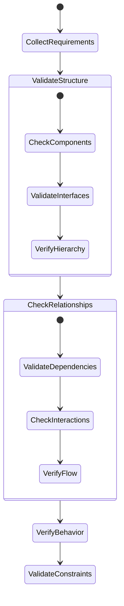
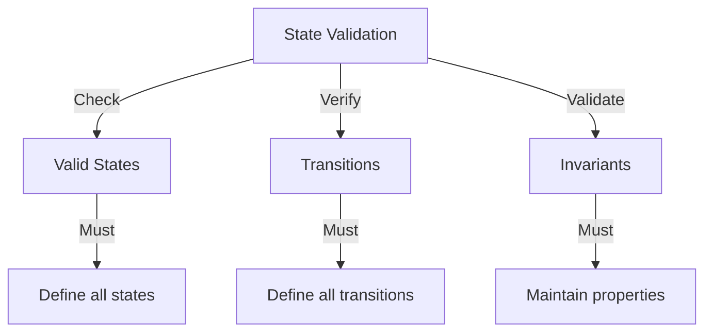

# AI Design Validation Rules

## 1. Validation Process



## 2. Structural Validation

### 2.1 Component Validation

```
FOR EACH component
    VERIFY single responsibility
        Component handles one primary concern
        Responsibilities don't overlap
        Clear purpose definition

    CHECK interface completeness
        All required methods defined
        Parameters properly typed
        Return values specified
        Error cases handled

    VALIDATE state management
        State transitions defined
        Invalid states prevented
        State invariants maintained
        History tracked properly
```

### 2.2 Relationship Validation

```
FOR EACH relationship
    VERIFY directionality
        Dependencies flow correctly
        Circular dependencies prevented
        Layer violations prevented
        Interface segregation maintained

    CHECK interaction patterns
        Communication method appropriate
        Protocol defined
        Error handling specified
        Resource management clear

    VALIDATE consistency
        State synchronization defined
        Data flow described
        Transaction boundaries set
        Recovery procedures specified
```

## 3. Behavioral Validation

### 3.1 State Validation



Validation Rules:

```
FOR EACH state machine
    VERIFY states completeness
        All states defined
        Initial state specified
        Final states identified
        Invalid states prevented

    CHECK transition validity
        All transitions defined
        Guards specified
        Actions identified
        Error cases handled

    VALIDATE state invariants
        Properties preserved
        Constraints maintained
        Resources managed
        History tracked
```

### 3.2 Protocol Validation

```
FOR EACH protocol
    VERIFY message handling
        All messages defined
        Format specified
        Validation rules set
        Error handling defined

    CHECK flow control
        Rate limiting defined
        Backpressure handled
        Buffer management specified
        Resource limits set

    VALIDATE reliability
        Retry logic defined
        Recovery specified
        Timeout handling
        Error propagation
```

## 4. Interface Validation

### 4.1 Contract Validation

```
FOR EACH interface
    VERIFY method contracts
        Preconditions defined
        Postconditions specified
        Invariants maintained
        Exceptions documented

    CHECK parameter validation
        Types specified
        Ranges defined
        Null handling
        Error cases

    VALIDATE return values
        Types specified
        Error handling
        Null cases
        Range constraints
```

### 4.2 Compatibility Validation

```
FOR EACH interface pair
    VERIFY type compatibility
        Parameter types match
        Return types compatible
        Exception handling consistent
        Null handling consistent

    CHECK protocol compatibility
        Communication patterns match
        State handling compatible
        Error handling aligned
        Resource management consistent
```

## 5. Resource Validation

### 5.1 Resource Management

```
FOR EACH resource
    VERIFY lifecycle management
        Creation controlled
        Cleanup ensured
        Limits enforced
        Leaks prevented

    CHECK usage patterns
        Access controlled
        Sharing defined
        Contention handled
        Deadlocks prevented

    VALIDATE state management
        Valid states defined
        Transitions controlled
        Recovery specified
        Cleanup guaranteed
```

### 5.2 Performance Validation

```
FOR EACH component
    VERIFY resource bounds
        Memory limits defined
        CPU usage bounded
        I/O patterns specified
        Network usage controlled

    CHECK scalability
        Load handling defined
        Growth patterns specified
        Bottlenecks identified
        Solutions proposed

    VALIDATE efficiency
        Algorithms appropriate
        Data structures suitable
        Resource usage optimized
        Patterns efficient
```

## 6. Integration Validation

### 6.1 System Integration

```
FOR EACH integration point
    VERIFY interface alignment
        Contracts match
        Protocols compatible
        Errors handled
        States synchronized

    CHECK data flow
        Formats compatible
        Validation consistent
        Transformation defined
        Error handling aligned

    VALIDATE behavior
        State management consistent
        Resource handling coordinated
        Error propagation defined
        Recovery synchronized
```

### 6.2 Cross-Cutting Concerns

```
FOR EACH system aspect
    VERIFY logging
        Events defined
        Levels appropriate
        Context captured
        Format specified

    CHECK monitoring
        Metrics defined
        Health checks specified
        Alerts configured
        Thresholds set

    VALIDATE security
        Access controlled
        Data protected
        Audit logged
        Threats mitigated
```

## 7. Validation Reporting

### 7.1 Validation Results

```
FOR EACH validation
    DOCUMENT findings
        Issues identified
        Severity assessed
        Impact analyzed
        Solutions proposed

    TRACK resolution
        Changes required
        Verification needed
        Tests updated
        Documentation revised

    MAINTAIN history
        Decisions recorded
        Changes tracked
        Rationale documented
        Lessons captured
```

### 7.2 Quality Metrics

```
FOR EACH component
    MEASURE compliance
        Rules followed
        Patterns applied
        Properties maintained
        Constraints satisfied

    TRACK improvements
        Issues resolved
        Quality enhanced
        Efficiency improved
        Maintenance simplified
```
