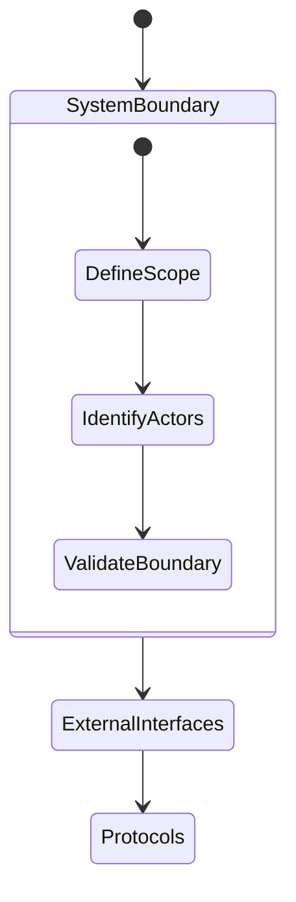
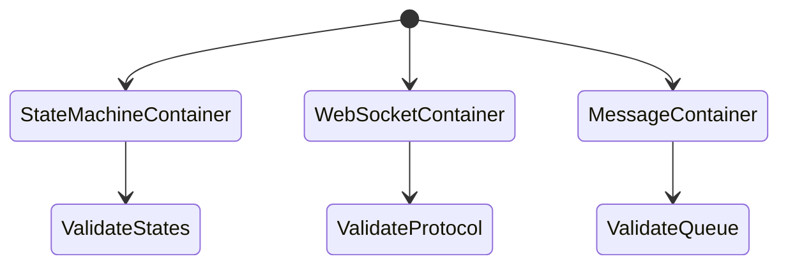
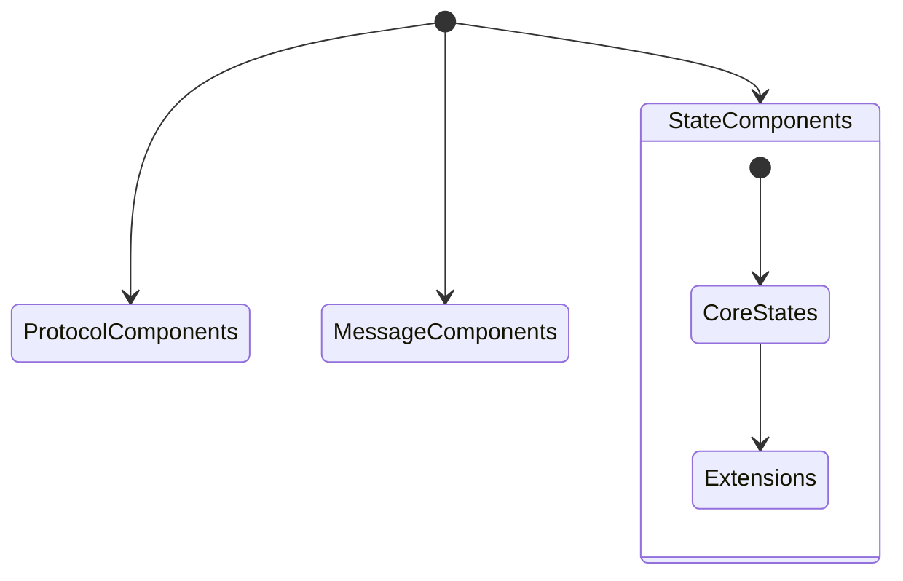
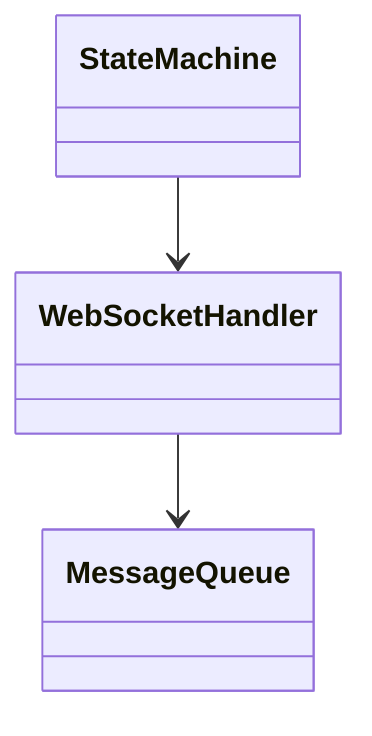

# WebSocket Client Design Process

## 1. System Context Level

### 1.1 Required Diagrams

### 1.2 Formal Mappings
- System boundary from state machine scope
- External interfaces from protocol definitions
- Core behaviors from formal properties
- Resource constraints from bounds

### 1.3 Design Tasks
1. System boundary diagram
2. External interface definitions
3. Protocol specifications
4. Resource constraints

### 1.4 Validation
- Boundary completeness
- Interface definitions
- Protocol coverage
- Constraint specification

## 2. Container Level

### 2.1 Required Diagrams

### 2.2 Formal Mappings
- State machine ($S, E, \delta$) → XState container
- Protocol specs → WS container
- Message handling → Queue container

### 2.3 Design Tasks
1. Container structure
2. Inter-container protocols
3. Resource allocation
4. Extension points

### 2.4 Validation
- Container separation
- Interface completeness
- Resource allocation
- Protocol definitions

## 3. Component Level

### 3.1 Required Diagrams

### 3.2 Formal Mappings
- State handling components from $S, \delta$
- Protocol components from WebSocket spec
- Message components from queue spec

### 3.3 Design Tasks
1. Core components
2. Component interfaces
3. Interaction patterns
4. Extension mechanisms

### 3.4 Validation
- Component completeness
- Interface definitions
- Interaction patterns
- Extension points

## 4. Class Level

### 4.1 Required Diagrams

### 4.2 Formal Mappings
- State machine → XState classes
- Protocol → WS classes
- Message handling → Queue classes

### 4.3 Design Tasks
1. Core interfaces
2. Type definitions
3. Class relationships
4. Extension interfaces

### 4.4 Validation
- Interface completeness
- Type safety
- Relationship validity
- Extension mechanisms

## 5. Design Generation Process

### 5.1 For Each Level
1. Create structural diagrams
2. Define interfaces
3. Map formal elements
4. Specify extensions
5. Validate design

### 5.2 Between Levels
1. Maintain consistency
2. Preserve properties
3. Validate mappings
4. Check constraints

### 5.3 DSL Usage
1. Apply base DSLs
2. Compose as needed
3. Validate composition
4. Verify properties

## 6. Validation Process

### 6.1 Each Level
- Design completeness
- Formal mapping correctness
- Interface consistency
- Extension points

### 6.2 Between Levels
- Relationship consistency
- Property preservation
- Interface compatibility
- Constraint satisfaction

### 6.3 Overall Design
- Complete coverage
- Minimal core
- Clear extensions
- Practical usability